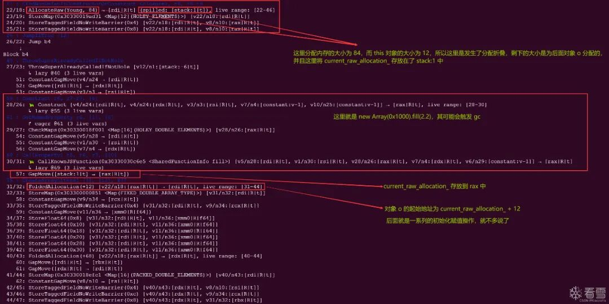
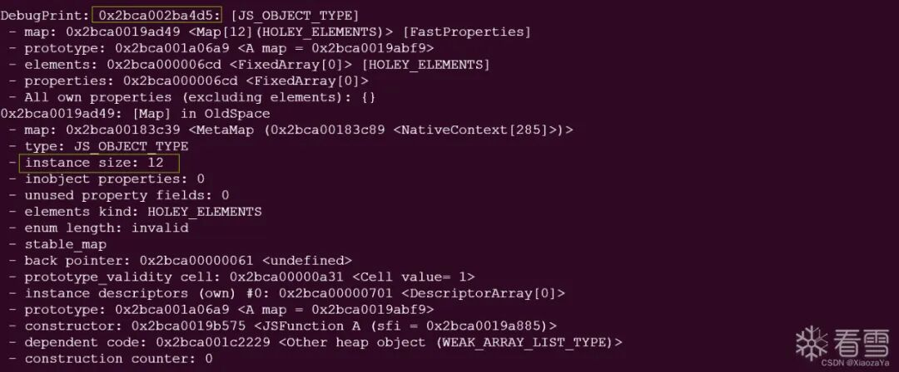
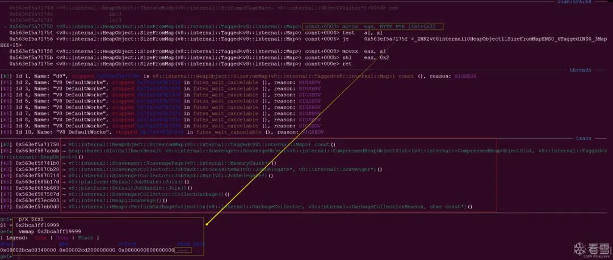
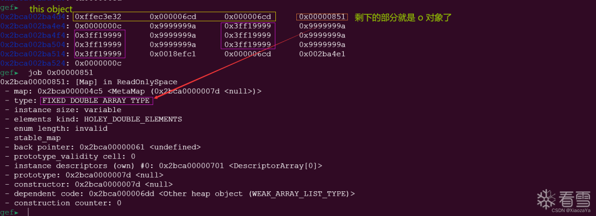
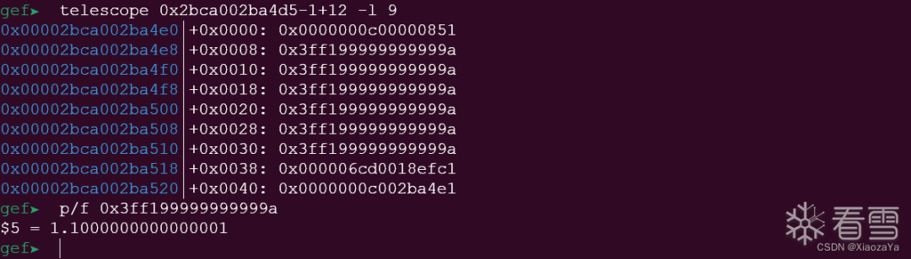
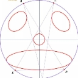

# CVE-2024-0517分析心得

<!-- vulwiki-editorial-rebuild:system-misc -->
## 条目范围与校订

- 本文对象：Google V8 Maglev
- 文献类型：V8分配折叠根因与失败利用笔记
- 版本、权限及部署边界：需受影响Maglev构建/JIT路径和GC时机；实际V8版本及构建配置缺失
- 核验状态：仅重建文本校订；未执行文中代码、PoC 或扫描，未把截图或转载声明记为本站复现

### 具体结论与待核项

以下为原归档的逐项勘误与证据缺口；可由文本确定的问题已在下文订正，仍缺来源的事实保持待核。

1. 作者明确EXP两天未写成、留todo，应标根因/崩溃研究与失败尝试，不可称完整稳定RCE复现
2. ClearCurrentRawAllocation补丁与分配初始化间GC根因可追溯至官方commit；引用同函数4069只是背景不是同漏洞
3. 源码、PoC、失败EXP和构建内容全部为空代码块，正文重要证据主要图片
4. GC释放/迁移及未初始化尾部状态的解释需按原始Exodus分析细化，不能把所有折叠分配均说成GC必然释放
5. 存在????和---地址占位，缺固定版本/补丁矩阵；独立失败记录和堆布局观察应保留

### 操作风险

作者明确EXP两天未写成、留todo，应标根因/崩溃研究与失败尝试，不可称完整稳定RCE复现

技术请求、代码与实验方法按原文保留；其中的破坏性动作仅限授权、可恢复的隔离环境。缺失代码、参数或版本事实不猜补。

### 来源追溯

- 原文参考链接（未重新核验）：<https://chromium.googlesource.com/v8/v8/+/78dd4b31847ab1f5b06ef3d8742a9f3835fb6919%5E%21/#F0）入手：>
- 原文参考链接（未重新核验）：<https://blog.exodusintel.com/2024/01/19/google-chrome-v8-cve-2024-0517-out-of-bounds-write-code-execution/>
- 原文参考链接（未重新核验）：<https://bbs.kanxue.com/user-home-965217.htm>
- 原文参考链接（未重新核验）：<http://mp.weixin.qq.com/s?__biz=MjM5NTc2MDYxMw==&mid=2458553456&idx=3&sn=11b55ee464d5aecd37fb4c5bc4dab5da&chksm=b18dbcfa86fa35ecef07864a534f85924153d8b32a403a57e2f3f2d5c266ce199c02bbcb9434&scene=21#wechat_redirect>
- 原文参考链接（未重新核验）：<http://mp.weixin.qq.com/s?__biz=MjM5NTc2MDYxMw==&mid=2458555047&idx=1&sn=b7632036b11bc28f1e89204e8856079d&chksm=b18da22d86fa2b3bdd31bb0aaea1817551ba8b9cc1f10dd36dead922533bcf6d6552b6e09788&scene=21#wechat_redirect>
- 原文参考链接（未重新核验）：<http://mp.weixin.qq.com/s?__biz=MjM5NTc2MDYxMw==&mid=2458554994&idx=1&sn=816559a8984c0ab9a1ab518c41660dcb&chksm=b18da2f886fa2bee97e29087abdc65fe2d4b725c29752b7bbf93f3555222d973c10075127d4b&scene=21#wechat_redirect>
- 原始披露 URL 未确认；既有归档来源标签保留，不能替代原始公告

### 归档技术正文

XiaozaYa  看雪学苑   2024-05-19 17:59  
  
> 原文此处代码块为空，内容未归档；无法从空块证明或复现所述结果。
  
  
  
Error Fold Allocations in VisitFindNonDefaultConstructorOrConstruct  
这个漏洞发生在MaglevGraphBuilder::VisitFindNonDefaultConstructorOrConstruct  
函数中，考虑之前分析的CVE-2023-4069  
也是发生在该函数中，所以打算把该漏洞也分析了。该漏洞主要发生在折叠分配时，未考虑内存空间分配与初始化之间的操作可能导致触发gc  
，从而导致UAF。  
  
  
  
> 原文此处代码块为空，内容未归档；无法从空块证明或复现所述结果。
  
  
  
> 原文此处代码块为空，内容未归档；无法从空块证明或复现所述结果。
  
#   
  
  
> 原文此处代码块为空，内容未归档；无法从空块证明或复现所述结果。
  
  
  
还是从patch（https://chromium.googlesource.com/v8/v8/+/78dd4b31847ab1f5b06ef3d8742a9f3835fb6919%5E%21/#F0）入手：  
  
  
> 原文此处代码块为空，内容未归档；无法从空块证明或复现所述结果。
  
  
  
可以看到补丁代码非常简单，就是添加了个ClearCurrentRawAllocation  
函数：  
  
  
> 原文此处代码块为空，内容未归档；无法从空块证明或复现所述结果。
  
  
  
该函数的功能为将current_raw_allocation_  
指针清空。  
  
  
这里补丁代码打在了TryBuildFindNonDefaultConstructorOrConstruct  
函数中，其上层调用链为：  
  
  
> 原文此处代码块为空，内容未归档；无法从空块证明或复现所述结果。
  
  
  
而VisitFindNonDefaultConstructorOrConstruct  
其实我们在之前分析CVE-2023-4069  
时就详细分析过，其主要就是处理FindNonDefaultConstructorOrConstruct  
节点的，但是这里还是放一下代码分析吧：  
  
  
> 原文此处代码块为空，内容未归档；无法从空块证明或复现所述结果。
  
  
  
这里会先调用TryBuildFindNonDefaultConstructorOrConstruct  
尝试进行图创建：  
  
  
> 原文此处代码块为空，内容未归档；无法从空块证明或复现所述结果。
  
  
  
可以看到这里我们可以将其分为快速路径和慢速路径，快速路径主要就是利用new_target.initial  
直接进行对象创建，慢速路径则退回到内建函数FastNewObject  
，这里我们主要看快速路径，快速路径为【1】->【2】->【3】  
，而【3】  
也是漏洞代码所在处，所以需要满足以下条件：  
  
  
◆1、TryGetConstant(this_function)  
  
◆2、TryGetConstant(new_target)  
  
◆3、new_target.initial.constructor === target  
  
  
这里想要到达想要到达漏洞逻辑，得绕过这三个判断，前面两个还是之前的方式插入CheckValue  
节点绕过，第三个就不多说了，new_target  
是派生构造函数即可，或者顶层默认构造函数也????，比较简单。  
  
  
最后为分配对象的语句如下，也是漏洞代码所在处：  
  
  
> 原文此处代码块为空，内容未归档；无法从空块证明或复现所述结果。
  
  
  
然后跟进BuildAllocateFastObject  
，看其是如何创建对象的：  
  
  
> 原文此处代码块为空，内容未归档；无法从空块证明或复现所述结果。
  
  
  
这里可以看到分配空间调用了ExtendOrReallocateCurrentRawAllocation  
函数，其会尝试折叠分配：  
  
  
> 原文此处代码块为空，内容未归档；无法从空块证明或复现所述结果。
  
  
  
先来说下什么是折叠分配？顾名思义，当我们在进行内存分配时，可能每次分配一小块内存，比如下面场景：  
  
  
> 原文此处代码块为空，内容未归档；无法从空块证明或复现所述结果。
  
  
  
而多次分配内存可能是一个比较耗时的行为，于是编译器在静态分析阶段，会尝试进行分配折叠优化：  
  
  
> 原文此处代码块为空，内容未归档；无法从空块证明或复现所述结果。
  
  
  
这里就避免了多次内存分配，但在动态类型语言中，可能会出现一些问题，比如在JavaScript  
中，内存是由gc  
进行管理的，在V8  
中，没有被root object  
直接或间接引用的对象被标记为死对象，在触发gc  
时会被回收。所以考虑如下场景：  
  
  
> 原文此处代码块为空，内容未归档；无法从空块证明或复现所述结果。
  
  
  
而如果此时发生分配折叠优化：  
  
  
> 原文此处代码块为空，内容未归档；无法从空块证明或复现所述结果。
  
  
  
这里的问题就是在分配完空间后，只对obj1  
的部分进行了初始化，而obj2  
的初始化则是在后面，那么如果在初始化obj2  
之前触发了gc  
，那么此时current_raw_allocation_+0x10  
这后面的内存就会被回收掉，如果我们此时分配对象占据这块内存，后面do something2  
时，仍然使用current_raw_allocation_+0x10  
，则导致UAF。  
让我们回到该漏洞分析中，通过上面的分析我们可以知道：  
  
  
◆在创建this  
对象时，保留了current_raw_allocation_  
指针，所以如果后面存在内存分配，则可能发生分配折叠  
  
  
poc  
如下：  
  
  
> 原文此处代码块为空，内容未归档；无法从空块证明或复现所述结果。
  
  
  
这里先来看下Maglev IR  
：  
  
  
  
  
  
调试分析下：  
  
  
this  
对象的地址为0x2bca002ba4d5  
，instance_size = 12  
，与Maglev IR  
图是吻合的：  
  
  
  
  
  
然后程序就crash  
了：  
  
  
  
  
  
从调用栈中的函数名称可以知道，明显触发了gc  
，而这里rsi  
的值为一个---  
地址，所以发生内存访问错误。这里我们来看下this  
对象下方的内存：  
  
  
  
  
这里我们换个角度看：0x2bca002ba4d5-1 = this_addr  
==>o_addr = this_addr+12  
  
  
  
  
  
看到这里其实就明白了，最开始分配了 84 字节的空间，减去this  
对象占据的头 12 字节的空间，还剩下 72 字节的空间，这 72 字节其实就是包含了o  
对象本身的空间和其elements  
占据的空间。而这段空间在o  
对象初始化之前在gc  
的过程中被释放了，然后又被其它对象占据了，所以在o  
初始化这段空间时就发生了UAF  
，即把其它对象内容给覆盖了，所以后面的rsi  
为0x2bca3ff19999 = 0x2bca00000000 + 0x3ff19999  
，这里的0x3ff19999  
就是1.1  
的头 4 字节。  
  
  
  
```
todo
```  
  
  
  
笔者感觉这个漏洞想要稳定利用还是比较困难的，因为我们无法精准控制gc  
，并且也无法精确控制释放后的内存被哪个对象占据。后面看看别人的expliot  
吧，主要是这里的gc  
搞得我很烦。  
  
**后续：**  
  
写利用写了两天，但是还是没写出来，gc  
后似乎拿不到指定的内存，主要是victim  
始终在this  
对象的上方，不知道为啥，看参考文章说其应该在下方。然后不想在继续浪费时间了，后面有灵感了再回来写利用，暂时留个坑。失败的exploit  
：  
  
  
> 原文此处代码块为空，内容未归档；无法从空块证明或复现所述结果。
  
  
  
如有读者能够写出稳定的利用，希望不吝赐教。  
  
  
  
> 原文此处代码块为空，内容未归档；无法从空块证明或复现所述结果。
  
  
  
通过分析该漏洞，学习到了分配折叠优化，目前已经通过复现漏洞学习了编译的如下常见优化方式：  
  
◆常量折叠  
  
◆公共子表达式消除  
  
◆数组边界检查消除  
  
◆逃逸分析  
  
◆分配折叠  
  
  
总的来说还是不错的，弥补了自己对编译器知识的匮乏，希望后面能够学到更多有趣的编译器漏洞。  
  
# 参考  
  
  
Google Chrome V8 CVE-2024-0517 Out-of-Bounds Write Code Execution  
  
（https://blog.exodusintel.com/2024/01/19/google-chrome-v8-cve-2024-0517-out-of-bounds-write-code-execution/）  
  
  
  
  
  
  
  
**看雪ID：XiaozaYa**  
  
https://bbs.kanxue.com/user-home-965217.htm  
  
*本文为看雪论坛优秀文章，由 XiaozaYa 原创，转载请注明来自看雪社区  
  
  
[](http://mp.weixin.qq.com/s?__biz=MjM5NTc2MDYxMw==&mid=2458553456&idx=3&sn=11b55ee464d5aecd37fb4c5bc4dab5da&chksm=b18dbcfa86fa35ecef07864a534f85924153d8b32a403a57e2f3f2d5c266ce199c02bbcb9434&scene=21#wechat_redirect)  
  
  
  
**# 往期推荐**  
  
1、[Windows主机入侵检测与防御内核技术深入解析](http://mp.weixin.qq.com/s?__biz=MjM5NTc2MDYxMw==&mid=2458555047&idx=1&sn=b7632036b11bc28f1e89204e8856079d&chksm=b18da22d86fa2b3bdd31bb0aaea1817551ba8b9cc1f10dd36dead922533bcf6d6552b6e09788&scene=21#wechat_redirect)  
  
  
2、[BFS Ekoparty 2022 Linux Kernel Exploitation Challenge](http://mp.weixin.qq.com/s?__biz=MjM5NTc2MDYxMw==&mid=2458554994&idx=1&sn=816559a8984c0ab9a1ab518c41660dcb&chksm=b18da2f886fa2bee97e29087abdc65fe2d4b725c29752b7bbf93f3555222d973c10075127d4b&scene=21#wechat_redirect)  
  
  
3、[银狐样本分析](http://mp.weixin.qq.com/s?__biz=MjM5NTc2MDYxMw==&mid=2458554906&idx=1&sn=271d52cc31bff5aadaba023dd2db8fe3&chksm=b18da29086fa2b861941c8eac1e53923a283cf1994b2814f0b8af5475d7e705df3c9d44c860b&scene=21#wechat_redirect)  
  
  
4、[使用pysqlcipher3操作Windows微信数据库](http://mp.weixin.qq.com/s?__biz=MjM5NTc2MDYxMw==&mid=2458554736&idx=1&sn=5a5cb13286a428dde51b17cfffd83312&chksm=b18da1fa86fa28ec7b7b4637e502485e2d6ed36b15e4a175313a5ee5614cda46a142b12419bd&scene=21#wechat_redirect)  
  
  
5、[XYCTF两道Unity IL2CPP题的出题思路与题解](http://mp.weixin.qq.com/s?__biz=MjM5NTc2MDYxMw==&mid=2458554671&idx=2&sn=5ef35adeb8c4c890e2763e1630c7d20c&chksm=b18da1a586fa28b38f6a6fa1aa064d0c4dbc9d884039aef8510f6c9c53627a4554f155f3c6f9&scene=21#wechat_redirect)  
  
  
  
  
  
  
  
  
**球分享**  
  
  
  
**球点赞**  
  
  
  
**球在看**  
  
  
  
  
  
点击阅读原文查看更多  
  


---

> 来源：gelusus/wxvl（微信公众号漏洞文章自动归档，原始披露 URL 尚未确认，现有链接按来源追溯区分别标注）
