# CVE-2024-0738漏洞挖掘过程学习

<!-- vulwiki-editorial-rebuild:system-misc -->
## 条目范围与校订

- 本文对象：mldong工作流引擎
- 文献类型：工作流表达式注入审计学习
- 版本、权限及部署边界：需后台创建、设计、部署并启动含决策节点的流程；版本/commit及所需角色未列
- 核验状态：仅重建文本校订；未执行文中代码、PoC 或扫描，未把截图或转载声明记为本站复现

### 具体结论与待核项

以下为原归档的逐项勘误与证据缺口；可由文本确定的问题已在下文订正，仍缺来源的事实保持待核。

1. 实际需工作流设计/部署权限，不可仅以远程发起暗示匿名RCE；决策节点与SpEL实现是必要条件
2. Hutool ExpressionEngine是依赖/接口，实际受控表达式入口在mldong，不能把所有Hutool/SpringBoot列受影响
3. 静态getEngine在实例化自动调用的说法需源码核对，静态方法本身不意味着自动执行
4. 关键调用链与配置在截图，缺固定源码commit、HTTP请求/响应和修复信息；calc示例限Windows
5. Gitee项目来源保留，产品名和标题补全，删福利推广

### 操作风险

原文技术操作的实际副作用未复现核验；按其请求/代码评估状态变更、凭据暴露和业务影响

技术请求、代码与实验方法按原文保留；其中的破坏性动作仅限授权、可恢复的隔离环境。缺失代码、参数或版本事实不猜补。

### 来源追溯

- 原文参考链接（未重新核验）：<https://gitee.com/mldong/mldong>
- 原始披露 URL 未确认；既有归档来源标签保留，不能替代原始公告

### 归档技术正文

原创 fgz  AI与网安   2024-01-22 07:03  
  
免  
责  
申  
明  
：**本文内容为学习笔记分享，仅供技术学习参考，请勿用作违法用途，任何个人和组织利用此文所提供的信息而造成的直接或间接后果和损失，均由使用者本人负责，与作者无关！！！**  
  
****  
**应粉丝要求小编将往期poc和我在网上收集的一些poc打包分享到网盘了。同时分享了大量电子书和护网常用工具，在文末免费获取。**  
  
  
01  
  
—  
  
漏洞名称  
  
  
  
mldong DecisionModel.java ExpressionEngine 代码注入  
漏洞  
  
  
  
  
02  
  
—  
  
漏洞影响  
  
  
mldo  
ng 后台管理  
  
  
  
  
  
03  
  
—  
  
漏洞描述  
  
  
mldong是一个开源项目，是基于  
SpringBoot+Vue3快速开发平台、自研的工作流引擎。  
在com/mldong/modules/wf/engine/model/DecisionModel.java文件的ExpressionEngine函数中发现了一个代码注入漏洞  
。攻击者通过该漏洞进行的操纵可能导致代码注入，攻击可远程发起。  
  
  
开源项目地址  
```
https://gitee.com/mldong/mldong
```  
  
  
  
  
04  
  
—  
  
漏洞挖掘过程  
  
  
在项目源码中寻找危险函数eval(通过代码搜索，这通常会触发表达式注入)  
  
这段代码的主要功能是为决策节点执行自定义执行逻辑。  
com/mldong/modules/wf/engine/model/DecisionModel.java  
  
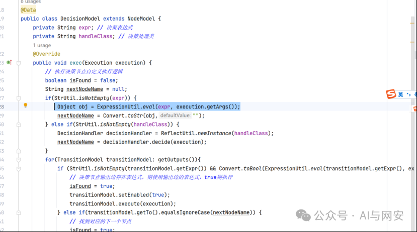  
  
通过代码跟踪，发现eval方法是基于ExpressionEngine接口实现的。/cn/hutool/extra/expression/ExpressionUtil.class  
  
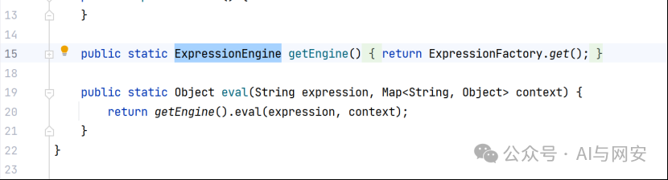  
  
getEngine方法是一个静态方法，在实例化ExpresionUtil时将自动调用该方法。最后，找到配置文件，根据文件内容，可以推断eval()方法识别SPEL表达式。  
```
mldong-master\mldong-framework\mldong-base\src\main\resources\META-INF\services\cn.hutool.extra.expression.ExpressionEngine
```  
  
  
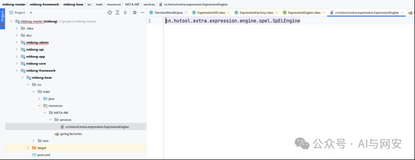  
  
**漏洞验证:**  
  
通过调用链，发现eval()方法从实例启动接口开始触发。值得注意的是，它只在执行决策模型时触发，这意味着处理过程需要有判断条件。  
  
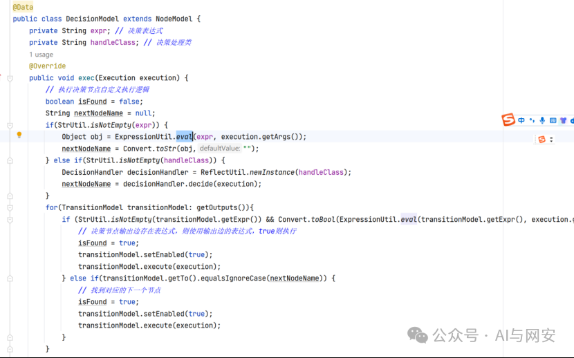  
  
  
进入前端页面，点击添加菜单。  
  
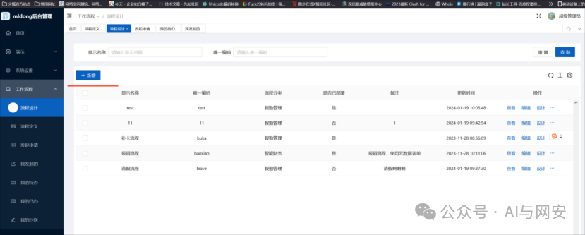  
  
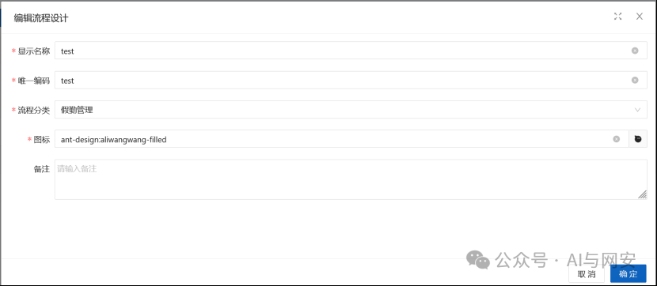  
  
添加后，单击设计菜单，右键单击，选择离开表单。依次选择开始节点、条件判断节点和结束节点。  
  
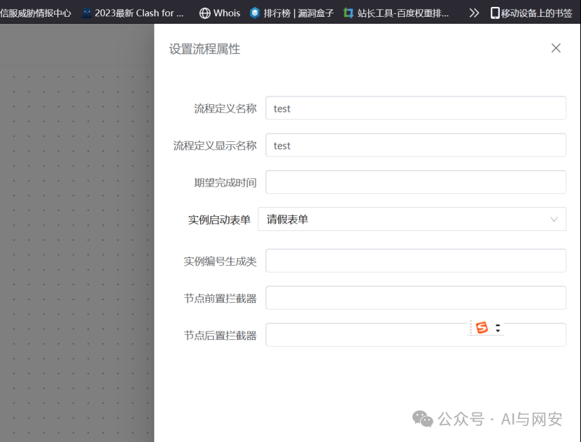  
  
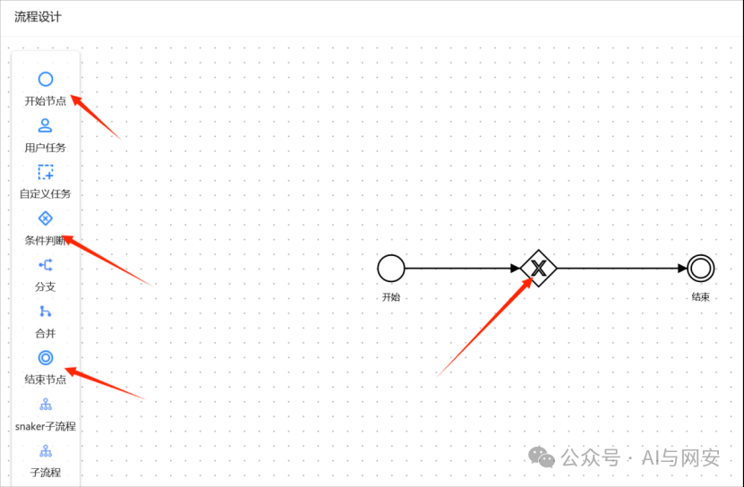  
  
点击条件判断进行编辑。  
  
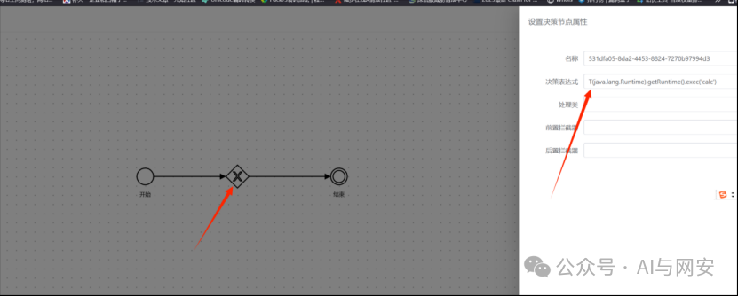  
  
Payload：  
```
T(java.lang.Runtime).getRuntime().exec('calc')
```  
  
  
单击保存  
  
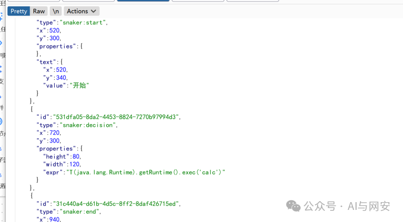  
  
部署后，在流程定义菜单中启动流程。  
  
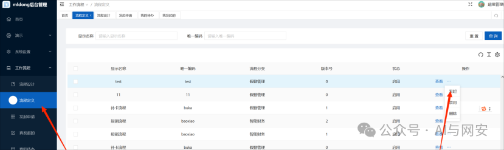  
  
成功触发的漏洞。  
  
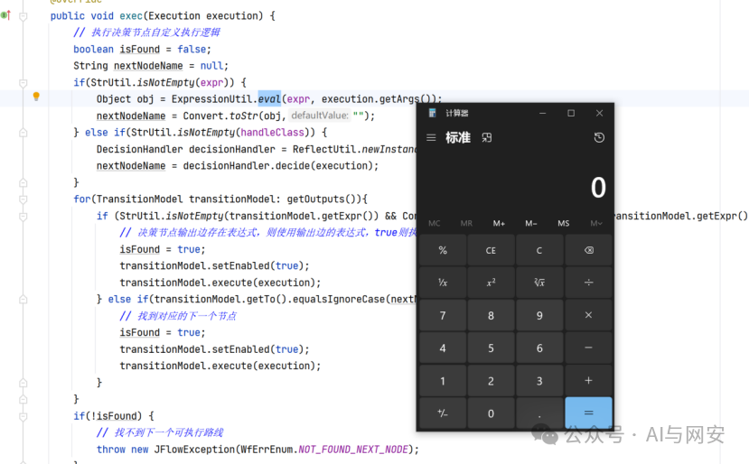  
  
  
  
  
  
05  
  
—  
  
福利领取  
  
  
关注公众号，在公众号主页点发消息发送下面  
**红色字体关键字**免费领取。  
  
  
  
  
  
  
**后台发送【****POC**  
**】关键字获取POC网盘地址**  
  
  
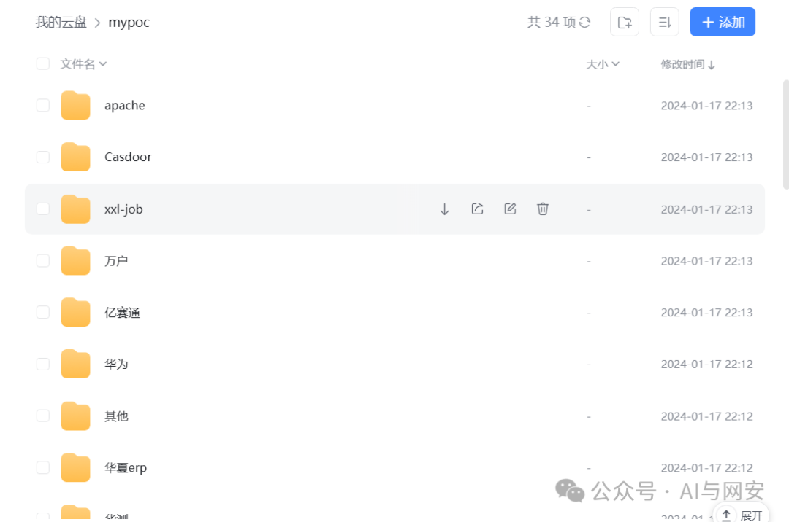  
  
  
**后台发送【****电子书**  
**】关键字获取学习资料网盘地址**  
  
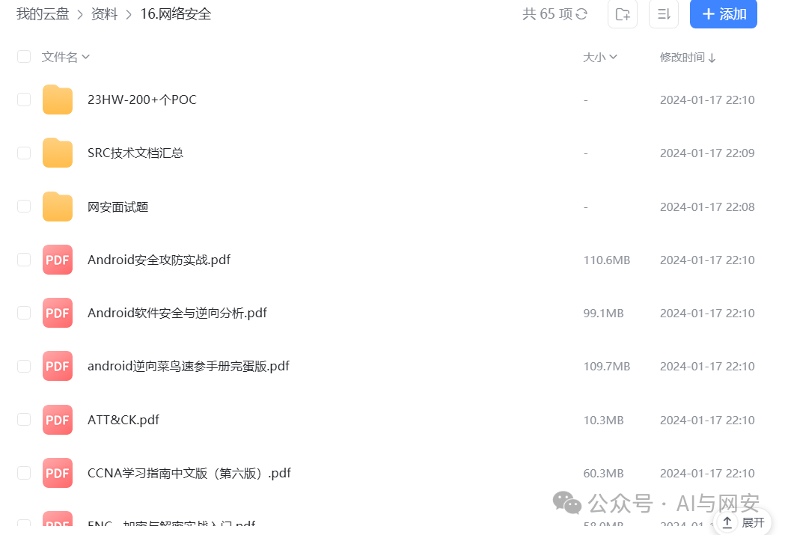  
  
  
  
后台发送【  
**工具**  
】获取渗透工具包  
  
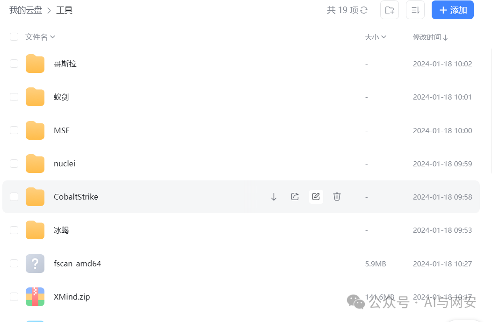  
  
  
  
  


---

> 来源：gelusus/wxvl（微信公众号漏洞文章自动归档，原始披露 URL 尚未确认，现有链接按来源追溯区分别标注）
