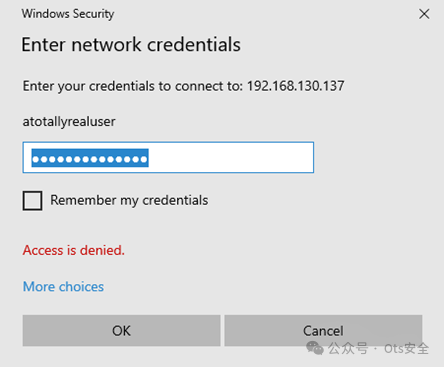
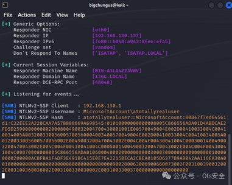
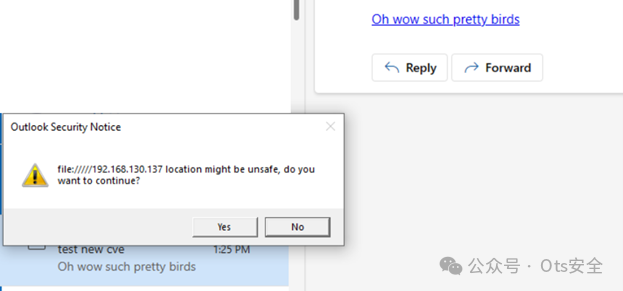
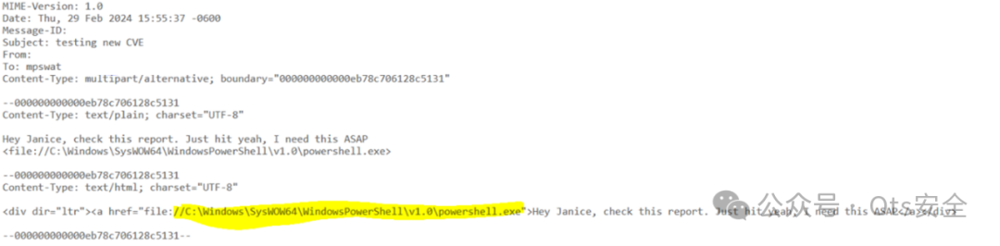
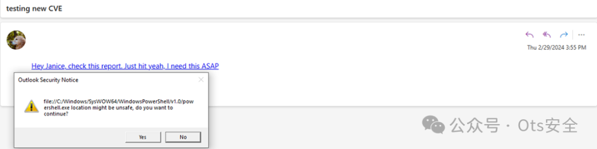
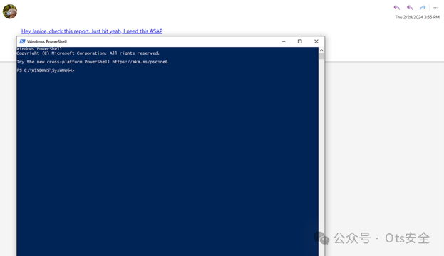

# CVE-2024-20670 报告 - “新 Outlook”NTLM 泄漏和文件执行

<!-- vulwiki-editorial-rebuild:system-misc -->
## 条目范围与校订

- 本文对象：New Outlook for Windows
- 文献类型：研究摘要与链接
- 版本、权限及部署边界：文中观察1.2024.214.400；诱导点击file链接、SafeLinks及SMB/WebDAV网络/策略条件不完整
- 核验状态：仅重建文本校订；未执行文中代码、PoC 或扫描，未把截图或转载声明记为本站复现

### 具体结论与待核项

以下为原归档的逐项勘误与证据缺口；可由文本确定的问题已在下文订正，仍缺来源的事实保持待核。

1. 摘要混合MonikerLink旧研究与新Outlook实际路径，需要明确本编号对哪个缺陷；版本是观察样本不等于完整范围
2. NTLM哈希泄漏应明确为网络认证挑战响应，而非本机密码哈希；网络协议与拦截条件不清
3. 通过file路径访问/启动远程文件不等于无需交互RCE，点击、警告和本地执行上下文需详细说明
4. 称发现并整改全过程但无修复日期/版本/补丁链接，所有关键URL与结果在截图
5. 原作者missfile研究可追溯，应回源而不是从图片概述补造操作；迁邮件客户端

### 操作风险

原文技术操作的实际副作用未复现核验；按其请求/代码评估状态变更、凭据暴露和业务影响

技术请求、代码与实验方法按原文保留；其中的破坏性动作仅限授权、可恢复的隔离环境。缺失代码、参数或版本事实不猜补。

### 来源追溯

- 原文参考链接（未重新核验）：<https://mpizzicaroli.github.io/missfile/>
- 原始披露 URL 未确认；既有归档来源标签保留，不能替代原始公告

### 归档技术正文

 Ots安全   2024-04-14 15:07  
  
  
  
**导语：**  
 近日，研究人员揭示了新 Outlook 应用程序的一个关键漏洞，该漏洞可能导致用户的 NTLM 哈希泄露和远程执行可执行文件。以下是该  
研究人员发现漏洞并整改的全过程。  
  
**漏洞发现：**  
在一次团队讨论中，  
研究人员注意到 CheckPoint 的 MonikerLink 漏洞，并探讨了是否可以通过 WebDAV 协议进行攻击。测试后发现，由于 SMB 被阻止，无法降级攻击。  
  
在检查 Microsoft Outlook 版本时，  
研究人员发现了新 Outlook，并发现其版本号为“1.2024.214.400”，引起了注意。  
  
**漏洞利用过程：**  
  
研究人员尝试在新 Outlook 中使用 MonikerLink 漏洞获取 NTLM 哈希泄露，但发现出现了意外情况。新 Outlook 似乎无法像传统 Outlook 那样泄露哈希。  
  
通过分析网络流量，  
研究人员发现了一个有趣的现象：当在电子邮件中发送 file:// 路径链接时，新 Outlook 会自动将其附加到 URL 中。通过 SafeLinks，该漏洞可能导致用户的 NTLM 哈希泄露。  
  
  
  
  
  
  
  
在尝试利用 WebDAV 协议时，  
研究人员遇到了困难，但意识到可以利用 file:// 协议执行远程文件。通过远程执行可执行文件，攻击者可以利用此漏洞执行恶意代码。  
  
  
  
  
  
  
  
这里可以查看到相关漏洞过程：  
  
https://mpizzicaroli.github.io/missfile/  
  
  
  
  
感谢您抽出  
  
  
  
.  
  
  
  
.  
  
  
  
来阅读本文  
  
  
  
**点它，分享点赞在看都在这里**  
  

---

> 来源：gelusus/wxvl（微信公众号漏洞文章自动归档，原始披露 URL 尚未确认，现有链接按来源追溯区分别标注）
