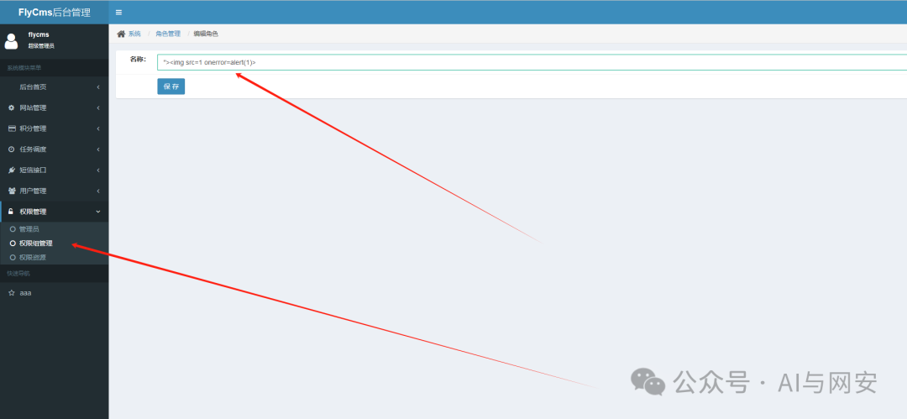
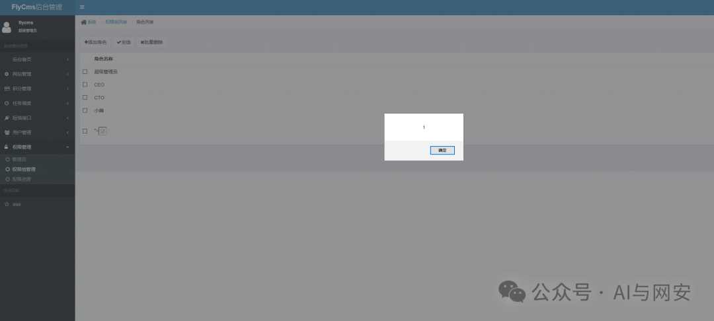

# CVE-2024-21732

<!-- vulwiki-editorial-rebuild:system-misc -->
## 条目范围与校订

- 本文对象：FlyCms
- 文献类型：后台XSS简短复现
- 版本、权限及部署边界：v1.0；权限管理页面可编辑内容的登录角色，后续查看/刷新触发
- 核验状态：仅重建文本校订；未执行文中代码、PoC 或扫描，未把截图或转载声明记为本站复现

### 具体结论与待核项

以下为原归档的逐项勘误与证据缺口；可由文本确定的问题已在下文订正，仍缺来源的事实保持待核。

1. 仅通用img/onerror载荷，无具体字段、URL、请求、目标查看者权限；不能判断自XSS还是跨用户存储XSS
2. 项目源码可追溯但未固定commit，截图不可替代输入/输出上下文
3. 称久未维护缺核验时间，修复建议只自行修复，没有输出编码位置/补丁来源；应归CMS并补产品标题

### 操作风险

原文技术操作的实际副作用未复现核验；按其请求/代码评估状态变更、凭据暴露和业务影响

技术请求、代码与实验方法按原文保留；其中的破坏性动作仅限授权、可恢复的隔离环境。缺失代码、参数或版本事实不猜补。

### 来源追溯

- 原文参考链接（未重新核验）：<https://github.com/sunkaifei/FlyCms>
- 原始披露 URL 未确认；既有归档来源标签保留，不能替代原始公告

### 归档技术正文

原创 fgz  AI与网安   2024-02-29 07:00  
  
免  
责  
申  
明  
：**本文内容为学习笔记分享，仅供技术学习参考，请勿用作违法用途，任何个人和组织利用此文所提供的信息而造成的直接或间接后果和损失，均由使用者本人负责，与作者无关！！！**  
  
  
  
01  
  
—  
  
漏洞名称  
  
  
  
FlyCms 安全漏洞(CVE-2024-21732)  
  
  
  
  
02  
  
—  
  
漏洞影响  
  
  
FlyCms v1.0版本  
  
开源项目，地址如下  
```
https://github.com/sunkaifei/FlyCms
```  
  
  
  
  
  
03  
  
—  
  
漏洞描述  
  
  
FlyCms 是一个类似知乎以问答为基础的完全开源的JAVA语言开发的社交网络建站程序，基于 Spring Boot+Bootstrap3+MyBatis+MySql+Solr +Ehcache应用架构，专注于社区内容的整理、归类和检索，它集合了问答，digg，wiki 等多个程序的优点，帮助用户轻松搭建专业的知识库和在线问答社区。业务模块包括：权限管理，会员管理，角色管理，定时任务管理（调度管理），问答管理，文章管理，分享管理，短信接口管理和邮件系统发送（注册、找回密码、邮件订阅），跨域登录，消息推送，全文检索、前端国际化等等众多模块。  
  
  
FlyCms v1.0版本存在安全漏洞，该漏洞源于允许通过权限管理功能进行跨站脚本(XSS)攻击。  
  
  
  
  
04  
  
—  
  
漏洞复现  
  
  
POC如下  
```
">
```  
  
  
  
  
刷新页面  
  
  
  
  
漏洞复现成功  
  
  
  
  
  
05  
  
—  
  
修复建议  
  
  
这个软件已经很久没人维护了，但因为是开源项目用户可以自行修复。  
  
  
  
  


---

> 来源：gelusus/wxvl（微信公众号漏洞文章自动归档，原始披露 URL 尚未确认，现有链接按来源追溯区分别标注）
