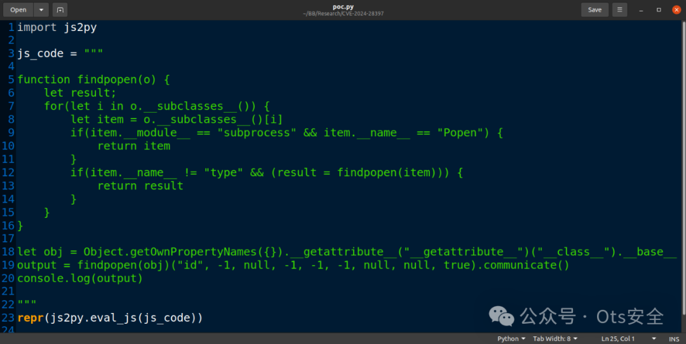
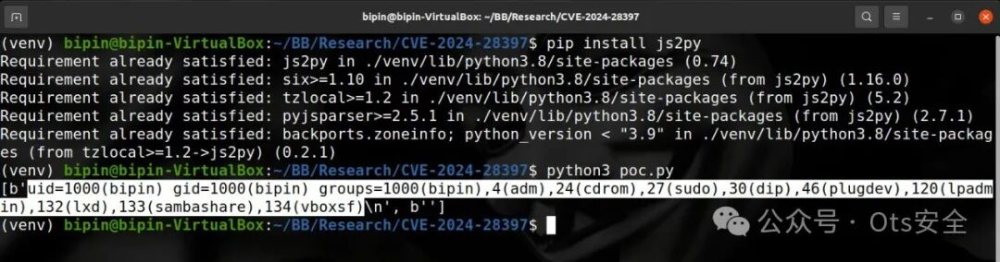

# CVE-2024-28397：js2py（JS 解释器）沙盒逃逸，绕过限制执行命令

<!-- vulwiki-editorial-rebuild:system-misc -->
## 条目范围与校订

- 本文对象：Js2Py
- 文献类型：Python JS沙盒逃逸简讯
- 版本、权限及部署边界：文列Python3的Js2Py<=0.74；宿主主动执行不可信JS，disable_pyimport已开仍可绕过；依赖产品需选择js2py解释器
- 核验状态：仅重建文本校订；未执行文中代码、PoC 或扫描，未把截图或转载声明记为本站复现

### 具体结论与待核项

以下为原归档的逐项勘误与证据缺口；可由文本确定的问题已在下文订正，仍缺来源的事实保持待核。

1. pyload/cloudscraper/lightnovel-crawler是潜在集成影响，必须分别给依赖版本与不可信JS可达路径，不泛化所有安装
2. 在3.12下安装python3与紧接不支持3.12矛盾，应明确Python3.12以下，而不是制造不可用环境
3. PoC仅GitHub地址，无实际代码/构建锁定/补丁信息，latest是文章时点不是当前版本
4. 宿主权限内命令执行不是OS/容器沙箱逃逸或必然root；远程利用需应用提供脚本入口
5. 交互图片和宣传占较多篇幅，保留原研究链接

### 操作风险

原文技术操作的实际副作用未复现核验；按其请求/代码评估状态变更、凭据暴露和业务影响

技术请求、代码与实验方法按原文保留；其中的破坏性动作仅限授权、可恢复的隔离环境。缺失代码、参数或版本事实不猜补。

### 来源追溯

- 原文参考链接（未重新核验）：<https://github.com/Marven11/CVE-2024-28397-js2py-Sandbox-Escape>
- 原始披露 URL 未确认；既有归档来源标签保留，不能替代原始公告

### 归档技术正文

 Ots安全   2024-06-22 12:07  
  
  
  
js2py是一个流行的 Python 包，可以在 Python 解释器中执行 JavaScript 代码。各种网络爬虫都会使用它来解析网站上的 JAVScript 代码。  
  
内部一个全局变量的实现存在漏洞js2py，使得攻击者可以获取js2py环境中一个python对象的引用，从而逃离js环境并在主机上执行任意命令。  
  
通常情况下，用户会调用此方法js2py.disable_pyimport()来阻止 JavaScript 代码逃离js2py环境。但利用此漏洞，攻击者可以绕过此限制并在主机上执行任何命令。  
  
威胁行为者可以托管一个包含恶意 js 文件的网站，或者通过 HTTP API 发送恶意脚本供受害者解析。通过这样做，威胁行为者可以通过在目标上执行任何 shell 命令来在主机上执行远程代码执行。  
  
漏洞详细信息  
- **受影响组件的版本号：**  
  
1. 在 Python 3 下运行的最新 js2py (<=0.74)  
  
- **受影响的产品：**  
  
1. pyload/pyload  
  
1. VeNoMouS/cloudscraper（使用 js2py 作为可选的“js 解释器”）  
  
1. dipu-bd/lightnovel-crawler  
  
- **重现步骤：**  
  
1. 在3.12下安装python3，目前js2py不支持python3.12。  
  
1. 运行pip install js2py安装js2py并执行poc.py，它将尝试head -n 1 /etc/passwd; calc; gnome-calculator; kcalc;在主机上执行。  
  
1. 如果存在漏洞，脚本应该打印Success! the vulnerability exists...或弹出计算器。  
  
  
  
  
  
  
```
https://github.com/Marven11/CVE-2024-28397-js2py-Sandbox-Escape
```  
  
  
  
  
感谢您抽出  
  
  
  
.  
  
  
  
.  
  
  
  
来阅读本文  
  
  
  
**点它，分享点赞在看都在这里**  
  


---

> 来源：gelusus/wxvl（微信公众号漏洞文章自动归档，原始披露 URL 尚未确认，现有链接按来源追溯区分别标注）
