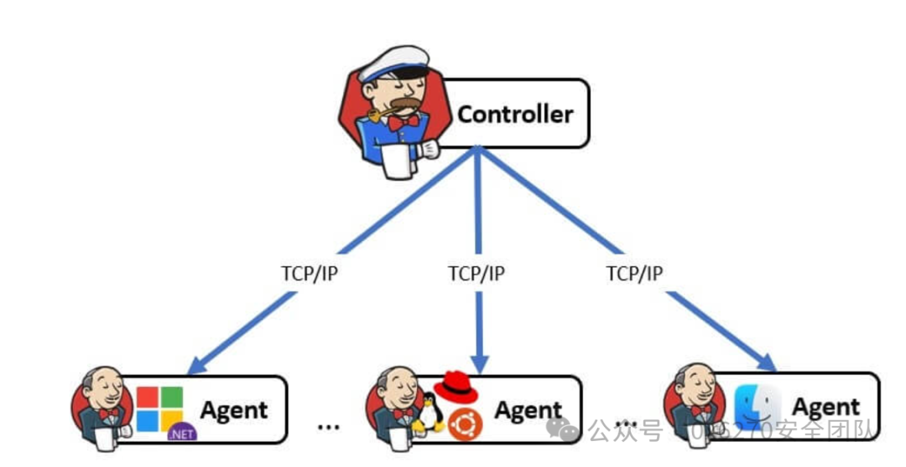
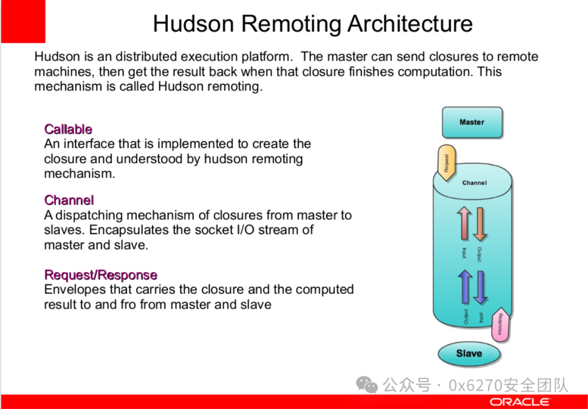
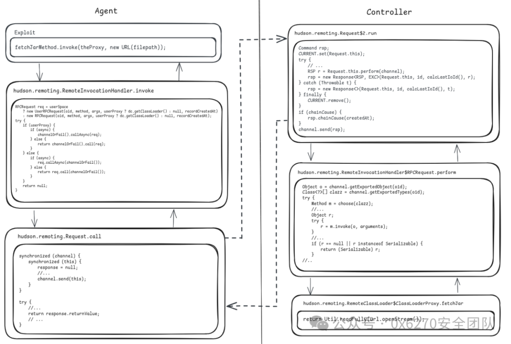
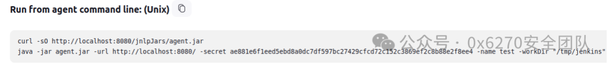
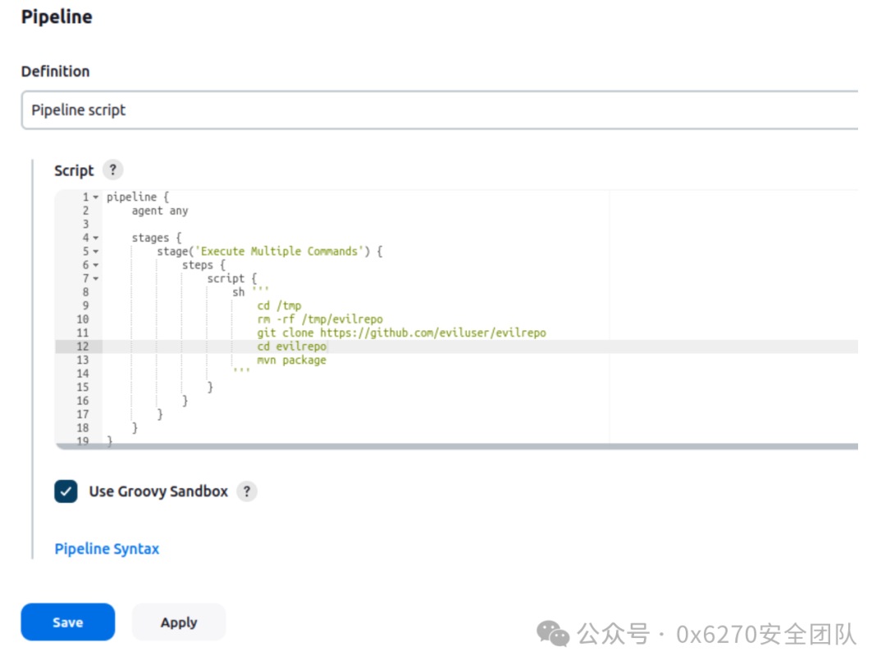
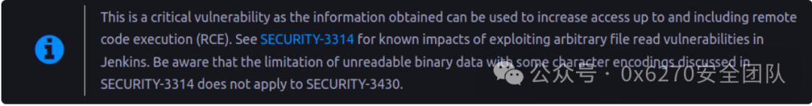

# CVE-2024-43044 漏洞分析

<!-- vulwiki-editorial-rebuild:system-misc -->
## 条目范围与校订

- 本文对象：Jenkins Remoting/Controller
- 文献类型：Jenkins代理到控制器文件读取及RCE链
- 版本、权限及部署边界：需代理进程控制、可在代理执行代码或Agent/Connect权限；入站代理secret或附加现有Remoting JVM；cookie链需Remember-me及可伪造管理员身份
- 核验状态：仅重建文本校订；未执行文中代码、PoC 或扫描，未把截图或转载声明记为本站复现

### 具体结论与待核项

以下为原归档的逐项勘误与证据缺口；可由文本确定的问题已在下文订正，仍缺来源的事实保持待核。

1. 非匿名互联网RCE，必须提升代理信任边界前提；SSH模式Java Attach还受同用户/JDK/Attach策略等限制
2. 从旧文件读取公告搬来Overall/Read前几行限制却说本漏洞满足，需区分CLI旧漏洞限制与fetchJar二进制完整读取路径，不增加/消除错误权限条件
3. 全部Security3430Test、patch、reader、cookie算法、curl/Groovy和build脚本为空代码块，无法按现文复现
4. 文件路径$JENKINS_主页/secret.key被机翻损坏，users/*.xml路径需按真实目录布局核对
5. DISABLE_JAR_URL_VALIDATOR是关闭防护而非缓解，应明确危险配置；REJECT_ALL有兼容影响
6. 无受影响/修复Jenkins和Remoting版本、无可点击官方公告/commit或EXP源码；转译保留我们原创口吻但未追原作者

### 操作风险

原文技术操作的实际副作用未复现核验；按其请求/代码评估状态变更、凭据暴露和业务影响

技术请求、代码与实验方法按原文保留；其中的破坏性动作仅限授权、可恢复的隔离环境。缺失代码、参数或版本事实不猜补。

### 来源追溯

- 原文参考链接（未重新核验）：<http://IP:8080/>
- 原始披露 URL 未确认；既有归档来源标签保留，不能替代原始公告

### 归档技术正文

原创 0x6270  0x6270安全团队   2024-09-10 22:00  
  
## 1. 引言  
  
Jenkins 是一种广泛用于自动执行构建、测试和部署软件等任务的工具，用于自动执行构建、测试和部署软件等任务。它是许多公司组织开发过程的关键部分。如果攻击者获取对 Jenkins 服务器的访问权限，他们可能会造成严重的损害，例如窃取凭据、污染代码，甚至中断部署。通过访问 Jenkins，攻击者可以篡改软件管道，从而可能导致开发过程混乱并泄露敏感数据。  
  
本文中我们将分析 CVE-2024-43044 的公告，该漏洞为 Jenkins 任意文件读取漏洞。  
## 2. Jenkins 架构概述  
  
Jenkins 架构基于控制器/代理模式，其中 Jenkins 控制器是 Jenkins 安装中的原始节点。Jenkins 控制器管理 Jenkins 代理并编排它们的工作，包括在代理上制定作业和监控代理 。控制器和代理之间的通信可以是入站（以前称为“JNLP”）或 SSH。  
  
  
  
在通信层，进程间通信的实现是在 Remoting/Hudson 库中完成的。该库还提供了一些关于 Remoting/Hudson库如何工作的文档。下图显示了此体系结构的一些重要组件。  
  
  
## 3. 漏洞分析  
### 3.1 公告  
  
Jenkins 团队针对任意文件读取漏洞发布了公告 （  
**SECURITY-3430 / CVE-2024-43044**  
），该漏洞允许代理从控制器读取文件。上述发生是因为允许控制器将 JAR 文件传输到代理的功能。根据公告，问题在于：在控制器上调用   
**ClassLoaderProxy#fetchJar**  
 ，不限制代理向控制器文件系统去读取文件。  
  
在漏洞的相关提交中，包含触发漏洞的测试代码。  
  
Security3430Test.java  
> 原文此处代码块为空，内容未归档；无法从空块证明或复现所述结果。
  
此代码主要获得对   
**hudson.remoting.RemoteClassLoader**  
 的访问权，它负责通过通道远程加载类文件。具体来说，它访问   
**RemoteClassLoader**  
 的 proxy 字段中的 Proxy 对象。此 Proxy 的处理程序是   
**hudson.remoting.RemoteInvocationHandler**  
 的实例。  
  
然后，代码使用此处理程序调用   
**fetchJar**  
 方法，该方法将触发   
**hudson.remoting.RemoteInvocationHandler.invoke**  
 方法。依次准备对控制器的远程过程调用 （RPC）。在控制器侧，调用到达   
**hudson.remoting.RemoteClassLoader$ClassLoaderProxy.fetchJar**  
。如下所示，控制器上的   
**fetchJar**  
 方法不验证 URL（由用户控制），并在未经验证的情况下读取资源。  
> 原文此处代码块为空，内容未归档；无法从空块证明或复现所述结果。
  
下面的图像将流程可视化：  
  
  
  
此缺陷允许绕过 Agent -> 控制器访问控制系统 ，该系统从 Jenkins v 2.326版本 开始默认启用，它以控制代理对控制器的访问，以防止其接管。  
### 3.2 补丁  
  
该补丁引入了验证程序和一些 Java 系统属性来控制   
fetchJar  
 功能。  
  
Java 系统属性包括：  
- **jenkins.security.s2m.JarURLValidatorImpl.REJECT_ALL**  
 – 拒绝任何 JAR进行获取  
  
- **hudson.remoting.Channel.DISABLE_JAR_URL_VALIDATOR**  
 – 禁用验证  
  
验证器验证请求的 URL 是否指向受允许的 JAR 文件（来自插件或核心的 JAR 文件），如代码片段所示：  
  
jenkinsci/remoting/src/main/java/hudson/remoting/RemoteClassLoader.java  
> 原文此处代码块为空，内容未归档；无法从空块证明或复现所述结果。
  
jenkinsci/jenkins/core/src/main/java/jenkins/security/s2m/JarURLValidatorImpl.java  
> 原文此处代码块为空，内容未归档；无法从空块证明或复现所述结果。
  
有关其他信息和解决方法，请参阅公告。  
## 4. 获取 RCE  
### 4.1 先决条件  
  
在公告中，我们可以看到攻击以“  
代理进程、代理上运行的代码以及具有 Agent/Connect 权限的攻击者  
”发起 。我们构造EXP去多重利用，同时支持入站代理  和 SSH 连接。  
#### 使用入站代理密钥  
  
在此模式下，EXP充当启动与控制器的连接的自定义代理。要使用它，您需要以下信息：  
1. 目标 Jenkins 服务器 URL;  
  
1. 代理名称;  
  
1. 代理密钥。  
  
获取上述一种方法是，一旦您可以访问代理节点，请列出所有正在运行的进程。您可能会在命令行中找到一个包含这些数据的 Java 进程，因为这是 Jenkins 建议在配置入站代理后连接入站代理的默认方式。  
  
  
  
另一种方法是通过凭据泄漏。值得注意的是，在运行我们的代理之前，必须终结正在运行的代理或等待断开连接，因为单个代理无法同时多次连接到 Jenkins 服务器。  
  
以这种方式运行漏洞的示例：  
> 原文此处代码块为空，内容未归档；无法从空块证明或复现所述结果。
#### 连接正在运行的 Remoting 进程  
  
在这种模式下，我们使用 Java 插桩 API 连接到已经在运行的 Remoting 进程。我们连接一个 Java 代理来完成漏洞利用。  
  
当以SSH连接代理/控制器完成时比较实用，因为在此模式下没有代理密钥。在控制器中启动的 SSHLauncher 将通过 SSH 会话执行命令  
java -jar remoting.jar -workDir WORKDIR -jar-cache WORKDIR/remoting/jarCache  
，并重定向其 stdin 和 stdout 以创建一个 Channel 来与代理通信。  
  
因此，例如，当通过部署在代码存储库中的恶意构建脚本进行攻击时，该代码存储库的构建由 Jenkins 管理（在代理上运行），攻击者将无法检索代理名称/密钥，因为在这种情况下不存在这些名称/密钥。将有一个 Remoting 进程通过 SSH 上的管道连接到控制器。然后，EXP将找到此进程的 PID 并将 Java 代码注入其中以执行后续步骤。  
  
要使用此模式，您需要提供以下信息：  
1. 目标 Jenkins 服务器 URL。（  
**可选**  
 – 漏洞将使用通过 SSH 连接的控制器的 IP，并形成 Jenkins URL 作为   
http://IP:8080/  
。在这种情况下，必须已安装   
pgrep  
、  
ps  
 和   
netstat  
）;  
  
1. 要执行的攻击命令。  
  
下图显示了一个攻击示例，其中管道在不受信任的克隆库中运行 “mvn package”。假设 Jenkins 配置为不通过内置节点在控制器上本地执行构建。这足以破坏 Jenkins 控制器：  
  
  
  
此设置中的库只需要两个文件：  
  
build.sh  
> 原文此处代码块为空，内容未归档；无法从空块证明或复现所述结果。
  
pom.xml：  
> 原文此处代码块为空，内容未归档；无法从空块证明或复现所述结果。
### 4.2 读取任意文件  
  
当提供代理 secret/name 时，EXP使用它来建立与 Remoting 库的 Jenkins 服务器的连接。我们使用 Engine 类并等待建立连接。但是，在连接到现存在的代理时，我们会跳过这些步骤。  
  
然后，我们从其中一个正在运行的线程中获取   
**hudson.remoting.RemoteClassLoader**  
 的实例。  
> 原文此处代码块为空，内容未归档；无法从空块证明或复现所述结果。
  
我们使用它来创建一个 reader 对象，该对象处理   
fetchJar（）  
 方法调用。  
> 原文此处代码块为空，内容未归档；无法从空块证明或复现所述结果。
  
有了这个对象，我们可以使用它从服务器加载文件。不需要路径遍历，您可以通过指定文件的完整路径来请求文件，例如：  
> 原文此处代码块为空，内容未归档；无法从空块证明或复现所述结果。
### 4.3 伪造有效的用户 Cookie  
  
该公告确认此漏洞可能存在 RCE，并指出了 2024 年 1 月发布的另一个文件读取漏洞的第二个公告，该漏洞列举了在 Jenkins 中通过此类缺陷获取 RCE 的一些方法。  
  
  
  
其中一种方法留意到，因为它不需要任何配置更改，即适用于默认安装。通过  
**远程代码执行“Remember me”cookie**  
包括为管理员帐户伪造一个 remember-me Cookie，允许攻击者登录应用程序并获得对脚本控制台的访问权限以执行命令。  
  
该技术的要求是：  
1. “Remember me” 功能已启用（默认）。  
  
1. 攻击者可以检索二进制密钥。  
  
1. 攻击者具有 Overall/Read 权限，能够读取文件中前几行之后的内容。  
  
该漏洞满足这些要求，因为它可用于读取二进制文件和文件的全部内容。  
  
需要一些数据才能构造有效的 Cookie。在实操中采用了这种方法：  
1. 读取   
**$JENKINS_HOME/users/users.xml**  
 文件以获取在 Jenkins 服务器上拥有帐户的用户列表;  
  
1. 读取每个   
**$JENKINS_HOME/users/*.xml**  
 文件以提取用户信息，例如：用户名、用户种子、时间戳和密钥hash;  
  
1. 读取 Cookie 签名所需的文件：  
  
1. **$JENKINS_主页/secret.key**  
  
1. **$JENKINS_HOME/secrets/master.key**  
  
1. **$JENKINS_HOME/secrets/org.springframework.security.web.authentication.rememberme.TokenBasedRememberMeServices.mac**  
  
一旦有了这些数据，就复制了 Jenkins cookie 签名算法，这可以用下面的伪代码来描述：  
> 原文此处代码块为空，内容未归档；无法从空块证明或复现所述结果。
  
此 Cookie 可以在对 Jenkins Web 应用程序的请求中作为 “Cookie： remember-me=VALUE” 发送。  
### 4.4 代码执行  
  
一旦有了remeber-me cookie，就可以在   
**/crumbIssuer/api/json**  
 中请求一个 CSRF 令牌（名为   
**Jenkins-Crumb**  
）。获取响应中收到的   
**JSESSIONID**  
 Cookie，因为这两个 Cookie 是关联的。  
  
之后，我们向   
**/scriptText**  
 发送一个 POST 请求，将 Jenkins-Crumb 值作为header传递，将 JSESSIONID 值作为 cookie，以及 remember-me cookie。要执行的 Groovy 代码通过名为 “script” 的 POST 参数传递。  
  
代码会自动完成所有这些操作。表示此最终请求的 curl 命令如下所示：  
> 原文此处代码块为空，内容未归档；无法从空块证明或复现所述结果。
  
使用 Groovy 执行命令：  
> 原文此处代码块为空，内容未归档；无法从空块证明或复现所述结果。
### 4.5 漏洞利用总结  
  
以下是关于漏洞利用中存在的步骤的回顾：  
1. 获取 hudson.remoting.RemoteClassLoader 的引用;  
  
1. 使用它创建文件读取器;  
  
1. 读取必要的文件（总共 3 个）为给定用户伪造 cookie;  
  
1. 阅读 Jenkins 用户列表;  
  
1. 读取有关每个用户的信息（id、timestamp、seed 和 hash）;  
  
1. 为用户伪造一个remember-me Cookie，直到我们可以访问 Jenkins 脚本引擎;  
  
1. 使用 Jenkins 脚本引擎执行系统命令;  
  
1. 以工具John the Ripper 准备好破解的格式转储用户名和哈希值。  
  
  

---

> 来源：gelusus/wxvl（微信公众号漏洞文章自动归档，原始披露 URL 尚未确认，现有链接按来源追溯区分别标注）
