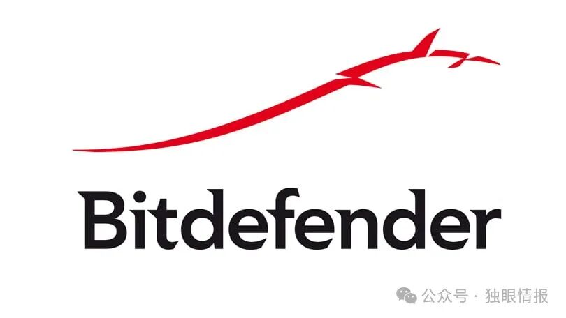

# CVE-2024-6980 Bitdefender GravityZone 存在严重漏洞

<!-- vulwiki-editorial-rebuild:system-misc -->
## 条目范围与校订

- 本文对象：Bitdefender GravityZone本地Update Server Proxy Service
- 文献类型：SSRF风险简讯
- 版本、权限及部署边界：仅本地GravityZone Console<6.38.1-5，云实例排除；更新代理接口可达条件和认证未给
- 核验状态：仅重建文本校订；未执行文中代码、PoC 或扫描，未把截图或转载声明记为本站复现

### 具体结论与待核项

以下为原归档的逐项勘误与证据缺口；可由文本确定的问题已在下文订正，仍缺来源的事实保持待核。

1. 明确本地/云区分有价值，保留固定最低修复build
2. 详细错误日志问题到任意请求的机制未解释，日志泄露与SSRF根因可能被二次摘要混写需核对厂商
3. 甚至执行任意命令只是推测，正文无链/PoC，不能升级为确认RCE
4. 未发现在野/PoC是2024-08时点声明，不应无日期继承当前状态；CVSS4.0独立标版本
5. 有Bitdefender原始安全公告与CVE记录，适合主源回填

### 操作风险

原文技术操作的实际副作用未复现核验；按其请求/代码评估状态变更、凭据暴露和业务影响

技术请求、代码与实验方法按原文保留；其中的破坏性动作仅限授权、可恢复的隔离环境。缺失代码、参数或版本事实不猜补。

### 来源追溯

- 原文参考链接（未重新核验）：<https://nvd.nist.gov/vuln/detail/CVE-2024-6980>
- 原文参考链接（未重新核验）：<https://www.bitdefender.com/support/security-advisories/verbose-error-handling-in-gravityzone-update-server-proxy-service/>
- 原文参考链接（未重新核验）：<https://feedly.com/cve/CVE-2024-6980⁠>
- 原文参考链接（未重新核验）：<https://cybersecuritynews.com/bitdefender-ssrf-vulnerability/⁠>
- 原文参考链接（未重新核验）：<https://www.cve.org/CVERecord?id=CVE-2024-6980>
- 原始披露 URL 未确认；既有归档来源标签保留，不能替代原始公告

### 归档技术正文

flyme  独眼情报   2024-08-03 11:54  
  
  
  
Bitdefender GravityZone 更新服务器中发现了一个漏洞。该漏洞可能允许攻击者在目标更新服务器上执行服务器端请求伪造 (SSRF)。该漏洞 (CVE-2024-6980) 的 CVSS 4.0 评分为 9.2（满分 10 分）。  
### 描述：  
  
CVE-2024-6980 是 GravityZone 更新控制台软件组件（版本 6.38.1-5 之前）中的一个详细错误日志记录问题。攻击者可以利用此日志记录问题操纵服务器，向任何给定的第三方机器发出任意请求，从而可能泄露敏感数据，甚至可能执行任意命令。这会严重危害组织的安全。  
### 受影响的版本：  
  
此问题影响在本地运行 6.38.1-5 之前版本的 GravityZone Console 的客户，因此不包括基于云的实例。  
### 建议：  
- 为了缓解此严重漏洞，在本地运行 Bitdefender GravityZone 的组织应确保正确应用 GravityZone 控制台的最新自动更新（最低 6.38.1-5）。  
  
- 确保为未来的实例启用自动更新。  
  
- 虽然尚未发现任何已知的野外利用实例或概念验证，但任何此时仍在运行易受攻击的版本的组织都应考虑在更新组件后查看 GravityZone 控制台日志以检查是否存在可疑活动的证据。  
  
### 参考：  
- https://nvd.nist.gov/vuln/detail/CVE-2024-6980  
  
- https://www.bitdefender.com/support/security-advisories/verbose-error-handling-in-gravityzone-update-server-proxy-service/  
  
- https://feedly.com/cve/CVE-2024-6980⁠  
  
- https://cybersecuritynews.com/bitdefender-ssrf-vulnerability/⁠  
  
- https://www.cve.org/CVERecord?id=CVE-2024-6980  
  

---

> 来源：gelusus/wxvl（微信公众号漏洞文章自动归档，原始披露 URL 尚未确认，现有链接按来源追溯区分别标注）
