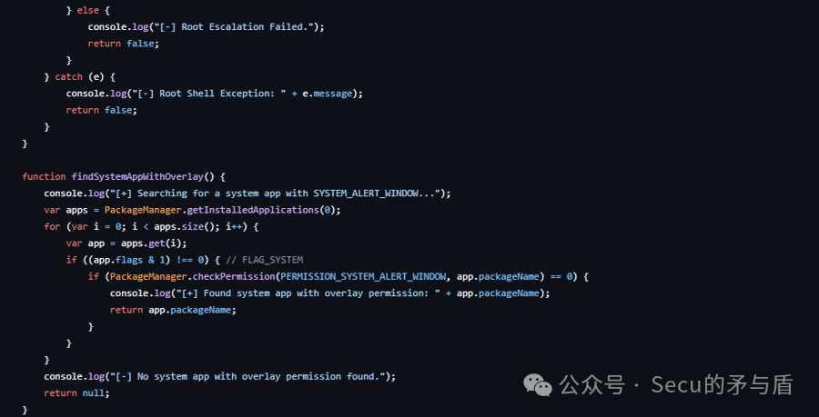
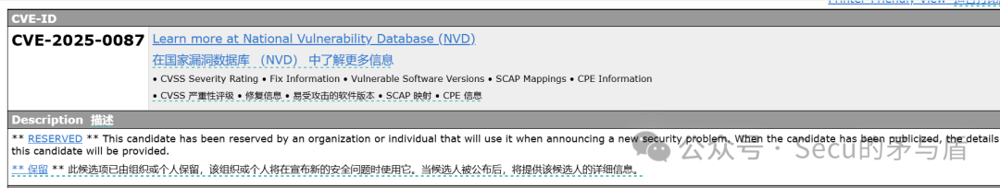

# CVE-2025-0087 安卓本地权限提升POC

<!-- vulwiki-editorial-rebuild:system-misc -->
## 条目范围与校订

- 本文对象：Android Framework UninstallerActivity
- 文献类型：Android跨用户卸载PoC线索
- 版本、权限及部署边界：文列Android12/12L/13/14/15-next与2025-03-01补丁级别；本地攻击者可触发卸载其他用户应用，具体权限缺失
- 核验状态：仅重建文本校订；未执行文中代码、PoC 或扫描，未把截图或转载声明记为本站复现

### 具体结论与待核项

以下为原归档的逐项勘误与证据缺口；可由文本确定的问题已在下文订正，仍缺来源的事实保持待核。

1. 跨用户卸载是授权边界绕过，不等同获得root或卸载任意系统受保护应用
2. 作者明确真假/有效性尚不明确，PoC仅第三方GitHub，必须保留未验证状态而不是标题POC即确认
3. 15-next:2025-03-01是分支/补丁级元数据，不能当普通发布版本；需Android官方公告/AOSP提交和OEM补丁映射
4. 无代码、调用参数/权限及无需用户交互证据；仅Vulert/MITRE和截图

### 操作风险

原文技术操作的实际副作用未复现核验；按其请求/代码评估状态变更、凭据暴露和业务影响

技术请求、代码与实验方法按原文保留；其中的破坏性动作仅限授权、可恢复的隔离环境。缺失代码、参数或版本事实不猜补。

### 来源追溯

- 原文参考链接（未重新核验）：<https://cve.mitre.org/cgi-bin/cvename.cgi?name=CVE-2025-0087>
- 原文参考链接（未重新核验）：<https://github.com/SpiralBL0CK/CVE-2025-0087-/>
- 原文参考链接（未重新核验）：<https://vulert.com/vuln-db/CVE-2025-0087>
- 原始披露 URL 未确认；既有归档来源标签保留，不能替代原始公告

### 归档技术正文

原创 Secu的矛与盾  Secu的矛与盾   2025-03-07 21:48  
  
简述  
  
    CVE-2025-0087 是 Android Framework Base 包中的本地权限提升漏洞，其核心问题出现在 UninstallerActivity.java 文件中。由于代码中缺乏充分的检查机制，攻击者可以在无需用户交互的情况下，借助该漏洞卸载其他用户的应用程序，从而实现本地权限的非授权提升。该漏洞的严重性在于它直接威胁到了系统应用的完整性与安全性，相关补丁已在 15-next:2025-03-01 及其他版本中推出。  
  
  
  
影响的版本  
  
      漏洞影响的版本包括 15-next、12、12L、13 及 14 系列，补丁方案已于2025年3月初推出，但在实际部署过程中，跨版本、多渠道更新的不一致性仍可能成为潜在隐患。  
  
当然真假性，有效性尚不明确，还望读者注意辨别，CVE官网：  
  
https://cve.mitre.org/cgi-bin/cvename.cgi?name=CVE-2025-0087  
  
  
  
  
现POC已公开  
```
https://github.com/SpiralBL0CK/CVE-2025-0087-/
```  
  
来源：  
https://vulert.com/vuln-db/CVE-2025-0087  
  


---

> 来源：gelusus/wxvl（微信公众号漏洞文章自动归档，原始披露 URL 尚未确认，现有链接按来源追溯区分别标注）
