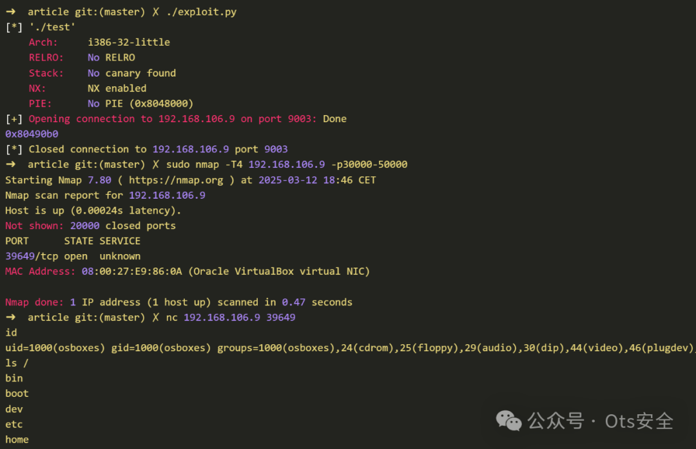

# CVE-2025-23016：严重的 FastCGI 堆溢出威胁嵌入式设备，PoC 发布

<!-- vulwiki-editorial-rebuild:system-misc -->
## 条目范围与校订

- 本文对象：fcgi2/libfcgi FastCGI C库
- 文献类型：FastCGI库溢出研究摘要
- 版本、权限及部署边界：文指32位ReadParams长度相加溢出，攻击者需控制FastCGI参数记录；PHP-FPM独立实现明确不受此库问题影响
- 核验状态：仅重建文本校订；未执行文中代码、PoC 或扫描，未把截图或转载声明记为本站复现

### 具体结论与待核项

以下为原归档的逐项勘误与证据缺口；可由文本确定的问题已在下文订正，仍缺来源的事实保持待核。

1. FastCGI既是协议又是实现库，需准确写fcgi2/libfcgi，不泛化到所有Nginx/Apache/lighttpd
2. HTTP请求参数可控不必然能发送畸形FCGI长度，前端转换/直接FastCGI可达及32位数据模型是关键缺失
3. 有Synacktiv原研究和2.4.5修复提示，标题PoC发布但本地无代码，作为摘要关联即可
4. 嵌入式普遍缺防护/特定摄像头受影响没有型号证据，不得扩成全部设备；CVSS版本和向量未列

### 操作风险

原文技术操作的实际副作用未复现核验；按其请求/代码评估状态变更、凭据暴露和业务影响

技术请求、代码与实验方法按原文保留；其中的破坏性动作仅限授权、可恢复的隔离环境。缺失代码、参数或版本事实不猜补。

### 来源追溯

- 原文参考链接（未重新核验）：<https://www.synacktiv.com/en/publications/cve-2025-23016-exploiting-the-fastcgi-library>
- 原始披露 URL 未确认；既有归档来源标签保留，不能替代原始公告

### 归档技术正文

 Ots安全   2025-04-29 11:14  
  
  
  
  
  
Synacktiv 的安全研究员 Baptiste Mayaud 披露了 FastCGI 库中的一个高危漏洞，编号为 CVE-2025-23016（CVSS 9.4）。该漏洞源于对参数长度的不当处理，可能导致可利用的堆溢出，尤其会影响摄像头和嵌入式系统等低功耗设备。  
  
FastCGI 是一个 C 语言库，旨在将 Nginx 或 Apache 等 Web 服务器与第三方 Web 应用程序连接起来。它广泛应用于需要轻量级编译应用程序的环境。虽然 PHP-FPM 重新实现了 FastCGI，并且不受影响，但许多嵌入式技术仍然直接使用了该易受攻击的库。  
  
该漏洞存在于 ReadParams() 函数中。在处理传入的 HTTP 参数时，FastCGI 库会错误地计算内存分配所需的总大小：  
  
“可能是为了在键和值之间存储‘=’字符，并在字符串末尾添加一个空字节，因此在最终的分配计算中添加了‘+2’， ”Baptiste Mayaud解释道。  
  
在 32 位系统上，此加法运算可能导致整数溢出，导致尽管预期数据量很大，但内存分配却很小。当数据被复制到这个过小的缓冲区时，就会发生堆溢出。  
  
能够控制HTTP 请求参数的攻击者可以：  
- 触发堆溢出。  
  
- 损坏的内存结构。  
  
- 可能在受影响的设备上执行任意代码。  
  
这尤其危险，因为嵌入式系统通常缺乏现代漏洞缓解措施。  
  
在演示中，Mayaud 使用 FastCGI 设置了一个存在漏洞的 lighttpd 服务器。通过利用该漏洞，他成功操纵堆内存，覆盖了 FastCGI 流结构中的函数指针。最终，他通过劫持 fillBuffProc 函数指针实现了任意代码执行。  
  
该漏洞利用策略基于获取 FCGX_Stream 结构体之前的易受攻击指针，然后覆盖其缓冲区以重写该结构体，并将 fillBuffProc 替换为系统的 PLT 条目。Mayaud 发布了针对此漏洞的概念验证 (POC) 漏洞利用代码。  
  
建议用户将 FastCGI 库升级到2.4.5或更高版本，该版本已修复该错误。  
  
参考文章：  
  
https://www.synacktiv.com/en/publications/cve-2025-23016-exploiting-the-fastcgi-library  
  
  
  
感谢您抽出  
  
  
  
.  
  
  
  
.  
  
  
  
来阅读本文  
  
  
  
**点它，分享点赞在看都在这里**  
  
  

---

> 来源：gelusus/wxvl（微信公众号漏洞文章自动归档，原始披露 URL 尚未确认，现有链接按来源追溯区分别标注）
