# CVE-2025-4076 BL-Link远程代码执行漏洞挖掘

<!-- vulwiki-editorial-rebuild:system-misc -->
## 条目范围与校订

- 本文对象：LB-LINK BL-AC3600
- 文献类型：路由器仿真与命令注入挖掘
- 版本、权限及部署边界：BL-AC3600具体固件未列；管理改密码请求含Authorization和user=admin；Buildroot2024.08.2/QEMU仿真
- 核验状态：仅重建文本校订；未执行文中代码、PoC 或扫描，未把截图或转载声明记为本站复现

### 具体结论与待核项

以下为原归档的逐项勘误与证据缺口；可由文本确定的问题已在下文订正，仍缺来源的事实保持待核。

1. 型号BL-AC3600及更高版本没有版本意义，不可当固件范围；BL-Link/LBLink命名不一致
2. 报文携管理员认证且文称入口做验证，应明确认证后命令注入，不把远程等同匿名
3. 核心rootcause为routepwd拼接chpasswd.sh命令；没有实际攻击payload/回显文本，不是完整EXP
4. 启动脚本、包安装、mount/scp/HTTP大量换行丢失，命令粘连导致不可执行；pid文件被误称日志
5. chmod-R777、启用root SSH/旧算法属于隔离仿真调整而非生产必要条件；宿主装包不替代Buildroot目标包配置
6. MD5是哈希不是加密，.so不宜称DLL；缺固件哈希/官方下载/修复，NVD引用保留

### 操作风险

原文技术操作的实际副作用未复现核验；按其请求/代码评估状态变更、凭据暴露和业务影响

技术请求、代码与实验方法按原文保留；其中的破坏性动作仅限授权、可恢复的隔离环境。缺失代码、参数或版本事实不猜补。

### 来源追溯

- 原文参考链接（未重新核验）：<https://nvd.nist.gov/vuln/detail/CVE-2025-4076>
- 原始披露 URL 未确认；既有归档来源标签保留，不能替代原始公告

### 归档技术正文

原创 Gray  ChaMd5安全团队   2025-05-15 00:01  
  
> 招新小广告CTF组诚招re、crypto、pwn、misc、合约方向的师傅,长期招新IOT+Car+工控+样本分析多个组招人有意向的师傅请联系邮箱 admin@chamd5.org(带上简历和想加入的小组)    
  
  
### 漏洞描述  
  
漏洞复现设备：BL-AC3600  
  
漏洞原理：路由器中存在远程代码执行  
  
简述:该漏洞存在于BL-AC3600及更高版本，文件 /cgi-bin/lighttpd.cgi 中的 easy_uci_set_option_string 函数。对 routepwd 参数的操作会导致命令注入。攻击者可以利用该漏洞远程发起攻击。  
### 固件模拟  
  
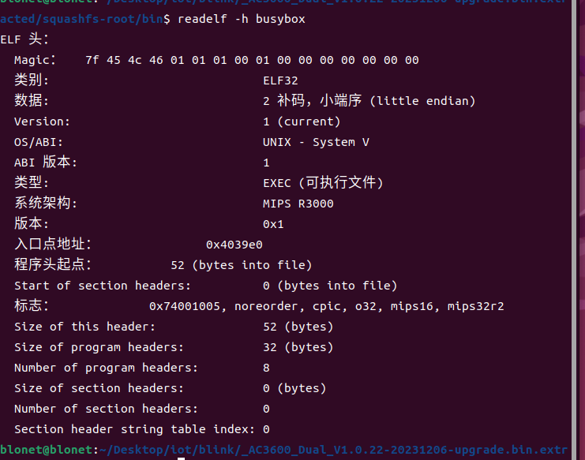  
  
mips32小端序，还是MipsR3000，尝试firmae之类  
的自动化工具，但无法直接模拟，因此  
还是采用qemu模拟。  
  
首先需要去模拟一个固件所依赖的环境  
```
make list-defconfigs
```  
  
默认给出的配置文件可以通过这个指令查询  
  
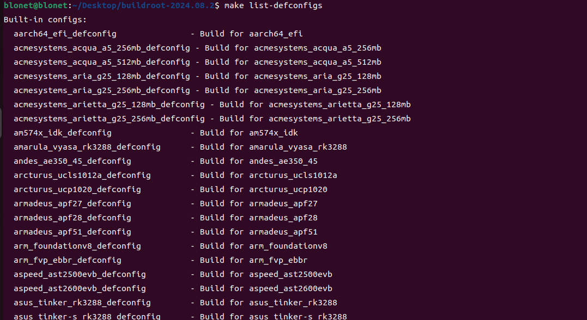  
  
这里选用qemu_mips32r2el_malta_defconfig生成配置文件  
```
make qemu_mips32r2el_malta_defconfig
```  
  
这一步会让我们的menuconfig自动根据想搭建的环境进行配置  
  
但只是基础配置，想开启openssh之类的还得自己去里面改  
```
make menuconfig
```  
  
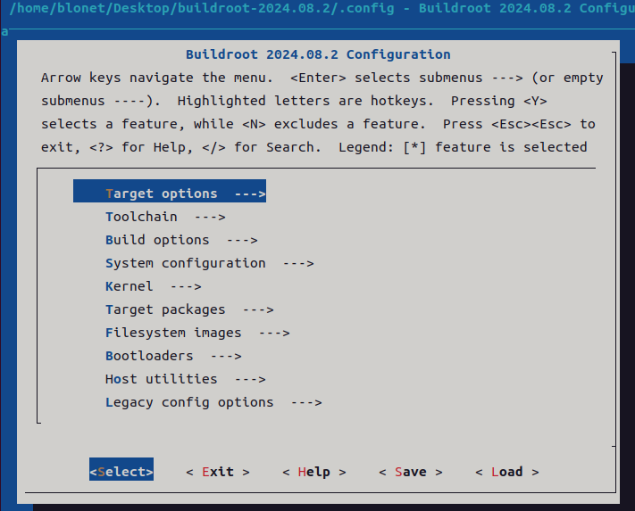  
  
第一个Target options就是设置镜像，像模拟的环境，大小端序之类的，都是在里面  
  
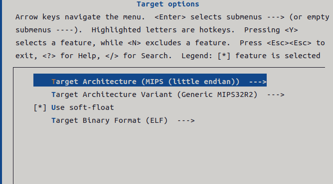  
  
第六个Target packages就是配置目标包  
  
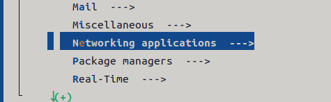  
  
进入这个networking开启我们之后需要的  
  
bridge-utils  
  
openssh-server  
  
如果没有就是缺少对应的环境，需要自己下  
```
sudo apt install bridge-utilssudo apt install openssh-server
```  
  
make编译好后启动文件应该会放在/buildroot-2024.08.2/output/images/下，不过默认的start-qemu.sh只有基本的启动项，为了方便我们之后传固件和做调试，可以修改sh文件  
```
#!/bin/shBINARIES_DIR="${0%/*}/"# shellcheck disable=SC2164cd "${BINARIES_DIR}"mode_serial=falsemode_sys_qemu=falsetap_interface="tap0"  # 默认的TAP接口名称tap_ip_host="192.168.100.1"  # 宿主机的IP地址tap_ip_guest="192.168.100.2"  # 虚拟机的IP地址while [ "$1" ]; do    case "$1" in    --serial-only|serial-only) mode_serial=true; shift;;    --use-system-qemu) mode_sys_qemu=true; shift;;    --tap-interface) tap_interface="$2"; shift 2;;    --use-tap) use_tap=true; shift;;    --) shift; break;;    *) echo "unknown option: $1" >&2; exit 1;;    esacdoneif ${mode_serial}; then    EXTRA_ARGS='-nographic'else    EXTRA_ARGS='-serial stdio'fiif ! ${mode_sys_qemu}; then    export PATH="/home/blonet/Desktop/buildroot-2024.08.2/output/host/bin:${PATH}"fiif ${use_tap}; then    # 创建并配置TAP接口    sudo ip link delete "${tap_interface}" 2>/dev/null  # 如果 TAP 接口已存在，先删除    sudo ip tuntap add dev "${tap_interface}" mode tap  # 创建 TAP 接口    sudo ip addr add "${tap_ip_host}/24" dev "${tap_interface}"  # 为 TAP 接口分配宿主机IP地址    sudo ip link set "${tap_interface}" up  # 启用 TAP 接口    # 配置 QEMU 使用 TAP 网络    NET_CONFIG="-netdev tap,id=net0,ifname=${tap_interface},script=no,downscript=no -device pcnet,netdev=net0"else    # 使用用户模式网络    NET_CONFIG="-net nic,model=pcnet -net user"fiexec qemu-system-mipsel -M malta \    -kernel vmlinux \    -drive file=rootfs.ext2,format=raw \    -append "rootwait root=/dev/sda console=ttyS0 ip=${tap_ip_guest}::${tap_ip_host}:255.255.255.0::eth0:off" \    ${NET_CONFIG} ${EXTRA_ARGS} "$@"
```  
  
启动登录后在模拟出的环境下再创建个接口  
```
ip addr add 192.168.100.2/24 dev eth0ip link set eth0 up//在虚拟机内部，配置其网络接口（例如 eth0）以与宿主机在同一网段
```  
  
可以ping一下能不能和宿主机ping通  
  
更改设置  
  
利用busybox里的vi修改）  
```
vi /etc/ssh/sshd_config
```  
  
找root登录对应行  
  
把注释去掉，后面的后缀改成 yes  
  
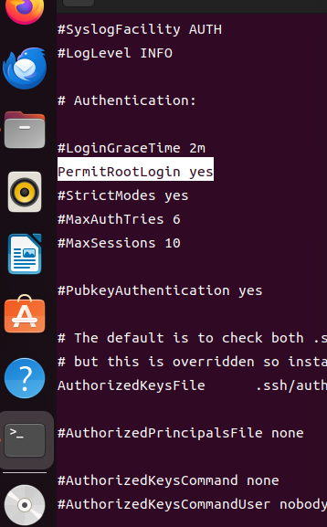  
  
传输固件，提一点如果宿主机openssh版本比较新会有报错因为现代 SSH 客户端（如 OpenSSH 8.8 及以上版本）默认禁用了 ssh-rsa  
和 ssh-dss  
密钥类型，因为它们被认为不够安全。  
  
不过加入-o HostKeyAlgorithms=+ssh-rsa就能解决  
```
sudo scp -r squashfs-root/ root@192.168.100.2:~/#sudo scp -o HostKeyAlgorithms=+ssh-rsa -r squashfs-root/ root@192.168.100.2:~/chmod -R 777 squashfs-root/
```  
  
挂载固件  
```
mount -o bind /dev ./squashfs-root/devmount -t proc /proc ./squashfs-root/procchroot squashfs-root/ /bin/sh
```  
  
在固件目录里能找到lighttpd文件，这就是LBlink所使用的webserver服务，去etc文件夹找相关配置  
  
拉起webserver主程序  
```
/usr/sbin/lighttpd -f /etc/lighttpd/lighttpd.conf
```  
  
这里启动的时候会有个报错  
  
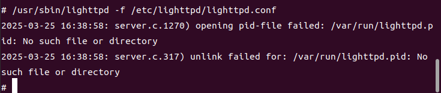  
  
提示缺少/var/lighttpd.pid，应该是少了一个日志文件导致无法启动，创建对应文件  
```
mkdir -p /var/run/touch lighttpd.pid//去run文件夹下创建chmod 777 lighttpd.pid
```  
  
还需要启动ubusd服务/sbin/ubusd start  
  
再次启动lighttpd  
  
还有一个办法就是直接找附带内核，配置文件的整合包拉起  
  
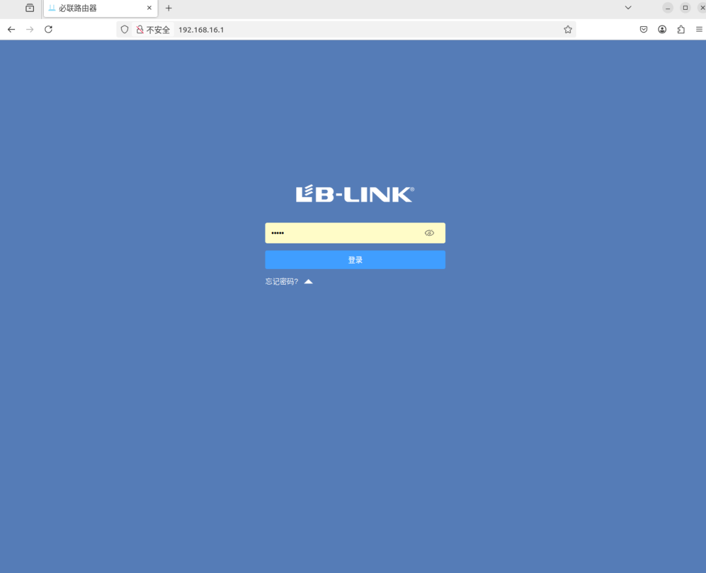  
### 逆向分析与漏洞挖掘  
  
开始做逆向分析的时候，可以实现的切入点就会多很多  
  
我自己的习惯还是利用emba,firmwalker这种分析工具跑的同时自己去人工审一下  
  
一般最先下手的还是CGI这类直接接收用户输入的接口  
  
先来看下firmwalker的分析结果  
  
  
  
像这边给出的就是一个md5加密后的管理员口令  
  
还有就是  
  
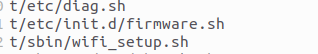  
  
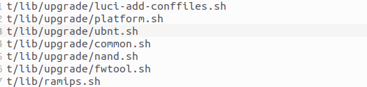  
  
这种firmware.sh，upgrade文件夹下的内容很可能就是固件升级相关的逻辑，  
  
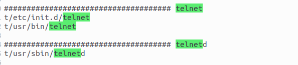  
  
设备开启的telent接口，之后就可以考虑命令注入开启telent反弹shell  
  
包括还有一个 /usr/lib/libblinkapi.so 文件  
  
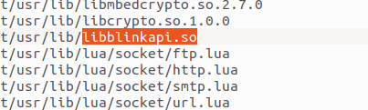  
  
不出意外是个API动态链接库 ，这种都是重点的分析对象  
  
我们可以去对一些功能点抓个包，比如修改密码这种功能点  
  
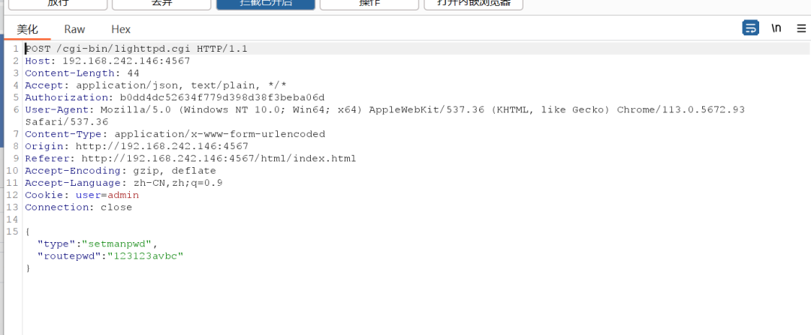  
```
POST /cgi-bin/lighttpd.cgi HTTP/1.1Host: 192.168.242.146:4567Content-Length: 44Accept: application/json, text/plain, */*Authorization: b0dd4dc52634f779d398d38f3beba06dUser-Agent: Mozilla/5.0 (Windows NT 10.0; Win64; x64) AppleWebKit/537.36 (KHTML, like Gecko) Chrome/113.0.5672.93 Safari/537.36Content-Type: application/x-www-form-urlencodedOrigin: http://192.168.242.146:4567Referer: http://192.168.242.146:4567/html/index.htmlAccept-Encoding: gzip, deflateAccept-Language: zh-CN,zh;q=0.9Cookie: user=adminConnection: close{"type":"setmanpwd","routepwd":"123123avbc"}
```  
  
可以很明确的看到是 lighttpd.cgi 这个cgi脚本在处理这个请求  
  
去分析一下这个脚本  
  
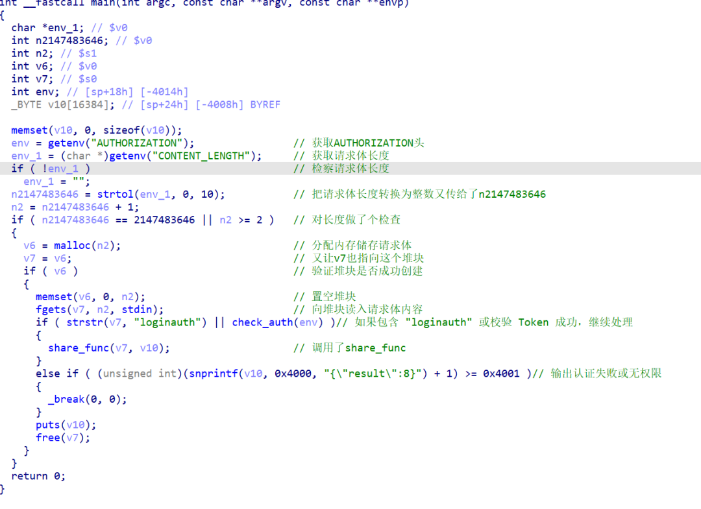  
  
对请求进行了一些验证，之后调用了share_func来对json数据做进一步处理  
  
share_func是一个动态链接的函数，我要去找到对应的DLL文件  
  
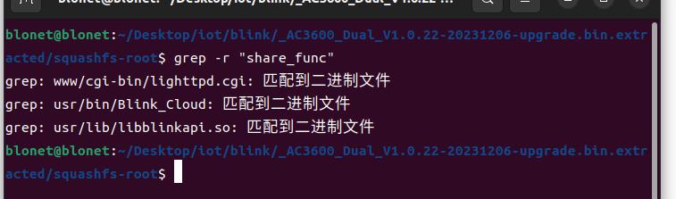  
  
又出现了刚刚说的libblinkapi.so文件，  
  
去libblinkapi.so里分析一下这个share_func  
  
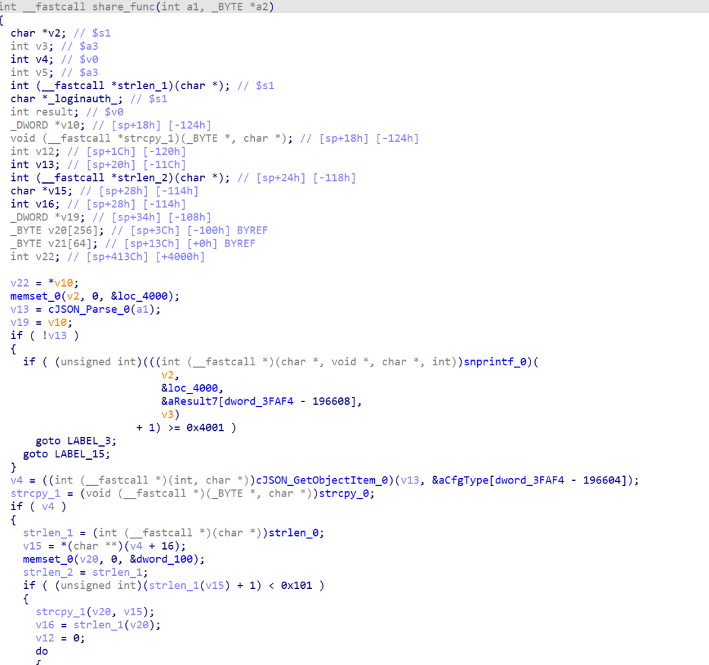  
  
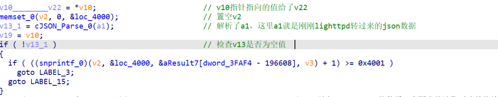  
  
接收了json数据给了v13  
  
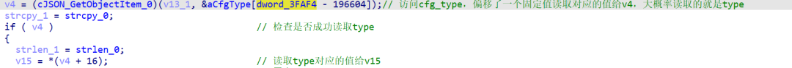  
  
访问字符串常量数组aCfgType， 偏移了一个固定值，最后读到的就是type了  
  
把type类读到了v4，  
  
把type对应的值，也就是setmanpwd给了v15  
  
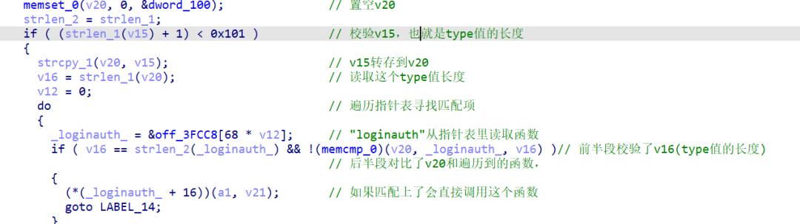  
  
v15转存到了v20  
  
在下面遍历指针表，寻找匹配的函数，如果找到了就会调用这个函数，json数据也会再交给那个函数处理  
  
setmanpwd对应的函数  
  
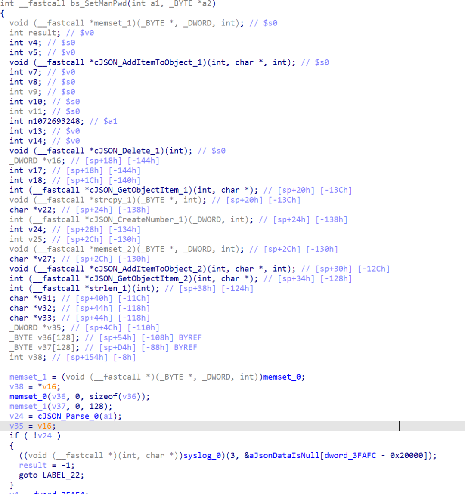  
  
分析一下这个函数，函数逻辑还是比较简单的  
  
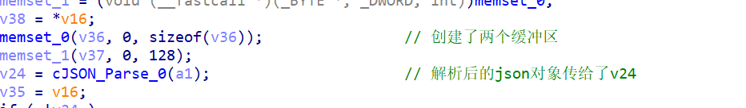  
  
创建了两个缓冲区  
  
把缓冲区给了v24  
  
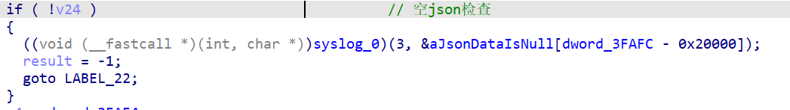  
  
做了个空json的检查  
  
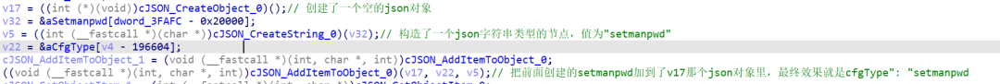  
  
其实就是构造了一个 v17为 cfgType: setmanpwd  
  
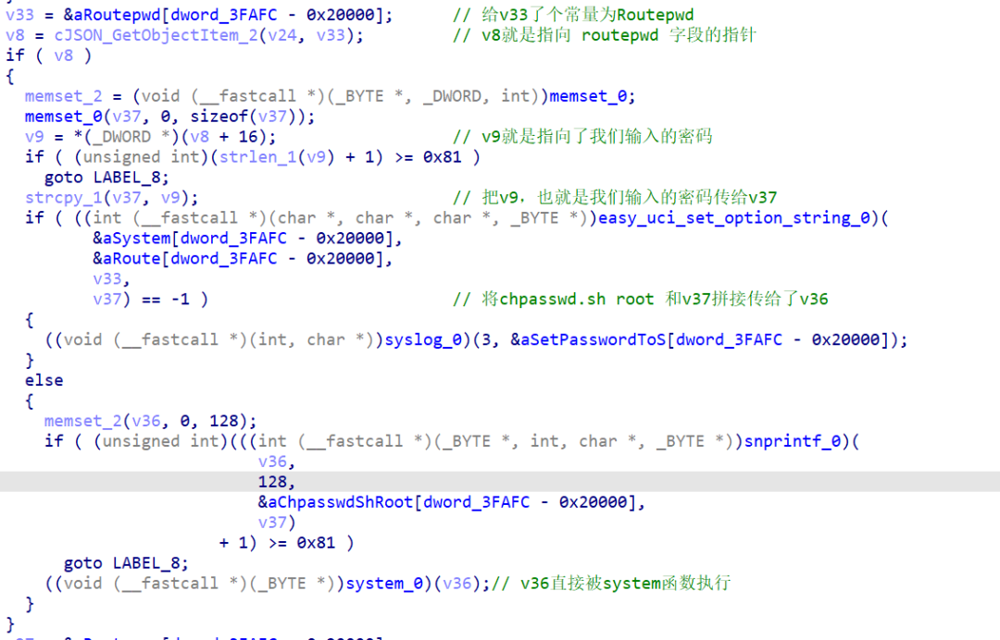  
  
针对我们输入的密码其实没做什么过滤，最后拼接到chpasswd.sh root后就被执行了  
  
换句话来讲，只要我们做一点简单的分割加个管道符就能实现命令注入  
  
只要在我们的抓包数据里去修改一下"routepwd":"123123avbc"就可以实现注入了  
  
漏洞整体逻辑还是比较简单的，主要是分享一下本人在挖掘这个漏洞时的思路  
  
这个漏洞已经被公开，其他信息可以在nvd看到  
  
nvd链接:https://nvd.nist.gov/vuln/detail/CVE-2025-4076  
  
结束  
  
  
招新小广告  
  
ChaMd5 Venom 招收大佬入圈  
  
新成立组IOT+工控+样本分析   
长期招新  
  
欢迎联系  
admin@chamd5.org  
  
  
  
  


---

> 来源：gelusus/wxvl（微信公众号漏洞文章自动归档，原始披露 URL 尚未确认，现有链接按来源追溯区分别标注）
