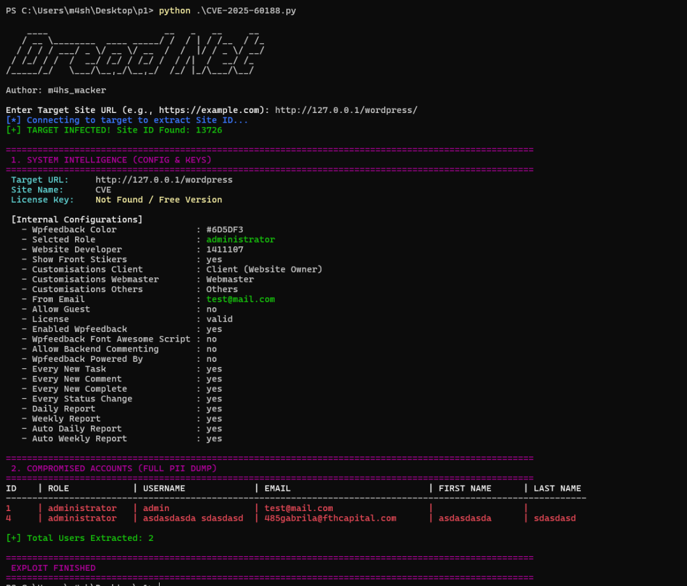

# CVE-2025-60188-Atarim-插件-漏洞利用

<!-- vulwiki-editorial-rebuild:system-misc -->
## 条目范围与校订

- 本文对象：WordPress Atarim插件
- 文献类型：HMAC认证绕过PoC项目简介
- 版本、权限及部署边界：公开REST端点暴露site_id，管理AJAX操作以该值作HMAC密钥；版本和具体header/签名规范未列
- 核验状态：仅重建文本校订；未执行文中代码、PoC 或扫描，未把截图或转载声明记为本站复现

### 具体结论与待核项

以下为原归档的逐项勘误与证据缺口；可由文本确定的问题已在下文订正，仍缺来源的事实保持待核。

1. 属于已知弱/泄露密钥生成合法MAC，不是破解HMAC-SHA256算法
2. wpf_website_users/details访问证明信息权限绕过，尚未证明获得WordPress管理员会话或OS权限
3. 恒定时间比较无法修复公开密钥问题，需安全密钥管理和服务器侧授权；wp_salt建议亦需调用方设计核验
4. 无代码/完整请求、固定受影响与修复版本；仅第三方PoC仓库，恶意软件栏目是模板噪声

### 操作风险

原文技术操作的实际副作用未复现核验；按其请求/代码评估状态变更、凭据暴露和业务影响

技术请求、代码与实验方法按原文保留；其中的破坏性动作仅限授权、可恢复的隔离环境。缺失代码、参数或版本事实不猜补。

### 来源追溯

- 原文参考链接（未重新核验）：<https://github.com/m4sh-wacker/CVE-2025-60188-Atarim-Plugin-Exploit>
- 原始披露 URL 未确认；既有归档来源标签保留，不能替代原始公告

### 归档技术正文

 Ots安全   2026-01-13 03:53  
  
**威胁简报**  
  
  
**恶意软件**  
  
  
**漏洞攻击**  
  
CVE-2025-60188：Atarim 插件身份验证绕过漏洞（通过 HMAC 伪造）概述 本仓库包含针对 CVE-2025-60188 的概念验证 (PoC) 和技术分析。CVE-2025-60188 是 Atarim WordPress 插件中发现的一个严重漏洞。此漏洞允许未经身份验证的用户绕过安全措施并访问敏感的系统信息。  
- 技术描述：该漏洞源于基于 HMAC 的身份验证实现不安全。应用程序使用可预测或已泄露的内部 ID（site_id）作为密钥，对管理 AJAX 操作请求进行签名。  
  
- 漏洞流程：信息泄露：site_id 通过面向公众的 REST API 端点暴露。  
  
- 签名伪造：由于密钥（站点 ID）已知，攻击者可以使用 HMAC-SHA256 算法在本地计算有效的请求签名。  
  
- 权限提升：通过在标头中提供伪造的签名，攻击者可以获得对受保护函数（如 wpf_website_users 和 wpf_website_details）的访问权限。  
  
- 影响信息泄露：未经授权访问用户个人身份信息（姓名、电子邮件、角色）。  
  
- 配置泄露：系统设置和潜在许可证密钥暴露。  
  
- 补救措施：用户应立即将 Atarim 插件更新至最新补丁版本。建议开发者使用高密钥（例如 wp_salt()）并实现恒定时间比对以进行签名验证。  
  
  
  
项目地址：  
  
https://github.com/m4sh-wacker/CVE-2025-60188-Atarim-Plugin-Exploit  
  
**END**  
  
  
  
  
  
公众号内容都来自国外平台-所有文章可通过点击阅读原文到达原文地址或参考地址  
  
排版 编辑 | Ots 小安   
  
采集 翻译 | Ots Ai牛马  
  
公众号 |   
AnQuan7 (Ots安全)  
  

---

> 来源：gelusus/wxvl（微信公众号漏洞文章自动归档，原始披露 URL 尚未确认，现有链接按来源追溯区分别标注）
