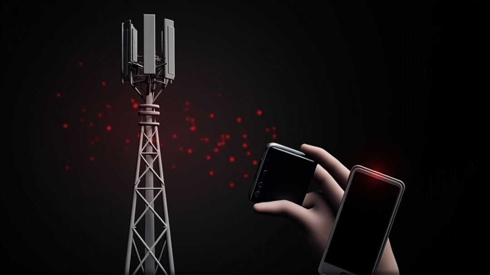

# CVE-2026-58704：零点击、近距离、间谍级攻击

<!-- vulwiki-editorial-rebuild:system-misc -->
## 条目范围与校订

- 本文对象：Google Pixel蜂窝调制解调器
- 文献类型：Pixel基带在野漏洞新闻与推测扩展
- 版本、权限及部署边界：文称邻近网络、无需用户交互/额外权限，2026-09-05安全补丁级；具体Pixel型号/基带固件未列
- 核验状态：仅重建文本校订；未执行文中代码、PoC 或扫描，未把截图或转载声明记为本站复现

### 具体结论与待核项

以下为原归档的逐项勘误与证据缺口；可由文本确定的问题已在下文订正，仍缺来源的事实保持待核。

1. 承认Google没披露攻击者却据零点击特征断定间谍软件/国家行为者并猜报告者，缺归因证据
2. 代码逻辑错误不等于已知if条件变if1；伪基站4G/5G下行触发、监听通话/读短信/取IMSI是历史类比未证本漏洞能力
3. 邻近攻击不自动说明具体RF入口或自动连接任意伪基站；基带与系统完全隔离绝对化又称可穿透系统需条件
4. 伪基站数百万美元、漏洞黑市数百万至千万无来源；高负载发热/信号差不是可靠入侵指标，避免无据焦虑
5. 将56967串利用更强没有兼容/同平台证据；同期六CVE只是补丁背景不作本篇PoC
6. 无Google/NVD/SecurityWeek可点击原链接，只有公众号与配图；factory image与OTA混称，刷机风险需独立说明

### 操作风险

原文技术操作的实际副作用未复现核验；按其请求/代码评估状态变更、凭据暴露和业务影响

技术请求、代码与实验方法按原文保留；其中的破坏性动作仅限授权、可恢复的隔离环境。缺失代码、参数或版本事实不猜补。

### 来源追溯

- 原文参考链接（未重新核验）：<https://mp.weixin.qq.com/s?__biz=MzAxMjE3ODU3MQ==&mid=2650621549&idx=1&sn=21c4b072726d2387d562109ada6b9bbb&scene=21#wechat_redirect>
- 原文参考链接（未重新核验）：<https://mp.weixin.qq.com/s?__biz=MzAxMjE3ODU3MQ==&mid=2650621944&idx=1&sn=3cc6dc9876a20466d4ec3634deb80220&scene=21#wechat_redirect>
- 原文参考链接（未重新核验）：<https://mp.weixin.qq.com/s?__biz=MzAxMjE3ODU3MQ==&mid=2650622065&idx=1&sn=09f8ae84c06d4331e71c277b177ae701&scene=21#wechat_redirect>
- 原始披露 URL 未确认；既有归档来源标签保留，不能替代原始公告

### 归档技术正文

原创 Red Hunter
                    Red Hunter  黑白之道   2026-09-17 00:35  
  
  
> **导语**  
：Google 周二推送 9 月 Pixel 安全补丁，修复一颗已被野外利用的高危蜂窝调制解调器漏洞 CVE-2026-58704，CVSS 8.0。零点击、无需用户交互、邻近攻击——这套组合拳是商业间谍软件或国家级 APT 的教科书级打法。Google 没披露漏洞发现者、攻击开始时间、受害目标，但攻击特征已经把答案写在脸上。  
  
## 一、事件概述：周二补丁里藏着 0day  
  
9 月 15 日，Google 发布 Pixel 9 月安全公告，补丁级别 2026-09-05。公告里 CVE-2026-58704 被单独点名——"存在有限的、有针对性的利用迹象"，这是公告里最高一档的措辞。  
  
  
  
漏洞出在 Pixel 的蜂窝调制解调器组件——手机里负责和基站对话、收发短信、解 SIM 卡的那块芯片固件。Google 没披露漏洞发现者，Android bug 跟踪编号 A-484011314 仍处于隐私状态。业内推测要么是 Google 内部红队捕获，要么是商业间谍软件厂商主动提交。  
  
公告同一天，SecurityWeek 直接点出："modem 级别、零点击的特征，加上 Google'有限、有针对性'的措辞，是过去商业间谍软件厂商或国家级攻击者相关攻击的典型特征。"  
## 二、技术剖析：逻辑错误与零点击组合  
  
CVE-2026-58704 在 NVD（美国国家漏洞数据库）的官方描述写得很简洁："在蜂窝调制解调器中，存在一个由于代码逻辑错误导致的可能权限绕过。这可能导致远程（邻近/相邻）的权限提升，无需额外的执行权限。"  
  
把这段拆开看，每一个定语都是刺眼的关键词：**逻辑错误**  
——不是缓冲区溢出、不是 UAF（释放后使用）那种内存破坏，而是写错了条件判断；**权限绕过**  
——拿到更高权限；**邻近/相邻**  
——必须在物理上接近目标手机，典型手段是伪基站；**无需额外执行权限**  
——不需要先装个恶意 App，意味着攻击入口在基带处理器（独立于 Android 系统的通信芯片）层面，跟系统层完全隔离。  
  
  
  
逻辑错误类漏洞最阴险的地方在于：它不像内存破坏那样依赖复杂的 ROP（返回导向编程）链和内存布局，一段错误的 if (privilege_check(user)) { ... }  
 改成 if (1) { ... }  
 就够了。攻击者只需构造一段特定的无线信号（伪装成基站的 4G/5G 下行消息），让目标手机的 modem 在解析时踩中错误的条件分支，权限就拿到手。  
  
至于拿到什么权限、能做什么后续动作——Google 没披露，也没有公开 PoC。但参考以往 modem 0day：拿到权限后可监听通话、读取短信、追踪位置、获取 IMSI（手机"身份证号"），部分历史漏洞甚至能穿透到 Android 系统层。  
## 三、零点击 + 邻近攻击：典型间谍软件打法  
  
把"零点击"和"邻近攻击"组合到一起，红队脑子里立刻浮现三样东西：IMSI 抓取器（俗称"黄貂鱼"，伪装成合法基站的无线电设备）、商业间谍软件如 NSO 集团（以色列）的 Pegasus、Intellexa（希腊/爱尔兰）的 Predator，以及背后那些不愿具名的国家级买家。  
  
攻击流程常是这样：情报机构部署一辆载有伪基站的小车，停在你常去的咖啡馆楼下；你的 Pixel 手机自动连上这辆车的伪基站；伪基站下发精心构造的无线消息，触发 CVE-2026-58704 的逻辑错误；modem 以高权限执行恶意操作；你连屏幕都没碰，手机已经"通了"。  
  
这种攻击成本极高——伪基站车几百万美元、漏洞在黑市上几百万到几千万美元、还需具备无线电协议和基带固件逆向能力的工程师团队。普通黑客玩不起。能这么打的，要么是商业间谍软件公司，要么是国家行为者。  
  
SecurityWeek 提到，这种 modem 级别的零点击漏洞"已多次被 Google 关联到间谍软件厂商"。Pixel 用户如果身处敏感行业（政府、记者、维权人士、企业高管），九月补丁不只是"建议安装"，而是"不装等于裸奔"。  
## 四、九月补丁"打包"：还有 100+ 颗雷  
  
别以为 CVE-2026-58704 是 9 月补丁的唯一看点。同期还有至少六颗 critical（严重）漏洞：CVE-2026-55318 和 CVE-2026-55343（IP 多媒体子系统和 libpixelimsmedia 的 RCE）、CVE-2026-56920（VPU RCE）、CVE-2026-56967（modem 里另一颗 RCE）、CVE-2026-58683 和 CVE-2026-58710（电话组件和 BigOcean 的 RCE）。再加上 bootloader（引导加载器）、TEE（可信执行环境）、电话组件等大量 critical 级权限提升——9 月公告一共修了一百多个 Pixel 专属漏洞，差不多 50 个标 critical。  
  
特别注意 CVE-2026-56967 也是 modem 里的 RCE——一个月里 Pixel modem 被连捅两刀，一刀是已被利用的 CVE-2026-58704，一刀是潜在可远程代码执行的 RCE。两颗串起来用，效果比单独一颗狠得多。  
## 五、给 Pixel 用户的紧急建议  
  
按优先级三件事。第一，立刻装 9 月补丁：打开"设置 → 安全 → 安全更新"，确认补丁级别是 2026-09-05 或更新；没收到推送就等几天或去 Google 工厂镜像刷最新 OTA（空中下载更新）。  
  
第二，自查暴露面。记者、社运人士、企业高管、政府工作人员、敏感行业从业者——回想过去几个月有没有在陌生场所停留过、信号突然变差过、电池异常发热过。Modem 0day 利用时通常让基带处理器持续高负载，表现为发热、续航缩短，但症状不一定出现，出现也不一定就是被打了——只能算辅助判断。  
  
第三，长期防御策略。Pixel 已是 Android 阵营里更新最快的设备，但 modem 漏洞修复节奏仍落后系统层。建议把 Pixel 当作"基础安全设备"，日常敏感操作尽量切换到硬隔离环境；同时关注 Google Project Zero 的 modem 漏洞披露。  
  
**版权声明**  
：本文由华盟网原创发布，保留所有权利。配图由华盟网授权使用。  
  
  
  
  
  
  
  
  
> 👇 点击**阅读原文**  
，访问我的网站  
  
  

---

> 来源：gelusus/wxvl（微信公众号漏洞文章自动归档，原始披露 URL 尚未确认，现有链接按来源追溯区分别标注）
