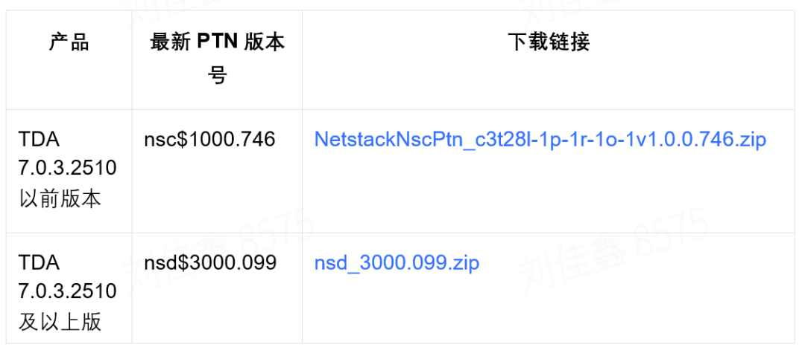

# CVSS10分！Pterodactyl Panel远程代码执行漏洞安全风险通告

<!-- vulwiki-editorial-rebuild:system-misc -->
## 条目范围与校订

- 本文对象：Pterodactyl Panel
- 文献类型：安全厂商通告
- 版本、权限及部署边界：文称Panel<1.11.11、未经认证locale/namespace请求
- 核验状态：仅重建文本校订；未执行文中代码、PoC 或扫描，未把截图或转载声明记为本站复现

### 具体结论与待核项

以下为原归档的逐项勘误与证据缺口；可由文本确定的问题已在下文订正，仍缺来源的事实保持待核。

1. 产品是游戏面板而非其管理的Minecraft等服务；补CVE元数据
2. 公告和发布链接明确，可保留摘要；CVSS3.0版本及RCE完整利用前提需对公告核验
3. 表中PoC公开而细节未公开/未复现须保留截至时间及来源；本文没有PoC不能标本站复现
4. TDA检测规则升级不是修复Panel；大段防护厂商产品广告和HTML表格应简化

### 操作风险

原文技术操作的实际副作用未复现核验；按其请求/代码评估状态变更、凭据暴露和业务影响

技术请求、代码与实验方法按原文保留；其中的破坏性动作仅限授权、可恢复的隔离环境。缺失代码、参数或版本事实不猜补。

### 来源追溯

- 原文参考链接（未重新核验）：<https://github.com/pterodactyl/panel/releases/tag/v1.11.11>
- 原文参考链接（未重新核验）：<https://github.com/advisories/GHSA-24wv-6c99-f843>
- 原文参考链接（未重新核验）：<https://vulners.com/cve/CVE-2025-49132>
- 原始披露 URL 未确认；既有归档来源标签保留，不能替代原始公告

### 归档技术正文

应急响应中心  亚信安全   2025-06-26 03:49  
  
  
  
  
近日，亚信安全CERT监控到安全社区研究人员发布安全通告，Pterodactyl Panel 存在一个远程代码执行漏洞，编号为 CVE-2025-49132。攻击者可通过对 /locales/locale.json 端点构造包含 locale 和 namespace 参数的恶意请求，在未经身份验证的情况下执行任意代码，进而完全控制面板服务器、读取凭据并窃取敏感数据。  
  
  
**目前官方已发布安全更新，亚信安全CERT建议受影响的客户尽快升级至最新版本。**  
  
  
Pterodactyl Panel 是一个开源的游戏服务器管理面板，采用 PHP + Laravel 构建，通过 Docker/Daemon 统一调度，支持 Minecraft、CS:GO、Rust 等多种游戏服务的快速部署、权限分级管理与资源配额分配。其 Web 界面直观，支持 API 自动化运维，可帮助运维人员便捷地在多节点环境中创建、监控和管理游戏服务器实例。  
  
  
**漏洞编号、类型、等级和评分**  
  
  
  
- CVE-2025-49132  
  
- 远程代码执行漏洞  
  
- 紧急  
  
- CVSS3.0： 10分  
  
  
  
  
**漏洞状态**  
  
  
  
<table><tbody><tr style="box-sizing: border-box;"><td data-colwidth="20.0000%" width="20.0000%" style="border-width: 1px;border-color: rgb(62, 62, 62);border-style: solid;background-color: rgb(145, 145, 145);box-sizing: border-box;padding: 0px;"><section style="margin: 5px 0%;box-sizing: border-box;"><section style="text-align: justify;padding: 0px 5px;font-size: 14px;color: rgb(255, 255, 255);box-sizing: border-box;">
<strong style="box-sizing: border-box;">细节</strong>
</section></section></td><td data-colwidth="20.0000%" width="20.0000%" style="border-width: 1px;border-color: rgb(62, 62, 62);border-style: solid;background-color: rgb(145, 145, 145);box-sizing: border-box;padding: 0px;"><section style="margin: 5px 0%;box-sizing: border-box;"><section style="padding: 0px 5px;font-size: 14px;color: rgb(255, 255, 255);box-sizing: border-box;">
<strong style="box-sizing: border-box;">PoC</strong>
</section></section></td><td data-colwidth="20.0000%" width="20.0000%" style="border-width: 1px;border-color: rgb(62, 62, 62);border-style: solid;background-color: rgb(145, 145, 145);box-sizing: border-box;padding: 0px;"><section style="margin: 5px 0%;box-sizing: border-box;"><section style="padding: 0px 5px;font-size: 14px;color: rgb(255, 255, 255);box-sizing: border-box;">
<strong style="box-sizing: border-box;">EXP</strong>
</section></section></td><td data-colwidth="20.0000%" width="20.0000%" style="border-width: 1px;border-color: rgb(62, 62, 62);border-style: solid;background-color: rgb(145, 145, 145);box-sizing: border-box;padding: 0px;"><section style="margin: 5px 0%;box-sizing: border-box;"><section style="padding: 0px 5px;font-size: 14px;color: rgb(255, 255, 255);box-sizing: border-box;">
<strong style="box-sizing: border-box;">在野利用</strong>
</section></section></td><td data-colwidth="20.0000%" width="20.0000%" style="border-width: 1px;border-color: rgb(62, 62, 62);border-style: solid;background-color: rgb(145, 145, 145);box-sizing: border-box;padding: 0px;"><section style="margin: 5px 0%;box-sizing: border-box;"><section style="padding: 0px 5px;font-size: 14px;color: rgb(255, 255, 255);box-sizing: border-box;">
<strong style="box-sizing: border-box;">复现情况</strong>
</section></section></td></tr><tr style="box-sizing: border-box;"><td data-colwidth="20.0000%" width="20.0000%" style="border-width: 1px;border-color: rgb(62, 62, 62);border-style: solid;box-sizing: border-box;padding: 0px;"><section style="margin: 5px 0%;box-sizing: border-box;"><section style="padding: 0px 5px;font-size: 14px;color: rgb(62, 62, 62);box-sizing: border-box;">
未公开
</section></section></td><td data-colwidth="20.0000%" width="20.0000%" style="border-width: 1px;border-color: rgb(62, 62, 62);border-style: solid;box-sizing: border-box;padding: 0px;"><section style="margin: 5px 0%;box-sizing: border-box;"><section style="padding: 0px 5px;font-size: 14px;color: rgb(62, 62, 62);box-sizing: border-box;">
公开
</section></section></td><td data-colwidth="20.0000%" width="20.0000%" style="border-width: 1px;border-color: rgb(62, 62, 62);border-style: solid;box-sizing: border-box;padding: 0px;"><section style="margin: 5px 0%;box-sizing: border-box;"><section style="padding: 0px 5px;font-size: 14px;color: rgb(62, 62, 62);box-sizing: border-box;">
未公开
</section></section></td><td data-colwidth="20.0000%" width="20.0000%" style="border-width: 1px;border-color: rgb(62, 62, 62);border-style: solid;box-sizing: border-box;padding: 0px;"><section style="margin: 5px 0%;box-sizing: border-box;"><section style="padding: 0px 5px;font-size: 14px;color: rgb(62, 62, 62);box-sizing: border-box;">
未发现
</section></section></td><td data-colwidth="20.0000%" width="20.0000%" style="border-width: 1px;border-color: rgb(62, 62, 62);border-style: solid;box-sizing: border-box;padding: 0px;"><section style="margin: 5px 0%;box-sizing: border-box;"><section style="padding: 0px 5px;font-size: 14px;color: rgb(62, 62, 62);box-sizing: border-box;">
未复现
</section></section></td></tr></tbody></table>  
  
  
**受影响版本**  
  
  
  
- Pterodactyl Panel <1.11.11  
  
  
  
  
产品解决方案  
  
  
  
目前亚信安全怒狮引擎已第一时间新增了检测规则，支持CVE-2025-49132漏洞的检测，请及时更新TDA产品的特征库到最新版本。规则编号：106066804，规则名称：翼龙面板远程代码执行漏洞(CVE-2025-49132)。  
  
  
更新方式如下：  
  
  
TDA产品在线更新方法：登录系统-》系统管理-》系统升级-》特征码更新；  
  
TDA产品离线升级PTN包下载链接如下：  
  
  
  
  
详细下载地址请后台咨询  
  
  
**修复建议**  
  
  
  
目前厂商已发布升级补丁以修复漏洞，补丁获取链接：  
  
  
https://github.com/pterodactyl/panel/releases/tag/v1.11.11  
  
  
**参考链接**  
  
  
  
- https://github.com/pterodactyl/panel/releases/tag/v1.11.11  
  
- https://github.com/advisories/GHSA-24wv-6c99-f843  
  
- https://vulners.com/cve/CVE-2025-49132  
  
  
  
  
本文发布的补丁下载链接均源自各原厂官方网站。尽管我们努力确保官方资源的安全性，但在互联网环境中，文件下载仍存在潜在风险。为保障您的设备安全与数据隐私，敬请您在点击下载前谨慎核实其安全性和可信度。  
  
  
  
  
了解亚信安全，请点击  
**“阅读原文”**  
  

---

> 来源：gelusus/wxvl（微信公众号漏洞文章自动归档，原始披露 URL 尚未确认，现有链接按来源追溯区分别标注）
