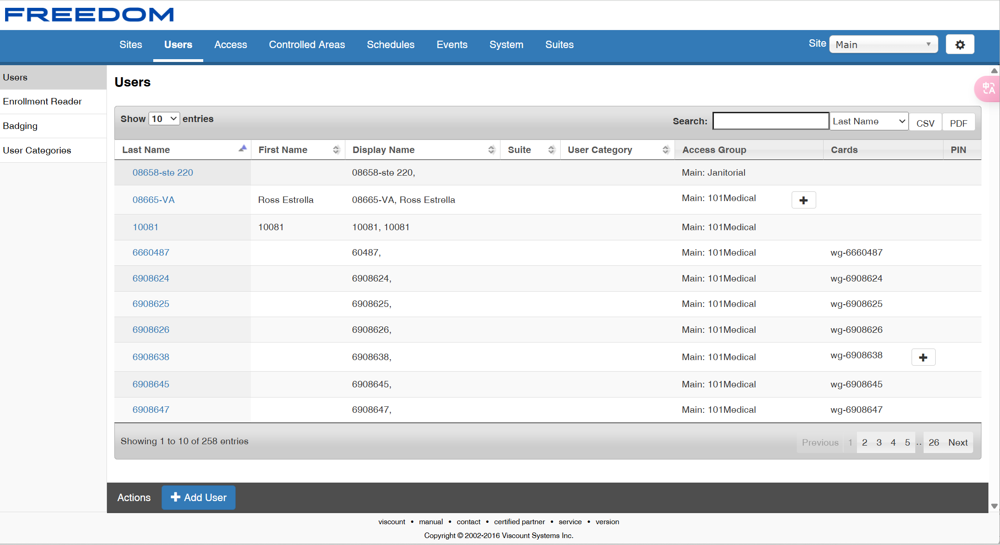
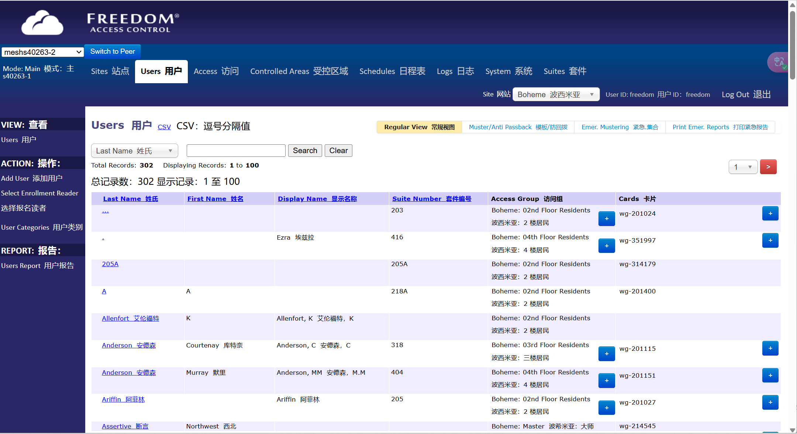

# FREEDOM-Administration 默认密码登录（CVE-2025-26793）

> 指纹字段校订（2026-10-04）：本文原归档明确标为 FOFA 的完整表达式已记入 `fofa`；原残缺 `fofa_unverified` 值逐字保存在 `previous_fofa_unverified`。后文关于该字段残缺的旧说明只描述校订前状态。查询用于产品检索，不证明资产受影响。

<!-- vulwiki-editorial-rebuild:system-misc -->
## 条目范围与校订

- 本文对象：Hirsch/Identiv/Viscount Enterphone MESH FREEDOM Administration
- 文献类型：默认凭据简要复现
- 版本、权限及部署边界：文称2024年前出货默认凭据未变更；实际设备软件/固件版本缺失
- 核验状态：仅重建文本校订；未执行文中代码、PoC 或扫描，未把截图或转载声明记为本站复现

### 具体结论与待核项

以下为原归档的逐项勘误与证据缺口；可由文本确定的问题已在下文订正，仍缺来源的事实保持待核。

1. 产品主名应Enterphone MESH，FREEDOM只是GUI名；影响版本仅FREEDOM不构成版本范围
2. 正文FOFA完整而frontmatter只有title=，确认抽取丢失；默认凭据登录的截图未视检，未给响应和权限
3. 在野利用已知、影响广等均无公告支持；没有厂商或CVE原始链接，也未给安全版本
4. 修复需明确改密码与升级对现有默认凭据是否生效，不能仅建议升级至未命名版本

### 操作风险

原文技术操作的实际副作用未复现核验；按其请求/代码评估状态变更、凭据暴露和业务影响

技术请求、代码与实验方法按原文保留；其中的破坏性动作仅限授权、可恢复的隔离环境。缺失代码、参数或版本事实不猜补。

### 来源追溯

- 原文参考链接（未重新核验）：<https://github.com/SourByte05/Vulnerability-Wiki-PoC>
- 原始披露 URL 未确认；既有归档来源标签保留，不能替代原始公告

### 归档技术正文

# 漏洞描述

Hirsch（前身为Identiv和Viscount）Enterphone MESH的Web GUI配置面板将在2024年之前提供默认凭据。管理员在初始配置时不会被提示更改这些凭据，更改凭据需要许多步骤。攻击者可以通过在互联网上使用这些登录凭据获取用户信息。

# 影响版本

FREEDOM

# **漏洞状态**

| 漏洞细节 | 漏洞POC | 漏洞EXP | 在野利用 |
|------|-------|-------|------|
| 是 | 已公开 | 已公开 | 已知 |

## 风险等级

| 维度 | 评价 |
|----|----|
| 威胁等级 | 高危 |
| 影响面 | 广 |
| 攻击者价值 | 高 |
| 利用难度 | 低 |

# 漏洞复现

FOFA：title="FREEDOM Administration"

POC/EXP：

```
默认用户名密码：

freedom/viscount
```







# 漏洞修复

关闭互联网暴露面或接口设置访问权限

升级至安全版本

更改默认密码


---

> 来源：SourByte05/Vulnerability-Wiki-PoC（https://github.com/SourByte05/Vulnerability-Wiki-PoC）
