# Fuzzing101 Exercise 4 - LibTIFF CVE-2016-9297&CVE-2016-9448分析

<!-- vulwiki-editorial-rebuild:system-misc -->
## 条目范围与校订

- 本文对象：LibTIFF/tiffinfo
- 文献类型：fuzzing教学与补丁回归分析
- 版本、权限及部署边界：测试4.0.4、文称<=4.0.6，解析恶意TIFF；9448手动应用首版补丁环境
- 核验状态：仅重建文本校订；未执行文中代码、PoC 或扫描，未把截图或转载声明记为本站复现

### 具体结论与待核项

以下为原归档的逐项勘误与证据缺口；可由文本确定的问题已在下文订正，仍缺来源的事实保持待核。

1. CVE元数据漏9448；两个相关但独立缺陷分实体保留补丁引入回归链
2. 原归档未保存搭建命令和具体调试代码；本轮以官方 Exercise 4 补充三处命令参考（非作者原文复原），具体指针调试块仍缺原文；crash样本和补丁commit无链接，关键证据截图未视检
3. IFD下一目录偏移是全部entries之后独立4字节，不是最后entry后4字节；内联value条件应含恰好4字节
4. 越界读取称堆溢出易误解为写；泄出的地址本身就是信息，不能因为只是地址就断言不构成信息泄露
5. 64位Linux最小chunk0x20依赖allocator非全部Linux；对NULL的Read/写需补丁逐行确认；4.0.7以上是否含4.0.7不清楚

### 操作风险

原文技术操作的实际副作用未复现核验；按其请求/代码评估状态变更、凭据暴露和业务影响

技术请求、代码与实验方法按原文保留；其中的破坏性动作仅限授权、可恢复的隔离环境。缺失代码、参数或版本事实不猜补。

### 来源追溯

- 原文参考链接（未重新核验）：<https://murphypei.github.io/blog/2019/01/linux-heap>
- 原文参考链接（未重新核验）：<https://web.archive.org/web/20120703095221/http://partners.adobe.com/public/developer/en/tiff/TIFF6.pdf>
- 原文参考链接（未重新核验）：<https://github.com/google/sanitizers/wiki/AddressSanitizerAndDebugger>
- 原文参考链接（未重新核验）：<https://github.com/antonio-morales/Fuzzing101/tree/main/Exercise%204>
- 原文参考链接（未重新核验）：<https://bbs.kanxue.com/user-home-937383.htm>
- 原文参考链接（未重新核验）：<http://mp.weixin.qq.com/s?__biz=MjM5NTc2MDYxMw==&mid=2458499288&idx=1&sn=b2b9cd6ff7388a8658d254e13c72f9ad&chksm=b18e885286f9014436a590f2531fda167be67e1e227ea395812968e828932bd44eade34b0dbf&scene=21#wechat_redirect>
- 原始披露 URL 未确认；既有归档来源标签保留，不能替代原始公告

### 归档技术正文

hu1y40  看雪学苑   2023-08-19 18:20  
  
最近在进行Fuzzing的学习，发现对Crash分析的内容较少，故而写此篇分析记录一下，望与各位同行共同进步。  
  
由于笔者也属于刚入门，若有误望大家指正。  
  
  
> 原文此处代码块为空，内容未归档；无法从空块证明或复现所述结果。
#####   
##### 1.漏洞简述  
  
• 漏洞名称：Libtiff 越界读取漏洞  
  
• 漏洞编号：CVE-2016-9297  
  
• 漏洞类型：越界读取  
  
• 漏洞影响：拒绝服务  
  
• CVSS评分：（CVSS 3.0 ）7.5  
  
• 利用难度：低  
  
• 基础权限：不需要  
#####   
##### 2.组件概述  
  
  
LibTIFF是一个开源的用于处理TIFF（Tagged Image File Format）图像文件的C/C++库。TIFF是一种常见的图像文件格式，广泛应用于图像处理和存储。LibTIFF提供了一组功能丰富的API，允许开发者读取、写入、编辑和处理TIFF格式的图像。  
#####   
##### 3.漏洞利用  
  
  
使用tiffinfo解析Fuzzing出的样本。  
  
  
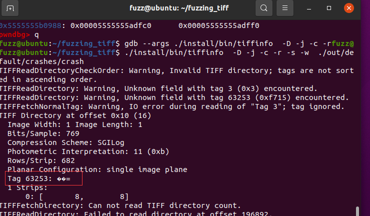  
#####   
##### 4.漏洞影响  
  
  
Libtiff <= 4.0.6  
#####   
##### 5.解决方案  
  
  
更新至Libtiff4.0.7以上版本  
  
  
> 原文此处代码块为空，内容未归档；无法从空块证明或复现所述结果。
#####   
##### 1. 环境准备  
  
  
详细搭建可以参考Fuzzing101  

参考补充说明：下列三处命令来自 [antonio-morales/Fuzzing101，Exercise 4，18e00c1626a2](https://raw.githubusercontent.com/antonio-morales/Fuzzing101/18e00c1626a2/Exercise%204/Readme.md)，遵循 [Apache-2.0 许可证](../../../docs/licenses/Fuzzing101-Apache-2.0.txt)。它们是新增练习参考，不能证明为 hu1y40 原文；上游环境为 Ubuntu 20.04.2、LLVM 11 和已安装的 AFL 工具链，编译命令在解压后的 `tiff-4.0.4` 目录执行。上游本节针对 CVE-2016-9297，不用于证明 CVE-2016-9448 的补丁回归分析。
  
  
目录创建  
参考补充（非 hu1y40 原文复原）：以下命令摘自 Fuzzing101 官方 Exercise 4。

```sh
cd $HOME
mkdir fuzzing_tiff && cd fuzzing_tiff/
```
  
  
  
下载tiff-4.0.4  
参考补充（非 hu1y40 原文复原）：以下命令摘自 Fuzzing101 官方 Exercise 4。

```sh
wget https://download.osgeo.org/libtiff/tiff-4.0.4.tar.gz
tar -xzvf tiff-4.0.4.tar.gz
```
  
  
  
使用ASAN模糊测试。  
参考补充（非 hu1y40 原文复原）：以下命令摘自 Fuzzing101 官方 Exercise 4。

```sh
export LLVM_CONFIG="llvm-config-11"
CC=afl-clang-lto ./configure --prefix="$HOME/fuzzing_tiff/install/" --disable-shared
AFL_USE_ASAN=1 make -j4
AFL_USE_ASAN=1 make install

afl-fuzz -m none -i $HOME/fuzzing_tiff/tiff-4.0.4/test/images/ -o $HOME/fuzzing_tiff/out/ -s 123 -- $HOME/fuzzing_tiff/install/bin/tiffinfo -D -j -c -r -s -w @@
```
  
  
#####   
##### 2.FUZZING  
  
  
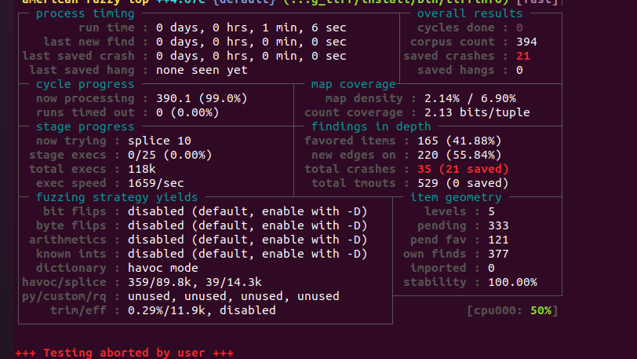  
####   
####   

#####   
##### 1. 基本信息  
  
  
漏洞产生在tif_dirread.c函数中，在Field的TIFFSetGetFieldType属性为TIFF_SETGET_C32_ASCII或TIFF_SETGET_C16_ASCII时，输出Tag Value未在字符串末尾置0，从而可能导致越界读取。  
#####   
##### 2. 详细分析  
######   
###### 2.1基础分析  
  
  
此次的分析基于Fuzzing101的Exercise4所以选择4.0.4版本进行分析，CVE对该漏洞的描述为:  
> The TIFFFetchNormalTag function in LibTiff 4.0.6 allows remote attackers to cause a denial of service (out-of-bounds read) via crafted TIFF_SETGET_C16ASCII or TIFF_SETGET_C32_ASCII tag values.  
> 在LibTiff 4.0.6中，TIFFFetchNormalTag函数存在漏洞，该漏洞可以被远程攻击者利用，通过精心构造的TIFF_SETGET_C16ASCII或TIFF_SETGET_C32_ASCII标签值来造成拒绝服务（越界读取）攻击。  
  
######   
###### 2.2静态分析  
  
  
查看一下crash文件。  
  
  
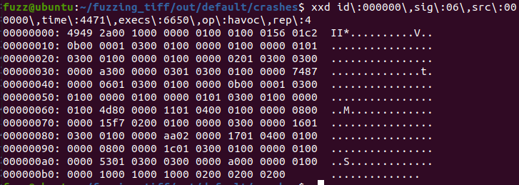  
  
  
00h~01h：0x4949，使用小端序。  
  
02h~03h：0x002a，十进制42，为tif文件标识符。  
  
04h~07h：第一个IFD（Image File Dirctory）的偏移。  
  
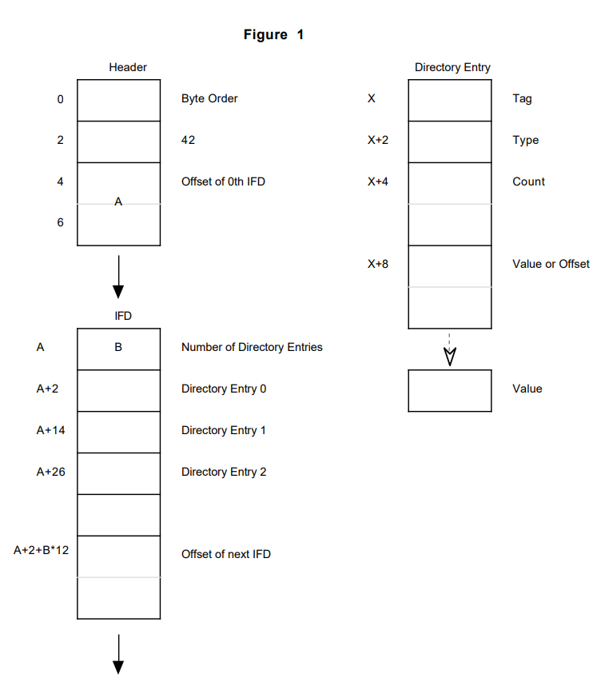  
  
随后是10h开始的第一个IFD结构。  
  
10h~11h：Directory Entries的数目。此处为11。  
  
后续每12字节代表1个IFD Entry。  
  
最后一个IFD Entry的后四个字节表示下一个IFD结构的偏移，如果没有为0。  
  
IFD Entry结构（一个Entry也可以叫做一个field）。  
  
00h~01h：该field的标识。  
  
02h~03h ：该field的数据类型。  
  
04h~07h：数量，Count of the indicated Type，根据数量和类型确定其字节数。  
  
08h~0Bh：值的文件偏移，如果该tag value占用字节数小于四字节，那么value存放于此。  
  
  
划分一下数据  
  
  
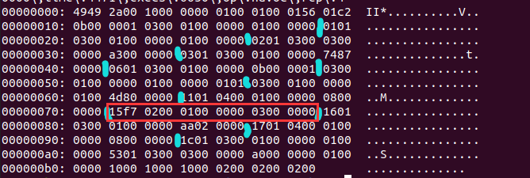  
  
  
红框处是下面出现crash寄存器出现的Tag 63253。此处可以注意一下。  
> tag：0xf715 63253  
> type：0x0002 ASCII类型  
> 数量：0x00000001 1  
> Offset or 数据：0x00000003 3  
  
######   
###### 2.3动态分析  
  
  
AFL+ASAN对Libtiff4.0.4进行Fuzzing，执行Fuzzing出的Crash，得到提示，部分DirectoryEntry（简称DE结构）解析错误，错误为堆溢出。  
  
  
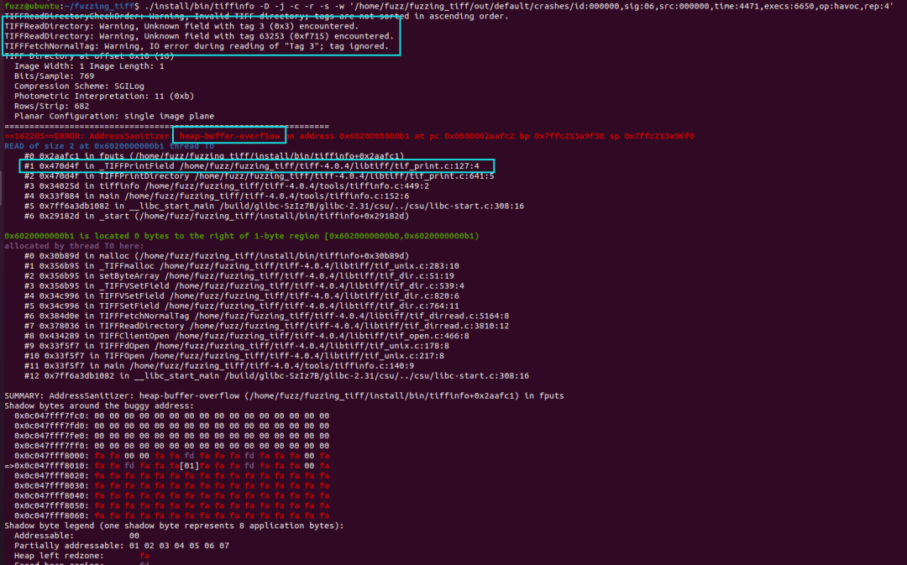  
  
  
根据官方提示在__asan::ReportGenericError  
下断点，这里中断在asan报告错误之前，发生错误之后的地方，bt查看调用栈，产生错误的代码在tif_print.c:127  
。  
  
  
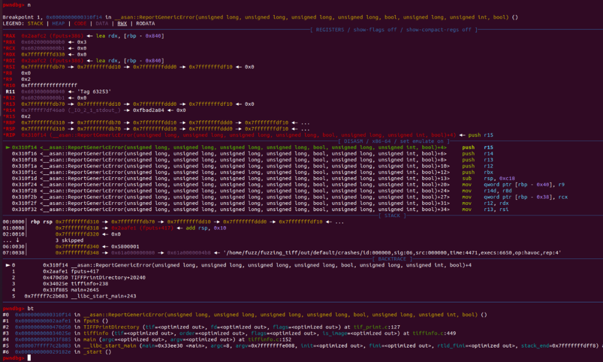  
  
  
由于ASAN会对程序进行插桩，阻碍汇编代码的阅读，所以笔者重新编译了一下源程序方便后续的调试。  
  
  
gdb --args ./install/bin/tiffinfo -D -j -c -r -s -w ./out/default/crashes/crash  
对程序进行调试，从上述信息得出断点位置b tif_print.c:126  
，执行的时候上下文信息如图。  
  
  
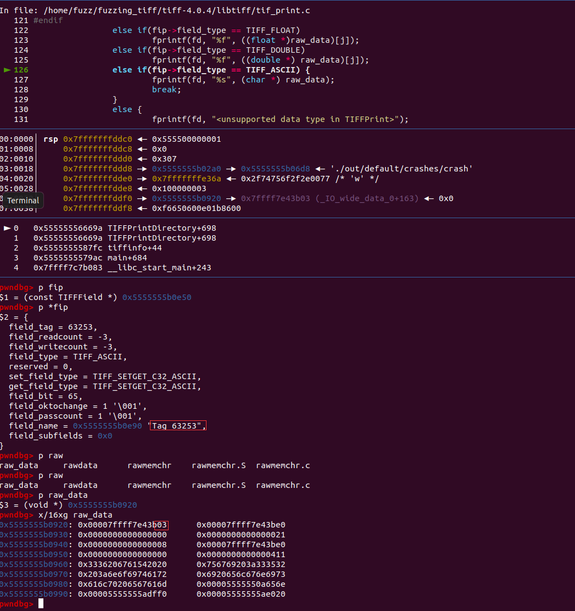  
  
  
这里将raw_data字符串打印了出来，raw_data对应的field为Tag 63253对应的field也就是我们crash文件红框标识的0xf715那一个DE结构。可以猜想一下逻辑，该DE结构被读入内存，输出的时候分配了一段内存空间用来存储其Value，随后根据其DE结构的类型（ASCII）输出Tag和对应的Value。回想一下，当时我们的数据长度为0x1，每一个ASCII类型占8位，所以我们该Tag的Value应该是0x3，但是这里显然，如果将raw_data输出，会输出03 3b e4 e4 f7 ff 7f  
。这里显然访问了不应该访问的内存。但是这并不会产生crash，因为该内存地址是可读写的。  
  
  
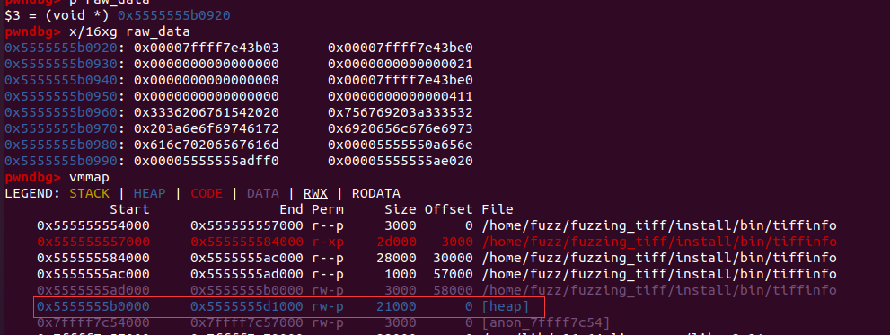  
  
  
随后raw_data的内存下一个写入断点，重新执行程序，看看它是什么时候写入的。  
  
  
第一次，该内存存放了一个_TIFFField结构指针。  
> 归档缺口：此处未保存具体调试表达式或断点输出；没有找到与这条 `_TIFFField` 指针观察对应的原文代码，因此不推测补写。
  
  
  
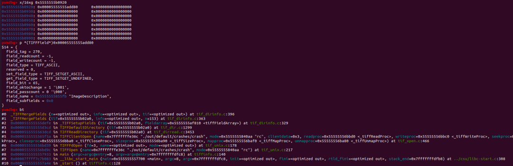  
  
  
从信息可以看出，该结构是一些的Tag信息，由于Tag 63253是一个在标准的Tag列表中没有，所以会进行一次Merge。  
  
  
第三次，0x00007ffff7e43be0和最后输出的值很接近了。  
  
  
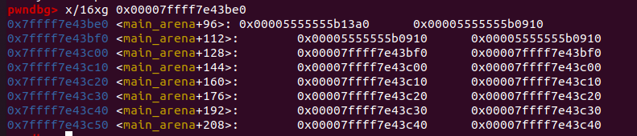  
  
  
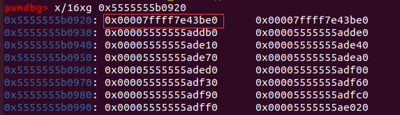  
  
  
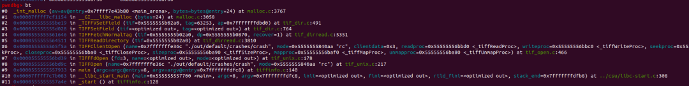  
  
  
bt查看一下调用栈。笔者决定从tif_dirread.c:5351  
开始跟一遍。  
  
  
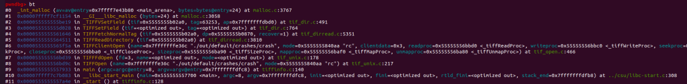  
  
  
TIFFSetField  
函数传入了一个DE结构，一个data，这个data存放的值Tag 的Value。  
  
  
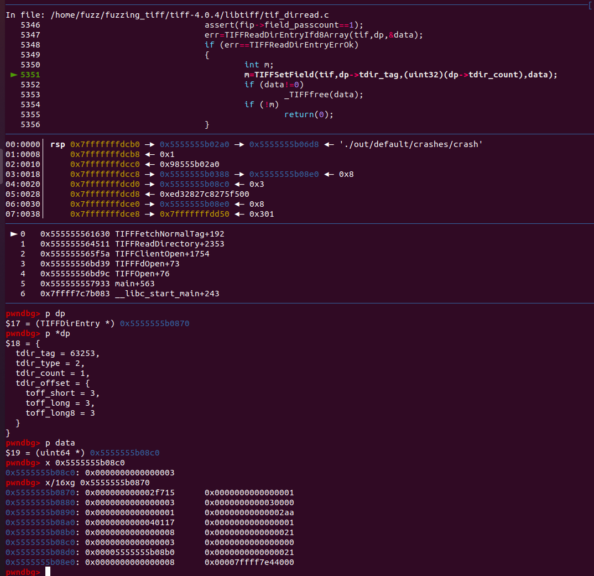  
  
  
随后进入内部，发现该函数做了如下操作，执行_TIFFVSetField  
函数找到Tag对应的TIFField  
malloc一个TIFFValue  
给它，最后分配了一个空间存储Value，该空间的起始地址也就是后续print的raw_data，尽管只分配了1字节的空间，但是由于是64位的Linux，内存分配的大小最小也是0x20字节，所以如下图，0x20为chunkSize，03为存储的Value。  
  
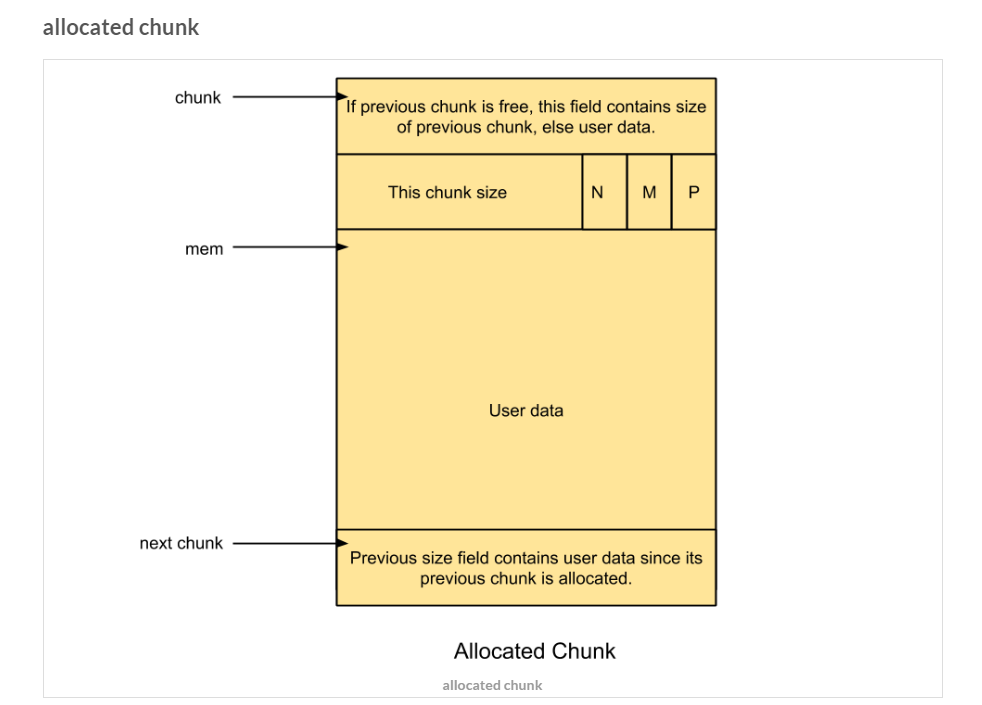  
  
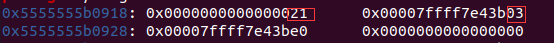  
  
  
后续打印会打印0x7ffff7e43b03，属于是越界读取。但是由于该地方的内存只是单纯的一个地址信息，且由内存管理机制决定，所以似乎无法造成信息泄露。尝试修改Tag的Value数目使得读取其他内存，其计算的偏移会和文件的Size进行一个比较，无法利用。  
  
  
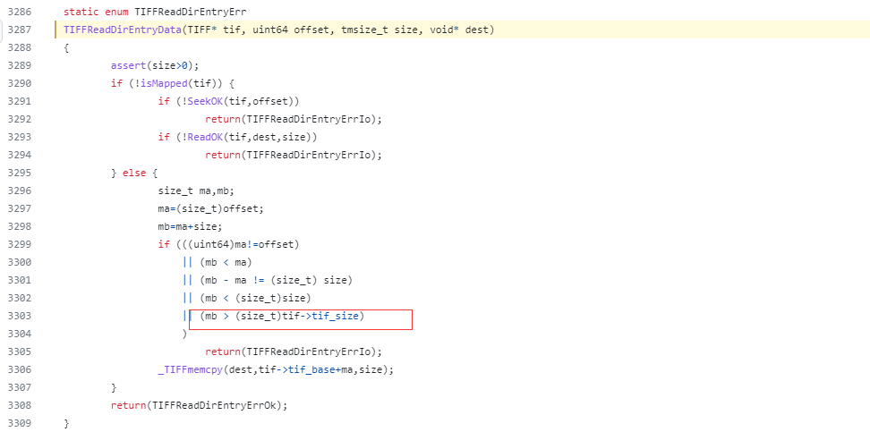  
  
###### 2.4 补丁分析  
  
  
在输出字符串的结尾提前放置了\x00防止越界读取。  
  
  
但是显然这里产生了新的漏洞，如果dp->tdir_count=0，那么data就是NULL，这时候对空指针进行了Read操作。  
  
  
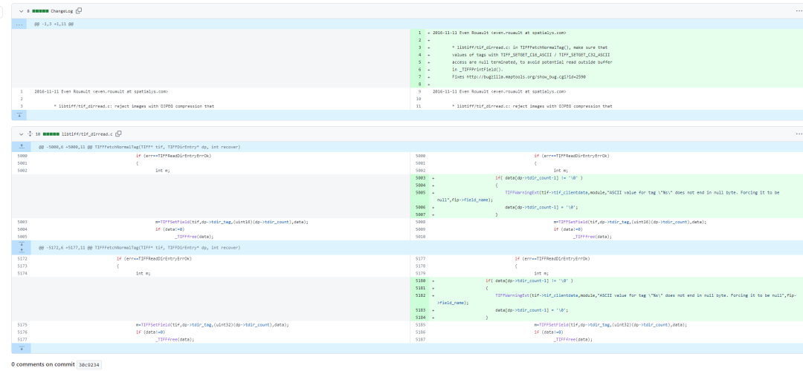  
  
  
CVE-2016-9448 的描述看起来起来就是这个原因。  
  
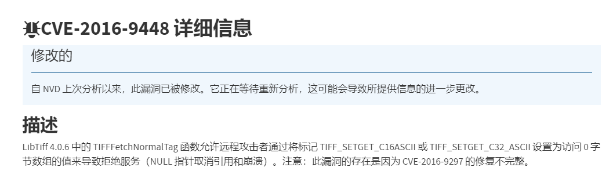  
  
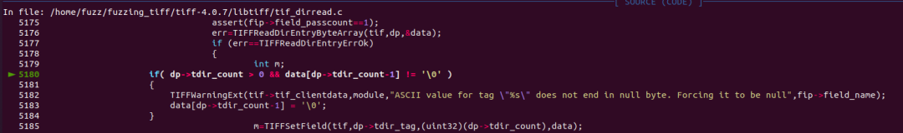  
  
  
按照第一次的补丁修改一下源码，随后修改Tag的Count为0，果然出现了Segmentation fault。  
  
  
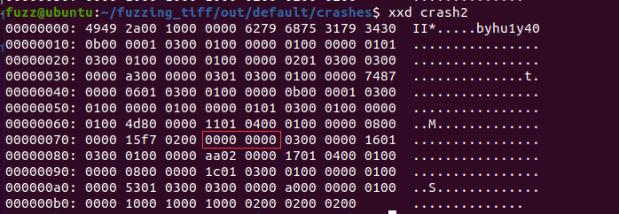  
  
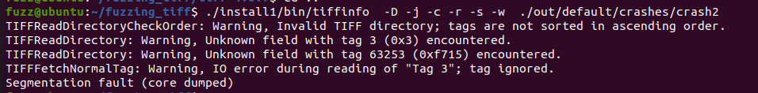  
  
  
  
参考文献  
  
  
Linux堆内存管理分析：  
https://murphypei.github.io/blog/2019/01/linux-heap  
  
  
TIF规范：  
https://web.archive.org/web/20120703095221/http://partners.adobe.com/public/developer/en/tiff/TIFF6.pdf  
  
  
ASAN：  
https://github.com/google/sanitizers/wiki/AddressSanitizerAndDebugger  
  
  
Fuzzing101：  
https://github.com/antonio-morales/Fuzzing101/tree/main/Exercise%204  
  
  
  
  
  
  
  
**看雪ID：hu1y40**  
  
https://bbs.kanxue.com/user-home-937383.htm  
  
*本文为看雪论坛精华文章，由 hu1y40 原创，转载请注明来自看雪社区  
  
  
[](http://mp.weixin.qq.com/s?__biz=MjM5NTc2MDYxMw==&mid=2458499288&idx=1&sn=b2b9cd6ff7388a8658d254e13c72f9ad&chksm=b18e885286f9014436a590f2531fda167be67e1e227ea395812968e828932bd44eade34b0dbf&scene=21#wechat_redirect)  
  
  
**#****往期推荐**  
  
1、[在 Windows下搭建LLVM 使用环境](http://mp.weixin.qq.com/s?__biz=MjM5NTc2MDYxMw==&mid=2458500602&idx=1&sn=4bcc2af3c62e79403737ce6eb197effc&chksm=b18e8d7086f9046631a74245c89d5029c542976f21a98982b34dd59c0bda4624d49d1d0d246b&scene=21#wechat_redirect)  
  
  
2、[深入学习smali语法](http://mp.weixin.qq.com/s?__biz=MjM5NTc2MDYxMw==&mid=2458500599&idx=1&sn=8afbdf12634cbf147b7ca67986002161&chksm=b18e8d7d86f9046b55ff3f6868bd6e1133092b7b4ec7a0d5e115e1ad0a4bd0cb5004a6bb06d1&scene=21#wechat_redirect)  
  
  
3、[安卓加固脱壳分享](http://mp.weixin.qq.com/s?__biz=MjM5NTc2MDYxMw==&mid=2458500598&idx=1&sn=d783cb03dc6a3c1a9f9465c5053bbbee&chksm=b18e8d7c86f9046a67659f598242acb74c822aaf04529433c5ec2ccff14adeafa4f45abc2b33&scene=21#wechat_redirect)  
  
  
4、[Flutter 逆向初探](http://mp.weixin.qq.com/s?__biz=MjM5NTc2MDYxMw==&mid=2458500574&idx=1&sn=06344a7d18a72530077fbc8f93a40d8f&chksm=b18e8d5486f904424874d7308e840523ebfb2db20811d99e4b0249d42fa8e38c4e80c3f622c6&scene=21#wechat_redirect)  
  
  
5、[一个简单实践理解栈空间转移](http://mp.weixin.qq.com/s?__biz=MjM5NTc2MDYxMw==&mid=2458500315&idx=1&sn=19b12ab150dd49325f93ae9d73aef0c4&chksm=b18e8c5186f90547f3b615b160d803a320c103d9d892c7253253db41124ac6993d83d13c5789&scene=21#wechat_redirect)  
  
  
6、[记一次某盾手游加固的脱壳与修复](http://mp.weixin.qq.com/s?__biz=MjM5NTc2MDYxMw==&mid=2458500165&idx=1&sn=b16710232d3c2799c4177710f0ea6d41&chksm=b18e8ccf86f905d9a0b6c2c40997e9b859241a4d7f798c4aeab21352b0a72b6135afce349262&scene=21#wechat_redirect)  
  
  
  
  
  
  
  
  
  
**球分享**  
  
  
  
**球点赞**  
  
  
  
**球在看**  
  


---

> 来源：gelusus/wxvl（微信公众号漏洞文章自动归档，原始披露 URL 尚未确认，现有链接按来源追溯区分别标注）
