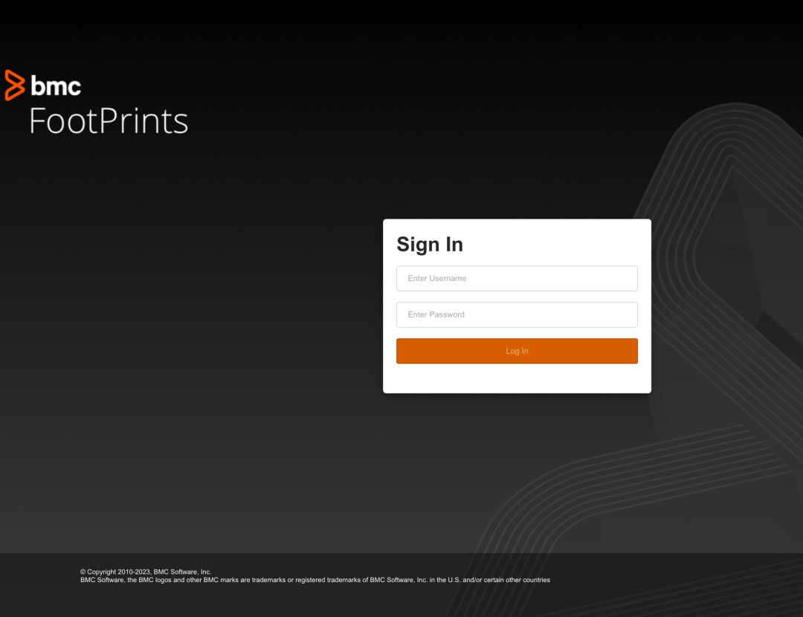
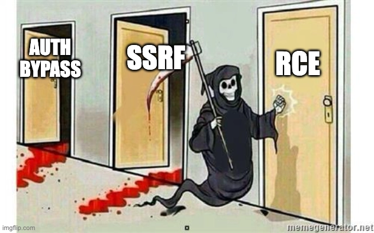
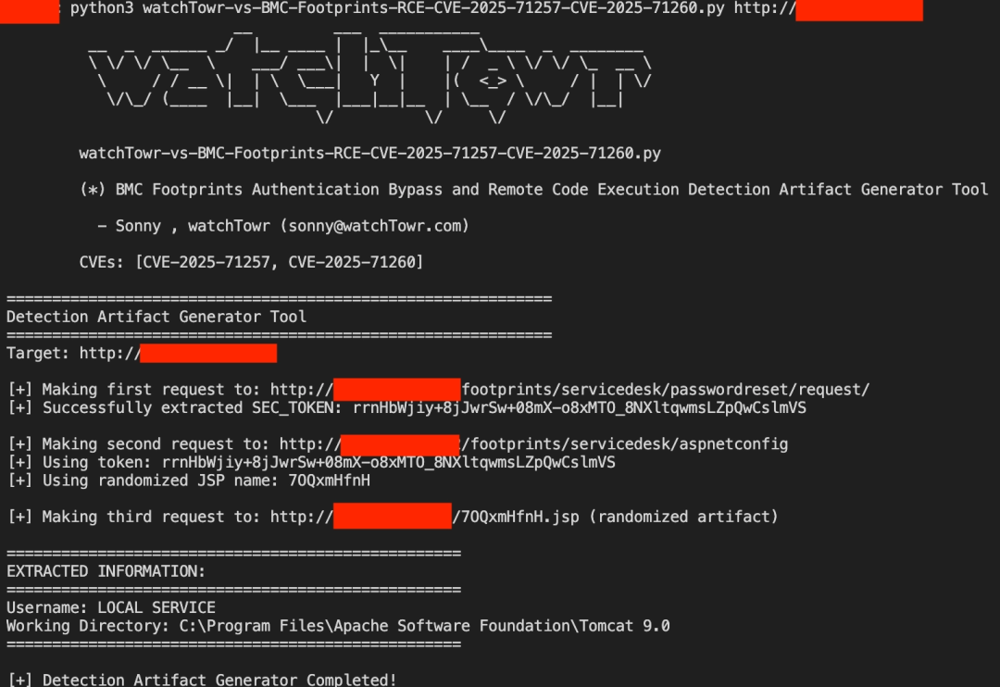

# IT 服务管理软件 BMC FootPrints 被曝未授权 RCE 漏洞链（CVE-2025-71257 至 71260）

<!-- vulwiki-editorial-rebuild:system-misc -->
## 条目范围与校订

- 本文对象：BMC FootPrints
- 文献类型：漏洞链解析转载
- 版本、权限及部署边界：文称20.20.02–20.24.01.001未装热修；SEC_TOKEN绕过+Java ViewState反序列化，两个SSRF可选
- 核验状态：仅重建文本校订；未执行文中代码、PoC 或扫描，未把截图或转载声明记为本站复现

### 具体结论与待核项

以下为原归档的逐项勘误与证据缺口；可由文本确定的问题已在下文订正，仍缺来源的事实保持待核。

1. 元数据仅71257漏其余三项；四漏洞不是全为RCE必需，应两CVE核心链及独立SSRF分开
2. 404不单独证明已进入特权会话，应有受保护资源及服务器认证主体证据
3. 将特殊包装!__VIEWSTATE与普通Java序列化Base64前缀rO0ABX混为修复办法，技术解释自相矛盾，须对原代码校准
4. AspectJWeaver链通常需说明写文件/落点到执行步骤，不能仅凭依赖存在推出任意命令；Mono/Mainsoft/Java架构归因无原代码引用
5. 给出watchTowr仓库但无研究博客和BMC热修编号；受影响同号版本经热修可安全，版本字符串不足判定

### 操作风险

原文技术操作的实际副作用未复现核验；按其请求/代码评估状态变更、凭据暴露和业务影响

技术请求、代码与实验方法按原文保留；其中的破坏性动作仅限授权、可恢复的隔离环境。缺失代码、参数或版本事实不猜补。

### 来源追溯

- 原文参考链接（未重新核验）：<https://{{external-host}}&dataEncoding=x>
- 原文参考链接（未重新核验）：<https://{{external-host}}>
- 原文参考链接（未重新核验）：<https://github.com/watchtowrlabs/watchTowr-vs-BMC-Footprints-RCE-CVE-2025-71257-CVE-2025-71260>
- 原始披露 URL 未确认；既有归档来源标签保留，不能替代原始公告

### 归档技术正文

 幻泉之洲   2026-03-19 08:35  
  
> 安全团队 watchTowr Labs 披露了 BMC FootPrints ITSM 软件中存在的一条高危漏洞链。攻击者可绕过身份验证，最终在未授权的情况下远程执行任意代码。受影响版本包括 20.20.02 至 20.24.01.001。  
  
## 漏洞概述  
  
BMC FootPrints 是一款 IT 服务管理（ITSM）解决方案，用于管理服务请求、资产和工单。watchTowr Labs 研究人员在 2025 年发现了该产品中存在的一系列漏洞，并成功将其串联，构成了预身份验证远程代码执行（Pre-Auth RCE）链。  
  
涉及的四个漏洞及其 CVE 编号分别为：   
- CVE-2025-71257 / WT-2025-0069：身份验证绕过  
  
- CVE-2025-71258 / WT-2025-0070：服务器端请求伪造  
  
- CVE-2025-71259 / WT-2025-0071：服务器端请求伪造  
  
- CVE-2025-71260 / WT-2025-0072：不可信数据反序列化  
  
这些漏洞组合在一起危害极高，允许未经身份验证的攻击者完全控制受影响的系统。  
## 影响范围  
  
受影响的版本分支明确为：   
- BMC FootPrints 20.20.02 到 20.24.01.001  
  
BMC 已在多个版本中发布了热修复补丁，包括 20.20.02、20.20.03.002 等。如果你的 FootPrints 版本在此范围内且未更新，就需要尽快采取行动。  
## 技术原理分析  
### 突破口：身份验证绕过 (CVE-2025-71257)  
  
研究开始后，发现应用程序对所有未经验证的请求都通过一个过滤器重定向到登录页。这个过滤器类似于白名单机制，只允许匹配特定模式的请求通过。  
  
在梳理了大量过滤器配置后，研究人员发现了一个特殊端点：/passwordreset/request/**  
。当访问此路径时，服务器会返回一个特殊的 SEC_TOKEN  
 cookie，而其他端点都不会返回此令牌。  
  
  
  
追踪代码发现，令牌由 GenericGuestAuthenticationFilter  
 类生成和设置。关键问题来了：这个 SEC_TOKEN  
 能否被用来绕过那个身份验证过滤器？  
  
测试很简单：拿着这个令牌去访问一个被保护的资源。结果没有重定向到登录页，而是返回了 404。别小看这个 404，它证明我们成功躲过了全局身份验证检查，进入了特权会话。至此，攻击面大大扩展。  
### 扩大战果：发现潜在的 SSRF (CVE-2025-71258/71259)  
  
带着 SEC_TOKEN  
 枚举应用程序，很快找到了两个服务器端请求锻造漏洞。  
  
一个在导入模块：   
  

```http
GET /footprints/servicedesk/import/searchWeb?url=https://{{external-host}}&dataEncoding=x HTTP/1.1  
  
Host: {{Hostname}}  
  
Cookie: SEC_TOKEN=...;  
```

  
  
另一个在外部新闻源模块：   
  

```http
GET /footprints/servicedesk/externalfeed/RSS?feedUrl=https://{{external-host}} HTTP/1.1  
  
Host: {{Hostname}}  
  
Cookie: SEC_TOKEN=...;  
```

  
  
这两个都是盲 SSRF，但研究目标是 RCE，这还不够。  
  
  
  
  
### 核心目标：反序列化实现 RCE (CVE-2025-71260)  
  
研究重点回到应用程序架构。它运行在 Tomcat 上，分析 web.xml  
 后，发现了一个有趣的映射：/aspnetconfig  
 这一 URI 对应 VmwDynamicServlet  
 servlet。  
  
向这个端点发送请求，服务器返回了一段 HTML，其中包含一个 __VIEWSTATE  
 参数，其内容看起来像是一个 Base64 编码的序列化 Java 对象的开头。  
  
  
  
这里很有意思。BMC FootPrints 内部使用了 Mono（一个 .NET 框架的开源实现）来处理 ASPX 页面，而底层的应用逻辑又是 Java。这就导致了 __VIEWSTATE  
 参数中存在 Java 序列化对象。  
  
尝试利用经典的 URLDNS  
 gadget 链来触发一次 DNS 查询作为验证。但直接用 GET 或 POST 带上恶意 __VIEWSTATE  
 都会失败，要么 302 重定向，要么 403 禁止。  
  
  
### 深入调试：定位问题  
  
问题出在何处？借助调试器，研究人员追踪到处理 __VIEWSTATE  
 的类：Mainsoft/Web/Hosting/BaseFacesStateManager  
。  
  
关键代码显示，它从请求中获取 __VIEWSTATE  
 参数值，并调用一个名为 StringStaticWrapper.StringCastClass  
 的方法。调试发现，这个方法的返回值是 null  
，导致整个处理流程提前中止，反序列化根本没发生。  
  
问题根源在于：服务器期望接收的是被封装在特定格式（如 !__VIEWSTATE<Base64数据>  
）中的值，而不仅仅是裸 Base64 数据。  
### 突破：绕过限制触发反序列化  
  
既然服务器期待特定的包装格式，那就给它。通过分析，发现正确的格式是将 Base64 数据包装在 “rO0ABX...” 这样的一个特定前缀结构里。  
  
尝试发送一个恶意构造的 __VIEWSTATE  
 参数，格式为 rO0ABXNy...（完整的恶意序列化数据）  
。这一次，服务器成功反序列化了对象，并抛出了预期的异常。最关键的是，通过 URLDNS  
 链，成功观察到了对攻击者控制域名的 DNS 查询。这证明了反序列化路径确实存在且可利用。  
  
  
  
  
### 最终的 RCE Gadget  
  
确认了反序列化点之后，下一步就是找一个能在目标环境（包含了 Tomcat 和 AspectJ 库）中实现代码执行的 gadget 链。  
  
研究团队最终使用了基于 AspectJWeaver  
 库的 gadget 链，该链能可靠地在目标系统上执行任意命令。他们提供了一个 Python PoC，可以串联所有漏洞：先绕过认证拿到 SEC_TOKEN  
，再访问 /aspnetconfig/CreateUserWizard.aspx  
 页面，注入恶意的 __VIEWSTATE  
 参数，从而触发反序列化，执行系统命令。  
## 漏洞复现思路  
  
完整的攻击链步骤如下：   
1. **获取 SEC_TOKEN**  
：发送请求至 /footprints/servicedesk/passwordreset/request/  
，从响应头中提取 SEC_TOKEN  
 cookie 值。  
  
1. **利用 SSRF（可选）**  
：使用 SEC_TOKEN  
 访问存在 SSRF 的端点，进行内部探测。  
  
1. **定位反序列化端点**  
：使用 SEC_TOKEN  
 认证访问 /footprints/servicedesk/aspnetconfig/CreateUserWizard.aspx  
。  
  
1. **构造并发送恶意 VIEWSTATE**  
：生成本地命令执行的 AspectJWeaver gadget 链 payload，将其进行 Java 序列化后 Base64 编码，并按照服务器要求的格式（如前缀“rO0ABX...”）封装。  
  
1. **触发 RCE**  
：将封装好的恶意 __VIEWSTATE  
 作为参数发送到目标端点，服务器反序列化该对象，执行其中包含的任意系统命令。  
  
watchTowr Labs 已将此漏洞复现的检测工具开源。  
  
GitHub - watchTowr Detection Artifact Generator   
  
(https://github.com/watchtowrlabs/watchTowr-vs-BMC-Footprints-RCE-CVE-2025-71257-CVE-2025-71260)  
  
  
  
  
## 修复建议与缓解措施  
  
**1. 立即更新**  
：最直接有效的方法是应用 BMC 发布的热修复补丁。请检查并升级到已修复的版本。  
  
**2. 临时缓解**  
：   
- 如果无法立即升级，考虑在网络层面限制对 BMC FootPrints 服务端口的访问，仅允许受信任的 IP 或网络段访问管理界面。  
  
- 审查并强化服务器上的安全过滤规则，确保所有敏感端点都得到正确的身份验证保护。  
  
**3. 安全监控**  
：在受影响的系统上启用并增强安全日志监控，特别关注对 /passwordreset/request/  
、/aspnetconfig/  
 等路径的大量异常访问尝试，以及可疑的反序列化相关错误日志。  
  


---

> 来源：gelusus/wxvl（微信公众号漏洞文章自动归档，原始披露 URL 尚未确认，现有链接按来源追溯区分别标注）
