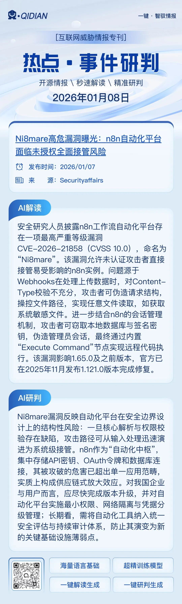

# n8n CVE-2025-68668 等多事件新闻摘要

<!-- vulwiki-editorial-rebuild:system-misc -->
## 条目范围与校订

- 本文对象：n8n；Chrome WebView；多组织数据泄露/钓鱼事件
- 文献类型：多事件新闻摘要且标题错配
- 版本、权限及部署边界：68668正文为认证用户，1.0.0–1.999.999；WebView修复143.0.7499.192/.193；多项仅攻击者声称
- 核验状态：仅重建文本校订；未执行文中代码、PoC 或扫描，未把截图或转载声明记为本站复现

### 具体结论与待核项

以下为原归档的逐项勘误与证据缺口；可由文本确定的问题已在下文订正，仍缺来源的事实保持待核。

1. 标题Ni8mare未授权全面接管与正文唯一n8n68668认证漏洞不一致，可能错配不同漏洞，应回源辨明
2. 七条独立新闻需拆摘要记录；Morgan/ASML为威胁者声称不得记确认泄露，ChatGPT/DeepSeek是被扩展窃取的服务而非平台漏洞
3. 来源只有媒体名无URL，n8n缺修复/配置/原始公告；WebView漏洞影响平台与版本枝干需核验
4. 数字52GB/1512/154/90万无数据出处；无PoC，不能合成未授权RCE记录

### 操作风险

原文技术操作的实际副作用未复现核验；按其请求/代码评估状态变更、凭据暴露和业务影响

技术请求、代码与实验方法按原文保留；其中的破坏性动作仅限授权、可恢复的隔离环境。缺失代码、参数或版本事实不猜补。

### 来源追溯

- 原始披露 URL 未确认；既有归档来源标签保留，不能替代原始公告

### 归档技术正文

SOC  赛欧思安全研究实验室   2026-01-08 01:30  
  
  
- **摩根记录管理漏洞：Everest 集团声称有 52GB 文件外流**  
  
Everest 勒索软件组织声称已经入侵了 Morgan Records Management 公司，据该组织称被泄露的数据达 52GB，包含约 1512 条记录，其中包括显然与纽约市住房管理局（NYCHA）有关的文件。  
  
来源: Daily Dark Web  
  
  
- **疑荷兰光刻机制造商 ASML 发生数据泄露，涉 154 个数据库与磁盘加密密钥**  
  
威胁行为者 “1011” 在暗网社区 BreachForums 上发布帖子，声称已成功入侵荷兰半导体设备巨头 ASML Holding N.V.（asml.com）的数据库系统，并正在泄露约 154 个数据库文件，相关数据据称已以 .SQL 格式公开下载。  
  
来源: CN-SEC 中文网  
  
  
- **新的 n8n 漏洞允许攻击者执行任意命令**  
  
在开源自动化和工作流平台 n8n 中发现了一个关键漏洞，该漏洞可允许通过验证的用户在易受攻击的系统上执行任意命令。该漏洞被追踪为 CVE-2025-68668，影响 1.0.0 至 1.999.999 的所有 n8n 版本，CVSS 得分为 9.1。  
  
来源: GBHackers  
  
  
- **WordPress 管理员成为续订电子邮件钓鱼欺诈的目标**  
  
一种新的网络钓鱼活动正以 WordPress 管理员为目标，通过令人信服的域名更新电子邮件实时窃取信用卡数据和双因素验证码。这种攻击依赖于紧迫性、精心打造的品牌和多阶段支付工作流程，诱骗受害者交出敏感的财务信息。  
  
来源: eSecurity Planet  
  
  
- **谷歌警告存在可破坏安全控制的高风险 WebView 漏洞**  
  
谷歌发布了 Chrome 浏览器 143.0.7499.192/.193 版本，以修补 WebView 中的一个高严重性漏洞，该漏洞可能允许攻击者绕过重要的安全策略。该漏洞被追踪为 CVE-2026-0628，对浏览器依赖 WebView 的策略执行框架来阻止恶意内容的用户构成重大威胁。  
  
来源: GBHackers  
  
  
- **APT36 利用恶意 Windows 快捷方式攻击印度政府**  
  
一个疑似民族国家的组织利用恶意 Windows 快捷方式文件发起了针对印度政府实体的网络间谍活动。攻击开始时会发送一个名为 "Online JLPT Exam Dec 2025.zip" 的 ZIP 压缩包，这是一个以考试为主题的诱饵，目的是诱骗官员打开附件。  
  
来源: eSecurity Planet  
  
  
- **恶意 Chrome 浏览器扩展泄露 90 万用户的 ChatGPT 和 DeepSeek 聊天记录**  
  
超过 90 万名 Chrome 浏览器用户受到了两个恶意扩展程序的攻击，这两个扩展程序将 ChatGPT 和 DeepSeek 对话秘密渗入攻击者控制的服务器，其中一个流氓扩展甚至获得了谷歌的"精选"徽章。  
  
来源: GBHackers  
  
  
  
  

---

> 来源：gelusus/wxvl（微信公众号漏洞文章自动归档，原始披露 URL 尚未确认，现有链接按来源追溯区分别标注）
