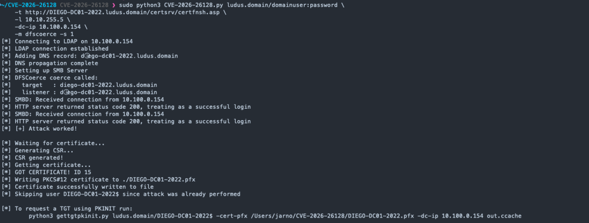

# Synacktiv 公开披露了一个 Kerberos 反射绕过漏洞（CVE-2026-26128），并提供了 PoC 漏洞利用代码

<!-- vulwiki-editorial-rebuild:system-misc -->
## 条目范围与校订

- 本文对象：Windows Kerberos/SMB反射
- 文献类型：漏洞链研究新闻
- 版本、权限及部署边界：26128本地转发变体应需本地落点；域用户、DNS/SPN可控及强制认证条件；SMB签名影响SMB路径
- 核验状态：仅重建文本校订；未执行文中代码、PoC 或扫描，未把截图或转载声明记为本站复现

### 具体结论与待核项

以下为原归档的逐项勘误与证据缺口；可由文本确定的问题已在下文订正，仍缺来源的事实保持待核。

1. 2025年10月修复58726与后文两漏洞均2026年3月修复矛盾，需分别记录时间线
2. 前半普通域用户远程SYSTEM与后半26128可靠本地提权混淆，应区分58726远程路径和26128本地转发
3. 所有Windows仅11 24H2例外断言过广，需要版本/默认签名策略及服务配置矩阵；SMB签名彻底阻止中继仅限该协议不是HTTP
4. 仅第三方PoC仓库无Synacktiv原研究/MSRC；HTTP ADCS/SCCM是补充路径需各自EPA/channel binding/TLS条件，不能统一一个开关
5. 未确认实际利用应保留为未知而非已利用

### 操作风险

原文技术操作的实际副作用未复现核验；按其请求/代码评估状态变更、凭据暴露和业务影响

技术请求、代码与实验方法按原文保留；其中的破坏性动作仅限授权、可恢复的隔离环境。缺失代码、参数或版本事实不猜补。

### 来源追溯

- 原文参考链接（未重新核验）：<https://github.com/jarnovandenbrink/CVE-2026-26128>
- 原始披露 URL 未确认；既有归档来源标签保留，不能替代原始公告

### 归档技术正文

 Ots安全   2026-07-06 02:17  
  
**威胁简报**  
  
  
**恶意软件**  
  
  
**漏洞攻击**  
  
Synacktiv 公开披露了一个 Kerberos反射绕过漏洞，漏洞编号为CVE-2026-26128。该漏洞允许域用户在目标 Windows 计算机上获得 SYSTEM 权限。概念验证的漏洞利用代码已公开，微软已于 2026 年 3 月修复了该漏洞。  
  
为什么这很重要  
  
Kerberos 反射会将一台机器自身的身份验证信息转发回自身。成功转发后，即可在目标机器上建立 SYSTEM 会话。这种 Kerberos 反射链在大多数 Windows 版本上默认工作。只有 Windows 11 24H2 版本会阻止它，因为它强制使用 SMB 签名。由于概念验证已公开，因此对 Active Directory 网络构成的风险是真实存在的。一个普通的域用户就足以发起攻击。研究还表明，微软之前的两个补丁未能触及问题的根源。身份验证反射问题困扰 Windows 系统近二十年，而这项研究证明它仍在不断卷土重来。  
  
攻击原理  
  
Synacktiv 构建了一种新的 Kerberos 强制身份验证原语。它利用了Windows组件处理 Unicode 字符方式的差异。域控制器在查找服务主体名称 (SPN) 时采用一种规范化方式，而 DNS 客户端则采用另一种方式。因此，精心构造的记录可以映射到真实的机器 SPN，同时仍然触发 DNS 查询。攻击者随后在受控服务器上获取目标机器的 Kerberos 票据。该票据对目标的 SMB 服务仍然有效。强制身份验证触发器（例如打印机或 EFSRPC 调用）会强制目标机器进行身份验证。  
  
起初，这导致了经过身份验证的远程代码执行 (RCE) 漏洞，并使CVE-2025-33073的修复失效。Synacktiv 于 2025 年 10 月向微软报告了此漏洞。随后，微软在 10 月份的“周二补丁日”发布了CVE-2025-58726补丁，该补丁阻止了 SMB 的中继。该补丁仅检查本地身份验证是否来自本地 IP 地址。然而，Synacktiv 也绕过了该漏洞。  
  
CVE-2026-26128 变种通过本地转发器转发票据，使连接看起来像是本地连接。其结果是可靠的本地权限提升至 SYSTEM。完整的漏洞利用链出现在Synacktiv 的研究中，并且一个公开的概念验证也重现了该漏洞。  
  
受影响版本  
  
该攻击在 2026 年 3 月补丁之前的所有 Windows 版本上默认有效。Windows 11 24H2 是个例外，因为它强制执行 SMB 签名。微软将这两个相关的漏洞分别标记为 CVE-2025-58726 和 CVE-2026-26128。这两个漏洞均在 2026 年 3 月的更新中得到了修复。  
  
修补和缓解  
  
请在所有服务器上应用 2026 年 3 月的“周二补丁日”更新。强制所有服务器启用 SMB 签名，因为它能彻底阻止中继攻击。同样的防御措施也能保护尚未打补丁的系统。值得注意的是，Kerberos 反射技巧仍然会影响缺少完整性检查的 HTTP 服务。Synacktiv 展示了针对 ADCS Web 注册和 SCCM AdminService 的有效攻击。因此，请强制执行通道绑定，并限制对这些服务的网络访问。禁用所有不需要的 HTTP 连接器。目前尚未确认任何实际的漏洞利用。但是，一旦漏洞被公开，攻击者的行动时间就会缩短，因此请尽快打补丁。  
  
  
- https://github.com/jarnovandenbrink/CVE-2026-26128  
  
  
  
**END**  
  
  
  
  
  
公众号内容都来自国外平台-所有文章可通过点击阅读原文到达原文地址或参考地址  
  
排版 编辑 | Ots 小安   
  
采集 翻译 | Ots Ai牛马  
  
公众号 |   
AnQuan7 (Ots安全)  
  

---

> 来源：gelusus/wxvl（微信公众号漏洞文章自动归档，原始披露 URL 尚未确认，现有链接按来源追溯区分别标注）
