# TP 诸多限制条件下如何 getshell

<!-- vulwiki-editorial-rebuild:system-misc -->
## 条目范围与校订

- 本文对象：2020N1CTF Easy_tp5/定制ThinkPHP5.0.0
- 文献类型：CTF题解
- 版本、权限及部署边界：PHP7、定制函数禁用/文件包含限制、open_basedir、仅public可写；方法4明确不适用于原题禁用error_log
- 核验状态：仅重建文本校订；未执行文中代码、PoC 或扫描，未把截图或转载声明记为本站复现

### 具体结论与待核项

以下为原归档的逐项勘误与证据缺口；可由文本确定的问题已在下文订正，仍缺来源的事实保持待核。

1. 必须分类CTF定制环境，不把绕过滤器的方法直接记为所有ThinkPHP产品漏洞；源码和题目包未连
2. error_reporting无论参数都返回0错误，其返回旧错误级别；弱比较/静态调用非静态方法是PHP版本相关行为不可外推PHP8
3. 方法5先说无$this才可静态调用又使用self::path->$this，需解释调用上下文绑定而非普遍规则
4. 方法1–5关键限制、代码、HTTP payload几乎仅图片，未视检，无法凭文字复现；应回源提取代码
5. 保留Windows非法文件名字/不同Linux目录行为和方法4额外前提等互补证据，不机械合并5条路线

### 操作风险

原文技术操作的实际副作用未复现核验；按其请求/代码评估状态变更、凭据暴露和业务影响

技术请求、代码与实验方法按原文保留；其中的破坏性动作仅限授权、可恢复的隔离环境。缺失代码、参数或版本事实不猜补。

### 来源追溯

- 原文标注出处：<https://mp.weixin.qq.com/s/LaTNNjwDT1VzN6uA0Gq0-Q>
- 原文参考链接（未重新核验）：<http://ksria.com/simpread/>
- 原文参考链接（未重新核验）：<https://github.com/MrWQ/vulnerability-paper>

### 归档技术正文

<meta name="referrer" content="no-referrer"/>

> 本文由 [简悦 SimpRead](http://ksria.com/simpread/) 转码， 原文地址 [mp.weixin.qq.com](https://mp.weixin.qq.com/s/LaTNNjwDT1VzN6uA0Gq0-Q)

这是 **酒仙桥六号部队** 的第 **123** 篇文章。

全文共计 3172 个字，预计阅读时长 9 分钟。

**前言**

先说说 2020_n1CTF 的 web 题 Easy_tp5 复现问题。

这个题在保留 thinkphp 的 RCE 点的同时，并且 RCE 中 ban 掉许多危险函数，只能允许单参数的函数执行。对于现在在网络中流传的文件包含的点也增加了限制。

**smile yyds!**

先说一下这个题限制条件：

*   thinkphp 版本：5.0.0
    
*   php 版本：7
    
*   对于包含文件增加了限制
    

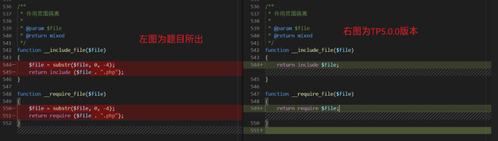

*   ban 掉所有的单参数危险函数
    

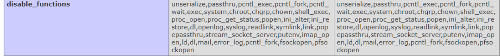

*   设置 open_basedir 为 web 目录
    

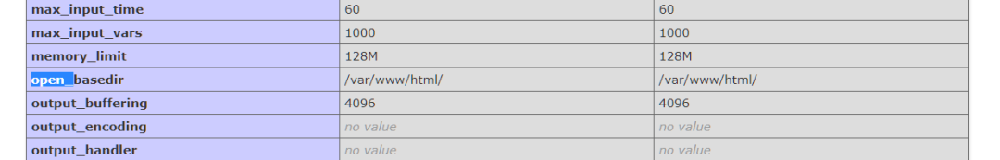

*   设置仅在 public 目录下可写
    

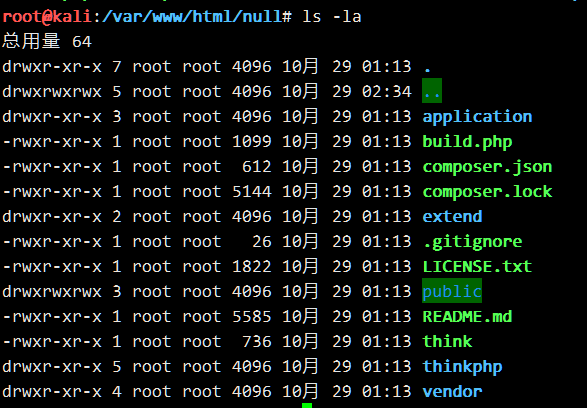

在 TP5.0.0 的中，目前公布的只是存在利用 Request 类其中变量被覆盖导致 RCE。如果 ban 掉单参数可利用函数那么只能用文件包含，但是文件包含做了限制不能包含 log 文件，所以只能从别的方面入手。

这些限制都太大了，所以需要想办法去上传一个 shell 来完成后续绕 disable_function。

首先 TP5.0.0 目前只存在通过覆盖 Request 中的某些变量导致 RCE，其余细节不再赘述，我们看看大概代码执行点在哪里。

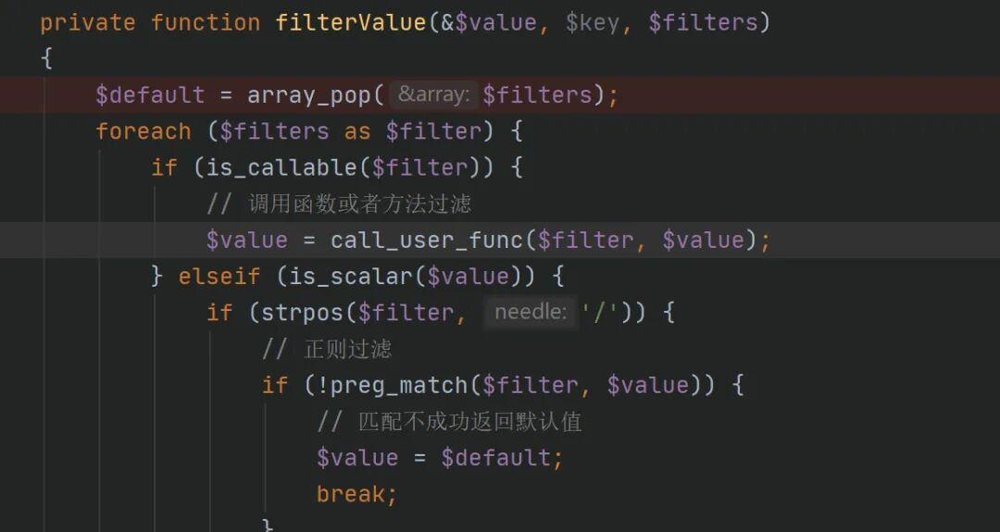

call_user_func 是代码执行点，我们基本上所有 PHP 自带的可利用函数基本被 ban 掉，所以我们需要从自写的函数调用来入手，首先我们需要看下这个点。可回调函数不仅仅指的是简单函数，还可以是一些对象的方法，包括静态方法。

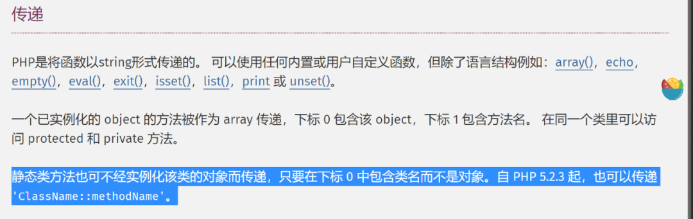

**方法一 thinkphp\library\think\Build::module**

我们可以这样通过调用这个类的静态方法 module，来实现写文件的操作。

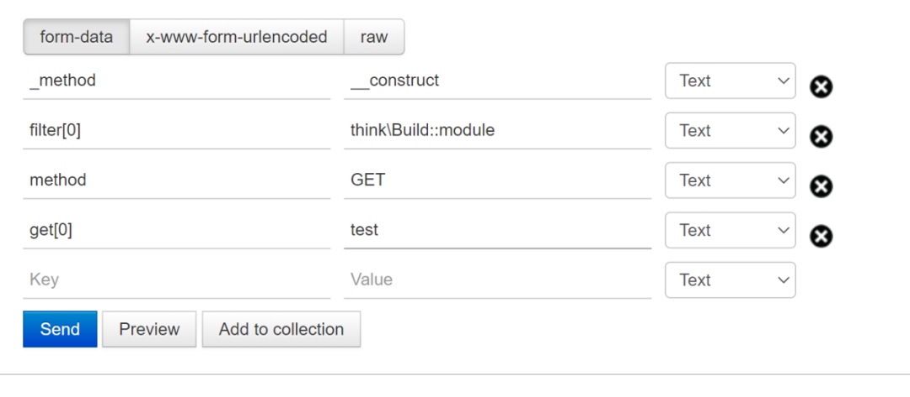

我们先看看这个该怎么走，我们看到这个 mkdir 是在 application 创建目录，但是由于权限问题肯定无法创建。根据 TP 报错即退出的机制从而中断执行。那么我们可以通过`../public/test`来创建目录。

我们会进入到 buildhello 函数中。

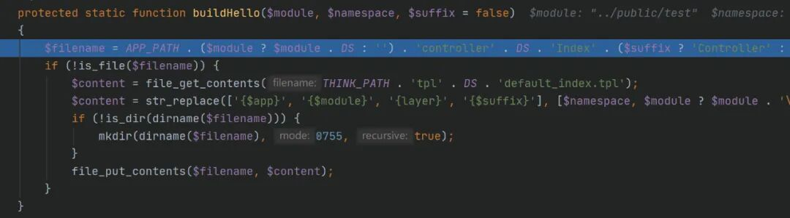

走完流程发现我们可以在 public 创建了一个 test 模块，同样看到`test/controller/Index.php`中我们所写的`../public/test`保存了下来那么我们就绕过，但是执行完之后会发现一些语法错误导致代码不能执行。

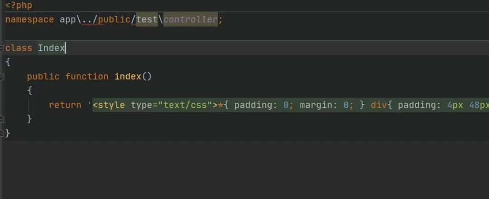

由于这部分内容可控那我们就把他变得符合语法执行，我们可以这么做`test;eval($_POST[a]);#/../../public/test;`，这样就符合语法。

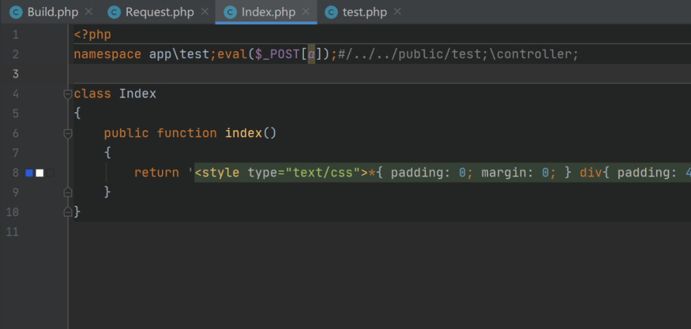

但是还有一个问题需要解决，就是我们这样的 payload 会设置一个不存在目录从而可以符合语法并且加入 eval 函数。但是现在还存在一个跨越不存在目录的问题。

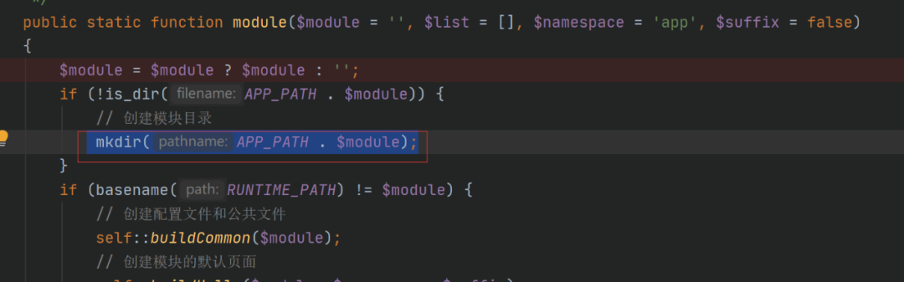

*   linux 环境
    

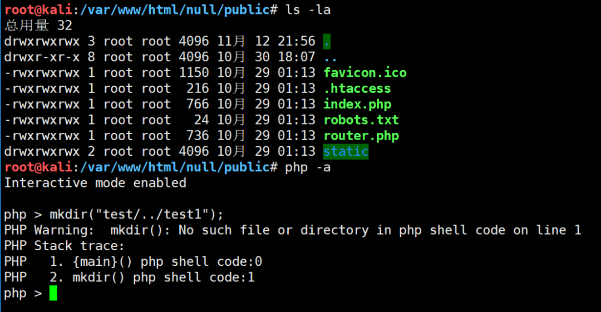

*   win 环境
    

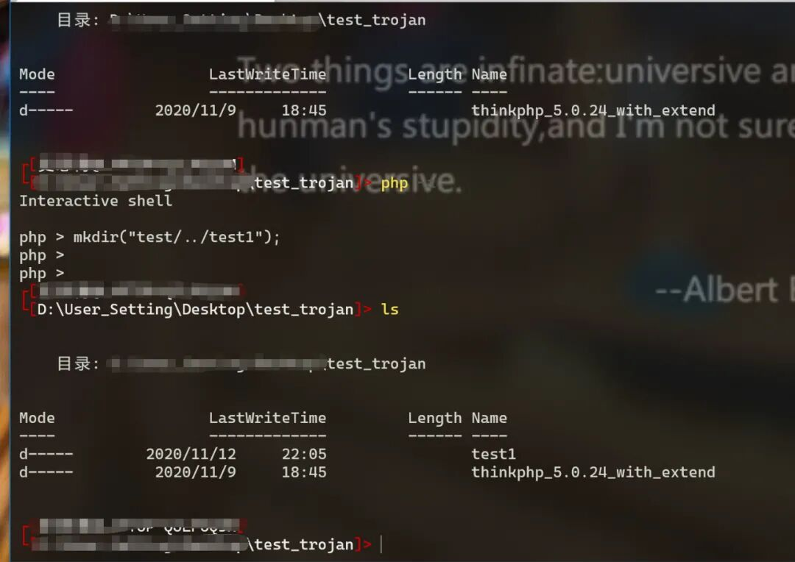

在 Linux 中不能创建不存在的目录，但是在 win 下就可以。但是报错是 warning，并不会中断执行，并且在 bindhello 函数中我们会看到：  

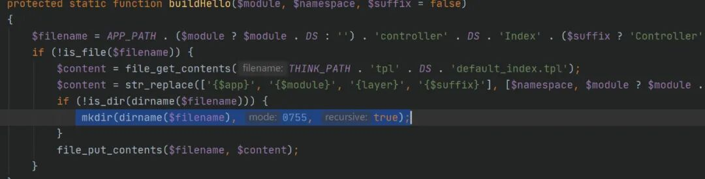

其中 mkdir 函数存在 recursive 参数为 true，允许递归创建多级嵌套的目录。这样就可以使 mkdir 中使用不存在的目录就可以进行绕过。但是现在有个问题：前面的 mkdir 中的 warning 报错被 TP 捕获到直接会退出无法执行后面的内容，那么我们就需要使用一些办法进行抑制报错。我们经常做题会用到一个函数`error_reporting`，我们可以使用`error_reporting(0)`抑制报错。

我们再回到代码执行点，我们发现 call_user_func 函数执行完的值会执行循环再次回到 call_user_func() 中当回调函数的参数进行使用。因此需要考虑一下怎么调整才能让我们执行并且抑制报错。

1. 如果我们将`error_reporting`放在前面执行，无论参数是什么都会返回 0 从而导致后面执行代码不可控。

2. 如果我们将`think\Build::module`放前面，那么 thinkphp 报错也不能执行成功。

但是如果我们放入一个中间值，在第一次执行能够成功创建目录，并且`error_reporting`还能成功执行，这时候就需要用到 PHP 弱类型比较，**PHP 中 0 == null，0 == 非数字开头的字符串。**

payload 如下可示：

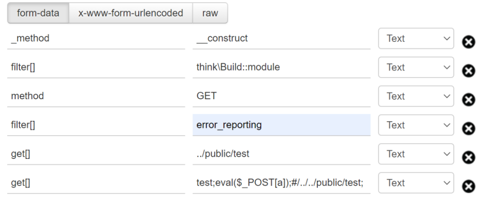

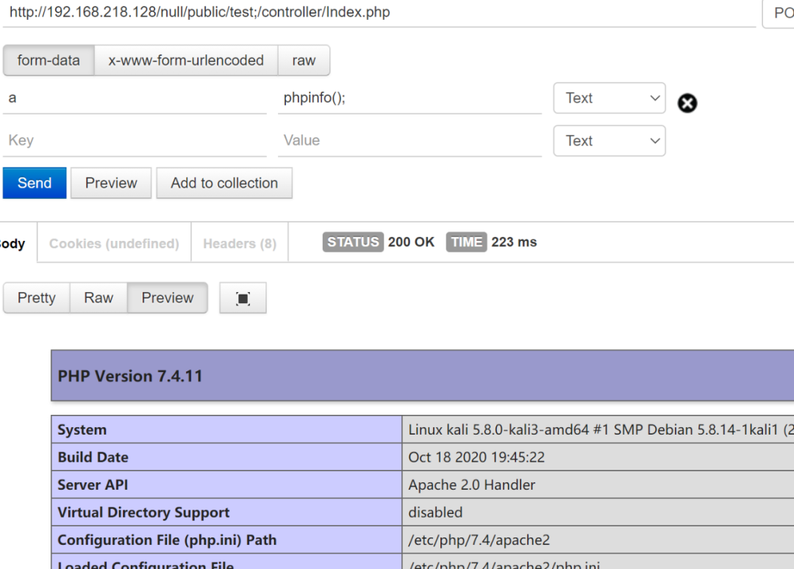

**方法二 使用注释符绕过语法产生的错误**

payload 如下：

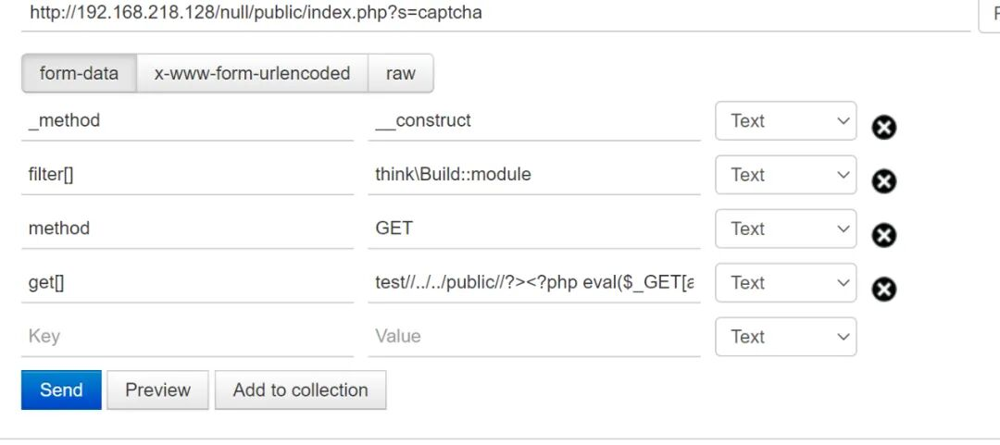

这样就会使用注释符注释掉后面的语法错误，然后使用`?>`包裹住，后面跟上自己用的 payload 即可。但是这样会产生一个问题，无法在 win 环境下使用，win 下文件夹中不能带这些字符`/ \ : * ? " < > |`

**方法三 文件包含 & php 伪协议**

这种操作就是，我们通过之前的`think\Build::module`写文件进去，写入的内容是我们 rot13 编码过的。然后通过`think\__include_file`调用我们写入文件的内容，因为这个过滤不够完全，可以让我们包含我们所写的内容。

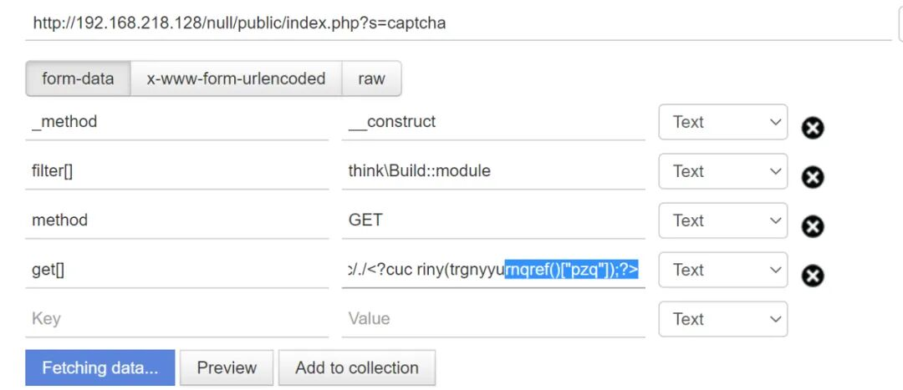

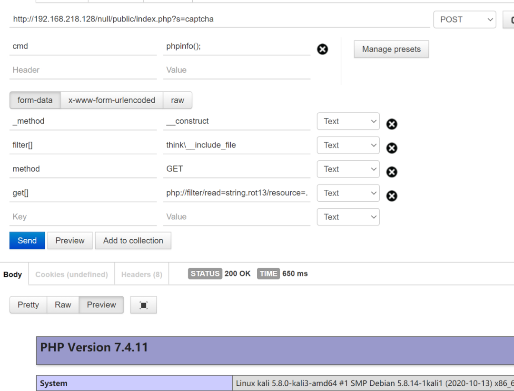

**方法四 覆盖日志路径写入**

因为题目将 error_log 函数 ban 掉了，所以这个非预期解是在不 ban 掉 error_log 函数的情况下所实现的。

payload 具体如下：

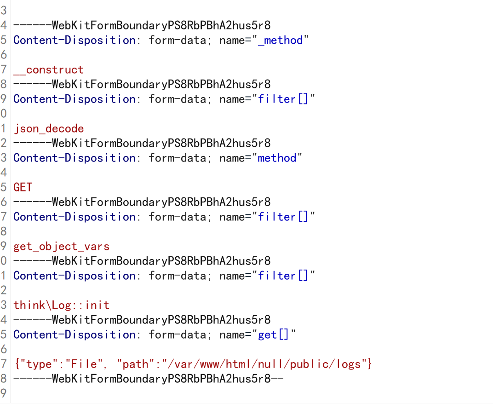

1. 通过`json_decode`使得我们传入的`{"type":"File", "path":"/var/www/html/null/public/logs"}`转换成内置类 stdClass 的一个对象。

2. 再通过`get_object_vars`将其转换成数组传入到`think\Log::init`中。

3. 在其中会 new 了一个`\think\log\driver\File`，并且传入的参数是我们的`'path'=>/var/www/html/null/public/logs`，那么会触发类中的__construct，将其默认的 path 给覆盖掉。

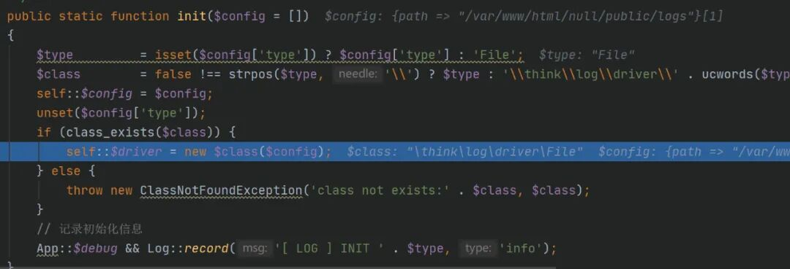

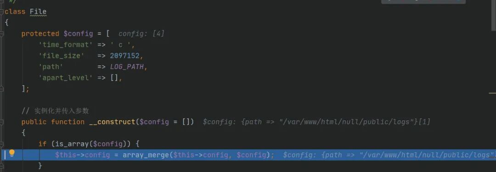

4. 最后因为我们触发漏洞点的特殊性，肯定会报错使得报错信息可以被计入到 log 文件里。

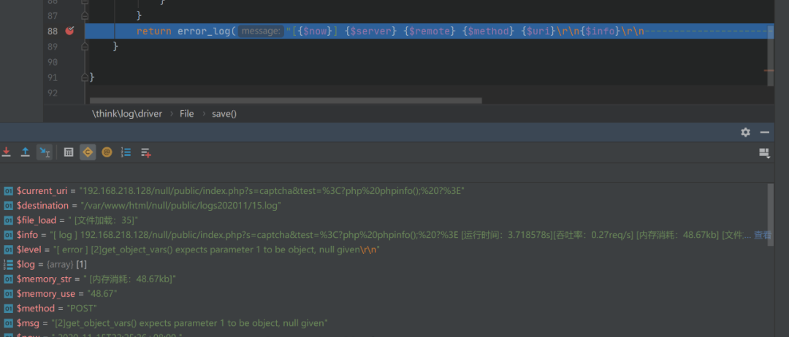

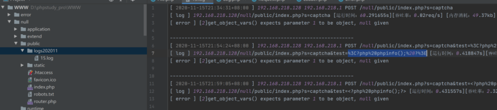

5. 之后再通过`think\Lang::load`包含。

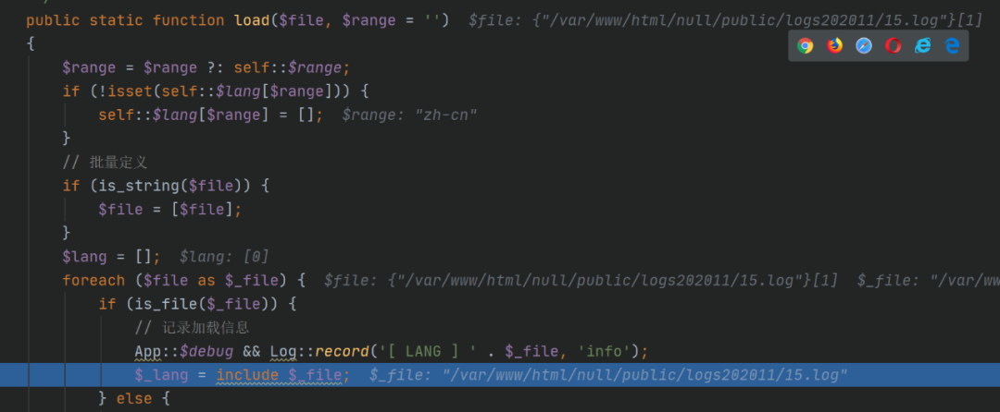

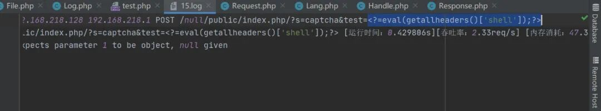

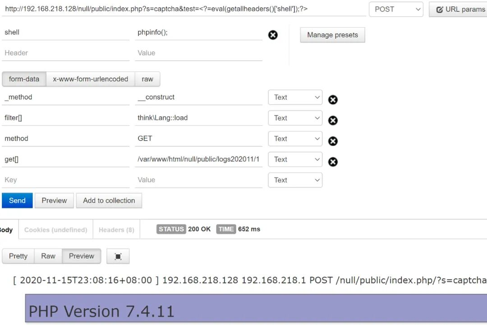

**方法五  :: 竟然可以调用非静态方法**

下面是个简单的例子。

```
<?php

class A{

    public function test1($a){
        echo "test1".$a;
    }
    static function test2($a){
        echo "test2".$a;
    }
    public function test3($a){
        $this->b = $a;
        echo "test3".$this->b;
    }
}

call_user_func("A::test1","x");
echo "</br>";
call_user_func("A::test2","x");
echo "</br>";
call_user_func("A::test3","x");
echo "</br>";
//$xxx=new A();
//call_user_func(array($xxx,'test3'),"x");
```

我们看看会怎么执行。

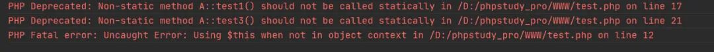

会发现使用:: 调用了 public 类的方法并且能够成功执行，但是会报错。并且:: 仅仅适合在方法中没有写`$this`的情况，因为`$this`指代的是这个对象，找不到对象自然会报错。那么我们看一下下面的 payload 就会一眼明白，payload 其实用了跟上面预期解抑制错误的另一种方法，然后抑制报错让 TP 不会遇错停止执行。

这个题解的 payload 如下：

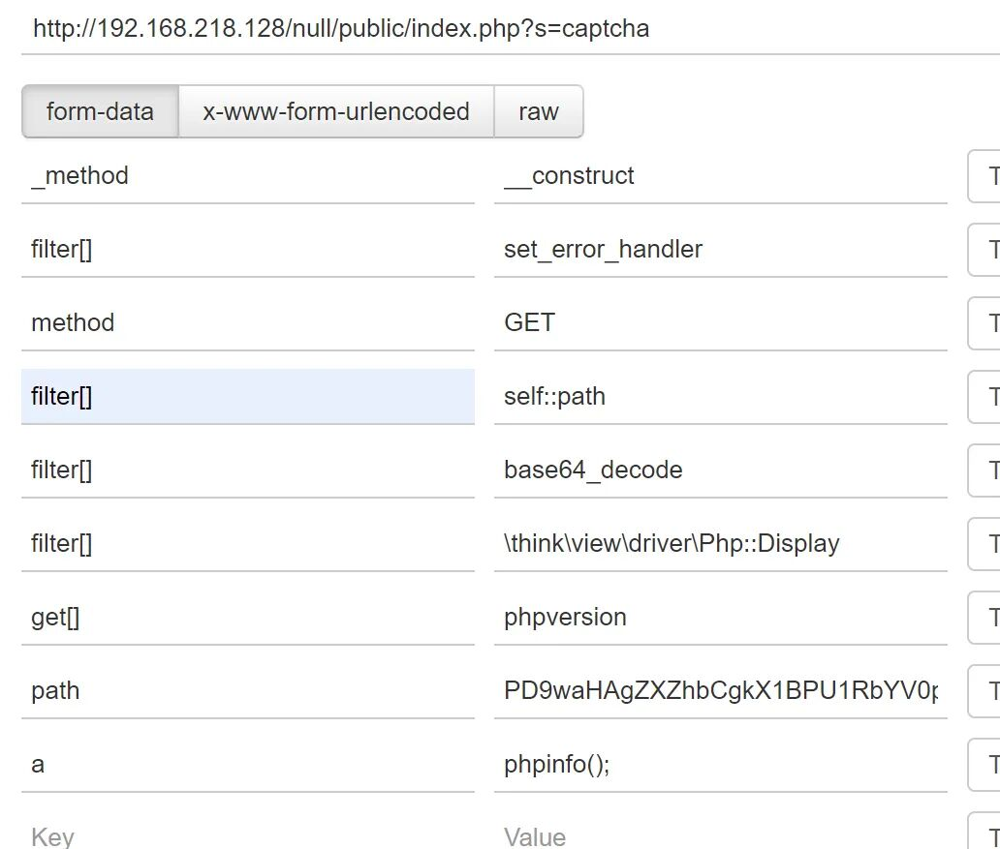

1. 因为 PHP 本身的错误处理被 thinkphp 所替代进行处理，所以上面就是将 thinkphp 所替代错误进行处理的方法给覆盖掉导致没有办法正常执行。

2. 调用`self::path`方法，可以抛弃掉我们上一个执行的返回值，并且返回我们所输入的`path`。为什么会返回 path，path 为什么是我们输入的值，这个就是之前提到的代码执行点他是覆盖了 Request 类的参数，所以方法返回的是`$this->path`，这个我们可以控制。

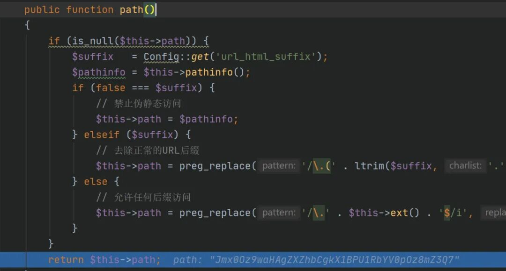

3. 之后调用 base64_decode，返回值就是我们 base64 解码的内容。

4. 解码后的返回值就会进入`\think\view\driver\Php::Display`中，然后进入 eval 执行代码。

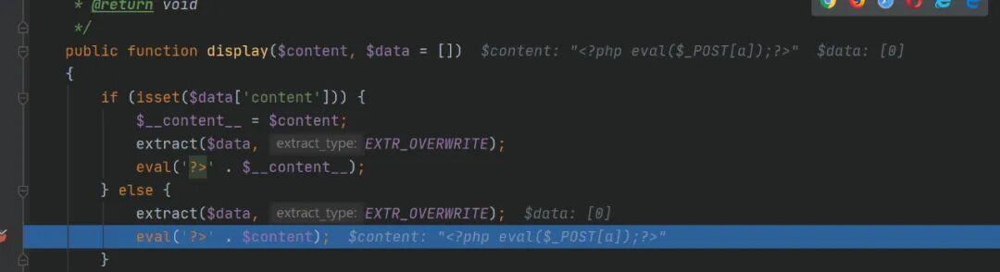

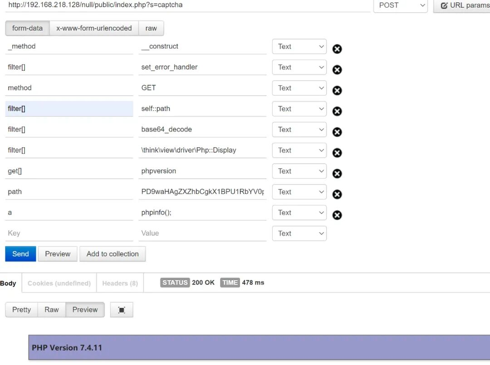


---

> 来源：MrWQ/vulnerability-paper（https://github.com/MrWQ/vulnerability-paper）
