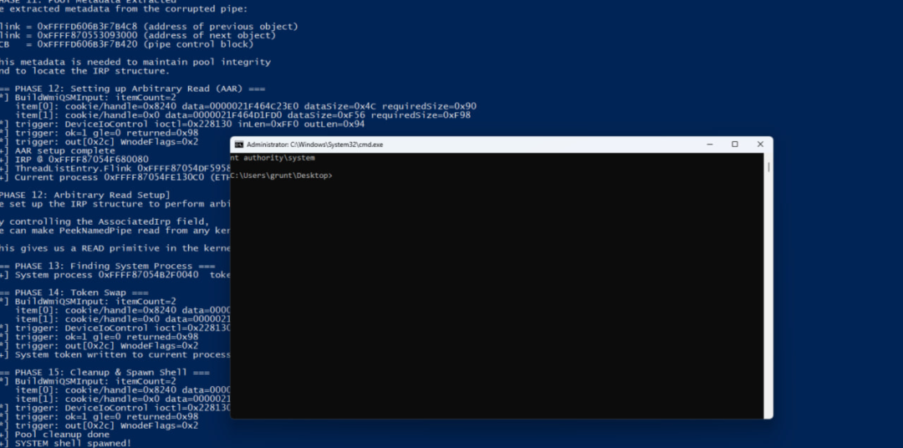

# Windows 内核 WMI 计数回绕 CVE-2026-42980

<!-- vulwiki-editorial-rebuild:system-misc -->
## 条目范围与校订

- 本文对象：Windows NT Kernel WMI（研究者归因）
- 文献类型：来源批判与机制综述
- 版本、权限及部署边界：本地低权限；研究者仅实验室配置，IOCTL0x228130；官方修复build与研究者开关观点需分层
- 核验状态：仅重建文本校订；未执行文中代码、PoC 或扫描，未把截图或转载声明记为本站复现

### 具体结论与待核项

以下为原归档的逐项勘误与证据缺口；可由文本确定的问题已在下文订正，仍缺来源的事实保持待核。

1. 保留官方与研究者单源机制区分、修复build误传对照及实验室可靠性限制，来源链较清晰
2. 称两个接口只差一位实际功能号相邻不等于一个bit；4,294,967,292是4GiB-4不是十进制4GB；版本1992/8655差在第4段不是第3段
3. 引用3.5/4.2/5.2/6.1不存在，说明编辑删节未修内部引用；截图未视检不能接受作者截图验证结论为本审计核验
4. 有特性开关不证明开关状态不由更新控制，本文推论强于其声明未知；版本不能判生效与结尾只靠版本号安全需协调
5. GitHub创建/推送时间不等于公开时间；任意读写/令牌替换不能由终端自述单独独立证明；原语完整链仍需源码/复现核实
6. 算术层修复无任何可观察中间态且只能版本检查的断言不成立，可有对照或调试观察；全文理论修复为研究者观点非厂商认证

### 操作风险

原文技术操作的实际副作用未复现核验；按其请求/代码评估状态变更、凭据暴露和业务影响

技术请求、代码与实验方法按原文保留；其中的破坏性动作仅限授权、可恢复的隔离环境。缺失代码、参数或版本事实不猜补。

### 来源追溯

- 原文参考链接（未重新核验）：<https://msrc.microsoft.com/update-guide/vulnerability/CVE-2026-42980>
- 原文参考链接（未重新核验）：<https://www.cve.org/CVERecord?id=CVE-2026-42980>
- 原文参考链接（未重新核验）：<https://cveawg.mitre.org/api/cve/CVE-2026-42980>
- 原文参考链接（未重新核验）：<https://nvd.nist.gov/vuln/detail/CVE-2026-42980>
- 原文参考链接（未重新核验）：<https://github.com/advisories/GHSA-jh49-99q5-mwf2>
- 原文参考链接（未重新核验）：<https://www.cnnvd.org.cn/frontend/warnDetail?id=771a0f919a3d44c1ae6f68801cec9653>
- 原始披露 URL 未确认；既有归档来源标签保留，不能替代原始公告

### 归档技术正文

 Ots安全   2026-09-19 06:58  
  
**威胁简报**  
  
  
**恶意软件**  
  
  
**漏洞攻击**  
  
2026 年 6 月 9 日，微软的六月安全更新日，一条编号为 CVE-2026-42980 的本地提权漏洞被列在 NT 内核名下，官方定级 Important，基础分 7.8，可利用性评为"更可能"。二十八天后的 7 月 7 日，一位自称计算机专业学生的研究者把这个洞的完整利用链放上 GitHub，链条终点是一行 nt authority\system  
。再往后两周，英文媒体开始集中报道；又过了一个多月，中文渠道里流转的修复版本号仍然是错的，而那个错误足以让一次自查得出"已经安全"的结论。  
  
本篇要核三件事。编号层的定级是否可信，机制描述的唯一来源是谁，以及一条错误的版本号是怎么从一家媒体流进中文通告的。  
## 一、原因导致：一处没有守卫的减法  
  
本章的全部内容都来自研究者的补丁对比与静态逆向。厂商从未公布函数名、接口号或算术位置，因此本章不构成厂商口径，这一点在 3.5 节会再说明一次。  
### 1.1 计数器在算一笔什么账  
  
WMI 查询在内核里要完成一次序列化：把提供程序返回的数据块按调用方给的输出缓冲区逐个摆放，同时维护一个 32 位的剩余空间计数。  
  
流程大体分两步。第一步按调用方给出的项目估算所需空间，估算值不大于剩余计数就放行。第二步等提供程序真的返回数据后，按实际长度对齐到 8 字节边界，再从剩余计数里减掉。**这个设计本身没有问题，问题出在第一步用的是估算值，第二步用的是实际值，而两者可以不一致。**  
  
落差来自对齐这个动作。第一步的估算按调用方给出的名称或数据长度计算，第二步按提供程序返回的真实长度向上对齐到 8 字节边界。对齐本身会引入最多 7 个字节的增量，而在特定长度上，这个增量足以让实际值越过估算值。  
  
**缺陷不需要任何人写错一个数。它需要的是两个阶段用两套口径计算同一个量，并且中间没有人做一次比较。**  
 这类形态在代码审查里几乎查不出来，因为两处代码相隔很远，各自单独看都成立。  
### 1.2 两条只差一位的查询路径  
  
研究者给出的两个接口号是 0x22812C  
 与 0x228130  
。把这两个值按 Windows 的接口编码位域拆开，可以看到一个能自行核对的结构：  
  
```
0x22812C   DeviceType 0x22   Function75   Access FILE_WRITE_ACCESS   Method METHOD_BUFFERED
0x228130   DeviceType 0x22   Function76   Access FILE_WRITE_ACCESS   Method METHOD_BUFFERED
```  
  
  
四项位域里有三项完全相同，只有功能号相邻差一位。这符合"同一组件的一对兄弟操作"的形态，与研究者给的两个函数名（一个处理多数据块查询，一个处理单实例多次查询）在结构上对得上。同一位域里的 Method 值为 0，即缓冲模式，这也与研究者在 4.2 节描述的缓冲区分配方式一致。  
  
**这一段核对的价值在于，它把接口号从"研究者的一家之言"提升到了"内部自洽、可以独立验算"。**  
 但它仍然不能证明这两个接口号就是厂商修补的那两处，因为验证这件事需要可读的内核差异。  
### 1.3 闸门用的值与实减用的值不是同一个  
  
把链条的核心讲成一句话：**减去一个数之前，没有确认这个数不大于被减数。**  
  
无符号整数相减一旦为负，结果不是负数，而是回绕到一个接近类型上限的巨大值。研究者与截图共同给出了一个具体窗口：剩余计数为 0x94，对齐后的实际尺寸为 0x98，相减得到 0xFFFFFFFC。这个值换成十进制是 4,294,967,292 字节，比 4 GB 少 4 个字节。  
  
写进正文的这三个数都经过复算。截图里两项输入的尺寸与按估算公式算出来的结果逐项吻合，0x94 减 0x98 的回绕结果也与 4 GB 这个量级吻合。**算术本身可以验算，这一点是本篇能给出机制的量化描述、而不只是名词堆叠的原因。**  
  
**同一条缺陷之所以危险，不在于减法写错了符号，而在于做这个减法之前少了一次比较。**  
 一次比较的成本是一个分支，省掉它换来的却是对内核池剩余空间的错误认知。  
  
回绕后的数值在操作上的意义是容量错觉。内核认为手里还有 4 GB 的空间可以摆放数据，于是不再做任何换缓冲区或截断的处理，继续往下写。**从这一刻起，写入边界已经不由缓冲区决定，而由攻击者提供的数据长度决定。**  
 一次比较的成本是一次分支预测，而省掉它换来的是整个内核堆的写权限。  
### 1.4 修复的形态与一个前置开关  
  
研究者对修复的描述是：把不受检查的减法换成带饱和保护的减法，使得被减数小于减数时结果被钳到 0 而不是回绕。他同时给出一个细节，该修复被一个内部特性开关守卫。  
  
这个细节如果成立，含义不小。**特性开关意味着同一份更新里可能同时存在修复前后的两条代码路径，走到哪一条取决于开关状态，而开关状态不由更新包决定。**  
 也就是说，一台装着六月更新的机器，其内核里是否有生效的修复，不能仅从版本号推出来。  
  
必须把边界写清楚：**这一点只有一个来源，没有厂商说明，也没有第二方复核。公开信息未说明该开关的默认状态、推送范围与判定方式。**  
 本篇把它作为观察记录，不作为结论，也不据此给出任何处置建议。  
### 1.5 机制描述的确认边界  
  
有一位第三方分析者在同一时期明确写过：有追踪平台把该缺陷归到 WMI 子系统，但该归属未获微软确认，应视为未证实。  
  
这句话需要原样接住。本章乃至第四章里出现的函数名、接口号与算术位置，**全部是研究者的逆向结论，不是厂商口径**  
。厂商给出的可核事实只有六项：内核归属、弱点类别、定级与分数、受影响产品清单、可利用性评级、以及"成功可获得 SYSTEM 权限"。  
  
**把两者混着读，会得出一个错误的印象：以为 WMI 这条路径是厂商确认过的。**  
 正确的读法是分开记：官方确认的是严重性，研究者主张的是位置。**官方确认的那一半不依赖研究者，研究者主张的那一半也不因为官方没否认而成立。**  
## 二、漏洞触发：从计数回绕到令牌替换  
### 2.1 触发点为什么选在后一条路径  
  
两条路径都存在同一个减法缺陷，但研究者选的是后一条（接口号 0x228130  
）。理由是该路径的估算闸门取决于调用方给出的项目尺寸，而后续的减法取决于提供程序实际返回的尺寸。两个值分属不同来源，中间就存在一个可以被撑开的落差。  
  
**这个选择本身是一条方法论：同一类缺陷在同一个组件的不同入口上，可利用性可以差很远，差别来自哪个入口的两个值由不同方提供。**  
  
这里有一个需要标注的缺口。研究者只对后一条路径展开了闸门与实减的取值来源，前一条路径的闸门取值来自哪里，他的撰写文里没有展开，公开信息未说明。**因此"前一条路径不可利用"这句话在本篇里不成立**  
，只能说公开材料没有给出它的可利用性分析。  
### 2.2 越界写入落在什么对象上  
  
序列化在错误的剩余量下继续，把后续数据写到已分配缓冲区的末尾之外。这一步的关键在于数据可控：被复制的那一段里有一部分内容由调用方提供。  
  
要把这个越界写变成可用的原语，需要让相邻位置正好是攻击者能观察的对象。研究者的做法是先用命名管道做池填充，制造一串同尺寸的连续分配，再挖一个洞，让内核把出问题的缓冲区分配到预定位置旁边。**这条链的可靠性不来自某一次幸运的对齐，而来自对内存分配器行为的主动塑形。**  
  
选管道作为目标对象有三个实用性理由。管道对象在用户态有完整的读接口，污染之后的变化不需要内核调试器就能观察。它记录的可读长度一旦被撑大，越读的量由这个字段决定，攻击者可控。管道对象本身是可批量创建的，批量创建等于把触发成功的概率从一次放大到多次。  
  
**这三点合起来说明一件事：可利用性不只由缺陷本身决定，也由内核里有没有合适的邻居对象决定。**  
 同一条缺陷换一个内核版本，可选邻居变了，工程成本也会变。  
  
本节不给出触发输入的具体格式与池排布参数。这些内容在公开仓库里可以找到，但**公开存在与适合转载是两件事**  
，本篇只描述到结构这一层。  
### 2.3 从信息泄露到任意读  
  
越界写污染了相邻的管道数据结构，把它记录的可读长度撑大。此后一次对管道的常规窥探读取请求就能越读，把后面的内核池元数据取回用户态。  
  
拿到元数据之后，研究者把被污染的结构重新塑形成另一种形态，使读取来源变成一个受控的内核地址。**到这一步，链条完成了一次质变：从"能越界写一小段"变成"能读内核任意地址"。**  
  
从写一小段到任意读，中间靠的不是新的漏洞，而是对一个已经能控制的内存结构做二次塑形。**这是内核利用里的常见手法，也是它难以通过单点加固拦住的原因：同一个初始原语可以被反复改造成新的原语。**  
  
这一层的意义在于能力升级的方向。越界写能改动的范围受限于相邻对象的布局，而任意读不受此限，它可以按地址去取任何内核结构。链条从受布局约束的一步，走到了不受布局约束的一步，后续的地址推导因此都建立在读取结果之上，而不是建立在猜测之上。  
  
**判断一条内核利用链成不成熟，看的就是它有没有走到这一步。**  
 停在越界写的利用需要精确命中目标结构，走到任意读的利用则可以按需检索，两者的工程成本差一个量级。  
### 2.4 令牌替换与收尾验证  
  
拿到任意读之后，链条沿当前线程追溯到所属进程，再沿活动进程链走到进程号为 4 的系统进程，读出它的令牌。随后通过一条写路径把这个令牌值写进当前进程的令牌字段。之后修复被污染的管道结构，派生一个新的命令行进程，该进程继承新令牌。  
  
  
  
上图取自 PoC 仓库，是这一段的直接证据。左侧终端输出覆盖了从池元数据提取到外壳派生的完整过程，其中三处值得逐字看：trigger: DeviceIoControl ioctl=0x228130  
 与紧随其后的 returned=0x98  
，说明触发接口与返回尺寸；System token written to current process  
，说明令牌替换这一步执行完成；SYSTEM shell spawned  
。右上角命令行窗口的标题为管理员命令行，提示符前一行显示 nt authority\system  
，当前目录是 C:\Users\grunt\Desktop  
。  
  
图里的终端数值还可以用来自核：两项输入的尺寸与按估算公式算出的所需空间逐项吻合，与前文那个 0x94 减 0x98 的窗口处在同一次运行里。**这张图因此不只证明"跑通了"，还证明"跑通时用的算术就是前面描述的那一套"。**  
### 2.5 这条链的可靠性边界  
  
研究者在撰写文里用一句话收束可靠性：这是在受测的易受攻击实验室配置中达到的可靠本地提权。他没有主张全部受影响版本都能以相同可靠性被攻破。有第三方分析者也提醒过，实验室里的成功不应被读成每一个受影响版本都能同样轻松地被打穿。  
  
PoC 源码里还留了一处自述，它自己的输出文案在找不到被污染的管道时提示"填充未命中，重启后重试"。**这条链需要多次尝试，其中一部分尝试会因内存布局不理想而失败。**  
 这属于可利用性的常规代价，不改变缺陷的成立，但会影响把它武器化所需的工程投入估计。  
  
**读这一节要避免两个方向的偏差。**  
 一个方向是拿"实验室里跑通"当成"生产环境一键提权"，另一个方向是拿"需要重试"当成"威胁被夸大"。**正确的读法是：机制成立，工程成本存在，两者都写进处置依据。**  
## 三、补丁分析：一层计数与一条错误的版本号  
### 3.1 修复被放在哪一层  
  
按研究者的描述，修复落在算术层：把回绕改成钳位。剩余计数一旦被钳到 0 而不是变成一个巨大的值，后续的序列化就没有空间可写，链条从第一步就断了。  
  
这个位置的选择有它的道理。**在内核内存破坏类缺陷上，于算术层设界比在下游逐个检查写入更有收敛性**  
，因为下游的写入点可能有很多个，而错误只有一处。研究者也据此认为，修复之后信息泄露、任意读写与令牌替换都会一并失效。  
  
需要标注的是，**这个判断的依据仍然只有他一个来源**  
。补丁不可逐行核，所以"修复是否彻底"这件事，本篇给不出独立结论。  
  
把修复放在算术层还有一个可观测的副作用，它让"是否已修复"这件事在行为上变得不容易验证。如果修复点在下游的某一处写入，防御方可以通过观察该写入是否越界来判断。修复点在算术层时，越界写从第一步起就不会发生，没有任何可观察的中间态。**这也是为什么 6.1 节给出的核对办法只能是版本号比对，而不是行为观测。**  
### 3.2 一个修复版本号的传播错误  
  
有一家英文安全媒体在报道这篇 PoC 时写了这么一句：Windows 11 24H2 上，修复后的内核为 10.0.26100.1992 或更高版本。  
  
这个数字与厂商清单不符。清单上 24H2 的修复 build 是 **10.0.26100.8655**  
。两者的第三段差了六千多，这不是排版偏差。同一篇文章的摘要表里列的却是正确值，也就是说，**错误出现在正文撰写环节，而不在数据源上。**  
  
这个错误的影响是具体的。拿 10.0.26100.1992 去核对一台已打补丁的 Windows 11 24H2，会看到本机版本"更高"，从而判定为已修复。如果这台机器实际上还停在修复线之下，判定就是错的。  
### 3.3 同一天的两篇报道  
  
2026 年 7 月 21 日，两家英文站点就同一条编号各发了一篇。一篇的标题是"公开 PoC 已发布"，另一篇在同日发布的分析里写"撰写时尚无公开利用代码"。  
  
两篇都不算错，但放在一起看就出现了矛盾。PoC 仓库的创建时间是 7 月 7 日，比这两篇报道早 14 天。**同一编号、同一天、两个相反的利用状态表述，说明这个时间窗口里的信息同步是断裂的。**  
  
对读者的实用含义是：**不要用媒体报道来锚定"PoC 何时公开"。**  
 仓库的创建与推送时间戳是接口给出的一手事实，媒体日期只是它被注意到的时间。  
### 3.4 中文转述链上的三处改动  
  
中文侧最早的一条是编号通报，2026 年 6 月 11 日，定级高危，只收录编号与厂商公告链接，没有技术描述。这一条没有问题。  
  
问题出现在后面的技术转述里。有一份中文情报通告沿用了 5.2 节那个错误的修复 build 号，并把受影响版本概括为"Windows 10 版本 1607 及多个后续版本"，实际上清单包含 Windows 11 的全部在支持版本与 Server 2012 起的服务器产品线。另有一篇中文复盘在技术描述里把内核池写成"内核堆栈"，并给出了若干无出处的判断句。  
  
**传播链上的偏差有个共同特征：越靠后，具体数字越容易被改写，而判断句越容易被加上。**  
 本篇的处置建议因此全部落在可核对的一手字段上，不落在任何转述的结论上。  
## 四、结束语  
  
这条编号在公开记录里的形态，比它本身更能说明当前的披露节奏。厂商把严重性说清楚了，把受影响产品列全了，把可利用性评为"更可能"，唯独不说是哪一处代码。研究者把这一层补上了，但没有第二个人复核。中间隔着的二十八天，是补丁与利用之间的真实距离。  
  
**这类结构的漏洞会越来越常见：归因与定级由厂商给，机制由研究者给，两者之间的确认环节是空的。**  
 防御方能做的是把可核字段与转述结论分开记，把补丁状态落到具体的内核版本号上，把"已经装了就安全"这个默认假设换掉。  
  
补丁日只是起跑线，**唯有把版本号核对到修复线之上、把本地低权限执行的入口一并收紧，这两件事同时做到，"更可能"这个评级才不落在自己头上。**  
## 五、参考  
  
```
厂商公告（含定级、弱点、受影响产品与修复 build）
https://msrc.microsoft.com/update-guide/vulnerability/CVE-2026-42980

CVE 记录（保留日、发布日、CNA 口径评分）
https://www.cve.org/CVERecord?id=CVE-2026-42980
https://cveawg.mitre.org/api/cve/CVE-2026-42980

NVD 记录（确认未独立评分，唯一参考为厂商公告）
https://nvd.nist.gov/vuln/detail/CVE-2026-42980

GitHub 通告
https://github.com/advisories/GHSA-jh49-99q5-mwf2

中文编号（CNNVD 月度通报，本条目为第 43 项）
https://www.cnnvd.org.cn/frontend/warnDetail?id=771a0f919a3d44c1ae6f68801cec9653

PoC 仓库与撰写文（机制描述的来源）
https://github.com/G4sp4rCS/CVE-2026-42980-POC
https://github.com/G4sp4rCS/CVE-2026-42980-POC/blob/main/writeup-en.md

CISA 已知被利用漏洞目录（本条不在其中，目录版本 2026.09.18）
https://www.cisa.gov/sites/default/files/feeds/known_exploited_vulnerabilities.json

六月补丁日汇总（本批 206 条，提权类 65 条）
https://threatprotect.qualys.com/2026/06/09/microsoft-patch-tuesday-june-2026-security-update-review/

同日的另一篇分析（称撰写时尚无公开利用代码；指出 WMI 归属未获厂商确认）
https://darkwebinformer.com/counting-below-zero-integer-underflow-to-system-in-the-windows-nt-kernel-cve-2026-42980/

出现错误修复版本号的那篇报道（正文写 10.0.26100.1992，摘要表为正确值）
https://securityonline.info/cve-2026-42980-privilege-escalation

用户提供的素材（联合供稿，同一段文字在多个域名重复出现）
https://cybersecuritynews.com/poc-windows-nt-os-kernel/
```  
  
  
**END**  
  
  
  
  
  
公众号内容都来自国外等平台- 搜索的内容通过结合编写 -   
  
 提供整洁 - 广告已关  
  
公众号 |   
AnQuan7 (Ots安全)  
  


---

> 来源：gelusus/wxvl（微信公众号漏洞文章自动归档，原始披露 URL 尚未确认，现有链接按来源追溯区分别标注）
