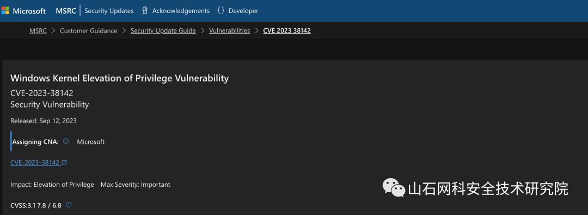
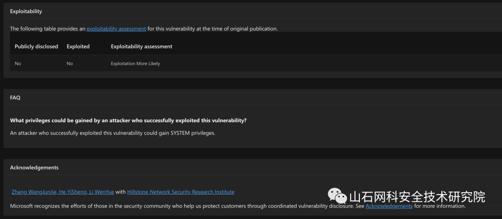
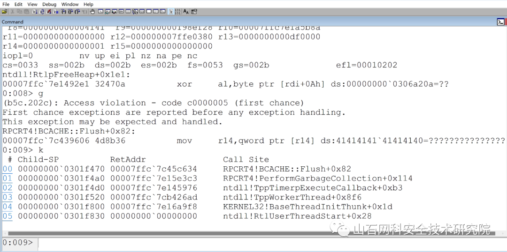

# Windows 内核本地提权漏洞 (CVE-2023-38142) 复现分析

<!-- vulwiki-editorial-rebuild:system-misc -->
## 条目范围与校订

- 本文对象：Windows ALPC
- 文献类型：原报告方简要复现通告
- 版本、权限及部署边界：本地低权限与可访问高权限RPC服务；示例spoolsv，未给具体Windowsbuild/调用数据
- 核验状态：仅重建文本校订；未执行文中代码、PoC 或扫描，未把截图或转载声明记为本站复现

### 具体结论与待核项

以下为原归档的逐项勘误与证据缺口；可由文本确定的问题已在下文订正，仍缺来源的事实保持待核。

1. 标题复现分析但仅服务崩溃截图和随后任意读写/SYSTEM断言，没有原语或代码；应标简要技术通告非完整EXP
2. 状态表细节/PoC未知与文现有触发描述应区分是否公开完整代码；在野未知保留
3. 任意高权限服务可触发是广泛主张，需接口/ACL约束；ALPC是机制不是独立安装产品
4. MSRC原始链接和报告时间线有价值；2023-09-13与UTC补丁日期注意时区；列表缺各产品KB/修复build
5. 大段HTML样式超过内容，转表但保留全部系统架构矩阵；图片未视检

### 操作风险

标题复现分析但仅服务崩溃截图和随后任意读写/SYSTEM断言，没有原语或代码；应标简要技术通告非完整EXP

技术请求、代码与实验方法按原文保留；其中的破坏性动作仅限授权、可恢复的隔离环境。缺失代码、参数或版本事实不猜补。

### 来源追溯

- 原文参考链接（未重新核验）：<https://msrc.microsoft.com/update-guide/vulnerability/CVE-2023-38142>
- 原始披露 URL 未确认；既有归档来源标签保留，不能替代原始公告

### 归档技术正文

原创 信创安全实验室  山石网科安全技术研究院   2023-09-14 11:35  
  
## 漏洞描述  
  
微软九月份补丁日发布了编号为CVE-2023-38142的windows内核特权提升漏洞，由山石网科信创安全实验室报告，目前已修复完成，漏洞详细情况详如下：  
  
<table><tbody style="margin-bottom: 0px;color: rgb(53, 53, 53);text-align: start;text-wrap: wrap;font-family: -apple-system-font, BlinkMacSystemFont, &#34;Helvetica Neue&#34;, &#34;PingFang SC&#34;, &#34;Hiragino Sans GB&#34;, &#34;Microsoft YaHei UI&#34;, &#34;Microsoft YaHei&#34;, Arial, sans-serif;letter-spacing: 0.544px;background-color: rgb(255, 255, 255);"><tr style="margin-bottom: 0px;color: rgb(53, 53, 53);text-align: start;text-wrap: wrap;font-family: -apple-system-font, BlinkMacSystemFont, &#34;Helvetica Neue&#34;, &#34;PingFang SC&#34;, &#34;Hiragino Sans GB&#34;, &#34;Microsoft YaHei UI&#34;, &#34;Microsoft YaHei&#34;, Arial, sans-serif;letter-spacing: 0.544px;background-color: rgb(255, 255, 255);"><td colspan="1" rowspan="1" width="125" data-style="border-color: rgb(222, 224, 227); font-size: 10pt; text-align: left;" class="js_darkmode__14" style="margin-bottom: 0px;color: rgb(53, 53, 53);text-align: start;text-wrap: wrap;font-family: -apple-system-font, BlinkMacSystemFont, &#34;Helvetica Neue&#34;, &#34;PingFang SC&#34;, &#34;Hiragino Sans GB&#34;, &#34;Microsoft YaHei UI&#34;, &#34;Microsoft YaHei&#34;, Arial, sans-serif;letter-spacing: 0.544px;background-color: rgb(255, 255, 255);">
漏洞名称
</td><td colspan="3" rowspan="1" data-style="border-color: rgb(222, 224, 227); font-size: 10pt; text-align: left;" class="js_darkmode__15" style="margin-bottom: 0px;color: rgb(53, 53, 53);text-align: start;text-wrap: wrap;font-family: -apple-system-font, BlinkMacSystemFont, &#34;Helvetica Neue&#34;, &#34;PingFang SC&#34;, &#34;Hiragino Sans GB&#34;, &#34;Microsoft YaHei UI&#34;, &#34;Microsoft YaHei&#34;, Arial, sans-serif;letter-spacing: 0.544px;background-color: rgb(255, 255, 255);">
Windows ALPC 本地提权漏洞
</td></tr><tr style="margin-bottom: 0px;color: rgb(53, 53, 53);text-align: start;text-wrap: wrap;font-family: -apple-system-font, BlinkMacSystemFont, &#34;Helvetica Neue&#34;, &#34;PingFang SC&#34;, &#34;Hiragino Sans GB&#34;, &#34;Microsoft YaHei UI&#34;, &#34;Microsoft YaHei&#34;, Arial, sans-serif;letter-spacing: 0.544px;background-color: rgb(255, 255, 255);"><td colspan="1" rowspan="1" width="125" data-style="border-color: rgb(222, 224, 227); font-size: 10pt; text-align: left;" class="js_darkmode__16" style="margin-bottom: 0px;color: rgb(53, 53, 53);text-align: start;text-wrap: wrap;font-family: -apple-system-font, BlinkMacSystemFont, &#34;Helvetica Neue&#34;, &#34;PingFang SC&#34;, &#34;Hiragino Sans GB&#34;, &#34;Microsoft YaHei UI&#34;, &#34;Microsoft YaHei&#34;, Arial, sans-serif;letter-spacing: 0.544px;background-color: rgb(255, 255, 255);">
漏洞公开编号
</td><td colspan="3" rowspan="1" data-style="border-color: rgb(222, 224, 227); font-size: 10pt; text-align: left;" class="js_darkmode__17" style="margin-bottom: 0px;color: rgb(53, 53, 53);text-align: start;text-wrap: wrap;font-family: -apple-system-font, BlinkMacSystemFont, &#34;Helvetica Neue&#34;, &#34;PingFang SC&#34;, &#34;Hiragino Sans GB&#34;, &#34;Microsoft YaHei UI&#34;, &#34;Microsoft YaHei&#34;, Arial, sans-serif;letter-spacing: 0.544px;background-color: rgb(255, 255, 255);">
CVE-2023-38142
</td></tr><tr style="outline: 0px;height: 39px;"><td colspan="1" rowspan="1" width="125" data-style="border-color: rgb(222, 224, 227); font-size: 10pt; text-align: left;" class="js_darkmode__20" style="outline: 0px;border-color: rgb(222, 224, 227);word-break: break-all;hyphens: auto;font-size: 10pt;text-align: left;" height="50">
漏洞类型
</td><td colspan="1" rowspan="1" width="125" data-style="border-color: rgb(222, 224, 227); font-size: 10pt; text-align: left;" class="js_darkmode__21" style="margin-bottom: 0px;color: rgb(53, 53, 53);text-align: start;text-wrap: wrap;font-family: -apple-system-font, BlinkMacSystemFont, &#34;Helvetica Neue&#34;, &#34;PingFang SC&#34;, &#34;Hiragino Sans GB&#34;, &#34;Microsoft YaHei UI&#34;, &#34;Microsoft YaHei&#34;, Arial, sans-serif;letter-spacing: 0.544px;background-color: rgb(255, 255, 255);outline: 0px;border-color: rgb(222, 224, 227);word-break: break-all;hyphens: auto;font-size: 10pt;" height="50">
LPE
</td><td colspan="1" rowspan="1" width="125" data-style="border-color: rgb(222, 224, 227); font-size: 10pt; text-align: left;" class="js_darkmode__22" style="margin-bottom: 0px;color: rgb(53, 53, 53);text-align: start;text-wrap: wrap;font-family: -apple-system-font, BlinkMacSystemFont, &#34;Helvetica Neue&#34;, &#34;PingFang SC&#34;, &#34;Hiragino Sans GB&#34;, &#34;Microsoft YaHei UI&#34;, &#34;Microsoft YaHei&#34;, Arial, sans-serif;letter-spacing: 0.544px;background-color: rgb(255, 255, 255);outline: 0px;border-color: rgb(222, 224, 227);word-break: break-all;hyphens: auto;font-size: 10pt;" height="50">
公开时间
</td><td colspan="1" rowspan="1" width="125" data-style="border-color: rgb(222, 224, 227); font-size: 10pt; text-align: left;" class="js_darkmode__23" style="margin-bottom: 0px;color: rgb(53, 53, 53);text-align: start;text-wrap: wrap;font-family: -apple-system-font, BlinkMacSystemFont, &#34;Helvetica Neue&#34;, &#34;PingFang SC&#34;, &#34;Hiragino Sans GB&#34;, &#34;Microsoft YaHei UI&#34;, &#34;Microsoft YaHei&#34;, Arial, sans-serif;letter-spacing: 0.544px;background-color: rgb(255, 255, 255);outline: 0px;border-color: rgb(222, 224, 227);word-break: break-all;hyphens: auto;font-size: 10pt;" height="50">
2023-09-13
</td></tr><tr style="margin-bottom: 0px;color: rgb(53, 53, 53);text-align: start;text-wrap: wrap;font-family: -apple-system-font, BlinkMacSystemFont, &#34;Helvetica Neue&#34;, &#34;PingFang SC&#34;, &#34;Hiragino Sans GB&#34;, &#34;Microsoft YaHei UI&#34;, &#34;Microsoft YaHei&#34;, Arial, sans-serif;letter-spacing: 0.544px;background-color: rgb(255, 255, 255);"><td colspan="1" rowspan="1" width="125" data-style="border-color: rgb(222, 224, 227); font-size: 10pt; text-align: left;" class="js_darkmode__24" style="margin-bottom: 0px;color: rgb(53, 53, 53);text-align: start;text-wrap: wrap;font-family: -apple-system-font, BlinkMacSystemFont, &#34;Helvetica Neue&#34;, &#34;PingFang SC&#34;, &#34;Hiragino Sans GB&#34;, &#34;Microsoft YaHei UI&#34;, &#34;Microsoft YaHei&#34;, Arial, sans-serif;letter-spacing: 0.544px;background-color: rgb(255, 255, 255);">
漏洞等级
</td><td colspan="1" rowspan="1" width="125" data-style="border-color: rgb(222, 224, 227); font-size: 10pt; text-align: left;" class="js_darkmode__25" style="margin-bottom: 0px;color: rgb(53, 53, 53);text-align: start;text-wrap: wrap;font-family: -apple-system-font, BlinkMacSystemFont, &#34;Helvetica Neue&#34;, &#34;PingFang SC&#34;, &#34;Hiragino Sans GB&#34;, &#34;Microsoft YaHei UI&#34;, &#34;Microsoft YaHei&#34;, Arial, sans-serif;letter-spacing: 0.544px;background-color: rgb(255, 255, 255);">
重要
</td><td colspan="1" rowspan="1" width="125" data-style="border-color: rgb(222, 224, 227); font-size: 10pt; text-align: left;" class="js_darkmode__26" style="margin-bottom: 0px;color: rgb(53, 53, 53);text-align: start;text-wrap: wrap;font-family: -apple-system-font, BlinkMacSystemFont, &#34;Helvetica Neue&#34;, &#34;PingFang SC&#34;, &#34;Hiragino Sans GB&#34;, &#34;Microsoft YaHei UI&#34;, &#34;Microsoft YaHei&#34;, Arial, sans-serif;letter-spacing: 0.544px;background-color: rgb(255, 255, 255);">
评分
</td><td colspan="1" rowspan="1" width="125" data-style="border-color: rgb(222, 224, 227); font-size: 10pt; text-align: left;" class="js_darkmode__27" style="margin-bottom: 0px;color: rgb(53, 53, 53);text-align: start;text-wrap: wrap;font-family: -apple-system-font, BlinkMacSystemFont, &#34;Helvetica Neue&#34;, &#34;PingFang SC&#34;, &#34;Hiragino Sans GB&#34;, &#34;Microsoft YaHei UI&#34;, &#34;Microsoft YaHei&#34;, Arial, sans-serif;letter-spacing: 0.544px;background-color: rgb(255, 255, 255);">
7.8
</td></tr><tr style="margin-bottom: 0px;color: rgb(53, 53, 53);text-align: start;text-wrap: wrap;font-family: -apple-system-font, BlinkMacSystemFont, &#34;Helvetica Neue&#34;, &#34;PingFang SC&#34;, &#34;Hiragino Sans GB&#34;, &#34;Microsoft YaHei UI&#34;, &#34;Microsoft YaHei&#34;, Arial, sans-serif;letter-spacing: 0.544px;background-color: rgb(255, 255, 255);"><td colspan="1" rowspan="1" width="125" data-style="border-color: rgb(222, 224, 227); font-size: 10pt; text-align: left;" class="js_darkmode__28" style="margin-bottom: 0px;color: rgb(53, 53, 53);text-align: start;text-wrap: wrap;font-family: -apple-system-font, BlinkMacSystemFont, &#34;Helvetica Neue&#34;, &#34;PingFang SC&#34;, &#34;Hiragino Sans GB&#34;, &#34;Microsoft YaHei UI&#34;, &#34;Microsoft YaHei&#34;, Arial, sans-serif;letter-spacing: 0.544px;background-color: rgb(255, 255, 255);">
漏洞所需权限
</td><td colspan="1" rowspan="1" width="125" data-style="border-color: rgb(222, 224, 227); font-size: 10pt; text-align: left;" class="js_darkmode__29" style="margin-bottom: 0px;color: rgb(53, 53, 53);text-align: start;text-wrap: wrap;font-family: -apple-system-font, BlinkMacSystemFont, &#34;Helvetica Neue&#34;, &#34;PingFang SC&#34;, &#34;Hiragino Sans GB&#34;, &#34;Microsoft YaHei UI&#34;, &#34;Microsoft YaHei&#34;, Arial, sans-serif;letter-spacing: 0.544px;background-color: rgb(255, 255, 255);">
低权限
</td><td colspan="1" rowspan="1" width="125" data-style="border-color: rgb(222, 224, 227); font-size: 10pt; text-align: left;" class="js_darkmode__30" style="margin-bottom: 0px;color: rgb(53, 53, 53);text-align: start;text-wrap: wrap;font-family: -apple-system-font, BlinkMacSystemFont, &#34;Helvetica Neue&#34;, &#34;PingFang SC&#34;, &#34;Hiragino Sans GB&#34;, &#34;Microsoft YaHei UI&#34;, &#34;Microsoft YaHei&#34;, Arial, sans-serif;letter-spacing: 0.544px;background-color: rgb(255, 255, 255);">
漏洞利用难度
</td><td colspan="1" rowspan="1" width="125" data-style="border-color: rgb(222, 224, 227); font-size: 10pt; text-align: left;" class="js_darkmode__31" style="margin-bottom: 0px;color: rgb(53, 53, 53);text-align: start;text-wrap: wrap;font-family: -apple-system-font, BlinkMacSystemFont, &#34;Helvetica Neue&#34;, &#34;PingFang SC&#34;, &#34;Hiragino Sans GB&#34;, &#34;Microsoft YaHei UI&#34;, &#34;Microsoft YaHei&#34;, Arial, sans-serif;letter-spacing: 0.544px;background-color: rgb(255, 255, 255);">
低
</td></tr><tr style="margin-bottom: 0px;color: rgb(53, 53, 53);text-align: start;text-wrap: wrap;font-family: -apple-system-font, BlinkMacSystemFont, &#34;Helvetica Neue&#34;, &#34;PingFang SC&#34;, &#34;Hiragino Sans GB&#34;, &#34;Microsoft YaHei UI&#34;, &#34;Microsoft YaHei&#34;, Arial, sans-serif;letter-spacing: 0.544px;background-color: rgb(255, 255, 255);"><td colspan="1" rowspan="1" width="125" data-style="border-color: rgb(222, 224, 227); font-size: 10pt; text-align: left;" class="js_darkmode__32" style="margin-bottom: 0px;color: rgb(53, 53, 53);text-align: start;text-wrap: wrap;font-family: -apple-system-font, BlinkMacSystemFont, &#34;Helvetica Neue&#34;, &#34;PingFang SC&#34;, &#34;Hiragino Sans GB&#34;, &#34;Microsoft YaHei UI&#34;, &#34;Microsoft YaHei&#34;, Arial, sans-serif;letter-spacing: 0.544px;background-color: rgb(255, 255, 255);">
PoC状态
</td><td colspan="1" rowspan="1" width="125" data-style="border-color: rgb(222, 224, 227); font-size: 10pt; text-align: left;" class="js_darkmode__33" style="margin-bottom: 0px;color: rgb(53, 53, 53);text-align: start;text-wrap: wrap;font-family: -apple-system-font, BlinkMacSystemFont, &#34;Helvetica Neue&#34;, &#34;PingFang SC&#34;, &#34;Hiragino Sans GB&#34;, &#34;Microsoft YaHei UI&#34;, &#34;Microsoft YaHei&#34;, Arial, sans-serif;letter-spacing: 0.544px;background-color: rgb(255, 255, 255);">
未知
</td><td colspan="1" rowspan="1" width="125" data-style="border-color: rgb(222, 224, 227); font-size: 10pt; text-align: left;" class="js_darkmode__34" style="margin-bottom: 0px;color: rgb(53, 53, 53);text-align: start;text-wrap: wrap;font-family: -apple-system-font, BlinkMacSystemFont, &#34;Helvetica Neue&#34;, &#34;PingFang SC&#34;, &#34;Hiragino Sans GB&#34;, &#34;Microsoft YaHei UI&#34;, &#34;Microsoft YaHei&#34;, Arial, sans-serif;letter-spacing: 0.544px;background-color: rgb(255, 255, 255);">
EXP状态
</td><td colspan="1" rowspan="1" width="125" data-style="border-color: rgb(222, 224, 227); font-size: 10pt; text-align: left;" class="js_darkmode__35" style="margin-bottom: 0px;color: rgb(53, 53, 53);text-align: start;text-wrap: wrap;font-family: -apple-system-font, BlinkMacSystemFont, &#34;Helvetica Neue&#34;, &#34;PingFang SC&#34;, &#34;Hiragino Sans GB&#34;, &#34;Microsoft YaHei UI&#34;, &#34;Microsoft YaHei&#34;, Arial, sans-serif;letter-spacing: 0.544px;background-color: rgb(255, 255, 255);">
未知
</td></tr><tr style="margin-bottom: 0px;color: rgb(53, 53, 53);text-align: start;text-wrap: wrap;font-family: -apple-system-font, BlinkMacSystemFont, &#34;Helvetica Neue&#34;, &#34;PingFang SC&#34;, &#34;Hiragino Sans GB&#34;, &#34;Microsoft YaHei UI&#34;, &#34;Microsoft YaHei&#34;, Arial, sans-serif;letter-spacing: 0.544px;background-color: rgb(255, 255, 255);"><td colspan="1" rowspan="1" width="125" data-style="border-color: rgb(222, 224, 227); font-size: 10pt; text-align: left;" class="js_darkmode__36" style="margin-bottom: 0px;color: rgb(53, 53, 53);text-align: start;text-wrap: wrap;font-family: -apple-system-font, BlinkMacSystemFont, &#34;Helvetica Neue&#34;, &#34;PingFang SC&#34;, &#34;Hiragino Sans GB&#34;, &#34;Microsoft YaHei UI&#34;, &#34;Microsoft YaHei&#34;, Arial, sans-serif;letter-spacing: 0.544px;background-color: rgb(255, 255, 255);">
漏洞细节
</td><td colspan="1" rowspan="1" width="125" data-style="border-color: rgb(222, 224, 227); font-size: 10pt; text-align: left;" class="js_darkmode__37" style="margin-bottom: 0px;color: rgb(53, 53, 53);text-align: start;text-wrap: wrap;font-family: -apple-system-font, BlinkMacSystemFont, &#34;Helvetica Neue&#34;, &#34;PingFang SC&#34;, &#34;Hiragino Sans GB&#34;, &#34;Microsoft YaHei UI&#34;, &#34;Microsoft YaHei&#34;, Arial, sans-serif;letter-spacing: 0.544px;background-color: rgb(255, 255, 255);">
未知
</td><td colspan="1" rowspan="1" width="125" data-style="border-color: rgb(222, 224, 227); font-size: 10pt; text-align: left;" class="js_darkmode__38" style="margin-bottom: 0px;color: rgb(53, 53, 53);text-align: start;text-wrap: wrap;font-family: -apple-system-font, BlinkMacSystemFont, &#34;Helvetica Neue&#34;, &#34;PingFang SC&#34;, &#34;Hiragino Sans GB&#34;, &#34;Microsoft YaHei UI&#34;, &#34;Microsoft YaHei&#34;, Arial, sans-serif;letter-spacing: 0.544px;background-color: rgb(255, 255, 255);">
在野利用
</td><td colspan="1" rowspan="1" width="125" data-style="border-color: rgb(222, 224, 227); font-size: 10pt; text-align: left;" class="js_darkmode__39" style="margin-bottom: 0px;color: rgb(53, 53, 53);text-align: start;text-wrap: wrap;font-family: -apple-system-font, BlinkMacSystemFont, &#34;Helvetica Neue&#34;, &#34;PingFang SC&#34;, &#34;Hiragino Sans GB&#34;, &#34;Microsoft YaHei UI&#34;, &#34;Microsoft YaHei&#34;, Arial, sans-serif;letter-spacing: 0.544px;background-color: rgb(255, 255, 255);">
未知
</td></tr></tbody></table>  
  
Microsoft Windows ALPC (高级本地过程调用)是美国微软(Microsoft)公司发展出来替代LPC，用于本机RPC的一种C/S模型技术，主要用于在同一台计算机上的进程之间进行轻量级的通信。  
ALPC  
中存在特权提升漏洞，攻  
击者可以利用该漏洞在目标系统获取更高的权限。  
## 时间线  
  
2023年6月17日，漏洞上报微软  
  
2023年7月6日，微软确定漏洞存在并进行修复  
  
2023年9  
月13  
日，  
微软修复完成并释放补丁  
  
  
  
  
  
## 漏洞复现  
  
使用特殊格式构造的调用发送RPC请求到本地任意高权限的服务，这里我们选择打印机服务spoolsv.exe进程(NT AUTHORITY\SYSTEM 权限)，可以发现服务进程发生了崩溃：  
  
  
  
  
随后攻击者可以利用该漏洞在高权限进程内实现任意地址读写，最终获得SYSTEM用户的代码执行权限。  
## 影响版本  
  
Windows 10 for 32-bit Systems   
  
Windows 10 for x64-based Systems   
  
Windows 10 Version 1607 for 32-bit Systems   
  
Windows 10 Version 1607 for x64-based Systems   
  
Windows 10 Version 1809 for 32-bit Systems   
  
Windows 10 Version 1809 for ARM64-based Systems   
  
Windows 10 Version 1809 for x64-based Systems   
  
Windows 10 Version 21H2 for 32-bit Systems   
  
Windows 10 Version 21H2 for ARM64-based Systems   
  
Windows 10 Version 21H2 for x64-based Systems   
  
Windows 10 Version 22H2 for 32-bit Systems   
  
Windows 10 Version 22H2 for ARM64-based Systems   
  
Windows 10 Version 22H2 for x64-based Systems   
  
Windows 11 version 21H2 for ARM64-based Systems   
  
Windows 11 version 21H2 for x64-based Systems   
  
Windows 11 Version 22H2 for ARM64-based Systems   
  
Windows 11 Version 22H2 for x64-based Systems   
  
Windows Server 2008 for 32-bit Systems Service Pack 2   
  
Windows Server 2008 for 32-bit Systems Service Pack 2 (Server Core installation)   
  
Windows Server 2008 for x64-based Systems Service Pack 2   
  
Windows Server 2008 for x64-based Systems Service Pack 2 (Server Core installation)   
  
Windows Server 2008 R2 for x64-based Systems Service Pack 1   
  
Windows Server 2008 R2 for x64-based Systems Service Pack 1 (Server Core installation)   
  
Windows Server 2012   
  
Windows Server 2012 (Server Core installation)	  
  
Windows Server 2012 R2	  
  
Windows Server 2012 R2 (Server Core installation)	  
  
Windows Server 2016   
  
Windows Server 2016 (Server Core installation)	  
  
Windows Server 2019   
  
Windows Server 2019 (Server Core installation)	  
  
Windows Server 2022   
  
Windows Server 2022 (Server Core installation)    
  
## 安全建议  
  
****  
安装相应的补丁程序，目前，官方已发布修复建议，建议受影响的用户尽快升级至安全版本。  
  
  
下载地址：https://msrc.microsoft.com/update-guide/vulnerability/CVE-2023-38142  
  
## 参考信息  
  
https://msrc.microsoft.com/update-guide/vulnerability/CVE-2023-38142  
#   
  

---

> 来源：gelusus/wxvl（微信公众号漏洞文章自动归档，原始披露 URL 尚未确认，现有链接按来源追溯区分别标注）
