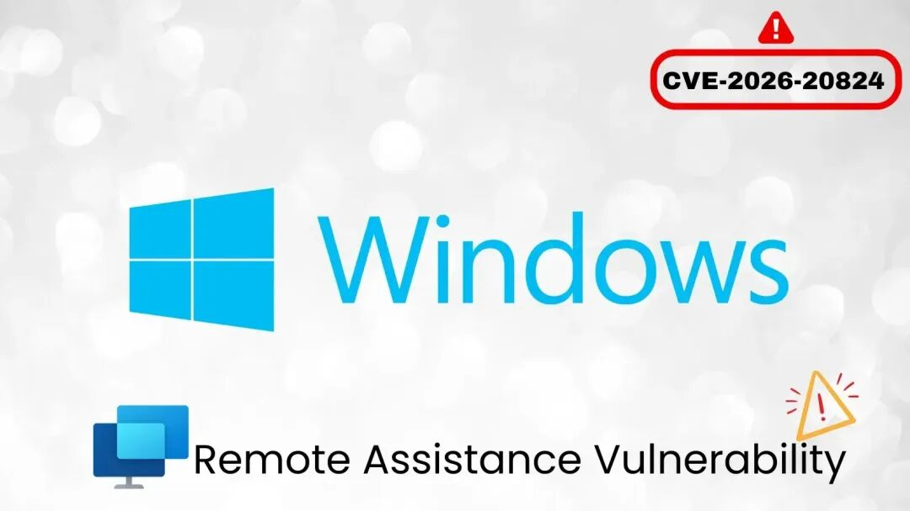
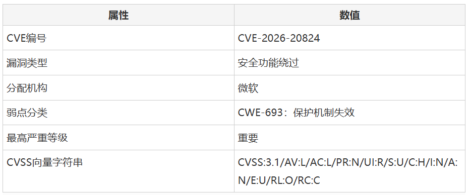
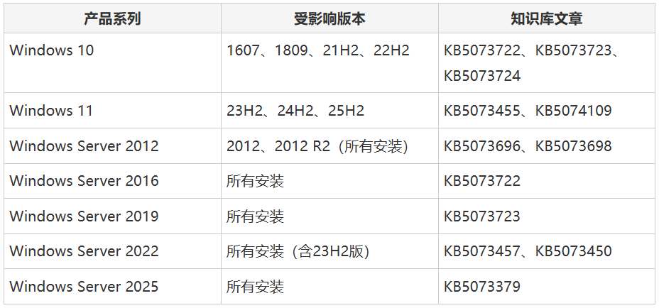

# Windows远程协助漏洞可绕过安全防护机制

<!-- vulwiki-editorial-rebuild:system-misc -->
## 条目范围与校订

- 本文对象：Windows Remote Assistance
- 文献类型：译文安全通告
- 版本、权限及部署边界：本地向量、用户打开恶意文件；2026-01补丁，具体MOTW机制未证
- 核验状态：仅重建文本校订；未执行文中代码、PoC 或扫描，未把截图或转载声明记为本站复现

### 具体结论与待核项

以下为原归档的逐项勘误与证据缺口；可由文本确定的问题已在下文订正，仍缺来源的事实保持待核。

1. 与misc164同CVE互补新闻候选；AV:L不一定攻击者需已有本地账户，本文却说需本地访问，应校官方具体场景
2. MOTW绕过根因无微软原始依据，只有二手媒体链接；不可自动扩展到SmartScreen或全部端点检测绕过
3. Windows11KB选择主要依发行版本非仅架构；各KB映射需MSRC核验，29配置图未视检
4. 紧急事项与标准窗口无需响应的建议应统一；必需更新分类不代表微软指定危机优先级；在野未见限截至文章日期

### 操作风险

原文技术操作的实际副作用未复现核验；按其请求/代码评估状态变更、凭据暴露和业务影响

技术请求、代码与实验方法按原文保留；其中的破坏性动作仅限授权、可恢复的隔离环境。缺失代码、参数或版本事实不猜补。

### 来源追溯

- 原文参考链接（未重新核验）：<https://cybersecuritynews.com/windows-remote-assistance-vulnerability/>
- 原文参考链接（未重新核验）：<https://mp.weixin.qq.com/s?__biz=MjM5NjA0NjgyMA==&mid=2651333596&idx=1&sn=a5f1d8decaf400a24f3b9e74a3a357e1&scene=21#wechat_redirect>
- 原始披露 URL 未确认；既有归档来源标签保留，不能替代原始公告

### 归档技术正文

 FreeBuf   2026-01-16 10:32  
  
  
  
  
  
  
微软已发布关键安全更新修复（CVE-2026-20824），该漏洞存在于Windows远程协助功能中，会导致保护机制失效，允许攻击者绕过"网络标记"（MOTW）防御系统。  
  
  
**Part01**  
## 漏洞概括  
  
  
该漏洞于2026年1月13日披露，影响从Windows 10到Windows Server 2025的多个Windows平台。（CVE-2026-20824）被评定为"重要"级别的安全功能绕过漏洞。  
  
  
该缺陷使未经授权的本地攻击者能够规避MOTW防御机制——该系统旨在限制对来自不可信源文件的危险操作。  
  
  
  
  
  
该漏洞CVSS v3.1评分为5.5分，需要本地访问和用户交互才能利用，但会造成严重的机密性风险。漏洞根源在于Windows远程协助对下载内容验证和处理机制存在缺陷。  
  
  
**Part02**  
## 攻击方式  
  
  
攻击者无法直接强制利用该漏洞，必须通过社会工程学手段诱使用户打开特制文件。最常见的攻击载体是电子邮件，攻击者会使用诱人主题分发恶意文件。网络攻击则需要用户手动从被攻陷或攻击者控制的网站下载并打开文件。  
  
  
**Part03**  
## 受影响系统及补丁  
  
  
微软已针对29种不同Windows配置发布安全更新：  
  
  
  
  
  
具体更新要求：  
  
- Windows 10 22H2版本（32位、ARM64和x64系统）需安装KB5073724  
  
- Windows 11（含最新23H2、24H2和25H2版本）需根据架构安装KB5073455或KB5074109  
  
- 运行Windows Server 2019、2022和2025的企业环境应立即通过相应知识库文章打补丁  
  
**Part04**  
## 修复建议  
  
  
由于该漏洞影响多代客户端和服务器操作系统，补丁安装应视为紧急事项。所有更新均标记为"必需"操作级别，表明微软认为修复对组织安全态势至关重要。  
  
  
目前该漏洞尚未在野利用，补丁发布前也未公开披露。微软评估其利用可能性为"不太可能"，表明存在技术障碍使大规模利用难以实现。但作为保护机制漏洞，成功利用可能部署先前检测到的恶意软件，或规避依赖MOTW指标的终端检测系统。  
  
  
建议组织在标准更新窗口内优先打补丁，但无需启动紧急事件响应程序。  
  
  
**参考来源：**  
  
Windows Remote Assistance Vulnerability Allow Attacker to Bypass Security Features  
  
https://cybersecuritynews.com/windows-remote-assistance-vulnerability/  
  
  
###   
###   
###   
  
**推荐阅读**  
  
  
###   
### 电台讨论  
  
****  
  
  
****  
  
  
  
  

---

> 来源：gelusus/wxvl（微信公众号漏洞文章自动归档，原始披露 URL 尚未确认，现有链接按来源追溯区分别标注）
